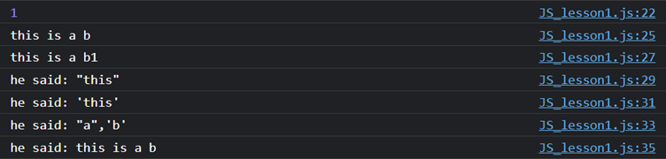
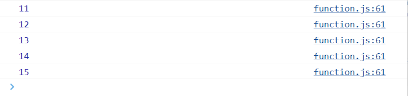
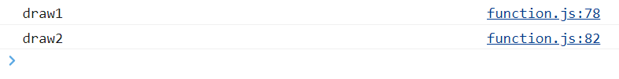

[JS学习资源](https://developer.mozilla.org/en-US/docs/Web/JavaScript)
学完JS后可以把它当作dictionary来查

如何在webpage打开JS的’debug window’: Inspect>Console> where JavaScript is edited

Tips: 
+ 学代码只看书没有意义，得写代码，多练习
    JavaScript写前端逻辑
    NodeJS写后端逻辑, NodeJS与JavaScript一脉相承(Java和python也可以写后端)  
    而后端负责管理数据库
+ 语言最好先选一样学精，再学另一样
    JavaScript每年都会有新feature, 最新的feature自学（可以关注个公众号）, 我们这里只讲基础的

# 1. JS basics
## 1.1 变量与打印
[variable.js](./C1_JS_Basics/variable.js)

### 1.1.1 Let
定义变量时无需声明类型, 用let:
```js
let my_name = "shawn";
console.log(my_name);
```
注意别再使用var来定义变量了:
```js
var something = "abc"; // no more using var now because it is not strict with grammar, use let instead
console.log(something);

```
打印连接两个变量:
```js
let firstName = "shawn",
    lastName = "Li";
console.log(firstName, lastName);

```
'undefined' & 'null':
```js
firstName = undefined; //a type of data, not defined
firstName = null; //a type of data, defined but value is null
console.log(firstName);
```

### 1.1.2 const

```js
const password = "kjjk";
password = 'aasaaa';         // 会报错

```

+ const 限定一个普通变量后，无法更改，如果更改，就会报错。但是let就没有如此的限制。
+ const 限定一个object type variable, 只是表示这个variable的object type固定无法改, 但object内部的field依然可以改动. 本质上const只是限定变量需要的内存大小.

## 1.2 变量的数据类型
变量的数据类型在JS中是implicit的

### 1.2.1 String

+ "" & '': 用于纯string
+ ``: 适用性更广, 可以引用变量

```js
//data type
let a = 1;
console.log(a);

// "" & '' for pure string -------------------------
let b = "this is a b";
console.log(b);

let b1 = "this is a b1";
console.log(b1);

let b2 = 'he said: "this"';
console.log(b2);

let b3 = "he said: 'this'";
console.log(b3);

// `` -----------------------------
let b4 = `he said: "a",'b'`;    // `` allows coexisting of '' & ""
console.log(b4);

let b5 = `he said: ${b}`;       // `` allows referencing a variable
console.log(b5);

```




### 1.2.2 数据类型转化
+ 当一个str和一个num相加时，结果的数据类型和被加数一致(和java的print一致)
  + 特别地，+”1”代表将str类型的1转化为num类型. 但是其中的双引号内必须只有数字。

```js
// data type conversion
let a = 1;
let b = "this is a b";

let b6 = "he said: " + b;   //add up two str: link
console.log(b6);            // he said: this is a b

let b7 = "he said: " + a;   //add num(convert to str first) to the end of str
console.log(b7);            // he said: 1

// +"1": convert string to num ------------------------------
let b8 = "1" + a;           //add num to the end of str
console.log(b8);            // 11

let b9 = +"1" + a;          //convert ”1” to num, then add to a, which is 1
console.log(b9);            // 2

let b10 = "" + 1;           //num to string
console.log(b10, typeof b10);   // 1 string

let b11 = +"1";             //string to num
console.log(b11, typeof b11);   // 1 'number'

```


### 1.2.3 Boolean & if statement
+ True: 字符串(包括字符串0)都是true
+ False: 数字0, null, undefined都是false
```js
//boolean
let c = "0";
let d = undefined;
let e = null;

if (c) {                // c: true
console.log("good");
}

if (!d) {               // d: false
console.log("bad");
} 

if (!e) {               // e: false
console.log("OK");
} 

```

```js 
If(statement){
}else if(statement){
}else if(statement){
}else{
}

```

## 1.3 Operator
[operator.js](./C1_JS_Basics/operator.js)

### 1.3.1 数值运算符
+ 加减乘除, 幂数运算, 取余取商
+ 自增自减
```js
// 数值运算符--------------------
let x = 10;
let y = 3;
console.log(x + y);
console.log(x - y);
console.log(x * y);
console.log(x / y);
console.log(x % y);
console.log(x ** y);  //exponential
console.log(Math.sqrt(100));

console.log(x++); // use first then add
console.log(x);
console.log(x--);
console.log(x);
console.log(++x); // add first then use
console.log(x);
console.log(--x);
console.log(x);

let xx = 10;
xx++;
xx = xx + 5;
xx += 5;
xx -= 5;
xx *= 5;
xx **= 5;
xx /= 5;
xx %= 5;

xx ?? 5; // what is it?
```

### 1.3.2 比较运算符

+ =, ==, ===
+ !=, !==
+ 大于,小于

```js
// 比较运算符
let x = 1;
console.log(x > 1); // false
console.log(x >= 1);  // true
console.log(x < 1);  // false
console.log(x <= 1); // true

console.log((x = 1)); // 1
console.log(x == 1); // justify if the value of x equals 1: true
console.log(x === 1); // justify if the value & type of x equals 1: true

//== justify only value, return Boolean
console.log(0 == false);  // true
console.log(0 != false); // false,  != is opposite to ==
console.log(true == 1); // true
console.log(true == 2); // false,  only 1 can == true

// === justify type & value
console.log(0 === false); // false
console.log(0 !== false); // true, !== is opposite to ===
```


### 1.3.3 三联运算符

```js
let pointers = 100;
if (pointers > 100) {
  console.log("gold");
} else {
  console.log("silver");
}

console.log(pointers > 100 ? "gold" : "silver"); // identical to if else

```


### 1.3.4 逻辑运算符
+ True: 字符串(包括字符串0)都是true
+ False: 数字0, null, undefined都是false

  + &&, ||
    ```js
    console.log(true && true);
    let dayTime = 3;
    if (dayTime > 18 && daytime < 24) {
      console.log("night");
    } else {
      console.log("day");  // go through this branch
    }


    console.log(false || true); // true

    if ((dayTime > 18 && dayTime < 24) || (dayTime > 0 && dayTime < 6)) {
      console.log("night");  // go through this branch
    } else {
      console.log("day");
    }

    ```

+ ||: true & false
  ```js
  console.log(0 || false);          // false, as num 0 is identical to false
  console.log(null || false);       // false
  console.log(undefined || false);  // false
  console.log(NaN || false);        // false
  //
  console.log(3 || false);  // return 3
  console.log(false||10);   // return 10
  console.log(4||10);       // return 4
  ```

  优先return左边的真
  + 如果||左边为真，则return左边的值， 
  + 如果左边为假,右边为真，则return右边的，
  + 如果左右两边都为假，则return false
  Application: 可以用于选择：默认端口||备用端口

+ 取反
  ```js
  console.log(true==2)   // return false
  console.log(!2)  //return false
  ```


### 1.3.5 严格模式

```js
"use strict"  //开启严格模式会开启诸多语法的严格限制
```

## 1.4 Control flow
### 1.4.1 switch case
和java一样
```js
const roles = ["student", "teacher", "boss"];

  let role = roles[2];

  switch (role) {
    case roles[0]:
      console.log("hello!");
      break;
    case roles[1]:
      console.log("!!!");
      break;
    case roles[2]:
      console.log("???");
      break;
    default:
      console.log("aaa");
  }


```
### 1.4.2 Loop
+ for loop
  格式和java一样
  ```js
  let newArrayNumber = [];
  for (let i = 0; i < 10; i++) {
    newArrayNumber[i] = i + 5;
  }
  console.log(newArrayNumber);

  ```
+ forEach
  forEach: 专门用来处理数组的, 必须先指定是对那个数组进行forEach
  语法格式：
  Array.forEach()
  括号里一般是一个箭头函数 () =>{}
  ```js
  // forEach: manipulation over each
  newArrayNumber.forEach((num, index) => {
  // num here refers to the element in newArrayNumber 
  // index starts from 0
  console.log("1:", num, index);
  });

  // identical to the above
  for (let i = 0; i < newArrayNumber.length; i++) {
  console.log("2:", newArrayNumber[i]);
  }

  ```

  

  > For和forEach的区别(自己查): forEach是个迭代器; 但是forEach比普通的for loop运行慢很多, 不考虑性能的情况下使用forEach更方便

+ for in & for out
  (自己查)

练习, 用JS打印9*9乘法表：
[loop.js](./C1_JS_Basics/loop.js)

## 1.5 Function

> 注意JS中写函数的语法和C,Java不同， JS中服从格式:
> 函数名 = function(){...}  OR
> 函数名 = ()=>{...}

### 1.5.1 定义与使用function

#### 1.5.1.1 Primitive type as function argument
因为primitive type argument所需的内存大小已知, 不需要引用

```js
function func2(info) {
  console.log(`${info} juice`); // ${} extract str input
}

func2("orange");
func2("apple");

```

#### 1.5.1.2 Array as function argument
+ Array的变量名采用引用
  ```js
  function func4(array) {
      let cum = 0;

      array.forEach((num) => {
        cum += num;
      });
      console.log(cum);
    }

    func4([1, 2, 3, 4, 5, 6]); // input has to be an array

  ```

+ 柔性数组
  ```js
  function func4_1(a, b, ...rest) {
    let cum = a + b;
    rest.forEach((num) => {
      cum += num;
    });
    console.log(cum);
  }

  func4_1(1, 2, 3, 4, 5, 6); // input is not an array, lawful
  func4_1(...[1, 2, 3, 4, 5, 6]); // expand the array, result in the same as above, lawful
  ```

+ return 
  ```js
  // return
  let cum = func5(1, 2);
  console.log(cum);

  function func5(a, b) {
    return a + b; // skip over the code left behind the return
  }

  ```


#### 1.5.1.3 Object type as function argument

+ object as function argument (直接索引object进行操作)
  + object type变量名采用引用, 因而存在dependency的问题
  + object作为函数输入时采用引用, 因此在函数中对object进行操作就相当于对内存中真实的object进行操作.
  ```js
  //obj as input parameter--------------------
  const obj = {
    // const only confines type of obj, cannot confine its content
    name: "Shawn",
    age: 18,
  };

  function func6(obj) {
    console.log("name:", obj.name);
    console.log("age:", obj.age);
    console.log(obj);

    obj.name = "xueshuo"    // alter obj status
    obj.age = 30;           // alter obj status
  }

  func6(obj);
  console.log(obj);
  //---------------------------------
  // function func6(obj) there is only 1 entrance
  // but there are two 'exit'
  // return: 出口之一，特点是产生新内容,同时不更改原始数据
  // 复杂结构的传参: 出口之一, 特点是可以获得内容修改, 缺点是更改了原始的数据。
  //---------------------------------

  ```
  注意打印object和打印object的属性的不同之处
  


+ 使用object的元素作为函数输入 (采用object的deepCopy进行函数操作)
    + 此时会创建一个新的, 真实的object, 相当于java中采用一对象的deepCopy来在函数内进行操作.
    + 但这种方式函数只能通过return来向外界传递信息, 相当于对输入对象的deepCopy进行操作, 然后return这个deepCopy.
    ```js
    function func7({ name, age }) {

      name = "shawn";
      age = "20";
      return { name, age };
    }

    const people = {
      // const only confines type of obj, cannot confine its content
      name: "Shawn",
      age: 18,
    };

    const newPeople = func7(people);
    console.log(newPeople); 
    console.log(people); 
    ```
  结果可见newPeople和people之间并没有dependency
  


### 1.5.2 箭头函数
对于一般的function定义方式（如下面）, Function的使用可以在其定义之前, 也可以在定义之后, 因为定义的函数会被存在一个表里,与主函数代码平行来被调用

但是对于const 函数则不能这样, 只有在定义函数之后才能使用, 否则报错. 这是应为这种函数是常量，必须先定义后使用:
```js
// function name is at the left hand side of =. 
// function() is at the right hand side of =
const func8 = function () { 
    console.log("func8");
};
func8();
```

**箭头函数同样如此, 必须先定义后使用，因为箭头函数也是常量**

#### 1.5.2.1 箭头函数的定义

格式: 函数名 = ()=>{}
+ 如果只有一个输入参数，可以省略括号写: 函数名 = a=>{}; 
+ 如果是两个以上输入参数，则必须写括号: 函数名 = (a, b)=>{} , 表示(a,b)将作为输入参数进入{}参与运算:
```js
const arrow_func1 = () => {
    console.log("array_func1");
};
```

e.g. 一个箭头函数的例子: 先定义后使用
```js
const array = [11,12,13,14,15]
const array_func4 = (num) =>{
  console.log(num)
}

array.forEach(array_func4)  //forEach()括号内可以是箭头函数

```



### 1.5.3 定义object内部的function

#### 1.5.3.1 标准写法
```js
//note 'const' only confine the type of cirle,
// not its content(its content is still changeable)
const circle = {    // 注意对象里定义变量用:而不是= 有点像JSON
  // fields-----------------
  radius: 1,
  location: {
    x: 1,
    y: 2,
  },
  isVisible: true,

  // methods----------------
  draw1() {
    console.log("draw1");
  },

  draw2() {
    console.log("draw2");
  },
};

circle.draw1()
circle.draw2()
```



#### 1.5.3.2 简略写法
```js
// 外部变量传入obj进行定义
const radius = 1;
const location = { x: 1, y: 2 };
const isVisible = true;
const draw = function () {
  console.log("draw----");
};

const circle2 = {     //z注意这里用: 而不是等号
  radius: radius,
  location: location,
  isVisible: isVisible,
  draw: draw,
};

circle2.draw(); // remember the bracket!!! 
```

```js
// 实际上，你甚至可以直接写成，省去映射的title以表示映射title和对应内容一样:
const radius = 1;
const location = { x: 1, y: 2 };
const isVisible = true;
const draw = function () {
  console.log("draw----");
};

const circle2 = {
  radius,
  location,
  isVisible,
  draw,
};

circle2.draw();

```


## 1.6 Array

[Array.js](./C2_Array/Array.js)

### 1.6.1 初始化Array
要点:
+ 用square bracket
+ index starts from 0
+ Array不算基本数据类型, 变量名采用引用

```js
let array = [1, 2, 3, "4", true, { name: "shawn" }];

console.log(array[0]);   //index starts from 0	

array[0] = "sdufsd";
console.table(array);
```


### 1.6.2 定义新的数组元素
要点:
+ JS的数组是动态数组, 可以改变长度
+ 超出数组长度的为undefined
+ 可以不连续定义新的数组元素


```js
// 接上面的JS code

console.log(array.length);
console.log(array[6]);        // array[6] = undefined

// 不连续定义数组元素------------------
array[100] = 78;                
console.log(array[100]);
console.log(array.length);  // now length of array is 101

```


#### 1.6.2.1 为Array加入object元素
要点:
+ 必须先指定哪个元素为object type, 再instantiate该object
+ 不能直接为某个元素instantiate
```js
// ...接上面的JS Array code...

array[101] = {};            // 先指定array[101]为object type
array[101].name = "shawn";  // 再instantiate该object
console.log(array[101]);    // now array[101].name displayed
```


# 2. Object

[object.js](./C3_Object/object.js)

## 2.1 创建一个object(instance)
```js
let obj = {
    name: "shawn",
    age: 18,
    income: 0,
    arc: {
        a: 222,
        b: 333,
    },
};
console.log(obj);
console.table(obj);
```

## 2.2 修改或增加已存在的object的某个field

+ 修改
  + 方式一 使用属性定义
    ```js
    obj.income = 0;
    ```
  + 方式二  使用索引定义
    ```js
    obj['name'] = 'Batman';
    ```

> Note:
> JS中没有锁，意味着你可以修改任何obj, 这带来了极大的不安全性（e.g.你手滑了把name打成了names, 这样就不是修改name的值而是添加了一个新元素，引起了很难察觉到的bug）. 因此在修改obj时需要格外谨慎。不过后端语言有锁，不会让你乱改数据导致此类Bug.

+ 添加
  + 和修改一样


## 2.3 关于object的引用
同java一样基本数据类型不需要引用, 但对于object类型(Array也算)的数据, JS依然采用引用: 
```js
object2 = object1; 
```
上面赋值语句代表将object1所引用的在内存中实际的object的地址赋给object2, 此时object1与object2同时指向内存中的同一个object. 

### 2.3.1 使用展开: {...obj}来传递object的值

展开的意思是, 再在内存中创建一个真实的object, 而不是使用引用, 有点像deepCopy, 但还不完全是deepCopy, 因为展开无法作用于嵌套的object, 只能作用于object内的基本数据类型.

> Note:
> {...object1}只是展开一层object1, 如果一个object1内部嵌套了另一个object2, {...object1}则不会展开内部更深层的object2 （JS此时依然使用object2的引用). 此时需要真正的deepCopy了. 老师的GitHub文档>JavaScript>javascript.xmind>数组的拷贝


e.g. 
```js
let person = {
    name: "shawn",
    age: 18,
};

let person3 = { ...person }; // create a deepCopy of person, assign this deepCopy to person3
console.log(person, person3);
person3.age = 100;          // this only change person3.age
console.log(person, person3);

```


可见此时person和person3之间没有dependency了, person3.age=100只作用了person3. 

另外要注意到JS中的打印不是按程序执行顺序的打印, 而是反映最终状态的. 如上面结果中, 第一次的console.log(person, person3)显示person3的age也变成了最终状态的100.


# 3. Function

> 注意JS中写函数的语法和C,Java不同， JS中服从格式:
> 函数名 = function(){...}  OR
> 函数名 = ()=>{...}

## 3.1 定义与使用function

### 3.1.1 Primitive type as function argument
因为primitive type argument所需的内存大小已知, 不需要引用

```js
function func2(info) {
  console.log(`${info} juice`); // ${} extract str input
}

func2("orange");
func2("apple");

```

### 3.1.2 Array as function argument
+ Array的变量名采用引用
  ```js
  function func4(array) {
      let cum = 0;

      array.forEach((num) => {
        cum += num;
      });
      console.log(cum);
    }

    func4([1, 2, 3, 4, 5, 6]); // input has to be an array

  ```

+ 柔性数组
  ```js
  function func4_1(a, b, ...rest) {
    let cum = a + b;
    rest.forEach((num) => {
      cum += num;
    });
    console.log(cum);
  }

  func4_1(1, 2, 3, 4, 5, 6); // input is not an array, lawful
  func4_1(...[1, 2, 3, 4, 5, 6]); // expand the array, result in the same as above, lawful
  ```

+ return 
  ```js
  // return
  let cum = func5(1, 2);
  console.log(cum);

  function func5(a, b) {
    return a + b; // skip over the code left behind the return
  }

  ```


### 3.1.3 Object type as function argument

+ object as function argument (直接索引object进行操作)
  + object type变量名采用引用, 因而存在dependency的问题
  + object作为函数输入时采用引用, 因此在函数中对object进行操作就相当于对内存中真实的object进行操作.
  ```js
  //obj as input parameter--------------------
  const obj = {
    // const only confines type of obj, cannot confine its content
    name: "Shawn",
    age: 18,
  };

  function func6(obj) {
    console.log("name:", obj.name);
    console.log("age:", obj.age);
    console.log(obj);

    obj.name = "xueshuo"    // alter obj status
    obj.age = 30;           // alter obj status
  }

  func6(obj);
  console.log(obj);
  //---------------------------------
  // function func6(obj) there is only 1 entrance
  // but there are two 'exit'
  // return: 出口之一，特点是产生新内容,同时不更改原始数据
  // 复杂结构的传参: 出口之一, 特点是可以获得内容修改, 缺点是更改了原始的数据。
  //---------------------------------

  ```
  注意打印object和打印object的属性的不同之处
  


+ 使用object的元素作为函数输入 (采用object的deepCopy进行函数操作)
    + 此时会创建一个新的, 真实的object, 相当于java中采用一对象的deepCopy来在函数内进行操作.
    + 但这种方式函数只能通过return来向外界传递信息, 相当于对输入对象的deepCopy进行操作, 然后return这个deepCopy.
    ```js
    function func7({ name, age }) {

      name = "shawn";
      age = "20";
      return { name, age };
    }

    const people = {
      // const only confines type of obj, cannot confine its content
      name: "Shawn",
      age: 18,
    };

    const newPeople = func7(people);
    console.log(newPeople); 
    console.log(people); 
    ```
  结果可见newPeople和people之间并没有dependency
  


## 3.2 箭头函数
对于一般的function定义方式（如下面）, Function的使用可以在其定义之前, 也可以在定义之后, 因为定义的函数会被存在一个表里,与主函数代码平行来被调用

但是对于const 函数则不能这样, 只有在定义函数之后才能使用, 否则报错. 这是应为这种函数是常量，必须先定义后使用:
```js
// function name is at the left hand side of =. 
// function() is at the right hand side of =
const func8 = function () { 
    console.log("func8");
};
func8();
```

**箭头函数同样如此, 必须先定义后使用，因为箭头函数也是常量**

### 3.2.1 箭头函数的定义

格式: 函数名 = ()=>{}
+ 如果只有一个输入参数，可以省略括号写: 函数名 = a=>{}; 
+ 如果是两个以上输入参数，则必须写括号: 函数名 = (a, b)=>{} , 表示(a,b)将作为输入参数进入{}参与运算:
```js
const arrow_func1 = () => {
    console.log("array_func1");
};
```

e.g. 一个箭头函数的例子: 先定义后使用
```js
const array = [11,12,13,14,15]
const array_func4 = (num) =>{
  console.log(num)
}

array.forEach(array_func4)  //forEach()括号内可以是箭头函数

```


## 3.3 定义object内部的function

### 3.3.1 标准写法
```js
//note 'const' only confine the type of cirle,
// not its content(its content is still changeable)
const circle = {    // 注意对象里定义变量用:而不是= 有点像JSON
  // fields-----------------
  radius: 1,
  location: {
    x: 1,
    y: 2,
  },
  isVisible: true,

  // methods----------------
  draw1() {
    console.log("draw1");
  },

  draw2() {
    console.log("draw2");
  },
};

circle.draw1()
circle.draw2()
```


### 3.3.2 简略写法
```js
// 外部变量传入obj进行定义
const radius = 1;
const location = { x: 1, y: 2 };
const isVisible = true;
const draw = function () {
  console.log("draw----");
};

const circle2 = {     //z注意这里用: 而不是等号
  radius: radius,
  location: location,
  isVisible: isVisible,
  draw: draw,
};

circle2.draw(); // remember the bracket!!! 
```

```js
// 实际上，你甚至可以直接写成，省去映射的title以表示映射title和对应内容一样:
const radius = 1;
const location = { x: 1, y: 2 };
const isVisible = true;
const draw = function () {
  console.log("draw----");
};

const circle2 = {
  radius,
  location,
  isVisible,
  draw,
};

circle2.draw();

```


# 4. JS耦合HTML,CSS

# 4.1 JS耦合HTML
## 4.1.1 JS抓取node


# 4.2 JS耦合CSS