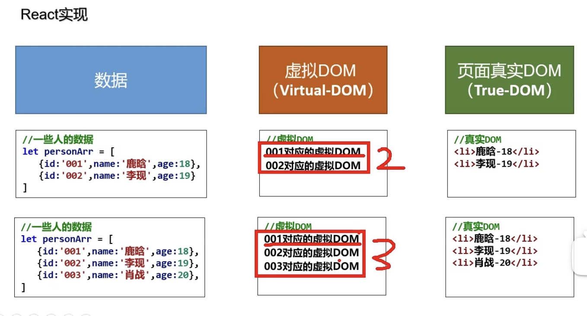

React入门

P01-07


---

[TOC]


---


# 1. React 简介

01

React: 用于**构建用户界面**的JavaScript库 / 是一个将**数据**渲染为**HTML视图**的开源JavaScript库

React由Facebook开发, 且开源; 近10年"陈酿", React正在被腾讯, 阿里等一线大厂广泛使用


为什么要学React? ---> 原生JS存在一些痛点

+ 原生JS操作DOM繁琐, 效率低 (DOM-API操作UI)

+ 使用JS直接操作DOM, 浏览器会进行大量的重回重排

+ 原生JS没有***<u>组件化</u>***编码方案, 代码复用率低
  + Html / css / js / src都拆成 "组件"


:moon: React的特点?

+ 采用***组件化***(component-based)模式, ***声明式***(declarative)编码, 提高开发效率及组件复用率
+ 在React Native( 另一门课程 )中可以使用React语法进行移动端开发
+ 高效: 使用virtual DOM + 优秀的Diffing算法, 尽量减少与真实DOM的交互





React先把数据转化为Virtual DOM 存在内存中 (我们不可见), 再根据Virtual DOM 映射出真实的DOM (页面可见的)

关键点: 当数据产生变化后, React会进行virtual DOM的比较, 来辨别出哪些数据是新加入的, 从而保留已有的Virtual DOM, 只添加新增数据对应的VIrtual DOM, 再把VIrtual DOM映射为real DOM; 这样就避免了原生JS的反复操作已有的real DOM, 从而提升了效率


JS前置知识

+ 判断this的指向
+ class
+ ES6语法: arrow function, destruct...
+ npm
+ 原型, 原型链 
+ 数组常用方法
+ 模块化


# 2. React 基本使用

Hello React

02

一些React库

+ react.js：React核心库 (必须首先被导入)

+ react-dom.js：提供操作DOM的react扩展库 (在react核心库导入后再导入)

+ babel.min.js：解析JSX语法代码转为JS代码的库 


新建一个html

```html
<!DOCTYPE html>
<html lang="en">
<head>
    <meta charset="UTF-8">
    <meta http-equiv="X-UA-Compatible" content="IE=edge">
    <meta name="viewport" content="width=device-width, initial-scale=1.0">
    <title>Document</title>
</head>
<body>
    <!-- 准备好容器 -->
    <div id="test"></div>

    <!-- 引入依赖 ,引入的时候，必须就按照这个步骤-->
    <script src="../js/react.development.js" type="text/javascript"></script>
    <script src="../js/react-dom.development.js" type="text/javascript"></script>
    <script src="../js/babel.min.js" type="text/javascript"></script>

    <!--这里使用了babel用来解析jsx语法-->
    <script type="text/babel">  // 注意这里必须写 “text/babel” 表示一下是利用babel的jsx语法
            // 1.创建虚拟DOM
            const VDOM = <h1>Hello React</h1>  //这个地方使用的是JSX语法，这里不是String不需要加"" 
            // 2.渲染，如果有多个渲染同一个容器，后面的会将前面的覆盖掉
            ReactDOM.render(VDOM,document.getElementById("test"));        
    </script>

</body>

</html>
```


起liver server, 可见生效了


后面用create-react-app要方便的多


## VIrtual DOM 的两种创建方式

03

方式一: 使用JSX语法 (以后写React都用这个)
:gem: [JSX.html](./02-VirtualDOM/JSX.html)
```html
<!--这里使用了babel用来解析jsx语法-->
<script type="text/babel">  // 注意这里必须写 “text/babel” 表示以下是利用babel的jsx语法
        // 1.创建虚拟DOM, 这个地方使用的是JSX语法，这里不是String不需要加"" 
        const VDOM = (
            <h1 id="title">
                <span>Hello, React</span>
            </h1> 
        ) 
        // 2.渲染，如果有多个渲染同一个容器，后面的会将前面的覆盖掉
        ReactDOM.render(VDOM,document.getElementById("test"));        // render(Virtual DOM, container)
</script>
```


方式二: 使用原生JS语法 
:gem: [JS.html](./02-VirtualDOM/JS.html)
```html
<!--这里使用了babel用来解析jsx语法-->
<script type="text/javascript">  // 注意这里必须写 “text/babel” 表示以下是利用babel的jsx语法
        // 1.创建虚拟DOM
        const VOM = React.createElement('h1', {id: 'title'}, React.createElement('span', {}, 'Hello, React'));
        // 2.渲染，如果有多个渲染同一个容器，后面的会将前面的覆盖掉
        ReactDOM.render(VDOM,document.getElementById("test"));        // render(Virtual DOM, container)
</script>
```

总结: 使用JSX的意义 

JSX允许我们像在html里正常写html那样, 在JS里写html

JSX其实就是JS原生方式创建Virtual DOM 的 语法糖, JSX就是为了解决原生JS在创建VIrtual DOM时, 如果html标签产生嵌套写法很繁琐的问题.


## VIrtual DOM  & Real DOM

04

:gem: [Virtual DOM vs. True DOM](./02-VIrtualDOM/VIrtual_True_DOM.html)


 关于Virtual DOM:
  1. 本质是Object类型的对象 (一般对象)
  2. Virtual DOM 比较"轻", True DOM 比较"重", 因为虚拟DOM是React内部在用, 无需真实DOM上那么多的属性
  3. 虚拟DOM最终会被React转化为真实DOM, 呈现在页面上


# 3. React JSX

05-06

该看这个了


# 4. 模块与组件, 模块化与组件化

07