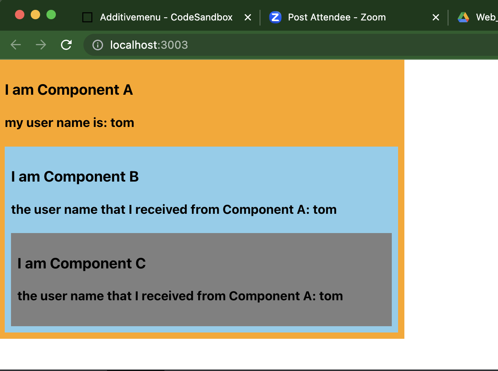
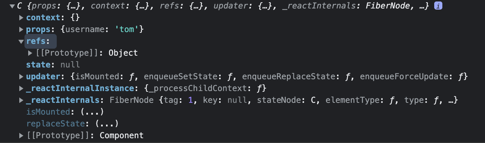
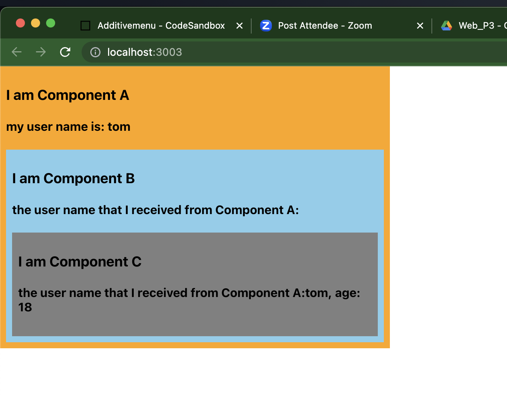

C8 React 基础补充内容

116-126

参考 :pencil:[尚硅谷的react扩展](./React_newFeatures.md)

# setState

116


# Lazy Load

117

# Hook

## StateHook

118


## EffectHook

119


## RefHook

120


# Fragment

121

# :moon: Context

122

https://reactjs.org/docs/context.html

一种组件间的通信方式, 常用于*祖先组件*与其*后代组件*间的通信, 祖先与后代隔离的越远, 使用context比props越方便

父子之间用props更方便


## 先看下传统的做法

App.js

```react
import React, { Component, Fragment } from "react";
import Demo from "./components/5_context/index.jsx";

export default class App extends Component {
  render() {
    return (
      <Fragment>
        <Demo />
      </Fragment>
    );
  }
}
```


components > 5_context > index.jsx:

+ 想将A组件中的信息传给其孙代, 只能将state逐层传递下去, A --> B --> C
  + 很低效, 需要中间组件代为传递信息

```react
import React, { Component } from "react";
import './index.css'

export default class A extends Component {
  state = { username: "tom" };

  render() {
    return (
      <div className="parent">
        <h3>I am Component A</h3>
        <h4>my user name is: {this.state.username}</h4>
        <B username = {this.state.username}/>
      </div>
    );
  }
}

class B extends Component {
  render() {
    return (
      <div className="child">
        <h3>I am Component B</h3>
        <h4> the user name that I received from Component A: {this.props.username}</h4>
        <C username={this.props.username} />
      </div>
    );
  }
}

class C extends Component {
  render() {
    
    // console.log(this);
    
    return (
      <div className="grandson">
        <h3>I am Component C</h3>
        <h4> the user name that I received from Component A: {this.props.username}</h4>
      </div>
    );
  }
}

```

components > 5_context > index.css:

```css
.parent{
    width: 500px;
    background-color: orange;
    padding: 8px;
}

.child{

    /* width: 100%; */
    background-color: skyblue;
    padding: 8px;
}

.grandson{
    /* width: 100%; */
    background-color: grey;
    padding: 8px;
}
```

得到这样的效果:




打印下C组件, 可见context (作为object) 是作为C的一个属性的



context就是专门用来做祖先和(深层)后代组件之间的通信的


## 使用context

第二种方式使用Provider, Consumer适用性更广, 所以 一般我们用第二种. 这种方式就有点通信的意思了, Prodiver作为发送方, 一开始声明好Provider的value有哪些内容, 再用`<Provider>`包住有接收value的组件范围, Consumer作为接收方, 直接接收Provider中的value的值

如果Consumer只需要一个值, 那value就可以是primitative type, 如果Consumer需要多个值, value可以是对象, 里面什么都可以有 (函数, 对象...), 就把value看成是一个packet就好

```js
1) 创建Context容器对象：
	const XxxContext = React.createContext()  
	
2) 渲染子组时，外面包裹xxxContext.Provider, 通过value属性给后代组件传递数据：
	<xxxContext.Provider value={数据}>
		子组件
    </xxxContext.Provider>
    
3) 后代组件读取数据：

	//第一种方式:仅适用于类组件 
	  static contextType = xxxContext  // 声明接收context
	  this.context // 读取context中的value数据
	  
	//第二种方式: 函数组件与类组件都可以
	  <xxxContext.Consumer>
	    {
	      value => ( // value就是context中的value数据
	        要显示的内容
	      )
	    }
	  </xxxContext.Consumer>
```

方式一: 仅适用于类组件 

+ 注意必须声明要接受context

```react
import React, { Component } from "react";
import './index.css'

// step1: 创建一个用来保存用户名的context(上下文)对象
const MyContext = React.createContext();
const {Provider} = MyContext;


export default class A extends Component {
  state = { username: "tom" , age: 18};


  render() {
    const {username, age} = this.state

    return (
      <div className="parent">
        <h3>I am Component A</h3>
        <h4>my user name is: {username}</h4>

        {/* step2: 使用destruct的写法 -- 此时 B组件及其后代都可以准备接收 value(必须是value 不能是其他名字)的信息了 */}
        <Provider value={{username: username, age: age}}>   
            <B/>
        </Provider>
        
        {/* 不用destruct的写法 */}
        {/* <MyContext.Provider>

        </MyContext.Provider> */}


      </div>
    );
  }
}

class B extends Component {
  render() {
    return (
      <div className="child">
        <h3>I am Component B</h3>
        <h4> the user name that I received from Component A: {this.props.username}</h4>
        <C username={this.props.username} />
      </div>
    );
  }
}

// 类组件
class C extends Component {

  // step3
  static contextType = MyContext; // 声明接收context

  render() {
    console.log(this.context)   // 读取context

    const {username, age} = this.context;

    return (
      <div className="grandson">
        <h3>I am Component C</h3>
        <h4> the user name that I received from Component A: {username}, age: {age}</h4>
      </div>
    );
  }
}
```


方式二: 函数组件与类组件都可以

+ 需要拿到step1创建的context对象的Consumer

```react
import React, { Component } from "react";
import './index.css'

// step1: 创建一个用来保存用户名的context(上下文)对象
const MyContext = React.createContext();
const {Provider, Consumer} = MyContext;


export default class A extends Component {
  
  state = { username: "tom" , age: 18};


  render() {
    const {username, age} = this.state

    return (
      <div className="parent">
        <h3>I am Component A</h3>
        <h4>my user name is: {username}</h4>

        {/* step2: 使用destruct的写法 -- 此时 B组件及其后代都可以准备接收 value(必须是value 不能是其他名字)的信息了 */}
        <Provider value={{username: username, age: age}}>   
            <B/>
        </Provider>
        
      </div>
    );
  }
}

class B extends Component {
  render() {
    return (
      <div className="child">
        <h3>I am Component B</h3>
        <h4> the user name that I received from Component A: {this.props.username}</h4>
        <C username={this.props.username} />
      </div>
    );
  }
}

// 函数式组件
function C(){

  return (
          <div className="grandson">
            <h3>I am Component C</h3>
            <h4> the user name that I received from Component A: 
              {/*step3: 用Consumer拿取Provider的value*/}
              <Consumer>
                {
                  {/*value的值和Provider里value的值一样!*/}
                  value => {
                    return `${value.username}, age: ${value.age}`
                  }
                }
              </Consumer>
            </h4>
          </div>
        );

}
```


也能接到A发来的信息, 并且我们跳过了B




在应用开发中一般不用context, 一般都用它的封装react差件

# PureComponent

123


# renderProps

124


# ErrorBoundary

125


# 组件间的通信方式总结

126


127-141是 React router 6的教程