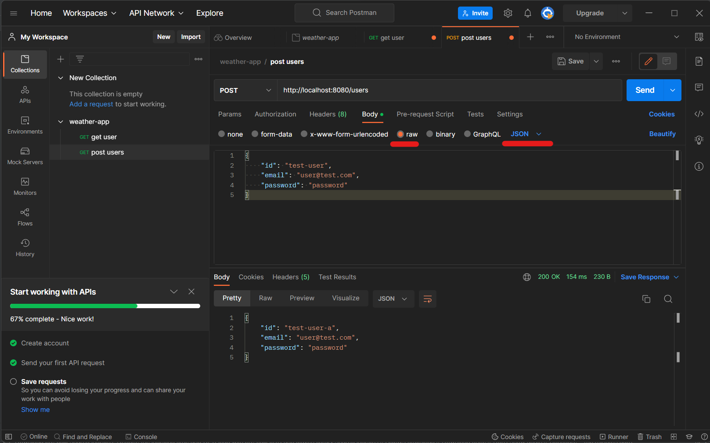

spring boot

---
0min-

Spring intro:
+ EJB太复杂了, 
+ Rod Johnson: Expert one-on-one J2EE Design and Development  --> Sprring framework
  + Spring framework: an open source Java application framework, based on two key principles: 1) dependency injection; 2) inversion of control 
  + high cohesion and loose coupling (高内聚低耦合) 有点类似encapsulation的意思

Spring Boot:
SpringBoot一套全新框架

https://spring.io/projects/spring-boot%C2%A0

--- 
15min-

第一个Spring Boot project

https://start.spring.io/

44min-

dependency: Springboot-starter 不写版本号是因为它自动follow up plungins中Springboot版本

+ maven central repo: 用来搜索dependency https://mvnrepository.com/repos/central

---
gradle command: 在intellij右侧的gradle面板也可


iTerm2: 老师用的Mac上的terminal 

ohmyzsh: 使得terminal五颜六色

---
1h14min-

为什么需要构建工具(build tool)?
+ 管理依赖
+ 管理构建过程

Apache Ant --> maven --> gradle

阅读: [maven vs. gradle](https://tomgregory.com/maven-vs-gradle-comparison/)

---
Annotation 1h19min-

就是一个类或方法开头@...


---
代码目录结构 1h35min-2h15min

配置相关
```yaml
server:
  port: 8888      // 注意中间的空格
```


service之间可以相互调用, 而不是直接去调用别的service对应的repository, 这样边界可以划的更加清晰, 方便重用降低耦合

结合PPT看

---

2h15min-2h21min 

歇息

---
RESTful API 2h21min-

最简单的request mapping 


Post 的结果

