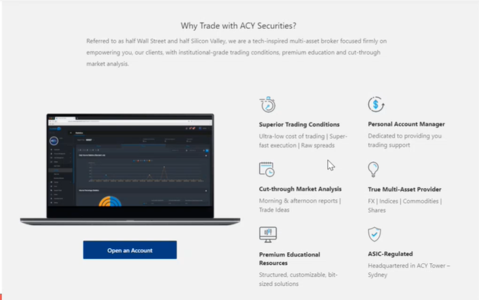
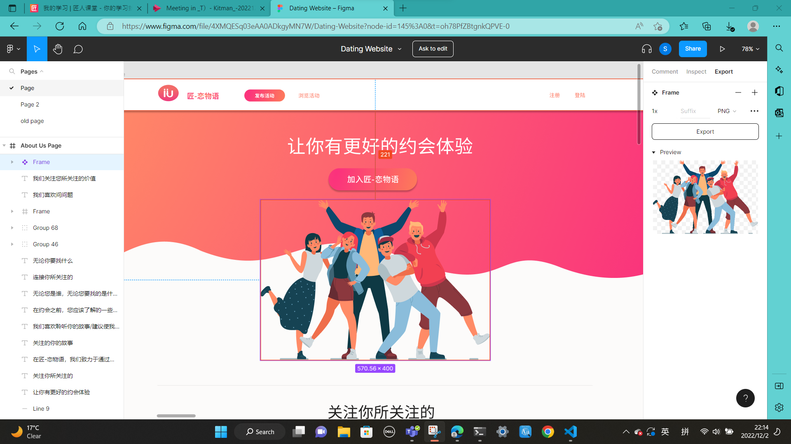

- [HTML practice 15min-40min](#html-practice-15min-40min)
- [CSS 40min-](#css-40min-)
  - [CSS practice 43min-1h40min](#css-practice-43min-1h40min)
    - [Practice结果展示和讲解 1h20min-1h40min](#practice结果展示和讲解-1h20min-1h40min)
- [SEO 相关 1h40min](#seo-相关-1h40min)
  - [Accessibility](#accessibility)
  - [Loading time request](#loading-time-request)
- [Editor 1h51min-](#editor-1h51min-)
- [作业相关 1h54min-2h04min](#作业相关-1h54min-2h04min)
- [Q\&A 2h04min-](#qa-2h04min-)

---

SEO: Search engine optimization

don't too many div, try to be semantic

# HTML practice 15min-40min

写出下图的html框架, 先不用管css

[practice1](./index.html)

+ button与a的区别
+ table不太适合做responsive的网页功能, responsive指的是页面分辨率改变内容实时显示(现在谁还用table?直接flexbox)
+ div(一般用作container) > section(一般用于段)
+ form里用fieldset来代替div, 能不用div就不用div, 因为div没啥实际含义

---

# CSS 40min-

Interview question
+ position: relative, absolute
+ Animation
+ Flex

当参考别的网站时
+ what could be copied
  + Animation, font-size, padding, margin, border-radius, color, 即样式可以抄
+ what should not be copied
  + flex, block, inline-block, float, 即布局别抄

## CSS practice 43min-1h40min
:question:回头再看这部分

模仿写网页:
https://www.figma.com/file/4XMQESq03eAA0ADkgyMN7W/Dating-Website?node-id=145%3A0

:question: 为毛这个网页上的元素的position全是absolute?

+ 抠图: 按住ctrl, 选择图片框 -> 点左侧menu中的frame -> export img
+ 选中某个元素, 直接copy它的css即可

[CSS_practice](./index2.html)

:question: div.showcase中<a>字体如何居中(不用absolute硬托到中间)? 考虑到<a>是inline-element
:question:如何选中nth-child?
:question: 给的网页里元素的定位的参照物都是body, html吗?

### Practice结果展示和讲解 1h20min-1h40min

# SEO 相关 1h40min

## Accessibility
做出的web在搜索引擎界面显示出来的title和description需要优化, 来让做出的网页通过搜索引擎更容易被别人搜索到

Extra HTML tags
+ Favicon 网站图标
+ `<title>` 搜索引擎页面的title
+ `<meta name="description/">` 搜索引擎界面title下面的小字
+  `<meta charset="utf-8">`

## Loading time request

对SEO的排名有关, 如果loading太慢, 别人搜索你的web可能都排到老后面了

img compression
图片资源太大(>256kb)需要压缩
+ [compressor.io](https://compressor.io/)
+ sprite sheet
  将一系列相同大小的图片合成在一张图片里, 之后利用css可以选择这一张图片中不同的区域来extract小图片
  + https://draeton.github.io/stitches/

# Editor 1h51min-

快捷键(editor shortcut) 

# 作业相关 1h54min-2h04min
assignment (P1,P2,P3)最重要, start ASAP, 因为你可以拿着P1,P2,P3去找工作的.

homework可以之后再做

关于P1说明: P1 1月15号交, 12月15, 29, 1月12号mid check
在week2把P1的Html的基本布局做出来
最后P1做完放到github上

P2: 1月中旬往后会带着做

1. Copy design unless you are a designer
   + 去themeforest > personal website直接抄 design
     + 先把别人的html整个抄下来自己再慢慢改, 一点点拼的话会很丑 
   + option1: 找匠人以外的人
   + option2: 同学之间互相做
2. Will review next week
3. P1限定只用jquery(自学)+css+html
   + cant't use: React, vue (P2才用这些)

# Q&A 2h04min-

什么叫不能responsive: 给了个e.g.

img与icon的区别

