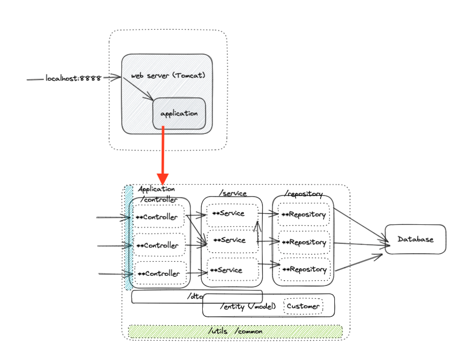
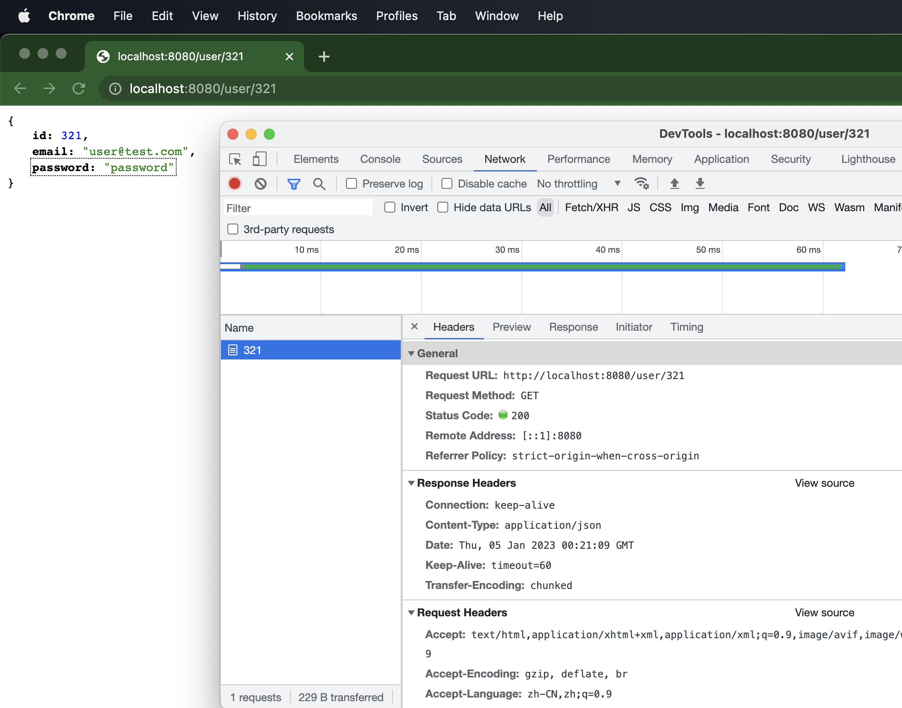

JR wk4 lec2 Springboot, 配Intellij project: weather-app 


---

# 1. Spring intro: 0min-15min

+ EJB太复杂了, 
+ Rod Johnson: <<Expert one-on-one J2EE Design and Development>>  --> Sprring framework

## Spring Framework: 

+ an open source Java application framework, based on two key principles: 
  +  dependency injection; 
  +  inversion of control;
+ Spring has the ability to auto-wire the dependency at run time, which allows the developer to write loosely couped code.
+ high cohesion and loose coupling (高内聚低耦合) 有点类似encapsulation的意思


## Spring Boot:
SpringBoot一套全新框架, 来自Spring大家族, 它的设计初衷是为Spring开发者提供一种更为快速, 体验更好的Spring应用开发方式. Spring boot以**约定大于配置**的核心思想, 默认帮我们进行了很多配置, 开箱即用, 同时也可快速扩展. 支持运行期内嵌容器, 如Tomcat, Jetty等. 没有冗余代码, 无需XML配置 (避免manual configuration带来错误)

https://spring.io/projects/spring-boot%C2%A0 官网介绍:

Spring Boot = Spring Framework + Embedded Server - Manual Configuration

可以看官方文档或者Spring官方GitHub来学习

---

Spring Boot 特性:

+ 使用Spring项目引导页面可以在几秒内构建一个project
+ Spring容器, 日志, 自动配置AutoConfiguration, Starter, 方便对外输出各种形式的服务, 如REST API, WebSocket, Web, Streaming, Tasks
+ 非常简洁的安全策略集成
+ 支持relational DB, non-relational DB
+ 支持运行期内嵌容器, 如Tomcat, Jetty
+ 强大的开发包, 支持热启动
+ 自动管理依赖
+ 自带应用监控
+ 支持各种IDE, 如Intellij, NetBeans

# 2. 第一个Spring Boot project 15min-1h35min

创建你的第一个spring boot project: https://start.spring.io/

选择gradle-Groovy, Java, SpringBoot 3.01, Artifact: weather-app, packaging Jar, Java17

dependency选择Spring web, Lombok, DevTools, validation, 然后点击generate

用intellij打开刚才generate的gradle project, 打开project structure --> set up SDK (JDK 17),  之后去build, Execution, Deployment > build tool > gradle 检查gradle确实使用了指定版本的JDK, 之后便会自动下载dependency

File > setting 搜索Annotation Processors: enable Annotation Processing

现在, WeatherappApplication class可以被run了(我们自己还没写任何代码), 邮件点击class name, run: 可以看到terminal 打印了log: 

debug时一定要注意看log, 尤其是第一个Exception

```bash
2023-01-04T21:50:24.682+11:00  INFO 4316 --- [  restartedMain] c.e.weatherapp.WeatherAppApplication     : Starting WeatherAppApplication using Java 17.0.5 with PID 4316 (/Users/lixueshuo/spoonlee/GitHub_Repo/spoonlee1/fullStack/Programming_Language/Java_Spring/weather-app/build/classes/java/main started by lixueshuo in /Users/lixueshuo/spoonlee/GitHub_Repo/spoonlee1/fullStack/Programming_Language/Java_Spring/weather-app)
2023-01-04T21:50:24.684+11:00  INFO 4316 --- [  restartedMain] c.e.weatherapp.WeatherAppApplication     : No active profile set, falling back to 1 default profile: "default"
2023-01-04T21:50:24.702+11:00  INFO 4316 --- [  restartedMain] .e.DevToolsPropertyDefaultsPostProcessor : Devtools property defaults active! Set 'spring.devtools.add-properties' to 'false' to disable
2023-01-04T21:50:24.703+11:00  INFO 4316 --- [  restartedMain] .e.DevToolsPropertyDefaultsPostProcessor : For additional web related logging consider setting the 'logging.level.web' property to 'DEBUG'
2023-01-04T21:50:25.078+11:00  INFO 4316 --- [  restartedMain] o.s.b.w.embedded.tomcat.TomcatWebServer  : Tomcat initialized with port(s): 8080 (http)
2023-01-04T21:50:25.083+11:00  INFO 4316 --- [  restartedMain] o.apache.catalina.core.StandardService   : Starting service [Tomcat]
2023-01-04T21:50:25.083+11:00  INFO 4316 --- [  restartedMain] o.apache.catalina.core.StandardEngine    : Starting Servlet engine: [Apache Tomcat/10.1.4]
2023-01-04T21:50:25.110+11:00  INFO 4316 --- [  restartedMain] o.a.c.c.C.[Tomcat].[localhost].[/]       : Initializing Spring embedded WebApplicationContext
2023-01-04T21:50:25.110+11:00  INFO 4316 --- [  restartedMain] w.s.c.ServletWebServerApplicationContext : Root WebApplicationContext: initialization completed in 407 ms
2023-01-04T21:50:25.240+11:00  INFO 4316 --- [  restartedMain] o.s.b.d.a.OptionalLiveReloadServer       : LiveReload server is running on port 35729
2023-01-04T21:50:25.252+11:00  INFO 4316 --- [  restartedMain] o.s.b.w.embedded.tomcat.TomcatWebServer  : Tomcat started on port(s): 8080 (http) with context path ''
2023-01-04T21:50:25.256+11:00  INFO 4316 --- [  restartedMain] c.e.weatherapp.WeatherAppApplication     : Started WeatherAppApplication in 0.712 seconds (process running for 0.939)
```

+ 可以看到port: 8080(http) --> 来源于Spring Boot默认配置
+ service: Tomcat; 想要我们的server side application要接受http请求, 需要web server, Tomcat就是这样一个web server, 我们的application是跑在web server中的. Spring Boot则是包在web server外面. 


在intellij运行project之后, 在浏览器输入http://localhost:8080/, 可见如下:


# 3. build tool: gradle

## 3.1 gradle command 44min-1h14min

+ build.gradle > dependency: Springboot-starter 不写版本号是因为它自动follow up plungins中Springboot版本

+ maven central repo: 用来搜索dependency(找library) https://mvnrepository.com/repos/central, 搜索apache common lang, 在build.gradle中导入如下dependency:

  + ```
    implementation 'org.apache.commons:commons-lang3:3.12.0'
    ```


gradle command(也可在terminal输入命令): 在intellij右侧的gradle面板的task也可, e.g:

+ Application > bootRun: 编译project并运行
+ build > build: 在build > libs产生jar包
+ help > dependencies: 生成tree来显示dependency之间的依赖关系

---

题外话 1h10min- 1h14min:  

iTerm2: 老师用的Mac上的terminal 

ohmyzsh: 使得terminal五颜六色


## 3.2 为什么需要构建工具(build tool)? 1h14min-1h19min

+ 管理依赖.
+ 管理构建过程(build process). 我们希望在开发, 测试, production环境下能有一致的行为, 能够把build 出来的jar包运行在不同的环境

build tool的发展: Apache Ant --> maven --> gradle

further reading: :book: [maven vs. gradle](https://tomgregory.com/maven-vs-gradle-comparison/)


# 4. Annotation, AutoConfiguration 1h19min-1h53min

## 4.1 A little bit deeper: Annotation 

Annotations assigns extra metadata to the source code it's bound to. Their typical uses are:

+ **Information for the compiler** - with anotations, the compiler can detect errors or suppress warnings
+ **Compile-time and deployment-time processing** - software tools can process annotations and generate code, configuration files, etc
+ **Runtime processing** - annotations can be examined at runtime to customize the behavior of a program

Annotation are a form of an interface where keyword *interface* is preceded by @, and whose body contains *annotation type element* declarations that loo very similar to methods 

:gem: e.g. @SpringBootApplication 修饰我们的application class的Annotation

```java
@Target(ElementType.TYPE)
@Retention(RetentionPolicy.RUNTIME)
@Documented
@Inherited
@SpringBootConfiguration
@EnableAutoConfiguration
@ComponentScan(excludeFilters = { @Filter(type = FilterType.CUSTOM, classes = TypeExcludeFilter.class),
		@Filter(type = FilterType.CUSTOM, classes = AutoConfigurationExcludeFilter.class) })
public @interface SpringBootApplication {
```

+ 注意里面的`@ComponentScan`, 只会scan与被@SpringBootAplication修饰的类所在同一package下的文件

+ `@SpringBootConfiguration`, `@EnableAutoConfiguration`体现约定大于配置的思想, 不需要我们再在代码中manual configration
+ `@SpringBootApplication` = `@Configuration`+`@EnableAutoConfiguration`+`@ComponentScan`

---

## 4.2 A little bit deeper: AutoConfiguration: 

AutoConfigration原理：

+ SpringBoot采用约定大于配置的思想, 将所有可能遇到的配置信息提前配置好, 写在自动配置的jar包里. 每个starter基本都会有对应的自动配置
  + starter是依赖关系的整理和封装. starter是一套依赖坐标的整合, 可以让导入的应用开发的依赖坐标更加方便.利用Maven依赖传递的特性: 把所有相关依赖全部打包
+ SpringBoot将配置信息存放在一个jar包中: spring-boot-autoconfigure-{VERSION}.jar, jar包里存放的都是配置类, 让配置类生效的规则类

:book: [SpringBoot common Application properties: 查看springboot默认配置](https://docs.spring.io/spring-boot/docs/current/reference/html/application-properties.html)

如果需要手动配置, 在代码目录结构的 main > resources > application.properties OR application.yaml 文件处配置

手动配置: 在代码目录结构的 main > resources >  application.yaml 文件里配置:

```yaml
server:
  port: 8888      // 注意中间的空格
```

之后运行application, 可见打印出来的log中, server port 变成了 8888 (默认是8080)

```bash
2023-01-05T10:18:46.016+11:00  INFO 1618 --- [  restartedMain] o.s.b.w.embedded.tomcat.TomcatWebServer  : Tomcat initialized with port(s): 8888 (http)
```


# 5. :full_moon: 代码目录结构 1h53min-2h15min

SpringBoot的基础结构共分为3个目录:

+ src/main/java: 程序开发以及主程序entry
+ Src/main/resources: 配置文件
  + Static: 存放web访问的静态资源, 如JS, CSS, images
  + Templates: 存放页面模板
  + Application.properties/application.yaml: project的配置信息
+ Src/test/java: 测试程序

---

Src/main/java/com.company.project 下的代码结构目录:

+ **web/controller**: 负责页面访问控制, 如接受http请求, 对接前端
+ **service**: 业务逻辑代码 
  + service之间可以相互调用, 而不是直接把数据送到别的service对应的repository, 这样做不同的service的边界可以划的更加清晰, 方便重用降低耦合
+ **repository**: 数据库访问代码, 对接数据库
+ **dto**: data transform object, 负责数据转化, 一般作用于controller layer或者service layer
+ **domain/model/entity**: 负责定义业务中涉及的entity (尤其是数据库mapping过来的), 比如user, customer
+ **Util/common:** 负责放置公共类, 如全局的配置文件, 工具类等.
+ **ProjectNameApplication.java**: 一般放在src/main/java/com.company.project下(根目录), 是项目的启动类, Spring Boot项目只能有一个main()方法

3-layer 架构: controller -- service -- repository




---

2h14min-2h20min 

歇息

# 6. :moon:RESTful API 2h20min-

## 6.1 Get: hello world controller

在controller package下新建HelloWorldController class

```java
@RestController		// 表示controller里的方法都以json格式输出
public class HelloWorldController {
    @RequestMapping("/hello")		// 相当于路由, 指定接受路径
    public String helloWorld(){
        return "Hello World";
    }
}
```

运行并访问localhost:8080/hello, 可以看到:


## 6.2 Get: 输入参数


```java
@RestController
public class HelloWorldController {
    @RequestMapping("/hello")
    public String helloWorld(String name){
        return "Hello World" + name;
    }
}
```

运行并访问: localhost:8080/hello?name=Shawn, 可见return中包含了输入参数


## 6.3 复杂一点的

### Get: return an object

在entity pacakge下新建User class:

```java
@Data
@AllArgsConstructor
public class User {
    private int id;
    private String email;
    private String password;
}
```

在 controller package下新建UserController class:

```java
@RestController								// 表示controller里的方法都以jason格式输出
public class UserController {
    @GetMapping("/user/{id}")           // extension of RequestMapping using request method: Get
    public User getUser(@PathVariable int id){      // @PathVariable 声明id是一个Path variable, 从url中找到它作为函数的输入
        return new User(id, "user@test.com", "password");
    }
}
```

之后运行, 再访问localhost:8080/user/321, 可见返回结果是以JASON格式呈现的:





### Post: return new object based on a given object 2h53min- 3h5min

在UserController class中定义如下方法

```java	
@PostMapping("/users")
public User createUser(@RequestBody User user){
  return new User(user.getId()+100, user.getEmail(),user.getPassword() );
}
```

然后运行application

在postman中新建collection > 新建request > POST, 

+ 访问localhost:8080/users
+ body选择raw, JSON, 然后输入一个JSON格式的user object
+ 再点击send, 可以发现下面的窗口generate了一个新的修改过(id + 100)的user object:

