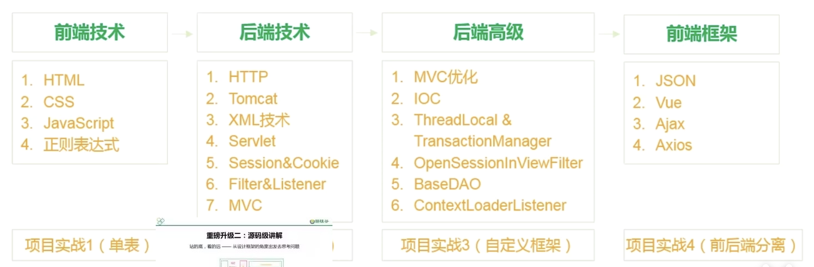

References: 

:computer:[尚硅谷JavaWeb 2022版](https://www.bilibili.com/video/BV1AS4y177xJ/?spm_id_from=333.788.recommend_more_video.0)

本课程衔接接下来的Spring与后续的SpringBoot框架

---
1-17: 前端  [Part1](./Part1_FrontEnd/README.md)
+ P11-15: 穿插静态页面project: 水果清单的实现 

18-89: 后端 [Part2](./Part2_BackEnd/README.md)

+ 18-22: IDEA部署JavaWeb
+ 23-39: 后端框架
+ 40-45: 自定义框架 对servlet逐步改造
+ 46-55: 继续改造, 逐步出现ssm的影子
+ 56-67: project
+ 69-89: project

---
moc, ioc是本课程核心

2022课程升级:

+ 仅仅会使用框架想进大厂工作还远远不够, **他们往往会自定义框架而不是简单地调用框架**

+ 项目实战: 3个项目实战:
  + 水果清单
  + QQZone
  + 书城

