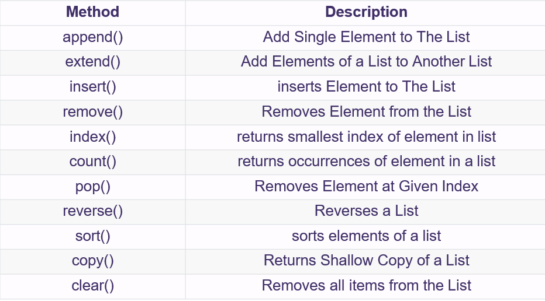
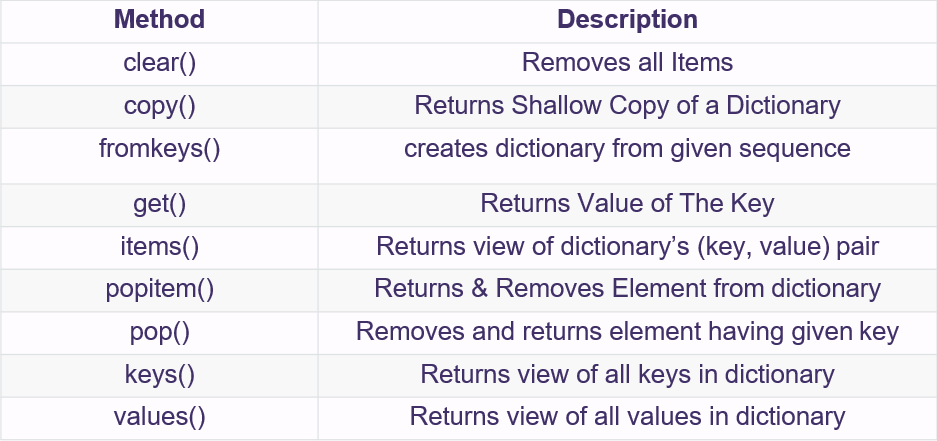
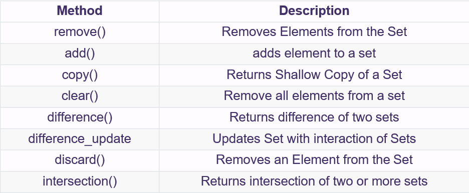

# Part 1 Python basic syntax


## 1.1 Variable
在Python中, 和其他编程语言一样, 变量名中只能包含字母, 数字和下划线, 且只能以字母或下划线作为变量名开头; 变量名不可包含空格; 变量名不能包含python用于特殊用途的关键字.

## 1.2 Data type

Name | type | Description
-----|-----|-----
Integer | int | Whole number: 3, 200, 
Floating point | float | Number with a decimal point: 2.3, 1.5
String | str | Ordered sequence of characters: "hello", 'happy'


### 1.2.1 int
整数

### 1.2.2 float
带小数点的数

### 1.2.3 String
在python中, 用"" 或''括起来的都是String (Java里""括起来的是String, ''括起来的是char)
```python
"this is tony"
'this is tony'  # 但注意, 此时如果String中有单引号将导致语法错误
```

操控String type的变量:
1. title()
首字母大写
2. String拼接
直接使用 + 来拼接String
但注意: python中如果连接字符串的类型不同, 要显式同化类型(这点和Java不同):

    ```python
    #需要显式地把23转化为String, 用Str(), 否则python无法知道你想如何解读23
    message = "happy " + 23 + "rd birthday" 

    message = "happy " + str(23) + "rd birthday"
    ```

3. 添加空白
   + 制表符 \t (相当于连续几个white space)
   + 换行 \n
4. 删除空白
   + 删除String末尾的空白 rstrip() 
   + 删除String开图空白 lstrip()
   + 删除String中的空白 strip()
5. Access character in a String
   和list类似, 直接用variableName[index]即可, index从0开始, 可以为负数(从末尾倒回去了)  

## 1.3 Operators

### 1.3.1 Arithmetic Operators
+ 加减乘除: +, -, *, /
+ 乘方: **
+ module, floor division: %, //
+ <,<=,>,>=
+ !=, ==
+ is, is not: identify operator
+ in, not in: membership operator

### 1.3.2 Logic Operators
+ not
+ or
+ and

### 1.3.3 Bit Operators
+ ~: complement
+ &: bit-wise "AND"
+ ^: bit-wise "XOR"
+ |: bit-wise "OR"
+ ">>", "<<": right shift, left shift
## 1.4 Control flow
和其他主流编程语言不同, python采用冒号和空格来区分control flow的层级, 而不是采用{ }


### 1.4.1 if-else

```python
x = 42
if x < 0:
   x = 0
   print(‘Negative changed to zero’)  
elif x == 0:
   print(‘Zero’)
elif x == 1:
   print(‘Single’)
else:
   print(‘More’)

```

+ Python中, 逻辑运算符用 or, and直接表示, 而不是 ||, && 
```python
if a > 0 or b > 0 and c < 0:  print(1)
else:
print(0)

```


### 1.4.2 loop 

```python
# while loop
i = 0 # Initialisation of variable i  
while i < 10:
   print(i)  i += 1

```

```python
# for loop
for i in range(1, 7):
   for j in range(1, 7):
      print(i, j)


```

+ Break statement – stop the loop
+ Continue statement – jump to the next iteration
+ Pass statement – placeholder (用来占行的, 有跟没有一个样)

```python
for num in range(2, 10):  
   if num % 2 == 0:
      print(“Found an even number”, num)
      break       # change this to continue, pass to see difference
   print(“Found a number”, num)

```


# Part 2 Python 基本数据结构

+ Order immutable用( ): tuple
+ Ordered mutable用[ ]: list
+ Unordered 用{ }: dictionary, set

Name | type | Description | Example
-----|-----|----- | -----
List | list | Ordered sequence of objects | [10, "hello", 200.3]
Dictionary | dict | Unordered key | {"mykey":"value", "name":"Frank"}
Tuple | tup | Ordered **immutable** sequence of objects | (10, "hello2", 200.3)
Set | set | Unordered collection of **unique** objects | {"a", "b", "c"}


## 2.1 :star: List
+  List 初始化
   List的元素用square bracket括起来

   ```python
   fruits = [‘apple’, ‘orange’, ‘banana’, ‘grapes’, ‘strawberry’]
   empty_list = []
   empty_list = list()
   ```

+ CRUD on List

   Access element:
   python index也是从0开始, 并且可以是负的.

   ```python
   # Access element
   fruits = [‘apple’, ‘orange’, ‘banana’, ‘grapes’, ‘strawberry’]
   print(fruits[0])
   print(fruits[1])
   print(fruits[2])
   print(fruits[-1])
   print(fruits[-2])
   ```


   ```python
   # add element
   fruits = [‘apple’, ‘orange’, ‘banana’, ‘grapes’, ‘strawberry’]
   print(fruits)
   fruits.append(’cherry’)
   print(fruits)
   ```


   ```python
   # remove element
   fruits = [‘apple’, ‘orange’, ‘banana’, ‘grapes’, ‘strawberry’]
   print(fruits)
   fruits.remove(‘banana’)
   fruits.pop()
   fruits.pop(0)
   del fruits[-1]
   ```

   

## 2.2 Tuple
Tuple is useful for storing  data that is required to be unmodified.

+ Tuple初始化
   ```python
   fruits = (‘apple’, ‘orange’, ‘banana’, ‘grapes’, ‘strawberry’)
   empty_tuple = ()
   empty_tuple = tuple()
   empty_tuple = (1,)
   ```

+ CRUD on Tuple
   ```python
   # access element
   fruits = (‘apple’, ‘orange’, ‘banana’, ‘grapes’, ‘strawberry’)
   print(fruits[0])
   print(fruits[1])
   print(fruits[2])
   print(fruits[-1])
   print(fruits[-2])
   ```

   ```python
   # add element
   fruits = (‘apple’, ‘orange’, ‘banana’, ‘grapes’, ‘strawberry’)
   print(fruits)
   fruit = (‘peach’,)
   fruits += fruit
   ```

   ```python
   # You couldn’t remove an item in a tuple because it is unmodified  
   # (a.k.a. immutable in Python idioms)
   ```


## 2.3 :star: Dictionary
A dictionary is a collection which is unordered, changeable and  indexed. In python, dictionaries are written with curly brackets,  and they have keys and values

+ dictionary 初始化
   ```python
   students = {‘name’: ‘Tom’, ‘major’: ‘IT’, ‘age’: 18}
   empty_dict = {}
   empty_dict = dict()
   ```

+ CRUD on dictionary

   ```python
   # access element
   students = {‘name’: ‘Tom’, ‘major’: ‘IT’, ‘age’: 18}
   students[‘name’]

   catelog = {1: ‘Drinks’, 2: ‘International Foods’, 3: ‘Liquor’}
   catelog[3]
   # pay attention here, catelog[3] does not mean the third key-value  pair of catelog. Rather it accesses the value with a key of 3.
   ```

   ```python
   # add element
   students = {‘name’: ‘Tom’, ‘major’: ‘IT’, ‘age’: 18}  # first way
   students[‘height’] = 165  # second way
   student_height = {‘height’:165}
   students.update(student_height)
   ```

   ```python
   # delete element
   students.pop(‘major’) # key
   students.popitem()
   del students[‘age’]
   ```

   


## 2.4 :star: set
A set is a collection which is unordered and unindexed. In Python  sets are written with curly brackets. A set contains distinct objects.

+ set初始化
  ```python
   nums = {9, 1, 12.6, 78, 5}
   empty_set = {1} # {} empty dictionary
   empty_set = set()
  ```

+ CRUD on set
  ```python
   # Can’t access elements in set based on index.
   # Could only retrieves all items or drop all items.
  ```

  ```python
  # add element
   nums.add(89)
   nums.update({100})      # add more than one element

  ```

   