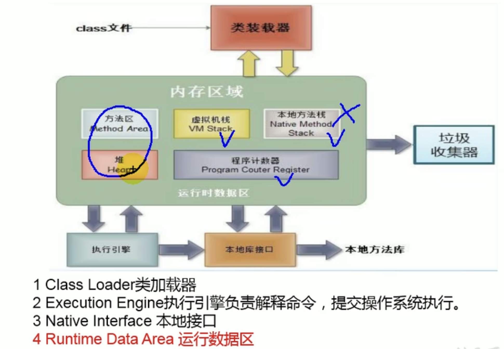
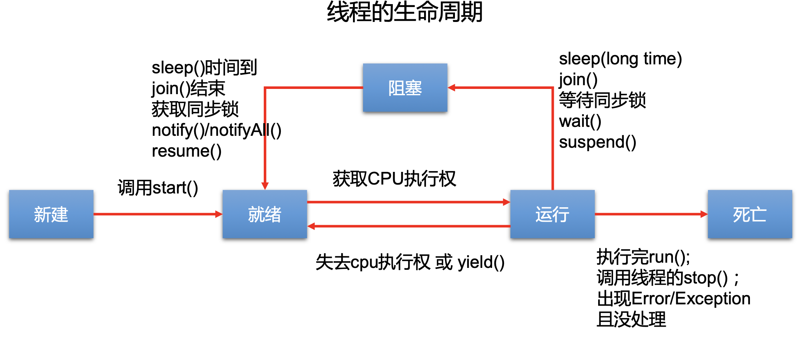

尚硅谷第8章: 多线程 413-447 (425-427 revision)

---

[TOC]


---


# 1. 基本概念

## 程序, 进程, 线程

+ 程序(program): 是为完成特定任务、用某种语言编写的一组指令的集合。即指一段<u>*静态的代码*</u>，静态对象

+ 进程(process): 是**程序的一次执行过程，或是正在运行的一个程序**。是一个<u>*动态的过程*</u>: 有它自身的产生、存在和消亡的过程。——<u>生命周期</u>

  + 如:运行中的QQ，运行中的MP3播放器
  + 程序是静态的，进程是动态的 
  + **进程作为资源分配的单位，系统在运行时会为每个进程分配不同的内存区域**

+ 线程(thread): 进程可进一步细化为线程，是一个程序内部的一条执行路径

  + 若一个进程同一时间**并行**执行多个线程，就称程序是支持多线程的 (e.g. 360可以同时扫毒, 清理磁盘...360安全卫士就是支持多线程的)

  + **线程作为调度和执行的单位，每个线程拥有独立的运行栈(虚拟机栈)和程序计数器(pc)，**线程切换的开销小

  + 一个进程中的多个线程共享相同的内存单元/内存地址空间 ---> 它们从同一堆中分配对象，可以访问相同的变量和对象。这就使得线程间通信更简便、高效。但多个线程操作共享的系统资源可能就会带来<u>*安全的隐患*</u>。


JVM 内存结构:




方法区和堆是一个进程一份 (一个进程内的线程共享方法区和堆)

虚拟机栈和程序计数器是每个线程一份


## 单核CPU和多核CPU的理解

- 单核CPU，也可"同时(看似同时)"运行多个线程, 但其实是一种假的多线程，因为<u>在一个时间单元内</u>，单核CPU也只能执行一个线程的任务
  - E.g. 虽然有多车道，但是收费站只有一个工作人员在收费，只有收了费才能通过，那么CPU就好比收费人员。如果多车道中有任何一个车道有某个人不想交钱，那么收费人员就把他“挂起”(晾着他，等他想通了，准备好了钱，再去收费)。但是因为CPU时 间单元特别短，因此感觉不出来。

- 如果是多核的话，才能更好的发挥多线程的效率。(现在的服务器都是多核的)
  - E.g. 一个Java应用程序java.exe，其实至少有三个线程:main()主线程，gc()  垃圾回收线程，异常处理线程。当然如果发生异常，会影响主线程。


## 并行与并发

+ 并行: 多个CPU同时执行多个任务。比如:多个人同时做不同的事。

+ 并发: 一个CPU(采用时间片)"同时(看似同时)"执行多个任务, CPU在不同的时间片来回切换线程。比如:秒杀、多个人做同一件事。


## 使用多线程的优点

1. 提高应用程序的响应。对图形化界面更有意义，可增强用户体验。 

2. 提高计算机系统CPU的利用率

3. 改善程序结构。将既长又复杂的进程分为多个线程，独立运行，利于理解和 修改


何时需要多线程

+ 程序需要同时执行两个或多个任务。
+  程序需要实现一些需要等待的任务时，如用户输入、文件读写操作、网络操作、搜索等。
+ 需要一些后台运行的程序时。


# 2. :full_moon: 线程的创建和使用

416

Java语言的JVM允许程序运行多个线程，它通过java.lang.Thread 类来体现

Thread类的特性

+ 每个线程都是通过某个特定Thread对象的run()方法来完成操作的，经常把run()方法的主体称为线程体 
+ 通过该Thread对象的start()方法来启动这个线程，而非直接调用run()


## 多线程的创建 方式一


方式1： 继承于thread类

step1: 创建一个继承于Thread类的子类

Step2: 重写Thread类中的run() ---> 此线程要执行的操作声明在run()中

step3: 创建Thread类的子类对象, 通过此对象调用start(): 启动当前线程, 同时调用当前线程的run()


```java
public class ThreadTest {

    public static void main(String[] args) {
        // 3. create instance of MyThread in main() thread
        MyThread t1 =  new MyThread();
        t1.start(); // 使得另一个t1线程开始执行, 同时调用t1的run()
        
        // 到这里, 此时有两个线程同时执行 (不考虑垃圾回收和异常)
        // 以下操作仍然在main thread中进行
        for(int i = 0; i < 100; i++){
            if(i % 2 != 0) {
                System.out.println(Thread.currentThread().getName() + " (main): "+ i);
            }
        }
    }

}

// 1. create a subclass of Thread
class MyThread extends Thread{
    // 2. Override run()
    @Override
    public void run(){
        for(int i = 0; i < 100; i++){
            if(i % 2 == 0) {
                System.out.println(Thread.currentThread().getName() + ": "+ i);
            }
        }
    }

}
```


可以看打main thread和t1 thread的操作同时进行了, 他们的打印结果交替出现

```bash
main (main): 1
main (main): 3
Thread-0: 0
Thread-0: 2
Thread-0: 4
Thread-0: 6
Thread-0: 8
Thread-0: 10
Thread-0: 12
main (main): 5
...
```


:bangbang: 使用线程时的注意事项 417: 

+ 如果要启动一个线程, 不要直接run(), 只能调用线程对象的start(). 不然run()还是在主线程中执行, 失去多线程的意义了

+ 如果一个线程对象已经调用了start(), 就不能第二次调用start()了. 此时如果想开新的线程, 只能再去另外new thread instance, 调用它的start()


练习418

:gem: 练习: 创建两个分线程, 其中一个线程遍历100以内的偶数, 另一个遍历100以内的奇数

+ 方式1: 老老实实创建俩Thread class分别重写它们的run()

+ 方式2: 创建Thread的匿名子类, 调用start() 

```java
public static void main(String[] args) {
  
    // 方式2: 创建thread的匿名子类, 然后调用start()
    new Thread(){
      @Override
      public void run(){
        // // 遍历打印100以内的偶数
        for(int i=0; i < 100; i++){
          if (i % 2 == 0) {
            System.out.println(Thread.currentThread().getName() + ": " + i);
          }
        }
      }
    }.start();

    new Thread(){
      @Override
      public void run(){
        // // 遍历打印100以内的偶数
        for(int i=0; i < 100; i++){
          if (i % 2 != 0) {
            System.out.println(Thread.currentThread().getName() + ": " + i);
          }
        }
      }
    }.start();

}
```


## 线程的常用方法

419 

+ `start()`: 启动当前线程, 并调用当前线程的run()

+ `run()`:  通常需要重写Thread类中的此方法, 将创建的线程要执行的操作声明在此方法中

+ `currentThread()`: 返回执行当前代码的线程对象

+ `getName()`: 获取当前线程的名字

+ `setName()`: 设置当前线程的名字 (也可通过构造器起名字)
+ `isAlive()`: 判断当前线程是否存活


线程交互

+ :star: `yield()`: 释放当前线程的cpu的执行权 (但是下一刻其实cpu执行权也可能又被分配到本线程 ); 即线程让步 暂停正在执行的线程, 把执行的机会让给优先级相同或更高的线程

+ :star: `join()`: 在线程a中调用线程b的join(),  此时线程a进入阻塞状态, 直到线程b完全执行完之后, 线程a才结束阻塞状态

+ `stop()`: deprecated. 当执行此方法时, 强制结束当前线程. 不推荐使用

+ `sleep(long millitime)`: 让当前线程"睡眠"(阻塞)指定的millitime毫秒. 在指定的millitime毫秒时间内， 当前线程是阻塞状态.


## 线程优先级的设置

420 


线程的调度策略: 

+ 时间片: 像time slot, 每个线程被分配到具体的某个time slot, 交替使用CPU资源
+ 抢占式: 高优先级的线程抢占CPU

Java的调度方法

+ 同优先级线程组成先进先出队列(先到先服务)，使用时间片策略 

+ 对高优先级，使用优先调度的抢占式策略


线程的优先级等级 

+ MAX_PRIORITY:10 

+ MIN _PRIORITY:1 

+ NORM_PRIORITY:5  (默认优先级)

涉及的方法

+ getPriority(): 返回线程优先值
+ setPriority(int newPriority) :改变线程的优先级


:bangbang: 说明: 高优先级的线程要抢占低优先级线程 在cpu执行权. 但这只是从概率上讲, 高优先级的线程高概率被首先执行, 并不意味着只有当高优先级的线程执行完之后才执行低优先级的的线程


## 例题: 继承Thread方式, 多窗口卖票

421

见Practice2 文件夹


## :moon: 多线程的创建 方式二

422

创建多线程的方式2: 实现Runnable接口
+ Step1: 创建实现了Runnable接口的类

+ Step2: 实现类去实现Runnable中的抽象方法 run()

+ Step3: 创建实现类的对象   ---> 创建将被线程操作的"鱼"

+ Step4: 将此对象作为参数传递到Thread类的构造器, 创建Thread类的对象 ---> 创建将操作"鱼"的一把把刀, 并把"鱼"放到案板上

+ Step5: 通过Thread类的对象, 调用start()


```java
public class ThreadTest1 {
    public static void main(String[] args) {
        // step3 创建实现类的对象
        MThread mThread = new MThread();
        // step4 将此对象作为参数传递到Thread类的构造器, 创建Thread类的对象
        Thread t1= new Thread(mThread);
        t1.setName("thread 1");
        // step5 通过Thread类的对象, 调用start()
        t1.start();     // 启动线程, 调用当前线程的run() ---> 当前线程的run()调用了Runnable类型的target的run()
        
        // 再启动一个线程, 遍历100以内的偶数
        Thread t2 = new Thread(mThread);
        t2.setName("thread 2");
        t2.start();
    }


}

// step 1, 2
class MThread implements Runnable{
    @Override
    public void run(){
        for (int i = 0; i < 100; i++) {
            if(i % 2 == 0){
                System.out.println(Thread.currentThread().getName()+ ": "+ i);
            }

        }
    }
}
```


:gem:  再看多窗口卖票demo

423 

见Practice2 > WindowTest1.java


## 多线程的创建的两种方式的对比

比较创建线程的两种方式

:bangbang: 开发中优先选择: 方式二 实现了Runnable接口的方式来创建线程

原因: 

+ 实现的方式没有类的单继承性的局限性

+ 实现的方式更适合来处理多个线程有共享数据的情况 (因为喂给多个Thread的构造器的是同一个实现了Runnable接口的类的对象)
  


联系: public class Thread implements Runnable, Thread类其实也实现了Runnable接口


相同点: 两种方式其实本质都需要重写Runnable接口中的run(), 将线程要执行的逻辑声明在run()中


# 3. 线程的生命周期

428

JDK中用Thread.State类 (a enum)定义了线程的几种状态

要想实现多线程，必须在主线程中创建新的线程对象。Java语言使用Thread类 及其子类的对象来表示线程，在它的一个完整的生命周期中通常要经历如下的五 种状态:

+ NEW (新建): 
  + 当一个Thread类或其子类的对象被声明并创建时，新生的线程对象处于新建 状态
+ RUNNABLE (就绪):
  + 处于新建状态的线程被start()后，将进入线程队列等待CPU时间片，此时它已 具备了运行的条件，只是没分配到CPU资源
+ 运行:
  + 当就绪的线程被调度并获得CPU资源时,便进入运行状态， run()方法定义了线 程的操作和功能
+ BLOCKED (阻塞):
  + 在某种特殊情况下，被人为挂起或执行输入输出操作时，让出 CPU 并临时中 止自己的执行，进入阻塞状态
+ TERMINATED (死亡): 
  + 线程完成了它的全部工作或线程被提前强制性地中止或出现异常导致结束





a线程中调用b.join(), 此时a线程阻塞, b线程cut in执行, 待b线程执行完毕, a线程才会从阻塞状态变回就绪状态

:bangbang: 注意调用start()之后, 线程进入就绪状态, 而不是运行状态


# 4. :full_moon: 线程的同步


## 线程安全问题

429

问题的提出

+ 多个线程执行的不确定性引起执行结果的不稳定 

+ 多个线程对账本的共享，会造成操作的不完整性，会破坏数据
  + e.g. Alice和Bob共享一个银行账户, 他们想从余额为1000的账户中取走1000块钱, 在Alice的取钱操作还未完成时(此时银行账户仍为1000), Bob也开始了取钱操作, 导致银行账户被取走了2000块钱


线程安全问题与举例

430


# 5. 线程的通信

439


# 6. JDK5.0新增的线程创建方式

作为2.线程的创建和使用的补充

## 多线程的创建 方式三: 实现Callable接口

442


## :full_moon: 多线程的创建 方式四: 使用线程池

444
