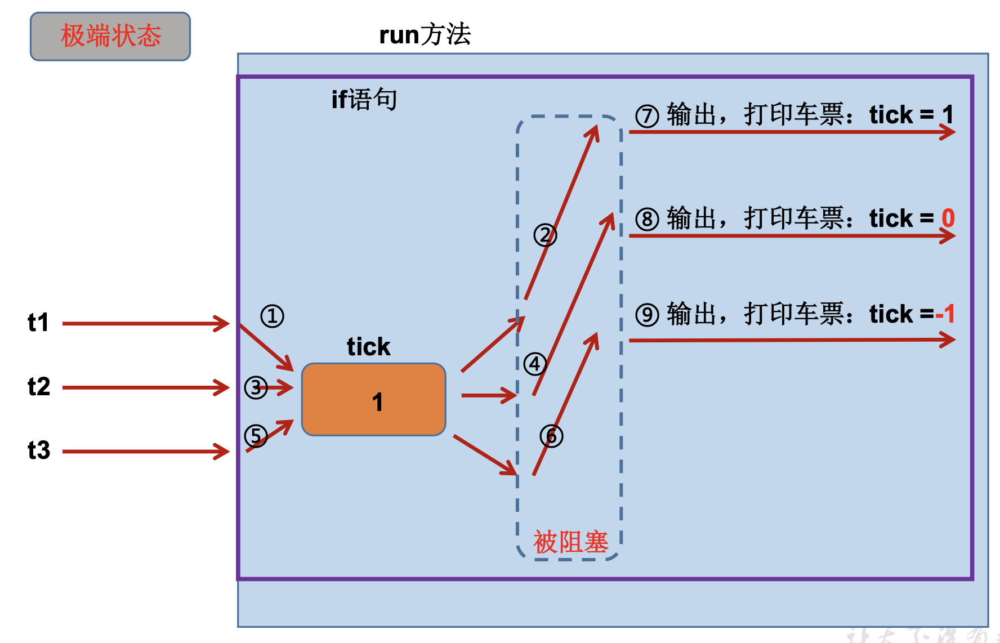

尚硅谷第8章: 多线程 413-447 (425-427 revision)


# 1. 基本概念

## 程序, 进程, 线程

+ 程序(program): 是为完成特定任务、用某种语言编写的一组指令的集合。即指一段<u>*静态的代码*</u>，静态对象

+ 进程(process): 是**程序的一次执行过程，或是正在运行的一个程序**。是一个<u>*动态的过程*</u>: 有它自身的产生、存在和消亡的过程。——<u>生命周期</u>

  + 如:运行中的QQ，运行中的MP3播放器
  + 程序是静态的，进程是动态的 
  + **进程作为资源分配的单位，系统在运行时会为每个进程分配不同的内存区域**

+ 线程(thread): 进程可进一步细化为线程，是一个程序内部的一条执行路径

  + 若一个进程同一时间**并行**执行多个线程，就称程序是支持多线程的 (e.g. 360可以同时扫毒, 清理磁盘...360安全卫士就是支持多线程的)

  + **线程作为调度和执行的单位，每个线程拥有独立的运行栈(虚拟机栈)和程序计数器(pc)，**线程切换的开销小

  + 一个进程中的多个线程共享相同的内存单元/内存地址空间 ---> 它们从同一堆中分配对象，可以访问相同的变量和对象。这就使得线程间通信更简便、高效。但多个线程操作共享的系统资源可能就会带来<u>*安全的隐患*</u>。


JVM 内存结构:


方法区和堆是一个进程一份 (一个进程内的线程共享方法区和堆)

虚拟机栈和程序计数器是每个线程一份


## 单核CPU和多核CPU的理解

- 单核CPU，也可"同时(看似同时)"运行多个线程, 但其实是一种假的多线程，因为<u>在一个时间单元内</u>，单核CPU也只能执行一个线程的任务
  - E.g. 虽然有多车道，但是收费站只有一个工作人员在收费，只有收了费才能通过，那么CPU就好比收费人员。如果多车道中有任何一个车道有某个人不想交钱，那么收费人员就把他“挂起”(晾着他，等他想通了，准备好了钱，再去收费)。但是因为CPU时 间单元特别短，因此感觉不出来。

- 如果是多核的话，才能更好的发挥多线程的效率。(现在的服务器都是多核的)
  - E.g. 一个Java应用程序java.exe，其实至少有三个线程: main()主线程，gc() 垃圾回收线程，异常处理线程。当然如果发生异常，会影响主线程。


## 并行与并发

+ 并行: 多个CPU同时执行多个任务。比如: 多个人同时做不同的事。

+ 并发: 一个CPU(采用时间片)"同时(看似同时)"执行多个任务, CPU在不同的时间片来回切换线程。比如:秒杀、多个人做同一件事。


## 使用多线程的优点

1. 提高应用程序的响应。对图形化界面更有意义，可增强用户体验。 

2. 提高计算机系统CPU的利用率

3. 改善程序结构。将既长又复杂的进程分为多个线程，独立运行，利于理解和 修改


何时需要多线程

+ 程序需要同时执行两个或多个任务。
+  程序需要实现一些需要等待的任务时，如用户输入、文件读写操作、网络操作、搜索等。
+ 需要一些后台运行的程序时。


# 2. :full_moon: 线程的创建和使用

416

Java语言的JVM允许程序运行多个线程，它通过java.lang.Thread 类来体现

Thread类的特性

+ 每个线程都是通过某个特定Thread对象的run()方法来完成操作的，经常把run()方法的主体称为线程体 
+ 通过该Thread对象的start()方法来启动这个线程，而非直接调用run()


## 多线程的创建 方式一


方式1： 继承于thread类

+ step1: 创建一个继承于Thread类的子类

+ Step2: 重写Thread类中的run() ---> 此线程要执行的操作声明在run()中

+ step3: 创建step1中定义的子类的对象, 通过此对象调用start(): 启动当前线程, 同时调用当前线程的run()

>  :bangbang: 使用线程时的注意事项 417: 
>
> + 如果要启动一个线程, 不要直接run(), 只能调用线程对象的start(). 不然run()还是在主线程中执行, 失去多线程的意义了
> + 如果一个线程对象已经调用了start(), 就不能第二次调用start()了. 此时如果想开新的线程, 只能再去另外new thread instance, 调用它的start()

```java
public class ThreadTest {

    public static void main(String[] args) {
        // 3. create instance of MyThread in main() thread
        MyThread t1 =  new MyThread();
        t1.start(); // 使得另一个线程t1开始执行, 同时调用t1的run()

//        // ❌问题一 不能通过直接调用run()的方式启动线程
//        // 不要单独使用run(), 因为那样子它还是在main thread中运行
//        t1.run();

        // ❌问题二: 再启动一个thread, 遍历100以内的偶数 --> ❌, 不能让已经start()的thread去再次执行start()
        // 否则会throw IllegalThreadStateException
        // 有点像stream API的运作方式, 我们此时需要重新创建新的线程对象再调用start()
        MyThread t2 = new MyThread();
        t2.start();


        // 到这里, 此时有三个线程同时执行 (不考虑垃圾回收和异常): t1, t2, 主线程
        // 到这里, 到底谁先执行不确定
        
        // 以下操作仍然在main thread中进行
        for(int i = 0; i < 100; i++){
            if(i % 2 != 0) {
                System.out.println(Thread.currentThread().getName() + " (main): "+ i);
            }
        }
    }

}

// 1. create a subclass of Thread
class MyThread extends Thread{
    // 2. Override run()
    @Override
    public void run(){
        // 遍历打印100以内的偶数
        for(int i = 0; i < 100; i++){
            if(i % 2 == 0) {
                System.out.println(Thread.currentThread().getName() + ": "+ i);
            }
        }
    }

}
```


结果:

+ t1, t2, main thread谁先获得cpu的执行权是不确定的, 因为: :bangbang: 注意调用start()之后, 线程只是进入就绪状态, 而不是运行状态
+ t1, t2, main thread对于cpu的使用是交替的
+ :star: 注意在调用t1线程的start()方法时(`t1.start()`), main thread会继续往下走运行下面的代码, 而不会去等t1执行完毕. 这也就是多线程的本意. 当运行`t1.start()`方法时, 就相当于从当前线程又分出来一个线程

```bash
main (main): 1
main (main): 3
main (main): 5
main (main): 7
Thread-0: 0
Thread-0: 2
Thread-0: 4
Thread-0: 6
Thread-0: 8
Thread-1: 0
Thread-1: 2
Thread-1: 4
...
```


练习418

:gem: 练习: 创建两个分线程, 其中一个线程遍历100以内的偶数, 另一个遍历100以内的奇数

+ 方式1: 老老实实创建俩Thread class分别重写它们的run()

+ 方式2: 创建Thread的匿名子类, 调用start() . 这样的线程只能用一次. 如下

```java
public static void main(String[] args) {
  
    // 方式2: 创建Thread的匿名子类, 然后调用start()
    new Thread(){
      @Override
      public void run(){
        // // 遍历打印100以内的偶数
        for(int i=0; i < 100; i++){
          if (i % 2 == 0) {
            System.out.println(Thread.currentThread().getName() + ": " + i);
          }
        }
      }
    }.start();

    new Thread(){
      @Override
      public void run(){
        // // 遍历打印100以内的偶数
        for(int i=0; i < 100; i++){
          if (i % 2 != 0) {
            System.out.println(Thread.currentThread().getName() + ": " + i);
          }
        }
      }
    }.start();

}
```

:bangbang: 这里给的例子都很简单, 在Thread的子类的run()方法中不使用任何外界依赖, Thread子类里也没有任何成员变量. 后面实际编程时则全然不同, 如何构筑Thread子类的结构也很重要.


## 线程的常用方法

419 

+ `start()`: 启动当前线程, 并调用当前线程的run()

+ `run()`:  通常需要重写Thread类中的此方法, 将创建的线程要执行的操作声明在此方法中

+ `currentThread()`: 返回执行当前代码的线程对象

+ `getName()`: 获取当前线程的名字

+ `setName()`: 设置当前线程的名字 (也可通过构造器起名字)
+ `isAlive()`: 判断当前线程是否存活


线程交互

+ :star: `yield()`: 释放当前线程的cpu的执行权 (但是下一刻其实cpu执行权也可能又被分配到本线程 ); 即**线程让步** 暂停正在执行的线程, 把执行的机会让给优先级相同或更高的线程

+ :star: `join()`: 在线程a中调用线程b的join(),  此时线程a进入阻塞状态, 直到线程b完全执行完之后, 线程a才结束阻塞状态

+ `stop()`: deprecated. 当执行此方法时, 强制结束当前线程. 不推荐使用

+ `sleep(long millitime)`: 让当前线程"睡眠"(阻塞)指定的millitime毫秒. 在指定的millitime毫秒时间内， 当前线程是阻塞状态.


## :moon: 线程优先级的设置

420 


线程的调度策略: 

+ 时间片: 像time slot, 每个线程被分配到具体的某个time slot, 交替使用CPU资源
  + 从CPU角度来看, 其实并没有实现真正的并行, 还是1个CPU把所有活都干了
  + 但是从我们人类的角度来看,  多个线程的任务似乎在被CPU同时执行. :question:但是这样似乎和串行在时间花销上没有区别了呀.... 但是我们实现了同时运行多个线程, 同时干不同的事情呀
    + :gem: e.g. 被老师罚抄3句话各100遍: 真正的并行: 手拿3支笔同时抄写; 这里的多线程: 只拿到1支笔, 切换着写3个分支, 但是切换得非常快, 并且往往不是依次切换的, 切换的顺序具有随机性, 可能第一个分支写了一半了, 但是第二个分支写了25%, 第三个分支写了40%.

  + 如果此时有多个CPU (多核CPU也可), 就可以实现更高程度的concurrency,  这里我们就理解为好像有多个Thread在同时运行, 遇到同步时需要排队等待CPU的执行权分配

+ 抢占式: 高优先级的线程抢占CPU

Java的调度方法

+ 对同优先级线程: 组成先进先出队列(先到先服务)，使用时间片策略 

+ 对不同优先级线程: 高优先级线程使用优先调度的抢占式策略 (但只是概率上而言)


线程的优先级等级 

+ MAX_PRIORITY:10 

+ MIN _PRIORITY:1 

+ NORM_PRIORITY:5  (默认优先级)

涉及的方法

+ getPriority(): 返回线程优先值
+ setPriority(int newPriority) :改变线程的优先级


:bangbang: 说明: 高优先级的线程要抢占低优先级线程 在cpu执行权. 但这只是从概率上讲, <u>高优先级的线程高概率被首先执行</u>, **这并不意味着只有当高优先级的线程执行完所有run()内的代码之后才执行低优先级的的线程**


:gem: 尚硅谷demo

```java
public class ThreadMethodTest {
    public static void main(String[] args) {
        HelloThread h1 = new HelloThread("Thread: 1");
        h1.setName("xueshuo's Thread");

        // 设置分线程的优先级
        h1.setPriority(Thread.MAX_PRIORITY);
        h1.start();

        // 给主线程命名
        Thread.currentThread().setName("main Thread");
        Thread.currentThread().setPriority(Thread.MIN_PRIORITY);


        for(int i = 0; i < 100; i++){
            if(i % 2 == 0){
                System.out.println(Thread.currentThread().getName() + " " +Thread.currentThread().getPriority()+ " : " + i);
            }


        }
        System.out.println(h1.isAlive());   // false
    }

}

class HelloThread extends Thread{
    @Override
    public void run(){
        for(int i = 0; i < 100; i++){
            if(i % 2 == 0){

                System.out.println(Thread.currentThread().getName() + " " +Thread.currentThread().getPriority()+ ": " + i);
            }

            if(i % 20 == 0) {
                this.yield();       // 当前线程让步, 释放cpu使用权限
            }
        }
    }

    public HelloThread(String name){
        super(name);
    }

}
```

结果:

+ 可见即使xueshuo's Thread的优先级为10, 也不是说该线程执行完毕之后才会去执行优先级为1的main Thread的代码, 只是高优先级的线程高概率被分配到CPU执行权

```bash
xueshuo's Thread 10: 0
main Thread 1 : 0
main Thread 1 : 2
xueshuo's Thread 10: 2
xueshuo's Thread 10: 4
main Thread 1 : 4
main Thread 1 : 6
xueshuo's Thread 10: 6
xueshuo's Thread 10: 8
main Thread 1 : 8
xueshuo's Thread 10: 10
...
main Thread 1 : 96
xueshuo's Thread 10: 84
main Thread 1 : 98
xueshuo's Thread 10: 86
xueshuo's Thread 10: 88
xueshuo's Thread 10: 90
true
xueshuo's Thread 10: 92
xueshuo's Thread 10: 94
xueshuo's Thread 10: 96
xueshuo's Thread 10: 98
```


:gem: UniMelb demo


## 例题: 继承Thread方式, 多窗口卖票

421

见Practice2 文件夹


```java
public class WindowTest {
    public static void main(String[] args) {
        Window w1 = new Window();
        Window w2 = new Window();
        Window w3 = new Window();

        w1.setName("w1");
        w2.setName("w2");
        w3.setName("w3");


        // 仍然有问题, 存在重票
        // 需要线程安全的知识来解决, 待解决
        w1.start();
        w2.start();
        w3.start();
    }

}

class Window extends Thread{
    private static int ticket = 100;

    @Override
    public void run(){
        while(true){
            if(ticket > 0){
                System.out.println(Thread.currentThread().getName() + ": sell ticket, ticket index is: " + ticket);
                ticket --;
            }else{
                break;
            }
        }
    }
}

```

结果

+ 结果显示上面的代码存在线程安全问题, 多个线程同时对共享数据进行修改
  + e.g. w3在w1的if block还没执行完时也进入了if block, 同时对ticket进行操作, 导致第一第二行打印ticket index都是100
  + e.g. 有的地方打印的ticket index甚至不连续

```bash
w1: sell ticket, ticket index is: 100
w3: sell ticket, ticket index is: 100
w3: sell ticket, ticket index is: 98
w2: sell ticket, ticket index is: 100
w2: sell ticket, ticket index is: 96
w2: sell ticket, ticket index is: 95
w2: sell ticket, ticket index is: 94
w3: sell ticket, ticket index is: 97
w1: sell ticket, ticket index is: 99
w3: sell ticket, ticket index is: 92
w3: sell ticket, ticket index is: 90
```


:bangbang: 这里, Thread的子类里就出现了成员变量, 代码逻辑开始逐渐变得复杂.


## :moon: 多线程的创建 方式二

422

创建多线程的方式2: 实现Runnable接口
+ Step1: 创建实现了Runnable接口的类

+ Step2: 实现类去实现Runnable接口中的抽象方法 run()

+ Step3: 创建实现类的对象   ---> 创建将被线程操作的"鱼"

+ Step4: 将此对象作为参数传递到Thread类的构造器, 创建Thread类的对象 ---> 把"鱼"放到案板上, 并创建将操作"鱼"的一把把刀; 即使得Thread类的实例与实现类的实例之间发生依赖

+ Step5: 通过Thread类的对象, 调用start()


```java
public class ThreadTest1 {
    public static void main(String[] args) {
        // step3 创建实现类的对象
        MThread mThread = new MThread();
      
        // step4 将此对象作为参数传递到Thread类的构造器, 创建Thread类的对象 (构造器注入依赖)
        Thread t1= new Thread(mThread);
        t1.setName("thread 1");
      
        // step5 通过Thread类的对象, 调用start()
        t1.start();     // 启动线程, 调用当前线程的run() ---> 当前线程的run()调用了Runnable类型的target的run()
        
        // 再启动一个线程, 遍历100以内的偶数
        Thread t2 = new Thread(mThread);
        t2.setName("thread 2");
        t2.start();
    }
}


// step 1, 2
class MThread implements Runnable{
    @Override
    public void run(){
        for (int i = 0; i < 100; i++) {
            if(i % 2 == 0){
                System.out.println(Thread.currentThread().getName()+ ": "+ i);
            }

        }
    }
}
```


:gem:  再看多窗口卖票demo

423 

见Practice2 > WindowTest1.java

```java
public class WindowTest1 {

    public static void main(String[] args) {
        Window1 w1 = new Window1();
        
        Thread t1 = new Thread(w1);
        t1.setName("Window1");
        Thread t2 = new Thread(w1);
        t2.setName("Window2");
        Thread t3 = new Thread(w1);
        t3.setName("Window3");

        // Window1中的ticket不需要写成static的, t1, t2, t3也能共享100张票, 因为只有1个实现了Runnable接口的类的对象 w1
        // 即三个线程共同来操作一个实现了Runnable接口的类的对象. 刀 ---> Thread,  鱼 ---> 实现了Runnable的对象
        t1.start();
        t2.start();
        t3.start();

    }
}


class Window1 implements Runnable{

    private int ticket = 100;       // 不用写static

    @Override
    public void run(){
        while(true){
            if(ticket > 0){
                System.out.println(Thread.currentThread().getName() + ": sell ticket, ticket index: "+ ticket);
                ticket--;
            } else{
                break;
            }
        }
    }
}
```

:bangbang: 使用实现Runnable接口的方式, 需要我们通过Thread构造器注入依赖 (Runnable实现类的对象), 再通过Thread对象来调用start(). 此时就需要考虑到依赖的问题了, 多个Thread对象被注入同一个Runnbale实现类的对象, 可以想象为多把菜刀(多Thread对象)同时要对一条鱼(Runable实现类对象)进行操作, 这条鱼的属性是被多把刀所共享的


## 多线程的创建的两种方式的对比

比较创建线程的两种方式

+ 继承的方式: 定义好Thread的子类之后, 需要实例化多个Thread子类对象分别调用start(), 此时共享数据是以static的形式存在Thread子类中.

+ 实现的方式: 定义好Runnable接口的实现类后, 往多个Thread的构造器中注入同一个Runnable接口的实现类的对象, 此时共享数据是存在于实现类内不必是static, 可见实现的方式天然适合处理多线程共享数据的问题


:bangbang: 开发中优先选择: 方式二 实现了Runnable接口的方式来创建线程

原因: 

+ 实现的方式没有类的单继承性的局限性

+ :star: 实现的方式更适合来处理多个线程有共享数据的情况 (因为多个Thread构造器被注入了同一个Runnable接口实现类的对象)
  


联系: public class Thread implements Runnable, Thread类其实也实现了Runnable接口


相同点: 两种方式其实本质都需要重写Runnable接口中的run(), 将线程要执行的逻辑声明在run()中


# 3. 线程的生命周期

428

JDK中用Thread.State类 (a enum)定义了线程的几种状态

要想实现多线程，必须在主线程中创建新的线程对象。Java语言使用Thread类 及其子类的对象来表示线程，在它的一个完整的生命周期中通常要经历如下的五 种状态:

+ NEW (新建): 
  + 当一个Thread类或其子类的对象被声明并创建时，新生的线程对象处于新建 状态
+ RUNNABLE (就绪):
  + 处于新建状态的线程被start()后，将进入线程队列等待CPU时间片，此时它已 具备了运行的条件，只是没分配到CPU资源
+ 运行:
  + 当就绪的线程被调度并获得CPU资源时, 便进入运行状态，run()方法定义了线程的操作和功能
+ BLOCKED (阻塞):
  + 在某种特殊情况下，被人为挂起或执行输入输出操作时，**<u>让出 CPU 并临时中止自己的执行</u>**，进入阻塞状态
+ TERMINATED (死亡): 
  + 线程完成了它的全部工作或线程被提前强制性地中止或出现异常导致结束


a线程中调用b.join(), 此时a线程阻塞, b线程cut in执行, 待b线程执行完毕, a线程才会从阻塞状态变回就绪状态

:bangbang: 注意调用start()之后, 线程只是进入就绪状态, 而不是运行状态


# 4. :full_moon: 线程的同步


## 4.1 :full_moon: 线程安全问题

429

问题的提出

+ 多个线程执行顺序的不确定性引起执行结果的不稳定 

+ 多个线程对账本的共享，会造成操作的不完整性，会破坏数据
  + e.g. Alice和Bob共享一个银行账户, 他们想从余额为1000的账户中取走1000块钱, 在Alice的取钱操作还未完成时(此时银行账户仍为1000), Bob也开始了取钱操作, 导致银行账户被取走了2000块钱


线程安全问题与举例

430 见package: threadSync > WindowTest1

还是以3个窗口卖票为例子


如果我们在Window1的run()中加入使线程阻塞的操作, 则会大大提高出现错票的概率

```java
public class WindowTest1 {

    public static void main(String[] args) {
        Window1 w1 = new Window1();

        Thread t1 = new Thread(w1);
        t1.setName("Window1");
        Thread t2 = new Thread(w1);
        t2.setName("Window2");
        Thread t3 = new Thread(w1);
        t3.setName("Window3");

        // Window1中的ticket不需要写成static的, t1, t2, t3也能共享100张票, 因为只有1个实现了Runnable接口的类的对象 w1
        // 即三个线程共同来操作一个实现了Runnable接口的类的对象. 刀 ---> Thread,  鱼 ---> 实现了Runnable的对象
        t1.start();
        t2.start();
        t3.start();

    }
}

class Window1 implements Runnable{

    private int ticket = 100;       // 用实现的方式创建thread不用写static

    @Override
    public void run(){
        while(true){
          
            if(ticket > 0){
              
                try {
                    // sleep()导致的线程阻塞 大大提高了引起错票的概率: ticket = -1 or 0; sleep时间越长, 错票概率越高
                    Thread.sleep(100);
                } catch (InterruptedException e) {
                    e.printStackTrace();
                }

                System.out.println(Thread.currentThread().getName() + ": sell ticket, ticket index: "+ ticket);

                ticket--;
            } else{
                break;
            }
        }
    }
}
```


原因如下, 现在只有1张票了, t1进入run()的if statement中由于sleep()被阻塞了, 此时t2被分配到了cpu执行权, 在t1未执行完成时也进入了if statement, 这时ticket 会被错误地多减去1一次.





线程安全问题总结:

1. 问题: 卖票过程中出现重票与错票 ---> 出现了线程安全问题
2. 问题出现的根本原因: **当某个线程来操作车票数(共享数据)的过程中, 尚未完成时, 其他线程参与了进来也对车票数(共享数据)进行操作**

3. 如何解决: 当一个线程a在操作车票数(共享数据)时, 其他线程不能参与进来, 直到线程a操作完车票数时, 其他线程才可以开始操作ticket. 这种情况下, 即使线程a出现了阻塞, 也不能改变


## 4.2 :full_moon: Java对线程安全问题的解决方案

Java中, 我们通过同步机制, 来解决线程安全问题

+ 好处: 解决了线程的安全问题.

+ 局限性: 操作同步代码时， 只能有1个线程参与, 其他线程等待, 相当于是1个单线程的过程.


### 核心要点

如果存在线程安全问题, 那么需要明确以下3个要素:

+ `需要被同步的代码`: 操作共享数据的代码, 即为需要被同步的代码 
  + 首先要明确哪些代码是操作共享数据的代码
  + :bangbang:难点一: synchronized{}不能包代码包多了(包多了是更加安全了, 但这样可能一个线程把活全干完了, 完全不留给其他线程机会), 也不能包代码包少了(并行逻辑发生错误, 线程安全问题可能依旧存在)


+ `共享数据`: 多个线程共同操作的变量. 比如: ticket就是共享数据. 要保证多个线程操作的是同一个共享数据, 这有多种实现方式 (见4.5 demo)

+ `同步监视器`, 俗称: 锁. 任何一个类的对象都可以充当锁
  + :bangbang: 难点二: 最最核心的要求是: **不管是使用哪种方式创建线程, 必须保证多个线程共用同一把锁.** 格外注意充当锁的对象是在哪里被实例化出来的, 如果写错位置了很难debug因为编译时无法察觉

:star: 此外, 我们可以在Thread子类或者Runnable实现类里, 将其他类的对象(外部依赖)定义为属性, 这些类中可以再定义同步方法等 (见4.5 demo), 然后在run()方法中调用属性的方法.


以下的解决方案还是以三个窗口共同卖票来说明


### 方式一: 同步代码块

431-432

```java
synchronized(同步监视器){
	// 需要被同步的代码
}
```


情况一: 处理实现的方式创建线程带来的线程安全问题

```java
public class WindowTest1 {

    public static void main(String[] args) {
        Window1 w1 = new Window1(); // w1只对应1个ticket, 1 个 obj锁

        Thread t1 = new Thread(w1);	// Thread类的实例与实现类的实例发生依赖
        t1.setName("Window1");
        Thread t2 = new Thread(w1);
        t2.setName("Window2");
        Thread t3 = new Thread(w1);
        t3.setName("Window3");

        // Window1中的ticket不需要写成static的, t1, t2, t3也能共享100张票, 因为只有1个实现了Runnable接口的类的对象 w1
        // 即三个线程共同来操作一个实现了Runnable接口的类的对象. 刀 ---> Thread,  鱼 ---> 实现了Runnable的对象
        t1.start();
        t2.start();
        t3.start();

    }
}


class Window1 implements Runnable{
    private int ticket = 100;       // 用实现的方式创建thread不用写static
    Object obj = new Object();      // 充当锁, 写在这里为了保证多个对Window1实例进行操作的多个线程共享同一把锁

    @Override
    public void run(){
        while(true){
          // any incoming threads attempting to exe the code block below will be stopped here until the lock is released
          // -----------------------------------------------------------------------
          // 方式一: 用this来充当锁 
            synchronized (this) {        // 方式二: 用另外的obj充当锁 synchronized (obj) {
                if (ticket > 0) {

                    try {
                        // sleep()导致的线程阻塞 大大提高了引起错票的概率: ticket = -1 or 0; sleep时间越长, 错票概率越高
                        Thread.sleep(100);
                    } catch (InterruptedException e) {
                        e.printStackTrace();
                    }

                    System.out.println(Thread.currentThread().getName() + ": sell ticket, ticket index: " + ticket);

                    ticket--;
                  
                } else {
                    break;
                }
            }
          // ------------------------------------------------------------------------
        }
    }
}
```

+ 此时可以用实现类的本身作为锁, 因为main()中只有1个实现类的实例, 锁是唯一的


情况二: 处理继承的方式创建线程时, 带来的线程安全问题

```java
public class WindowTest {
    public static void main(String[] args) {
        Window w1 = new Window();
        Window w2 = new Window();
        Window w3 = new Window();

        w1.setName("w1");
        w2.setName("w2");
        w3.setName("w3");

        w1.start();
        w2.start();
        w3.start();
    }
}

class Window extends Thread{
    private static int ticket = 100;
    private static Object obj = new Object();       // 注意得是 static, 保证多个Window的实例共享同一把锁

    @Override
    public void run(){
        while(true){

            // 方式一: 用Window.class作为锁
            synchronized (Window.class) {   // 方式二: 使用Thread子类的静态成员变量作为锁, synchronized (obj) {
         
                if (ticket > 0) {
                    try {
                        Thread.sleep(100);
                    } catch (InterruptedException e) {
                        e.printStackTrace();
                    }

                    System.out.println(Thread.currentThread().getName() + ": sell ticket, ticket index is: " + ticket);
                    ticket--;
                } else {
                    break;
                }
            }
        }
    }
}
```

+ 注意不能用Thread子类的this作为锁, 因为main()中是实例化多个Thread子类来start(), 此时锁不唯一
+ 但是可以考虑用当前类作为锁


### 方式二: 同步方法

433-434


如果操作共享数据的代码完整的声明在一个方法中, 我们不妨将此方法声明为synchronized
*        同步方法仍然涉及到同步监视器(锁), 只是不需要我们显式地声明
*        非静态的同步方法, 同步监视器是: this
*        静态的同步方法, 同步监视器是: 当前类本身


情况一: 处理实现的方式创建线程时, 带来的线程安全问题

```java
public class WindowTest2 {

    public static void main(String[] args) {
        Window2 w2 = new Window2(); // w1只对应1个ticket, 1 个 obj锁

        Thread t1 = new Thread(w2);
        t1.setName("Window1");
        Thread t2 = new Thread(w2);
        t2.setName("Window2");
        Thread t3 = new Thread(w2);
        t3.setName("Window3");

        // Window1中的ticket不需要写成static的, t1, t2, t3也能共享100张票, 因为只有1个实现了Runnable接口的类的对象 w1
        // 即三个线程共同来操作一个实现了Runnable接口的类的对象. 刀 ---> Thread,  鱼 ---> 实现了Runnable的对象
        t1.start();
        t2.start();
        t3.start();

    }
}


class Window2 implements Runnable{

    private int ticket = 100;       // 用实现的方式创建thread不用写static
    Object obj = new Object();      // 充当锁, 写在这里为了保证多个对Window1实例进行操作的线程共享同一把锁

    @Override
    public void run(){
        while(true){

            show();
        }
    }

    // 同步方法
    private synchronized void show(){       // 锁: this
        if (ticket > 0) {

            try {
                // sleep()导致的线程阻塞 大大提高了引起错票的概率: ticket = -1 or 0; sleep时间越长, 错票概率越高
                Thread.sleep(100);
            } catch (InterruptedException e) {
                e.printStackTrace();
            }

            System.out.println(Thread.currentThread().getName() + ": sell ticket, ticket index: " + ticket);
            ticket--;
        }
    }

}
```

上面代码还存在无法跳出while()循环的问题, 小问题先不cover了


情况二: 处理继承的方式创建线程带来的线程安全问题

```java
public class WindowTest2 {
    public static void main(String[] args) {
        Window2 w1 = new Window2();
        Window2 w2 = new Window2();
        Window2 w3 = new Window2();

        w1.setName("w1");
        w2.setName("w2");
        w3.setName("w3");

        // 仍然有问题, 存在重票
        // 需要线程安全的知识来解决, 待解决
        w1.start();
        w2.start();
        w3.start();
    }
}

class Window2 extends Thread{
    private static int ticket = 100;

    @Override
    public void run(){
        while(true){

            show();
        }
    }
		
  	// 同步方法 
   // 加static修饰方法是为了保证多个线程共享的锁是唯一的 
    private static synchronized void show(){        // 锁是: 当前类 Window2.class
        // private synchronized void show(){           // 锁是 this, 在main()对应t1,t2,t3并不唯一, 此种解决方式依然存在线程安全问题
            if (ticket > 0) {

            try {
                Thread.sleep(100);
            } catch (InterruptedException e) {
                e.printStackTrace();
            }

            System.out.println(Thread.currentThread().getName() + ": sell ticket, ticket index is: " + ticket);
            ticket--;
        }
    }

}
```

+ 这里也能看到使用实现Runnable接口的方式更方便, 因为继承的方式考虑线程安全问题总得考虑static与否


### 线程安全的单例模式之懒汉式 double check

435

问题所在

```java
public class BankTest {
    
}

class Bank{
    private Bank(){
        
    }
    
    private static Bank instance = null;
    
    public static Bank getInstance(){           // 调用getInstance() in run(), 意味着可能多个线程要调用getInstance()
        
      // 存在线程安全问题, 如果多个Thread同时调用getInstance(), 如果某个Thread在执行getInstance()中block了,
      // 那么有可能导致instance = new Bank()被执行多次, instance先后被指向了多个Bank的实例, 也就不符合单例模式的初衷了
      if(instance == null){
          
          	// Thread might be blocked at here
          
            instance = new Bank();
        }
        return instance;
    }
}
```


用线程同步来解决线程安全问题

+ 同步方法

```java
    public static synchronized Bank getInstance(){    // 调用getInstance() in run(), 意味着可能多个线程要调用getInstance()
          if(instance == null){
              instance = new Bank();
          }
          return instance;
  	}
```


+ 同步代码块

方式一: 优化前的. 虽然线程安全了, 但是性能稍差

```java

    public static Bank getInstance(){           // 调用getInstance() in run(), 意味着可能多个线程要调用getInstance()

        // 方式一: 同步代码块 效率差一些. 如果instance已经被创建了,
        // 之后的线程在调用getInstance()时还必须再去等synchronized释放锁了, 进入同步代码块才能reuturn intance
        synchronized (Bank.class) {
            if(instance == null){
                instance = new Bank();
            }
            return instance;
        }
    }
```

方式二: 优化后的 (即DoubleCheck方式)

```java
// 方式二: 同步代码块
    public static Bank getInstance(){           // 调用getInstance() in run(), 意味着可能多个线程要调用getInstance()

        // 方式二: 效率更高一些. 如果instance已经被创建了,
        // 那么之后的线程在调用getInstance()时没必要再去等synchronized释放锁了
        // 直接return创建好的instance的引用
        if(instance == null){	// 当第一个线程已经创建好instance后, 之后的线程不需要再等待同步监视器被释放才能return instance, 提升效率
            synchronized (Bank.class) {
                if(instance == null){	// 防止跟在第一个new instance的线程后面的几个线程再次new instance, 解决线程安全问题
                    instance = new Bank();
                }
            }
        }
        return instance;
    }
```

:bangbang: 面试时, 如果要让你写单例模式, 默认肯定要你写线程安全的


## 4.3 :moon: 死锁(dead lock)的问题

436

线程的死锁问题

+ 不同的线程分别占用对方需要的同步资源不放弃，都在等待对方放弃 自己需要的同步资源，就形成了线程的死锁

+ 出现死锁后，不会出现异常，不会出现提示，只是所有的线程都处于 阻塞状态，无法继续

```java
public class DeadLockTest {
    public static void main(String[] args) {
        StringBuffer s1 = new StringBuffer();
        StringBuffer s2 = new StringBuffer();

        // 线程1: 继承的方式
        new Thread(){
            @Override
            public void run(){
                synchronized (s1){
                    s1.append("a");
                    s2.append("1");
                    synchronized (s2){
                        s1.append("b");
                        s2.append("2");

                        System.out.println(s1);
                        System.out.println(s2);
                    }
                }
            }
        }.start();

        // 线程2: 实现的方式
        new Thread(new Runnable() {
            @Override
            public void run() {

                synchronized (s2){
                    s1.append("c");
                    s2.append("3");
                    synchronized (s1){
                        s1.append("d");
                        s2.append("4");

                        System.out.println(s1);
                        System.out.println(s2);
                    }
                }
            }
        }).start();


    }
}
```


引入sleep, 大大提高出现死锁的概率

```java
public class DeadLockTest {
    public static void main(String[] args) {
        StringBuffer s1 = new StringBuffer();
        StringBuffer s2 = new StringBuffer();

        // 线程1: 继承的方式
        new Thread(){
            @Override
            public void run(){
                synchronized (s1){
                    s1.append("a");
                    s2.append("1");

                    // 线程1 sleep期间, 线程2可能开始执行了, 当二者结束sleep时可能出现:
                    // 线程1 拿着 s1锁, 等着s2锁被释放
                    // 线程2 拿着 s2锁, 等着s1锁被释放
                    // ---> 出现死锁了
                    try {
                        Thread.sleep(100);
                    } catch (InterruptedException e) {
                        e.printStackTrace();
                    }

                    synchronized (s2){
                        s1.append("b");
                        s2.append("2");

                        System.out.println(s1);
                        System.out.println(s2);
                    }
                }
            }
        }.start();

        // 线程2: 实现的方式
        new Thread(new Runnable() {
            @Override
            public void run() {

                synchronized (s2){
                    s1.append("c");
                    s2.append("3");

                    // 线程1sleep期间, 线程2可能开始执行了, 当二者结束sleep时可能出现:
                    // 线程1 拿着 s1锁, 等着s2锁被释放
                    // 线程2 拿着 s2锁, 等着s1锁被释放
                    // ---> 出现死锁了
                    try {
                        Thread.sleep(100);
                    } catch (InterruptedException e) {
                        e.printStackTrace();
                    }

                    synchronized (s1){
                        s1.append("d");
                        s2.append("4");

                        System.out.println(s1);
                        System.out.println(s2);
                    }
                }
            }
        }).start();


    }
}
```


:gem: 还有一个dead lock的演示，见intellij的代码


后面使用集合, StringBuffer都会用到同步监视器, 届时容易发生死锁问题


:bangbang: 避免死锁的方法:

+ 专门的算法、原则

+ 尽量减少同步资源的定义 , 不需要用同步的地方不要用同步
+ 尽量避免嵌套同步


## 4.4 方式三: Lock锁方式解决线程安全问题

437

从JDK 5.0开始，Java提供了更强大的线程同步机制——通过显式定义同 锁对象来实现同步。同步锁使用Lock对象当。

+ java.util.concurrent.locks.Lock接口是控制多个线程对共享资源进行访问的 工具。锁提供了对共享资源的独占访问，每次只能有一个线程对Lock对象 加锁，线程开始访问共享资源之前应先获得Lock对象。
  + ReentrantLock (re-entrant lock 再次进入的锁)类实现了 Lock ，它拥有与 synchronized 相同的并发性和 内存语义，在实现线程安全的控制中，比较常用的是ReentrantLock，可以 显式加锁、释放锁。


```java
class Window implements Runnable {
    private int ticket = 100;

    // step1: instantiate lock
    private ReentrantLock lock = new ReentrantLock();       // 构造器参数如果是true, 则实例化一个'fair' lock, 让等待的线程先进先出(进入队列), 不至于老是同一个线程抢到cpu的执行权

    @Override
    public void run(){
        while(true){

            try {
                // step2: 调用lock()方法, 从这里开始就保证线程上锁了
                lock.lock();

                if(ticket > 0){
                    // 增大线程安全问题出现概率
                    try {
                        Thread.sleep(100);
                    } catch (InterruptedException e) {
                        e.printStackTrace();
                    }
                    System.out.println(Thread.currentThread().getName() + ": sell ticket, ticket index is "+ ticket);
                    ticket --;
                }else{
                    break;
                }
            } finally {
                // step3: 调用unlock(), release lock
                lock.unlock();
            }
        }
    }
}
```

:bangbang:注意如果同步代码有异常，要将unlock()写入finally语句块


synchronized 与 Lock 的对比

1. Lock是显式锁(手动开启和关闭锁，别忘记关闭锁)，synchronized是 隐式锁，出了作用域自动释放
2. Lock只有代码块锁，synchronized有代码块锁和方法锁
3. 使用Lock锁，JVM将花费较少的时间来调度线程，性能更好。并且具有更好的扩展性, 因为提供更多的子类
   + 关于Lock的扩展性: e.g.如果构造器参数如果是true, 则实例化一个'fair' lock, 让等待的线程先进先出(进入队列), 不至于老是同一个线程抢到cpu的执行权


优先使用顺序:

Lock -----> then 同步代码块(已经进入了方法体，分配了相应资源) -----> then 同步方法 (在方法体之外)


## 4.5 :gem: 同步机制的练习

438

银行有一个账户, 有两个储户分别向同一个账户存3000元, 每次存1000, 存3次, 每次存完打印账户余额

依次分析：
 *  1. 是否是多线程问题? 是的, 两个线程分别是代表储户的线程
 *  2. 是否涉及共享数据? 是的, 账户 (账户余额)
 *  3. 涉及到线程安全吗? 有
 *  4. 考虑如何解决线程安全问题 --> 同步机制: 三种方式


### 继承的方式

线程不安全时

```java
/**
 *  P438
 *
 * @author xueshuo
 * @create 2023-02-25 4:34 pm
 */
public class AccountTest {
    public static void main(String[] args) {
        Account acct = new Account();
        // c1, c2同时依赖于acct, 于是他们就共享同一个acct的数据了
        Customer c1 = new Customer(acct);
        Customer c2 = new Customer(acct);

        c1.setName("tom");
        c2.setName("alice");

        c1.start();
        c2.start();
    }
}


class Account{
    private double balance;

    public Account(double balance) {
        this.balance = balance;
    }

    // 存钱
    public void deposit(double amt){
        if (amt > 0){

            balance += amt;

            // 引入线程安全问题出现的几率
            try {
                Thread.sleep(1000);
            } catch (InterruptedException e) {
                e.printStackTrace();
            }

            System.out.println(Thread.currentThread().getName() +  ": 存钱成功, 余额为: "+ balance);
        }
    }

    public Account() {
    }
}


class Customer extends Thread{
    private Account acct;
  
    public Customer(Account acct){		// 注入依赖
        this.acct = acct;
    }

    @Override
    public void run(){
        for(int i = 0; i < 3; i++){
            acct.deposit(1000);
        }
    }

}
```

输出结果可能为

```bash
tom: 存钱成功, 余额为: 2000.0
alice: 存钱成功, 余额为: 2000.0
alice: 存钱成功, 余额为: 4000.0
tom: 存钱成功, 余额为: 4000.0
tom: 存钱成功, 余额为: 6000.0
alice: 存钱成功, 余额为: 6000.0
```

明显存在安全问题, 这是因为线程不同步， c1进入deposit执行完`balance += amt;` 进入阻塞状态1s, 在这1s内, c2也进入deposit也执行了`balance += amt`, 当c1,c2结束阻塞状态时, balance上就出现了2000块. 


只需要在Account里的deposit()变为 synchronized method 即可

```java
public synchronized void deposit(double amt){
  
 	// ... 
}
```


:bangbang:  这个例题里也涉及到Thread子类内的外部依赖. 这里使用继承的方式和前面略有不同， 公共数据`acct`是通过构造器注入到Thread子类里的,  因此依然可以满足多个线程共享公共数据. 

回忆之前讲到的, 同步方法的同步监视器问题, 如果是非静态的方法, 同步监视器是this, 静态的方法的同步监视器是当前类本身, 这里我们没有把deposit声明为静态方法, 它的同步监视器是this, 然后多个线程共享的数据acct是同一个, 所以c1,c2 其实也是只有1个同步监视器, 这是合法的有效的. 


### 使用实现的方式

以下是我自己写的

+ 其实也可仿照上面的, 把class切分的更加细, e.g.独立出来1个Account类, 然后让其作为Runnable实现类的属性

```java
public class BankAccountExer {

    public static void main(String[] args) {
        BankAccount bankAccount = new BankAccount();

        // 代表储户1的线程
        Thread t1 = new Thread(bankAccount);
        t1.setName("customer1");

        // 代表储户2的线程
        Thread t2 = new Thread(bankAccount);
        t2.setName("customer2");

        t1.start();
        t2.start();

    }
}


class BankAccount implements Runnable{

    private int balance = 600;

    public synchronized void deposit(int depositMoney){
        if(depositMoney > 0){
            balance += depositMoney;
            System.out.println(Thread.currentThread().getName() +  " deposited " + depositMoney + " dollars, now the balance in the account is " + balance );
        }
    }

    @Override
    public void run() {

       deposit(1000);

       // 提高线程安全问题出现的概率
        try {
            Thread.sleep(1000);
        } catch (InterruptedException e) {
            e.printStackTrace();
        }

        deposit(1000);

        deposit(1000);
    }
}
```

结果: 

```bash
customer1 deposited 1000 dollars, now the balance in the account is 1600
customer2 deposited 1000 dollars, now the balance in the account is 2600
customer1 deposited 1000 dollars, now the balance in the account is 3600
customer1 deposited 1000 dollars, now the balance in the account is 4600
customer2 deposited 1000 dollars, now the balance in the account is 5600
customer2 deposited 1000 dollars, now the balance in the account is 6600
```


# 5. 线程的通信

## 5.1 线程通信例题

439

使用两个线程打印1 ~ 100, 要求两个线程交替打印


涉及到的三个方法:
 * wait(): 一旦执行此方法, 当前线程就进入阻塞状态, 并释放同步监视器
 * notify():  一旦执行此方法, 就会唤醒被wait()的一个线程, 如果有多个线程被wait， 就唤醒优先级高的那个
 * notifyAll(): 一旦执行此方法, 就会唤醒所有被wait的线程

:bangbang: 说明:
 * wait(), notify(), notifyAll() 三个方法必须使用在同步代码块或同步方法中 (Lock使用线程通信有别的方式)
 * wait(), notify(), notifyAll() 三个方法的调用者**必须是同步代码块或同步方法中的同步监视器**, 否则会出现IllegalMonitorStateException
 * wait(), notify(), notifyAll() 三个方法是定义在java.lang.object中, 因为任何类的对象都可以充当同步监视器


```java
/**
 * P439
 * 线程通信的例子: 使用两个线程打印1 ~ 100, 要求两个线程交替打印
 *
 * @author xueshuo
 * @create 2023-02-25 5:06 pm
 */
public class CommunicationTest {

    public static void main(String[] args) {
        Number number = new Number();

        Thread t1 = new Thread(number);
        Thread t2 = new Thread(number);

        t1.setName("t1");
        t2.setName("t2");

        t1.start();
        t2.start();

    }
}


class Number implements Runnable{
    private int number = 1;


    @Override
    public void run() {

        synchronized (this) {

            while(true){
                // 唤醒线程
                notify();       // 唤醒其他处于阻塞状态的1个线程, 优先级越高越先被唤醒

                if(number <= 100){

                    try {
                        Thread.sleep(10);
                    } catch (InterruptedException e) {
                        e.printStackTrace();
                    }

                    System.out.println(Thread.currentThread().getName() + ": "+ number);
                    number++;

                    try {
                        // 使得调用如下wait()方法的线程进入阻塞状态
                        // 执行wait()的线程会释放拿到的锁, 但s执行sleep()的线程不会释放拿到的锁
                        wait();
                    } catch (InterruptedException e) {
                        e.printStackTrace();
                    }

                }else{
                    break;
                }
            }
        }
    }
}
```


实现交替打印的过程: 

不妨设t1先抢到了锁, 在执行完

```java
System.out.println(Thread.currentThread().getName() + ": "+ number);
number++;
```

后, t1 执行wait()进入阻塞状态, 同时释放了锁, 此时t2得以拿到锁而进入synchronized代码块, 执行`notify(); ` 唤醒了t1, 接着t2执行完

```java
System.out.println(Thread.currentThread().getName() + ": "+ number);
number++;
```

后, t2执行wait()进入阻塞, 同时释放锁, t1得以拿到锁而进入synchronized代码块 

如此往复...


---

面试题: Sleep()与wait()的异同

440

相同点

+ 一旦执行方法, 都会使执行方法的线程进入阻塞状态

不同点

+ 两个方法声明的位置不同: Thread类中声明sleep( ), Object类中声明wait( )
+ 调用的要求不同: sleep( )可以在任何需要的场景下调用, 而wait( ) 必须使用在同步代码块或同步方法中
+  关于释放同步监视器： 如果两个方法都使用在同步代码块或同步方法中, sleep() 方法不会释放同步监视器, 但是wait()则会释放同步监视器


## 5.2 :gem: 生产者消费者例题

441

经典例题: 生产者(Productor)将产品交给店员(Clerk)，而消费者(Customer)从店员处 取走产品，店员一次只能持有固定数量的产品(比如:20)，如果生产者试图 生产更多的产品，店员会叫生产者停一下，如果店中有空位放产品了再通 知生产者继续生产;如果店中没有产品了，店员会告诉消费者等一下，如 果店中有产品了再通知消费者来取走产品。

这里可能出现两个问题: 

+ 生产者比消费者快时，消费者会漏掉一些数据没有取到。 
+ 消费者比生产者快时，消费者会取相同的数据。

有点像internet technology中的流量控制


:gem: 继承的方式创建线程

注意例题对于对象的设计, 涉及到3个类, 其中两个继承自Thread, 一个含有共享数据的信息

+ Clerk
+ Consumer
+ Producer

注意是如何解决线程安全问题的

+ clerk对象作为共享数据, 内部的两个方法都是非静态的`syncrhonized` 方法 (即同步监视器都是this)， 同时我们还让不同的线程依赖同一个clerk对象, 这样就保证了不同的线程在调用clerk的方法时同步监视器是相同的.

线程通信:

+ 在`synchronized`方法里我们才能写写同步监视器调用`wait()`
+ 注意何时调用`notify`来唤醒其他阻塞的线程

```java
/**
 * 441
 * 线程通信的应用: 生产者/消费者问题
 *
 * 分析:
 * 1. 是否是多线程问题? 是, 存在生产者线程, 消费者线程
 * 2. 是否有线程安全问题 ---> 是否有共享数据? 有, 店员(或产品数量)
 * 3. 如何解决线程的安全问题? 同步机制--3种方法 (同步代码块， 同步方法, Lock)
 * 4. 是否涉及到线程通信? 是, 
 *
 * @author xueshuo
 * @create 2023-02-27 2:58 pm
 */
public class ProductTest {

    public static void main(String[] args) {
        Clerk clerk = new Clerk();		// 共享数据, 被不同线程使用依赖

        Producer p1 = new Producer(clerk);
        p1.setName("Producer1");

        Consumer c1 = new Consumer(clerk);
        c1.setName("Consumer1");

        Consumer c2 = new Consumer(clerk);
        c2.setName("Consumer2");

        p1.start();
        c1.start();
        c2.start();
    }

}


class Clerk{

    private int productCount = 0;

    // 生产产品
    public synchronized void produceProduct(){        // 同步监视器是this

        if (productCount < 20 ){
            productCount++;
            System.out.println(Thread.currentThread().getName() + ": 开始生产第" + productCount + "个产品");

            notify();   // 唤醒对方
        } else{
            try {
                wait();     // 由同步监视器调用, 正好也是this
            } catch (InterruptedException e) {
                e.printStackTrace();
            }
        }
    }

    // 消费产品
    public synchronized void consumeProduct() {         // 同步监视器是this
        if(productCount > 0){
            System.out.println(Thread.currentThread().getName() + ": 开始消费第" + productCount + "个产品");
            productCount--;

            notify(); // 唤醒对方
        }else{
            try {
                wait();     // 由同步监视器调用, 正好也是this
            } catch (InterruptedException e) {
                e.printStackTrace();
            }
        }
    }
}


class Producer extends Thread{
    private Clerk clerk;

    public Producer(Clerk clerk){
        this.clerk = clerk;
    }

    @Override
    public void run(){
        System.out.println(getName() + ": start to produce product...");

        while(true){

            // 控制生产速度
            try {
                Thread.sleep(1000);
            } catch (InterruptedException e) {
                e.printStackTrace();
            }

            clerk.produceProduct();
        }
    }
}


class Consumer extends Thread{
    private Clerk clerk;
    public Consumer(Clerk clerk){
        this.clerk = clerk;
    }

    @Override
    public void run(){
        System.out.println(getName() + ": start to consume product...");

        while(true){

            // 控制消费速度
            try {
                Thread.sleep(2500);
            } catch (InterruptedException e) {
                e.printStackTrace();
            }

            clerk.consumeProduct();
        }
    }

}

```


:gem: 思考如何通过实现的方式实现需求

https://developer.aliyun.com/article/52846


PPT 上有

```java
```


PPT上还提供了另一个 练习的例子


# 6. JDK5.0新增的线程创建方式

作为2.线程的创建和使用的补充

## 多线程的创建 方式三: 实现Callable接口

442

与使用Runnable相比， Callable功能更强大些 

+ 相比run()方法，可以有返回值. e.g. 一个线程执行完任务返回一个值供另一个线程使用
+ 方法可以抛出异常. run()只能try-catch在内部handle掉异常
+ 支持泛型的返回值. 
+ 需要借助FutureTask类，比如获取返回结果

```java
 Future接口
+ 可以对具体Runnable、Callable任务的执行结果进行取消、查询是 否完成、获取结果等。
+ FutrueTask是Futrue接口的唯一的实现类
+ FutureTask 同时实现了Runnable, Future接口。它既可以作为Runnable被线程执行，又可以作为Future得到Callable的返回值
```


一共6步

```java
/**
 * 442
 * 创建线程的方式三: 实现Callable接口 --- JDK 5.0 新增
 *  如何理解实现Callable接口创建多线程比实现Runnable接口创建多线程要强大?
 *  1. call() 可以有返回值
 *  2. call() 可以抛出异常， 被外面的操作捕获, 获取异常信息
 *  3. Callable是支持generics的
 *
 * @author xueshuo
 * @create 2023-03-01 12:31 pm
 */
public class ThreadNew {

    public static void main(String[] args) {
        // 3. 创建Callable接口实现类的对象
        NumThread numThread = new NumThread();

        // 4. 将此Callable接口实现类的对象作为参数传递到FutureTask的构造器中，创建FutureTask的对象
        FutureTask futureTask = new FutureTask(numThread);

        // 5. 将futureTask对象作为参数传递到THread类的构造器中, 创建Thread对象, 并调用start()启动线程任务
        Thread t1 = new Thread(futureTask);     // FutureTask也实现了Runnable
        t1.start();     // 执行线程任务

        // 6. 获取Callable中call方法的返回值 (如果不感兴趣就可以不用调用 futureTask.get())
        try {
            // get 方法的返回值即为FutureTask构造器参数Callable实现类重写的call()的返回值
            Object sum = futureTask.get();
            System.out.println("sum is " + sum);
        } catch (InterruptedException e) {
            e.printStackTrace();
        } catch (ExecutionException e) {
            e.printStackTrace();
        }
    }
}

// 1. 提供一个实现了Callable接口的实现类
class NumThread implements Callable{
    // 2. 实现call方法, 将此线程需要执行的操作声明在call() 中
    @Override
    public Object call() throws Exception {
        int sum = 0;
        // 遍历100以内的偶数, 返回他们的和
        for(int i = 1; i <= 100; i++){
            if (i % 2 == 0){
                System.out.println(i);
                sum += i;
            }
        }
        return sum;
    }
}
```


## :full_moon: 多线程的创建 方式四: 使用线程池

443-444

使用线程池的好处

+ 背景:经常创建和销毁、使用量特别大的资源，比如并发情况下的线程， 对性能影响很大。

+ 思路:提前创建好多个线程，放入线程池中，使用时直接获取，使用完 放回池中。可以避免频繁创建销毁、实现重复利用。类似生活中的公共交通工具 (前几个线程创建方式就类似自己造交通工具从A到B, 到B又把造出来的交通工具给销毁了)。 后面讲的数据库连接池的思想也类似

```java
好处:
1. 提高响应速度(减少了创建新线程的时间)
2. 降低资源消耗(重复利用线程池中线程，不需要每次都创建) 
3. 便于线程管理, 可以控制:
	 + corePoolSize:核心池的大小
 	 + maximumPoolSize:最大线程数
 	 + keepAliveTime:线程没有任务时最多保持多长时间后会终止 
   + ...
```


```java
JDK 5.0起提供了线程池相关API:ExecutorService 和 Executors  
  
ExecutorService: 真正的线程池接口。常见子类ThreadPoolExecutor
+ void execute(Runnable command) :  //执行任务/命令，没有返回值，一般用来执行 Runnable
+ <T> Future<T> submit(Callable<T> task):  //执行任务，有返回值，一般用来执行 Callable
+ void shutdown() : //关闭连接池

Executors: 工具类、线程池的工厂类，用于创建并返回不同类型的线程池
+ Executors.newCachedThreadPool():  // 创建一个可根据需要创建新线程的线程池
+ Executors.newFixedThreadPool(n);  //创建一个可重用固定线程数的线程池
+ Executors.newSingleThreadExecutor() :  //创建一个只有一个线程的线程池
+ Executors.newScheduledThreadPool(n):  //创建一个线程池，它可安排在给定延迟后运 行命令或者定期地执行。
```


示例

```java
public class ThreadPool {

    public static void main(String[] args) {
        // 1. 利用Executors工具类生成含有指定线程数量的线程池
        ExecutorService executorService = Executors.newFixedThreadPool(10);
        // System.out.println(executorService.getClass());     // 查看executorService的类

//        // optional: 设置线程池属性 方便管理
//        ThreadPoolExecutor service1 = (ThreadPoolExecutor) executorService;
//        service1.setCorePoolSize(15);
//        service1.setKeepAliveTime(5, TimeUnit.SECONDS);


        // 2. 执行指定的线程操作, 需要提供实现了RUnnable接口或Callable接口实现类的对象
        executorService.execute(new NumberThread());      // 适合适用于Runnable
        executorService.execute(new NumberThread1());      // 适合适用于Runnable

        //executorService.submit(Callable callable);  // 适合使用于Callable

        // 3. 关闭线程池
        executorService.shutdown();
    }
}


class NumberThread implements Runnable {

    @Override
    public void run() {
        for(int i=1; i<=100;i++){
            if (i % 2 == 0){
                System.out.println(Thread.currentThread().getName()+": "+ i);
            }
        }
    }
}

class NumberThread1 implements Runnable {

    @Override
    public void run() {
        for(int i=1; i<=100;i++){
            if (i % 2 != 0){
                System.out.println(Thread.currentThread().getName()+": "+ i);
            }
        }
    }
}
```

