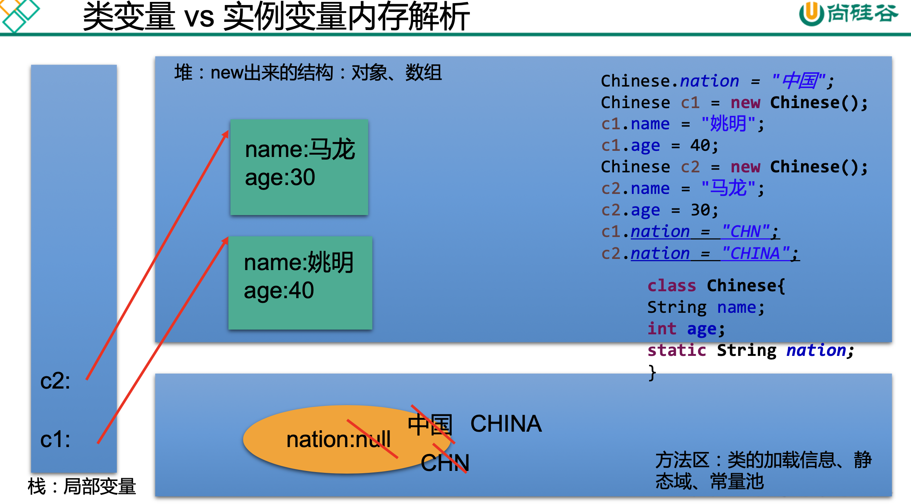

References:

:computer: [尚硅谷 面向对象(下):  static, 代码块, final (313-340)](https://www.bilibili.com/video/BV1Kb411W75N?p=315&vd_source=c6866d088ad067762877e4b6b23ab9df)

之后的抽象类, 抽象方法, 接口, 内部类见CoreJava chap6 笔记


# 1. static 关键字

313-326

我们有时候希望无论是否产生了对象或无论产生了多少 对象的情况下，某些特定的数据在内存空间里只有一份，例如所有的中国人都有个 国家名称，每一个中国人都共享这个国家名称，不必在每一个中国人的实例对象中 都单独分配一个用于代表国家名称的变量。

```
static可以用来修饰的结构: 属性, 方法, 代码块, 内部类
```


## 1.1 static 修饰属性

使用static修饰属性: 静态变量 (类变量)

1. 属性按是否被static修饰又分为: 静态属性 vs. 非静态属性(实例变量)
   + 实例变量： 我们创建了类的多个对象, 每个对象都独立地拥有一套类中的非静态属性, 当修改其中一个对象的非静态属性时， 不会导致其他对象中同样的属性值的修改.
   + 静态变量: 我们创建了类的多个对象, 多个对象共享同一个静态变量. 当通过某一个对象修改静态变量时. 会导致其他对象调用次静态变量时, 也是修改过的.

2. static 修饰属性的其他说明
    静态变量随着类的加载而加载, 可以通过"类.静态变量"的方式进行调用
    静态变量的加载要早于对象的创建
    由于类只会加载一次, 则静态变量在内存中也只会存在一份: 存在方法区的静态域中


:bangbang: 不能通过类来调用非静态的结构, 但是可以通过对象调用静态结构

| 能否调用 | 类变量 | 实例变量 |
| -------- | ------ | -------- |
| 通过类   | yes    | no       |
| 通过对象 | yes    | Yes      |


3. 静态属性举例: System.out; Math.PI


```java
public class StaticTest {
    public static void main(String[] args) {

        Chinese.nation = "中国";     // 静态变量随着类的加载而加载

        Chinese c1 = new Chinese();
        c1.name = "姚明";
        c1.age = 40;

        Chinese c2 = new Chinese();
        c2.name = "马龙";
        c2.age = 30;

        c1.nation = "CHN";
        c2.nation = "CHINA";
        System.out.println(c2.nation);  // "CHINA"
    }
}

class Chinese{
    String name;
    int age;

    static String nation;

}
```


### :moon: JVM内存解析

316



注意JVM三大结构: 栈, 堆, 方法区分别用来存放什么

JVM的内存解析最早在封装那里提到


## 1.2 static 修饰方法

317

1. 使用static修饰方法

随着类的加载而加载, 可以通过"类.静态方法"来调用

2. static调用权限:

| 能否调用 | 静态方法 | 非静态方法             |
| -------- | -------- | ---------------------- |
| 通过类   | yes      | no                     |
| 通过对象 | yes      | Yes (但是不推荐这么写) |

+ 静态方法中, 只能调用静态的方法或属性， 因为他们的生命周期是一致的

+ 非静态方法中, 既可以调用非静态的方法或属性，也可以调用静态的方法或属性

3. static 注意点

* 在静态的方法内, 不能使用this, super关键字
* 关于静态属性和静态方法的使用, 大家都从生命周期的角度去理解


```java
class Chinese{
    String name;
    int age;

    static String nation;
		
   // non-static 方法 -------------------------------------- 
    public void eat(){
        System.out.println("中国人吃中餐");
        // 调用非静态结构
        System.out.println(name);

        info();

        // 调用静态结构
        walk();
        System.out.println("nation: "+ nation);
    }

    public void info(){
        System.out.println(name + age);
    }

		// static 方法 ------------------------------------------
    public static void show(){
        System.out.println("I am a Chinese");
        // 不能调用非静态结构
//        eat();
//        name = "Tom"

        // 可以调用静态结构
        System.out.println(nation);
        walk();
    }

    public static void walk (){

    }


}
```


:bangbang: 属性和方法是否该加static的经验之谈

```
6. 开发中如何确定一个属性是否要被声明为static?
      > 属性是可以被多个对象所共享的, 不会随着对象的不同而不同的.
      > 类中的常量也常常声明为static. e.g. Math.PI

    开发中如何确定一个方法是否要被声明为static?
      > 操作静态属性的方法, 通常就设置为static (非静态的方法也可以调用静态属性, 但是方便期间保证他们的生命周期一致)
      > 工具类中的方法, 习惯上声明为static的. 比如, Math, Arrays, Collections
```


## 1.3 static 应用举例

320

注意下例中Circle哪些属性被声明为static

```java
public class CircleTest {
    public static void main(String[] args) {
        Circle c1 = new Circle();
        Circle c2 = new Circle();
        Circle c3 = new Circle(3.4);

        System.out.println("c1's id is: " + c1.getId());
        System.out.println("c2's id is: " + c2.getId());
        System.out.println("c3's id is: " + c3.getId());

        System.out.println("total circles: " + Circle.getTotal() );
    }

}


class Circle{

    private double radius;
    private int id;     // 每创建一个新的Circle, id 自动递增

    public Circle(){
        id = init++;
        total++;
    }

    public Circle(double radius){
        this();
//        id = init++;
//        total++;

        this.radius = radius;
    }

    private static int total;       // how many circle has been created, 被所有对象共享
    private static int init = 1001; // 辅助赋值给Circle对象的id, 被所有对象共享

    public double findArea(){
        return 3.14 * radius * radius;
    }

    public int getId() {
        return id;
    }

    public static int getTotal() {
        return total;
    }

    public void setId(int id) {
        this.id = id;
    }
}
```


## 1.4 static 练习

321

```java
编写一个类实现银行账户的概念，包含的属性有“帐号”、“密 码”、“存款余额”、“利率”、“最小余额”，定义封装这些 属性的方法。账号要自动生成。 编写主类，使用银行账户类，输入、输出3个储户的上述信息。 考虑:哪些属性可以设计成static属性。
```

:bangbang: 明确一个类中哪些属性应该是static, 哪些不是

```java
public class Account {
    private int id;
    private String pwd = "0000000";
    private double balance;

    private static double interestRate;
    private static double minMoney = 1.0;
    private static int init = 1001; // 辅助, 用于自动生成id

    public Account () {
        id = init++;
    }

    public Account(String pwd, double balance){
        id = init++;
        this.pwd = pwd;
        this.balance = balance;
    }

    @Override
    public String toString() {
        return "Account{" +
                "id=" + id +
                ", pwd='" + pwd + '\'' +
                ", balance=" + balance +
                '}';
    }

		
  	// 各种getter, setter.....
  	
}
```

```java
public class AccountTest {
    public static void main(String[] args) {
        Account acct1 = new Account();
        Account acct2 = new Account("password", 1000.0 );


        Account.setInterestRate(0.012);
        Account.setMinMoney(100);

        System.out.println(acct1);
        System.out.println(acct2);

        System.out.println(Account.getInterestRate());
        System.out.println(Account.getMinMoney());
    }
}
```


## 单例模式

322 - 326

这里也讲了单例模式, 更全面的单例模式见design pattern


```java
单例模式的优点: 
由于单例模式只生成一个实例，减少了系统性能开销，当一个对象的 产生需要比较多的资源时，如读取配置、产生其他依赖对象时，则可以通过在应用启动时直接产生一个单例对象，然后永久驻留内存的方 式来解决。
  
> 网站的计数器，一般也是单例模式实现，否则难以同步。
> 应用程序的日志应用，一般都使用单例模式实现，这一般是由于共享的日志 文件一直处于打开状态，因为只能有一个实例去操作，否则内容不好追加。
> 数据库连接池的设计一般也是采用单例模式，因为数据库连接是一种数据库
资源。
> 项目中，读取配置文件的类，一般也只有一个对象。没有必要每次使用配置
 文件数据，都生成一个对象去读取。
> Application 也是单例的典型应用
> Windows的Task Manager (任务管理器)就是很典型的单例模式
> Windows的Recycle Bin (回收站)也是典型的单例应用。在整个系统运行过程
 中，回收站一直维护着仅有的一个实例。
```


# 2. main()方法 与代码块

327-331

该看这个了


## main()


## 代码块


# 3. final 关键字

332-335


