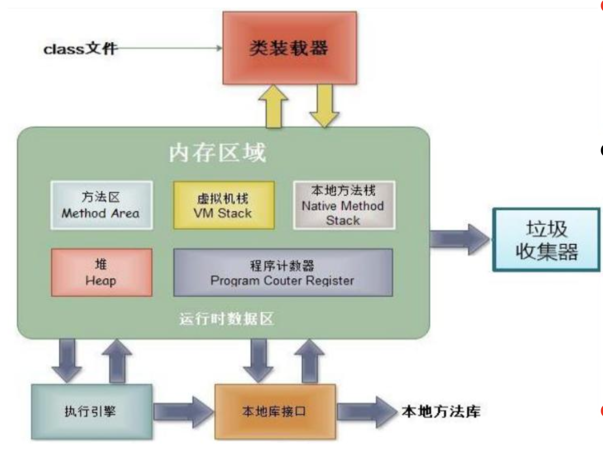
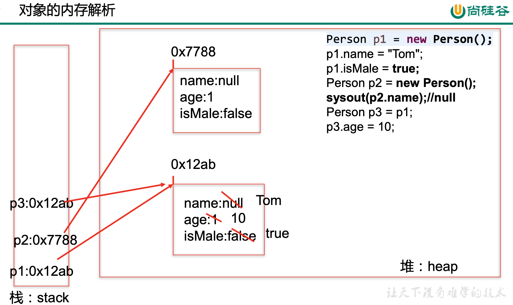
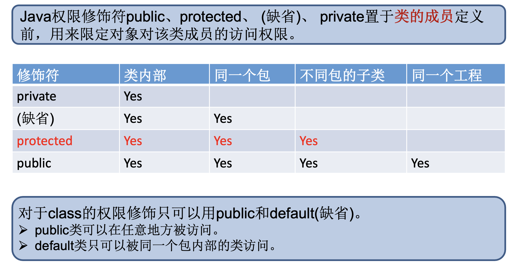

References:

:computer: [尚硅谷 面向对象(上): JVM, Encapsulation, 四种权限](https://www.bilibili.com/video/BV1Kb411W75N?p=176&vd_source=c6866d088ad067762877e4b6b23ab9df)


# Class


## :moon: 对象的JVM内存解析

181




+ `堆(Heap)`，此内存区域的唯一目的 就是**存放对象实例**，几乎所有的对象 实例都在这里分配内存。这一点在 Java虚拟机规范中的描述是:所有的 对象实例以及数组都要在堆上分配。

+ `栈(Stack)`，是指虚拟机栈。虚拟机栈用于存储**局部变量 (方法内部声明的变量)**等。 局部变量表存放了编译期可知长度的 各种基本数据类型(boolean、byte、 char 、 short 、 int 、 float 、 long 、 double)、对象引用(reference类型， 它不等同于对象本身，是对象在堆内 存的首地址)。 方法执行完，自动释放。

+ `方法区(Method Area)`，用于存储已 被虚拟机加载的类<u>信息、常量、静态 变量、即时编译器编译后的代码</u>等数 据。




先在堆空间中分配内存 new 对象, 再将其地址赋值给局部变量


## 属性与局部变量

182

看到这里


# Encapsulation 

219-223


## Access modifier

221


Visibility scope: public > protected > Default (package private) > private

> Access modifiers in Java are keywords that define the visibility and accessibility of classes, methods, and variables within a program. There are four access modifiers in Java:
>
> 1. `Public:` Public access modifier is the most permissive access level in Java. It allows classes, methods, and variables to be accessed from anywhere in the program, including other packages.
> 2. `Protected`: Protected access modifier allows access to classes, methods, and variables within the same package and in subclasses. Protected members are not accessible outside the package, even if they are inherited by a subclass in another package.
> 3. `Default` (no modifier): The default access modifier is used when no other access modifier is specified. It allows access to classes, methods, and variables within the same package only.
> 4. `Private`: Private access modifier is the most restrictive access level in Java. It allows access to members only within the same class. Private members are not accessible outside the class, even if they are inherited by a subclass.
>
> The use of access modifiers is important for encapsulation and information hiding in Java programs. By controlling the visibility of classes, methods, and variables, programmers can ensure that their programs are more secure, reliable, and maintainable.




> Protected members are accessible within the same package and in subclasses, even if they are in a different package. This means that a subclass in a different package can access protected members of its superclass. Protected members are used to provide more flexibility in class design, allowing subclasses to access and override methods or fields that are intended to be used only within the class hierarchy.
>
> Default members, on the other hand, are only accessible within the same package. This means that any class in the same package can access default members, but classes in different packages cannot. Default members are typically used to provide package-level encapsulation, where certain methods or fields are only intended to be used within a specific package and not by external classes.
>
> In summary, the main difference between protected and default access modifiers is that protected provides access to subclasses, while default provides access only within the same package.
>
> 
>
> Sure, here's an example to illustrate the difference between protected and default access modifiers in Java:
>
> ```Java
> javaCopy code
> package com.example.package1;
> 
> public class MyClass {
>     protected int protectedField = 1;
>     int defaultField = 2;
> }
> ```
>
> In this example, `MyClass` has two fields: `protectedField` with protected access modifier and `defaultField` with default access modifier.
>
> Now, let's create a subclass of `MyClass` in a different package:
>
> ```Java
> javaCopy code
> package com.example.package2;
> 
> import com.example.package1.MyClass;
> 
> public class MySubclass extends MyClass {
>     public void printFields() {
>         System.out.println(protectedField); // OK, accessible from subclass
>         // System.out.println(defaultField); // ERROR, not accessible from subclass
>     }
> }
> ```
>
> In this subclass, we have a method `printFields` which tries to access the two fields of `MyClass`. As `protectedField` is marked as protected, it can be accessed by `MySubclass`, even though it is in a different package. However, `defaultField` is marked as default and cannot be accessed by `MySubclass` because it is in a different package.
>
> If we had defined `MySubclass` in the same package as `MyClass`, it would have been able to access both fields without any issues because default members are accessible within the same package.
>
> 


# Constructor


## This


