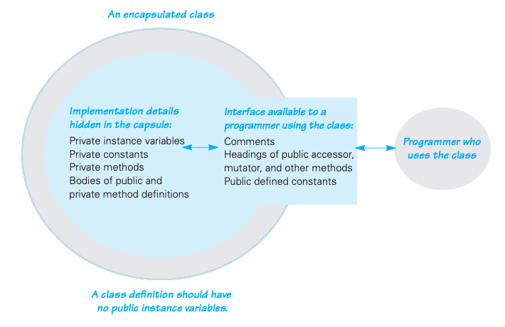
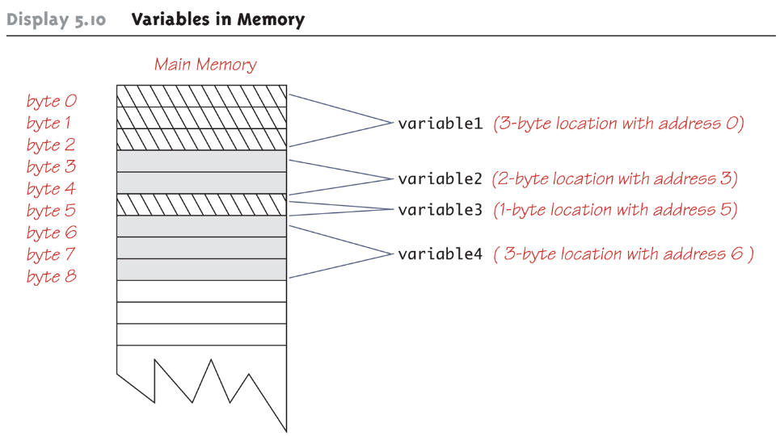
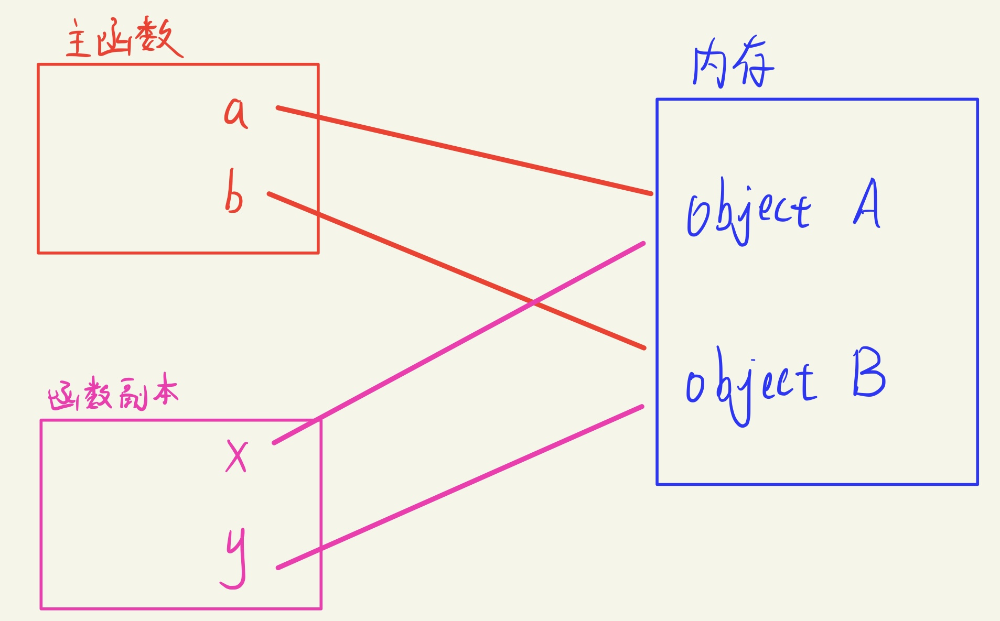

References:


:pencil: [尚硅谷 面向对象(下): static, 代码块, final (313-340)](./GuiguShang/GuiguShang.md)

:pencil: [尚硅谷 面向对象(上): JVM, Encapsulation, 四种权限](./GuiguShang/OOP1.md)


----


---

# Chapter 4 对象与类
## 4.1 面向对象程序设计概述
> 重要OOP概念:
>+ 类(class): 构造对象的模板或蓝图.
> 由类构造(construct)对象的过程称为创建类的实例(instance). 类即注模, 对象即铸造的模型.
>>+ 实例字段(instance field): 对象中的数据.
>>+ 方法(method): 操作数据的过程.
>>+ 对象当前状态(state):作为一个类的实例, 特定对象都有一组特定的实例字段, 这些值的集合就是这个对象的当前状态.
>+ 封装(encapsulation):将数据和行为组合在一个包中, 并对对象的使用者隐藏具体的实现方式.
>+ 继承(inheritance)

> 对象的三个特性:
>+ 行为(behavior): 由可调用方法定义
>+ 状态(state): 必须通过调用方法改变
>+ 标识(identity): 每个对象都有一个唯一标识
> 这三个特性之间相互影响. e.g. 对象的状态会影响到其行为(订单状态为"已付款", 那么此时就应该禁用"付款"行为)

> 类与类之间的关系
>+ 依赖dependence("uses-a"): 如果一个类的方法使用或操纵另一个类的对象, 就说一个类依赖于另一个类;应尽可能将相互依赖的类降至最少.
>+ 聚合aggregation("has-a"): 意味着类A的对象包含类B的对象.
>+ 继承 inheritance("is-a"): 一般来讲, 如果类A扩展类B, 类A不但包含从类B继承的方法, 还会有一些额外的功能.
>+ 可以使用UML(Unified Modelling Language)绘制类图来描述类之间的关系

---

UniMelb Java:

Terminologies:  
A **class** is a type and you can declare variables of your own class type (e.g., you can define a class Car and then declare a variable  Car myCar). _A value of_ a class type is called an **object** or an **instance** of the class. The process of creating an object of a class is called **instantiation**. If A is a class, then the statements “the type of B is A”, “B is an instance of A”, and “B is an object of the class A” all mean the same thing. 

An object has both data and actions (i.e., methods) associated with it. Both the data items and the methods are also called **members** of the object. Data items are also referred to as fields. Methods define what objects of your class are capable of.You can think of methods and the list of variable names/types as belonging to the class, and the data stored in the variables as belonging to the instance of the class.

The **application programming interface (API)** for a class is a description of how to use the class. Optimally, a programmer need only read the API in order to use a well-designed class. 

An **abstract data type (ADT)** is a data type that is written using good information-hiding techniques.




## 4.2 使用预定义类

 1. 对象与对象变量

+ 构造对象
  **想要使用对象, 首先必须构造对象, 并对其初始状态, 然后对对象应用方法**
+ 在Java中, 使用构造器(constructor)构造新实例(构造器相当于一种特殊的方法, 用来初始化object的instance variable, 通常一个class中的constructor会被overloaded(重载)). 构造器的名字应和类名相同.例如想构造一个Date对象, 需要在构造器前加上new操作符:
    ```Java
    new Date(); // 构造了一个新的对象, 它被初始化为当前的日期和时间
    ```
    
    [Demo: constructor](UniMelb/constructor/Date.java)

+ 复用构造的对象-对象变量
  通常会希望复用构造的对象, 此时需要将构造的对象放在对象变量里:
  
    ```Java
    Date birthday = new Date();
    ```

---

1. :full_moon:注意事项
+ **注意一定要区分对象和对象变量!!!**
  
    ```JAVA
    Date deadline;
    ```

    例如上述代码定义了一个对象变量deadline, 它可以引用Date类型的对象,但deadline本身并不是一个对象! **对象变量并没有包含一个对象, 而是引用内存中的对象.** 在Java中, 任何对象变量的值都是对存储在另外一个地方的某个对象的引用.  
    可以认为对象变量相当于C中的指针变量, 而对象相当于一个实实在在的数据（而不是地址值).

+ **注意一定要先初始化对象变量, 才能对其使用方法**
    不同于C, 在Java中如果未初始化指针(引用)，运行时系统会直接报错,而不是产生一个随机的结果
    + 引用新构造的对象
    ```JAVA
    deadline=new Date();
    ```
    + 引用已有的对象 
    两个对象变量将引用内存中的同一个对象
    ```JAVA
    deadline=birthday;
    ```

+ **new操作符返回值也是一个引用**
  
    ```JAVA
    Date deadline = new Date();
    ```

    表达式new Date()构造了一个Date类型的对象, 它的值是对新创建对象的一个引用. 而这个引用存储在对象变量deadline中.


+ **所有的Java对象都存储在堆中.当一个对象包含另一个对象变量时,它只是包含另一个堆对象的指针.**


### 4.2.2 Java类库中的LocalDate类
[Java_Date](code2_2_localdate.java)
标准Java类库分别包含了两个类: 
+ 表示时间点的Date类
+ 用日历表示法表示日期的LocalDate类

具体内容先跳过

### 4.2.3 更改器方法与访问器方法
[calender_demo](code2_3_demo.java)

[Demo: mutator](UniMelb/mutator_method/demoDate.java)

>重要概念
> 一般一个class中的方法分为两类:
>+ 更改器方法(mutator or setter method): 更改对象状态的方法
>+ 访问器方法(accessor method): 只访问对象而不修改对象状态的方法. 通常这种方法用get作为函数开头名, 里面写个return...

具体内容先跳过


## 4.3 :full_moon:用户自定义类
[employeeSalaryManagement](code3_1_employeeTest.java)

在Java中, 最简单的类定义形式为:
```Java
class ClassName{
    field1;
    field2;
    ...
    constructor1;
    constructor2;
    ...
    method1;
    method2;
    ...
}

```

### 4.3.1 基于上面[demo](code3_1_employeeTest.java)分析(原书4.3.2- 4.3.8)

#### 1. 概览
demo中包含两个类: Employee类和带有public修饰符的EmployeeTest类（包含了main方法）. 当编译这段source code时, 编译器将在目录下创建两个类文件: 1) EmployeeTest.class; 2) Employee.class. 在命令行中键入 javac EmployeeTest.java则会编译EmployeeTest及其用到的类

#### 2. public与private修饰符
Java uses **modifiers** to restrict access to certain variables and methods. They contribute to the language's ability to hide information and are a crucial component of encapsulation.

+ public: Employee类中的方法都被标记为public,这意味着任何类的任何方法都可以调用这些方法.
+ private: Employee类中的字段都标记为了private, 这意味着只有Employee类自身的方法能够访问访问这些实例字段,而其他类的方法则不能读写这些字段.
+ It is considered good programming practice to **make all instance variables private** by default. Use accessor to access these private instance variable outside the class.
+ **Most methods are public** and thus provide controlled access to the object. Usually, **methods are private only if used as helper methods** for other methods in the class. 
  
#### 3. 关于构造器  
demo中的Employee类的第二部分关于constructor的定义:
```java
    // define constructor-----------------------------------------
    public Employee(String n, double s, int year, int month, int day){ // remember these parameters are inputs, not actual class property

        //name = Objects.requireNonNullElse(n, "unknown"); // name might be null, 这里我们采用"宽容法"    
        
        //----"严格法"----------
        Objects.requireNonNull(n, "the name cannot be null"); 
        name = n;
        //--------------
        salary = s;
        hireDay = LocalDate.of(year, month, day);
    }
```
注意到:
+ 构造器与类名相同
+ 每个类可以有一个以上的构造器
  通过它们的参数类型来加以区分(见4.6).
+ 构造器可以有0个,1个或多个参数
+ 构造器可以没有返回值
+ **构造器总是伴随着new操作符一起调用**
+ **注意:不要在构造器中定义与实例字段同名的局部变量**  
 以防止这些局部变量遮蔽(shadow)同名的实例字段.例如以下构造器中声明了局部变量name和salary， 这与Employee类的实例字段重名了.
 ```Java
 public Employee(String n, double s, ...){
 String name = n //error
 double salary = s; // error
}
 ```
#### 4.使用var关键字声明局部变量
在Java10中, 如果可以从变量的初始值推导出它们的类型, 那么可以用var关键字声明局部变量,而无需指定类型.  
```java
Employee haary = new Employee("Harry", 50000, 1989,10,1); //最标准写法
var harry = new Employee("Harry", 50000, 1989,10,1); // 也可这样
```
不过我们一般不会对数值类型使用var, 如int, long或者double. 注意var关键字只能用于方法中的局部变量, 参数和字段的类型必须声明.

#### 5.关于使用null引用
我们知道, 一个对象变量包含一个对象的引用, 或者包含一个特殊值null(表示没有引用任何对象). **定义一个类时, 最好事先清楚哪些字段可能为null**. 如果对一个null值应用一个方法, 则会产生一个NullPointerException异常. 有两种方式来address关于null值的使用:
+ "宽容型"方法: 把null参数转换为一个适当的null值(希望接收可有可无的值)
```java
public Employee(String n, double s, int year, int month, int day){
    name =  Objects.requireNonNullElse(n,"unknown");
    ...
}
```
+ "严格型"方法: 干脆直接拒绝null参数(不希望接收可有可无的值)
此时如果用null名字构造了一个Employee对象, 就会产生NullPointerException异常.这种做法有两个好处: 1)异常报告会提供这问题的描述; 2)异常报告会准确指出问题所在的位置, 方便定位错误.

```java
public Employee(String n, double s, int year, int month, int day){
    Objects.requireNonNull(n, "The name cannot be null");
    name = n;
    ...
}
```

---

UniMelb Java

null is a special constant that may be assigned to a variable of any class

```java
e.g., YourClass  yourObject = null; 
```

**It indicates that your variable does not currently refer to any object at all.** It is often used in constructors to initialize class type instance variables when there is no obvious object to use yet.  If a variable of a class type is not initialized, it will default to being null.

**null is not an object.**  It is a placeholder that doesn't refer to anywhere in memory. To test if a variable is null, use == or != (instead of equals() ).  We are testing whether or not the variable refers to something, not testing its value.

```java
e.g.    if (myObject == null)
```

Because null doesn't refer to an object, it is meaningless to refer to its instance variables. Accessing a non-static member through a null variable will result in a "Null Pointer Exception" error message.


---


#### 6.隐式参数与显示参数
>+ 隐式(implicit)参数: 用关键词this指示隐式参数(Java中可写可不写), 隐式参数不会出现在方法声明中.
>+ 显示(explicit)参数: 位于方法名后面括号中的数值, 显式地列在方法声明中

---


#### 7.封装的优点
略

### 4.3.2 其他碎碎念 
#### 1.基于类的访问权限
一个方法可以访问所属类的所有对象的私有数据.

#### 2. 私有方法
>+ 私有方法: 关键字private. 从程序设计者的角度来讲, 如果方法是私有的, 类的设计者就可以确信他不会用在别处, 可将其删去.
>+ 公有方法: 关键字public. 程序设计这应意识到, public method不能随便删去, 因为可能会有其他代码依赖这个方法. 

#### 3. final实例字段
>可以将实例字段定义为final, 这样的字段必须在构造对象时初始化， 且之后无法再修改这个字段.

## 4.35 编写额外的常用对象方法
UniMelb Java:  

1. 对象之间的比较
    > 注意!
    >+ You can't just use == to compare objects as it often refers to references in memory!
    >+ If you don't provide an equals() method, a default will generated -- but the default often doesn't do what you would expect, and so it is good to provide your own.

    For your classes, you should always implement an equals() method to be able to compare instances to each other. 

    [Demo: compareInstances](UniMelb/compareInstance/Date.java)
    为毛用javac, java运行不了????????

    > 注意!  
    > 这里的equals method不考虑做比较的两个object的instance variable取值为Null的情况(e.g. objectA.field1 = null, objectB.field1 = null, 这种情况我们不能认为objectA.field1 equals objectB.field1); 如果你想比较的instance variable 取值可能为null, 此时需要你额外再写一个match method引用equals method来进行比较, 如下
    > ```java 
    > private static boolean datesMatch(Date date1, Date date2)
    > if (date1 == null)
    >    return (date2 == null);
    > else if (date2 == null) //&& date1 != null
    >    return false;
    > else // both dates are not null.
    >    return(date1.equals(date2));
    > ```

2. toString
   [Demo: object_toString](UniMelb/toString/Data.java)
    为毛用javac, java运行不了????????  
    In the example above, check what happens if you replace the last line with the following statement:
    ```java
    System.out.println(date1);
    ```
    What happens here is that Java knows that the println() function takes a String as an argument. As a result, it tries to convert the date1 object into a String, which it does by calling the toString() method.


## 4.4 静态字段与静态方法
解释static修饰符(modifier)的含义: **静态, 与类关联, 是类的方法(静态方法)或属性(静态字段), 而与动态变化的对象无关. 因此, 静态字段和静态方法不依赖于对象, 通过类便可直接调用, 而一般的实例字段却需要对象才能使用.**
### 4.4.1 静态字段

[Demo: staticVariable](UniMelb/staticVariable/humanMain.java)

>+ 如果将一个字段定义为**static**, **每个类**只有一个这样的字段;
>+ 对于非静态的实例字段, **每个对象**都有一个自己的副本
> (静态字段也叫类字段, "静态"是延续了C++的叫法并无实际含义)


```Java
class Employee{
    private static int nexId = 1;
    private int id;
}
```
上面的代码表示, 每一个Employee对象都有一个自己的字段, 但这个类的所有实例都共享一个nextId字段. 例如, 如果有1000个Employee类对象, 则有1000个实例字段id, 分别对应每一个对象. 但是， 只有一个静态字段nextId.即使没有Employee对象, 静态字段nextId也存在(因此只要有static关键字, 那么你就可以无需对象便可访问字段).它属于类, 而不属于单个的对象. 这种静态字段一般用于类共享的信息(类似多线程中需要一个共享变量来递增id)

==有个代码例子???????没懂==

---

UniMelb Java: If not explicitly initialized, a static variable will be automatically initialized to a default value:  
   + **boolean** static variables are initialized to **false**

   + **Other primitive types** static variables are initialized to **the zero of their type**

   + **Class-type** static variables are initialized to **null**

---
### 4.4.2 静态常量
静态变量用的比较少, 但是静态常量却用得很多. 例如Math类中关于PI的定义:
```Java
public class math{
    ...
    public static final double Pi = 3.14159265358979323846;
}
```
在程序中用Math.PI来访问这个常量. 但如果这里省略关键字static, PI就变成了Math类的一个实例字段, 即需要一个Math类的对象来访问PI，且每一个Math对象都有一个自己的PI副本.

==另一个常使用的静态常量是System.out ???????回头看==
### 4.4.3 :full_moon:静态方法

[Demo: staticMethod](UniMelb/staticMethod/SharePrice.java)

>+ **静态方法是不在对象上执行的方法 (或认为是没有this参数的方法). 静态方法可以不经过Object就被调用** 
> 例如Math类的pow方法就是一个静态方法, 表达式 Math.pow(x,a)会计算x的a次幂. 在运算完成时, 它不使用任何Math对象(换言之,它没有隐式参数). 这种方法更像是面对过程中的普通函数.
>+ **静态方法无法访问非静态实例字段(static method cannot access instance variables), 因为它不能在对象上执行; 但是相应地, 静态方法可以访问静态字段.** 
>+ **非静态方法不但可以访问非静态字段，还可以访问静态字段** 如上述demo的value method
>+ 可以使用对象来调用静态方法, 这是合法的, 但是不推荐这么做, 因为这违背了我们使用静态方法的初衷: 静态方法不依赖于对象, 而是属于类的.

2. 以下两种情况可以使用静态方法 
   
   + 方法不需要访问对象状态, 因为它需要的所有参数都通过显示参数提供.(e.g. Math.pow) 
   + 方法只需访问类的静态字段

---

UniMelb Java: 注意! 静态方法不能call非静态方法. e.g.:

    ```java
    class Main {
        private void sayHello () {
            System.out.println ("Hello, World!");
        }
    
        public static void main (String[] args) {
            sayHello (); // static method calls a non-static method, error will pop out
        }
    }
    ```
    Principle:  When a non-static method is called, it is passed a hidden parameter, this, which refers to the object ("instance") of this class from which it is being called.  A static method can be called without an object, like  Main.main(),  and so there is no this variable that it can pass.
    
    + 修改方法一: 给sayHello() 加上modifier: static
    
    + 修改方法二: 非静态方法依赖object来被invoke, 如下
    
    ```java
    class Main {
        private void sayHello () {
            System.out.println ("Hello, World!");
        }
    
        public static void main (String[] args) {
            Main instance = new Main();
            instance.sayHello ();
        }
    }
    ```

---

### 4.4.4 工厂方法 
使用静态工厂方法(factory method)来构建对象.

已见过的工厂方法包括: LocalDate.now 和 LocalDate.of

==NumberFormat类??????==


### 4.4.5 :full_moon: main方法
main方法也是一个静态方法, 它不对任何对象进行操作. 每一个类都可以有一个main方法, 这是常用于对类进行单元测试的一个技巧.

[Demo: staticTest](code4_4_staticTest.java)

+ **注意上述Demo中两个class是并列关系的, 不是包含关系**: class code4_4_staticTest(和java file的名字一样), class Employee; 其中前者用到后者.
+ 注意并不是只要一个方法用到static field, 该方法就是static method--**是否要冠以一个method以static, 取决于该方法是否要用到instances的field(是否可以只依赖于类).** 比如demo中的setId方法用到了static field nextId, 但同时也要用到instances的id, 所以不是static method.

+ 跑 class code4_4_staticTest中的main method:  
    在terminal中输入: 
    ```shell
    java code4_4_staticTest  
    ```
    可见static class Employee的main method并未被执行  
    ```shell
    name=Tom, id=1, salary=40000.0
    name=Dick, id=2, salary=60000.0
    name=Harry, id=3, salary=65000.0
    Next available id = 4
    ```
+ 跑class Employee中的main method:   
    在terminal中输入: 
    ```shell
    java Employee
    ```
    可见只有static class Employee的main method被执行了  

    ```shell
    Harry50000.0
    ```

## 4.45 math class
this session is from UniMelb Java

> Math class provides many static methods related to (you guessed it) mathematics.It is in java.lang which is imported by default, and so you do not need an import statement.All of its elements are static, and so you will never need to create an object of class Math.

2. Some methods
    ```java
    public static double  pow(double base, double exponent)
    public static double   sqrt (double argument)
    public static T abs(T argument) // for T in double, float, long, int
    public static T min (T n1, T n2) // for T in  double, float, long, int
    public static T max (T n1, T n2) // for T in  double, float, long, int
    ```

3. Converting to integers  
    There are three methods for converting floating point values (double and float) to integers. (There are four counting overloading.)

    + Round to nearest
        ```java
        public static long round (double argument)
        public static int  round (float  argument)
        ```
        These return the integer nearest to the argument.

        Positive values with a fractional part 0.5 or higher round up, and values with a fractional part less than 0.5 round down.  (For negative values, this is reversed.  Have a think about why.)

        Note that these return integer types (long and int).

    + Round down
        ```java
        public static double floor (double argument)
        ```
        This rounds down; it returns the largest whole number that isn't bigger than the argument, e.g., Math.floor(3.5) = 3.0.

        (For negative values, it rounds away from zero.  Math.floor(-3.5) = -4)

        Note that these return double.  They are not useful for changing the type of data; just for mathematical operations.

    + Round Up
        ```java
        public static double ceil (double argument)
        ```
        This rounds up; it returns the smallest whole number that isn't smaller than the argument. e.g., Math.ceil(3.5) = 4.0

        The name is short for "ceiling".

        Again, for negative values this rounds away from zero.  Again, it returns a double.

4. Additional functions
   
   random

    sin, cos, tan, asin, acos, atan, sinh, cosh, tanh

    toDegrees, toRadians

    atan2, hypot

    exp, log, log10, expm1, logp1


## 4.46 wrapper class

Variables of primitive types are not Java objects.  That is, they are not of a class derived from class Object.That means we cannot have, for example, a java List of integers, because the List class can only have lists of Object elements.

However, java provides classes that behave like the primitive types:

```java
// 大写首字母
boolean -> Boolean
byte    -> Byte
short   -> Short
long    -> Long
float   -> Float
double  -> Double
// 其他
char -> Character
int  -> Integer

```

Wrapper classes also have many useful constants and static methods  
e.g., Integer.decode(String s) converts a decimal string to an Integer.

1. Boxing
   Boxing is the process of going from a value of a primitive type to an object of its wrapper class

   + To convert a primitive value to an "equivalent" class type value, create an object of the corresponding wrapper class using the primitive value as an argument
   + The new object will contain an instance variable that stores a copy of the primitive value
   + Unlike most other classes, a wrapper class does not have a no-argument constructor
        Integer integerObject = new Integer(42);

2. Unboxing
   Unboxing: the process of going from an object of a wrapper class to the corresponding value of a primitive type.  The methods for this are:

    ```java
    Boolean.booleanValue()
    Byte.byteValue()
    Short.shortValue()
    Integer.intValue()
    Float.floatValue()
    Double.doubleValue()
    Character.charValue()
    ```
    None of these methods take an argument
    ```java
    int i = integerObject.intValue();
    ```
3. Automatic boxing and unboxing
   Manually inserting boxing and unboxing code makes coding slower and makes code harder to read.Starting with version 5.0, Java can automatically do boxing and unboxing.

   + **Boxing简化写法**: Instead of creating a wrapper class object using the new operation (as shown before), it can be done as an automatic type cast:    
    ```java
        Integer integerObject = 42;
    ```

    + **Unboxing简化写法**: Instead of having to invoke the appropriate method (such as intValue) to convert from an object of a wrapper class to a value of its associated primitive type, the primitive value can be recovered automatically
        ```java
        int i = integerObject;
        ```
4. :moon:Static methods of wrapper class
   
    [Demo: StringManipulation](UniMelb/wrapperClass/stringManipulation.java)

    Wrapper classes have static methods that convert a correctly formed string representation of a number to the number of a given type:

    ```java
    Integer.parseInt ()
    Long.parseLong ()
    Float.parseFloat ()
    Double.parseDouble ()
    ```

    Wrapper classes also have static methods that convert from a numeric value to a string representation of the value:

    ```java
    Double.toString(123.99); // returns the string value "123.99"
    ```

    The Character class contains a number of static methods that are useful for string processing.  

    ```java
    // Replace lower case characters by upper case equivalents, or vice versa
    public static char toUpperCase(char argument)
    public static char toLowerCase(char argument)
    
    // Returns true if the argument is an upper-case letter, and false otherwise.
    public static boolean isUpperCase(char argument)
    public static boolean isLowerCase(char argument)
    
    // The following return true if argument is...
    public static boolean isWhitespace(char argument) // Whitespace (space, tab \t, new line \n)
    public static boolean isLetter(char argument)     // A letter a-z, A-Z, accented chars
    public static boolean isDigit(char argument)
    public static boolean isLetterOrDigit(char argument)
    ```

    a short example:
    ```java
    import java.util.Scanner;
    
    /**
    Illustrate the use of a static method from the class Character.
    */
    
    public class StringProcessor {
        public static void main (String[] args) {
            System.out.println("Enter a one-line sentence:");
            Scanner keyboard = new Scanner(System.in);
            String sentence = keyboard.nextLine();
            
            sentence = sentence.toLowerCase();
            char firstCharacter = sentence.charAt(0); // get the first char of sentence
            sentence = Character.toUpperCase(firstCharacter) + sentence.substring(1); // Capitalizing the first character of sentence
    
            System.out.println("The revised sentence is:");
            System.out.println(sentence);
        }
    }
    ```
    Results:
    ```shell
    Enter a one-line sentence:
    this is WRONG
    The revised sentence is:
    This is wrong
    
    ```

    > Advanced: Unicode
    > 这些static method对于不同语言的字母的处理方式会不同. 具体google


## 4.5 :full_moon:方法参数

这里只看JavaCore的内容即可, UniMelb可以只看最后的call by value call by reference的demo即可, UniMelb其他内容作为补充 

### 4.5.0 UniMelb Java content  

0. Some basic knowledge
    It is important to understand how computers store data, such as Java variables. A computer has two forms of memory:

    + Secondary memory (typically a hard disk, or flash drive like SSD) is used to hold files for "permanent" storage

    + Main memory (a.k.a. Primary memory, typically RAM) is used by a computer when it is running a program.

    Values stored in a program's variables are kept in main memory.

    

    > variable and memory  
    > Every variable is stored in a location in computer memory.
    >+ **基本类型变量是实实在在的内存的数据.** When the variable is a **primitive type** (int, double etc.), **the value of the variable** is stored directly in the memory location assigned to the variable.  This is possible because each value of a primitive type always requires the same amount of memory to store its values.
    >+ **类变量是引用(指针)，不是真的内存中的object.** When the variable is a **class type**, **only the memory address (or reference)** of where the object is located is stored at the memory location assigned to the variable.  (Note: two different locations are involved.)
    > For classes:
    >>+ The object named by the variable is stored in some other location in memory, not the location assigned to the variable.
    >>+ Like primitives, the value of a class variable (i.e., the reference) is a fixed size
    >>+ Unlike primitives, the value of a class variable is a memory address or reference
    >>+ The object whose address is stored in the variable can be of variable size.
    >
    >Because a class variable only holds a reference to the object, two class variables can contain the same reference, and therefore name the same object. 因而你可以使得两个类变量引用(指向)内存中的同一个object, 对任意一个类变量进行操作就相当于对内存中的object操作.


    > Advanced: Virtual memory
    >"Virtual memory" allows the operating system allows some data from "main memory" to be stored on the hard drive instead of in RAM.  That is one reason we talk about main and secondary memory, instead of RAM and hard drive.  Main memory includes RAM plus virtual memory "swap space".
    
    > Conversion
    > 1 Byte = 8 bits
    > 1 kiB = 2^10 = 1024 bytes.  1 kB = 10^3 bytes    (Note the "i" in kiB.)
    > 1 MiB = 2^20 bytes.  1 MB = 10^6 bytes
    > 1 GiB = 2^30 bytes.  1 GB = 10^9 bytes
    > 2^32B = 4 x 2^30 bytes = 4 GiB
    > 2^64B = 16 x 2^60 bytes ~ 16,000,000,000 GiB.  To paraphrase Bill Gates, that should be enough for anyone.


1. block & local variable
    A variable declared within a method definition is called a local variable. All method parameters are local variables.**Unlike other programming languages, Java does not have global variables.**

    A block is another name for a compound statement or a method body; that is, a set of Java statements enclosed in braces, {}. A variable declared within a block is local to that block. When the block ends, all variables declared within the block disappear.

    ```java
    int sum = 0;
    for(int i=1; i<=100; i++) {
        sum = sum+1;
    }
    ```
    The variable i is local to the for loop, and cannot be used outside of the loop. If you need to use such a variable outside of a loop, then you must declare it outside the loop.  


2. method, parameter and argument
   
    Some methods, however, need to receive additional data via a list of parameters in order to perform their work. These parameters are also called formal parameters. A **parameter list** provides a description of the data required by a method. It indicates the number and types of data pieces needed, the order in which they must be given, and the local name for these pieces as used in the method:
    ```java
    public double myMethod(int param1, int param2, double param3) {} // parameter list within bracket
    ```
    When a method is invoked, the appropriate values must be passed to the method in the form of **arguments**. Arguments are also called **actual parameters**. The number and order of the arguments must exactly match that of the parameter list. The type of each argument must be compatible with the type of the corresponding parameter.
    ```java
    int a=1,b=2,c=3;
    double result = myMethod(a,b,c);
    ```
    If argument and parameter types do not match exactly, Java will attempt to make an automatic type conversion. In the example above, the int value of argument c would be cast to a double. A primitive argument can automatically be typecast from any of the following types to any of the types that appear to its right: 
    ```shell
    byte > short > int > long > float > double > char
    ```
    >The terms parameter and argument are often used wrongfully interchangeably. You may need to infer their meaning from context.

3. Pass-by-value mechanism
   
   ```java 
    int myFunction (int arg) {
        arg = arg + 1;
        return arg;
    }
   
    int a = 1;
    int b = myFunction(a);
   ```
    + In a call-by-value function call, a copy of a would be passed to myFunction and so a would not be affected by the line  arg = arg + 1;

    + In a call-by-reference function call, arg would actually stand for a during the function call -- arg would be a reference to the location where a is stored, and so after the function call, a == 2.

    [Demo: call by value and call by reference](UniMelb/callByValue_ByReference/callByValueByReference.java)

    > So which does Java use?
    > Technically, **all Java methods are call-by-value.**  A parameter is a local variable that is set equal to the value of its argument.  Therefore, any change to the value of the parameter cannot change the value of its argument.
    > However, since class variables are actually references to objects, they behave very **similarly** to call-by-reference parameters.  In particular, the function call can change the value of the object that the parameter refers to, even though it cannot change the parameter itself (i.e., can't make it refer to a different object).

    The value plugged into a class type parameter is a reference (memory address) 

    + Therefore, the parameter becomes another name for the argument
   
    + Any change made to the object named by the parameter (i.e., changes made to the values of its instance variables) will be made to the object named by the argument, because they are the same object
   
    + Note that, because it still is a call-by-value parameter, any change made to the class type parameter itself (i.e., its address) will not change its argument (the reference or memory address)
   
    The value of the object named by the argument can be updated but the argument itself will not be changed.

    > The operators = and == don't do what you might expect when used on class variables. Note class variable is essentially a pointer, the value of a class variable is just an address, so that:
    >+ ‘=’是赋值, class type variable a  = class type variable b, 代表a和b指向内存中的同一个object. Assignment (=) causes two variables to be names for the same object; it does not create a copy. Changing the instance variables of the object referred to by one variable will cause cause changes in the object referred to by the other  variable, because it is the same object.
    >+ '=='本质上是check左右两边的值是否相同. 但'=='对于primitive type 和class type variable的作用是不一样的. 
    >>+ 对于class type variable, 由于它们的值是address, 所以'=='实际上对于它们是check引用的Object是否相同. Testing for equality (==两个等号) only checks that two variables of a class type refer to the same object.If they refer to two objects with the same instance variables, it will return false. 
    >>+ 对于primitive type variable, 因为它们就是call by value的, 所以==就是比较variable的value
    >+ To test for equality, use the member method equals().


### 4.5.1 :full_moon: JavaCore content
[paramTest](code4_5_paramTest.java)

Java程序设计语言对对象采用的不是按引用调用, 实际上, **对象引用是按值传递的.**

对demo总结（运行结果见代码注释）
+ 有两种类型的方法参数:
   1) 基本数据类型(数字, boolean)
   2) 对象引用
   
+ **Test1: 当基本数据类型作为方法参数时, 方法不能修改基本数据类型的参数(即数值型或布尔型).**  
    因为Java对于基本数据类型的参数是按值传递的. 方法会创建主函数中基本数据的副本, 然后在副本中计算, 方法调用结束后副本中的变量会被释放.

+ **Test2: 当对象引用作为方法参数时, 方法可以改变对象参数的状态.**
    因为对象是按照对象引用作为方法参数而被方法调用的. 方法同样会创建主函数中对象变量的副本(**对象变量就是对对象的引用**), 这样副本中的对象变量和主函数中的对象变量其实都引用(指向)了内存中的同一对象, 在副本中改变对象变量其实就在改变内存中的对象, 所以此时方法调用结束后对象的状态可以被改变.

+ **Test3: 当对象引用作为方法参数时, 方法不能让一个对象参数引用一个新的对象 (methods can't attach new objects to object parameters).**
    test3的结果显示, swap方法只是交换了副本中的参数x和y, 并没有交换主函数中的我们想交换的对象变量a和b. 主函数中的对象变量a和b分别引用了内存中的对象A和B, a和b的值应该就是内存中对象a和b的地址, 现在想要使得对象变量a指向对象B, 对象变量b指向对象A, 需要交换的是对象变量a和b的值, 但是实际上swap方法创建的副本中对象变量x和y初始化得到的值是内存中的对象A和B的地址值, 交换x和y根本不会影响到主函数中对象变量a和b的值 (除非你用指针分别指向对象变量a和b, 再令指针指向的值互换, 不过这是C的思想了.)本质上还是因为Java是按值传递的(call by value).

> 总结 
>  
如下图, Java中对对象引用是按值传递, 所以不论是主函数还是函数副本中的对象引用都是直接引用内存中的对象(相当于直接用指针指向内存中的对象), 这样在函数中对对象变量操作其实就是对内存中的对象的操作. 但也正因为这点, 主函数和函数副本之间并没有直接关联, 因此交换函数副本中的对象变量的值，并不能交换主函数中的对象变量的值



## 4.6 对象构造
对象构造非常重要, Java提供了多种编写构造器的机制.

除了利用构造器及其参数来将构造对象外, 还可以通过class内部的method来构造对象, e.g.[Demo](UniMelb_bill/BillingDialog.java)

### 4.6.0 :full_moon:  Privacy leaks

1. Copy constructors

    A copy constructor is a constructor with a single argument of the same type as the class. The copy constructor should create an object that is a **separate, independent object**, but with the instance variables set so that it is an exact copy of the argument object.

+ 对于只含有primitive type instance variable的写法：

    Note how, in the Date copy constructor, the values of all of the **primitive type** private instance variables are merely copied.

    ```java
    public Date(Date aDate) //constructor - chapter 4, 构造器输入为同一个类的class type variable
    {
        if (aDate == null) //Not a real date.
        {
            System.out.println("Fatal Error.");
            System.exit(0);
        }
        month = aDate.month;
        day = aDate.day;
        year = aDate.year;
    }
    ```

+ 对于含有class type instance variable的写法 

    现在来看一个含有class type as instance variable的类：Person

    ```java
    public class Person
    {
        private String name;
        private Date born;  
        private Date died; //null if still alive
    }
    ```
    若按照如下方式来定义copy constructor, 则不会'复制'出一个separate, independent的object. 因为如下其实是把旧的class type variable的born, died字段的值赋给了新的想要'复制'的class type variable的born, died字段, 实际上二者的字段指向的是内存中的同一object.
    ```java
    born = original.born //dangerous
    died = original.died //dangerous
    ```

    真正的安全的做法是, 在内存中再创建一个新的object(用new), 然后再将其引用赋给新的class type variable的对应字段, 这样新的class type variable才能代表一个独立的object, 如下:

    ```java
    born = new Date(original.born);
    ```

    如下, 完整的对含有class type instance variable的class的copy constructor的写法:
    ```java
    public Person(Person original)
    {
        if (original == null)
        {
            System.out.println("Fatal error.");
            System.exit(1);
        }
        name = original.name;
        born = new Date(original.born); // 创建内存中新的object
        if (original.died == null)
            died = null;
        else
            died = new Date(original.died); // 创建内存中新的object
    }
    ```

2. privacy leaks

    The previously illustrated examples from the Person class show how an incorrect definition of a constructor can result in a privacy leak.

    A similar problem can occur with incorrectly defined mutator or accessor methods. For instance:

    ```java
        public Date getBirthDate()
    {
        return born; //dangerous, 相当于return了内存中born object的指针, 直接掏心掏肺了属于是
    }
    
        public Date getBirthDate()
    {
        return new Date(born); //correct, return了另一个完全独立于内存中born object的copy, 不会影响到原来的born object, 阴阳合同的感觉
    }
    ```


3. Mutable and immutable classes

    + A class that contains no methods (other than constructors) that change any of the data in an object of the class is called an immutable class.Objects of such a class are called **immutable objects**. It is perfectly safe to return a reference to an immutable object because the object cannot be changed in any way. The String class is an immutable class.

    + A class that contains public mutator methods or other public methods that can change the data in its objects is called a **mutable class**, and its objects are called **mutable objects**.

    + **Never write a method that returns a mutable instance variable**(因为这样其实会return指向内存中object的指针, 这个指针如果暴露在外（比如将return的reference赋给一个变量, 之后仅仅通过这个变量就可以改变内存中object的状态），通过mutator method就可以改动内存中的object).  Instead, use a copy constructor to return a reference to a **completely independent copy** of the mutable object. 
        >+ A **deep copy** of an object is a copy that, with one exception, has no references in common with the original.  The exception is that references to immutable objects are allowed to be shared.
        >+ Any copy that is not a deep copy is called a **shallow copy**. This type of copy can cause dangerous privacy leaks in a program.
        >+ shallow copy当然效率比deep copy更高
4. complete example
   作为前面的汇总: [Demo: personDate](UniMelb/copyConstructor/copyConstructor.java)

    Exercise:  Implement  Date.precedes()  near the end of the code, and fill in your name and birth date, and those of a friend or other person in the method  Main.main  at the start of the code.

    You can also test the unused methods such as Person.consistent, and/or check which of two people with death dates lived longer.


### 4.6.1 重载

[Demo: reloading](UniMelb/Reloading/Date.java)

+ 如果多个方法有相同的名字,不同的参数, 便出现了**重载(Overloading)**.编译器必须挑选出具体调用哪个方法: 编译器用各个方法首部中的参数类型与特定方法调用中所使用的值类型进行匹配, 来选出正确的方法.这个查找匹配的过程叫**做重载解析(overloading resolution)**.
+ Java允许重载任何方法, 要完整地描述一个方法, 需要指定方法名及其参数类型, 这叫做方法的**签名(signature)**.例如String类有4个名为indexOf的公共方法, 它们的签名是:
    ```java
    indexOf(int)
    indexOf(int, int)
    indexOf(String)
    indexOf(String, int)
    ```
    其实就是由method name和其Parameter list共同uniquely identify一个方法; **不过注意返回类型不是方法签名的一部分, 也就是说不能有两个名字相同, 参数类型也相同却有不同返回类型的方法.** 
    如果Java无法找到和signature完全匹配的方法, 那么它就会进行自动类型转换(automatic type conversion), 如果此时方法的signature有多个, 经过自动类型转换后你可能就会invoke到错误的方法, 得到预料之外的结果

### 4.6.2 :full_moon:默认字段初始化
>如果在构造器中没有显式地为字段设置初值, 那么就会被自动赋值为默认值:
>+ 数值为0
>+ boolean值为false
>+ 对象引用为null
> 依赖默认值的做法是一 b种不好的编程实践, 如果不对字段明确地进行初始化, 就会影响程序代码的可读性. 

>:full_moon:**注意区分字段与局部变量关于初始化的区别:**
>+ 方法中的局部变量必须明确地初始化 
>+ 但是在类中，如果没有初始化类中的字段, 将会自动初始化为默认值(0, false OR null).


### 4.6.3 无参数的构造器
>+ 如果编写一个类时没有编写构造器, 那么Java会为你提供一个无参数构造器, 这个构造器将所有的实例字段设置为默认值.例如以下是Employee类的无参数构造器:
>>```Java
>> public Employee(){
>>  name = "";
>>  salary = 0;
>>  hireDay = LocalDate.now();
>>}
>>```
>+ 如果编写一个类时编写了至少一个构造器, 但没有编写无参数的构造器, 那么构造对象时必须提供参数. 例如 [4-2 Demo](code3_1_employeeTest.java)中的Employee类提供了一个简单的构造器:
>>```Java
>>public Employee(String n, double s, int year, int month, int day)
>>```
>>对于这个类, 如果你不提供参数而想构造默认员工就是不合法的:
>>```java
>>e = new Employee(); // error
>>```

### 4.6.4 :full_moon:显式字段的初始化
>+ **除了在构造对象时初始化字段, 在定义类时的字段时(也叫声明, 编写一个类的step1)也可以直接为任何字段赋值.** 如果希望把一个类的所有构造器的某特定字段设置为同一个值, 这个语法就很方便. 例:
>> ``` java
>> class Employee{
>>    private String name = "";
>> }
>> ```
>> 但是在C++中, 不能直接初始化类的实例字段, 所有的字段都必须在构造器中设置
>+ **初始值不一定非得是常量.** 例如下面例子中就是利用方法调用来初始化一个Employee对象的id.
>> ``` java
>> class Employee{
>> private static int nextId;
>> private int id = assignId();
>> ...
>> private static int assignId(){
>>  int r = nextId;
>>  nextId++;
>>  return r;
>>  }
>> ...
>> }
>> ```
==试下这个代码!!!==

至此, 我们学习到了两种初始化字段的方式:
+ 在构造器中设置值
+ 在声明中赋值

在4.6.7中, 我们还会了解到第三种初始化字段的方式--初始化块(initialization block)

### 4.6.5 参数名
 关于参数命名的实践: 以下构造器中, 等号左边是实例字段, 右边是传入的参数变量. 这里的核心问题在于不要把二者取一样的名字, 否则参数变量会遮蔽同名的实例字段, 一般有以下三种习惯来区分实例字段和参数变量:
+ 我们通常喜欢用单个字母作为参数名:
 ```java
 public Employee(String n, double s){
      name = n;
      salary = s;    
 }
 ```
 但是这种方式会降低代码可读性.
+ 有些程序员在每个参数前面加一个前缀"a"(preferred):
 ```java
  public Employee(String aName, double aSalary){
      name = aName;
      salary = aSalary;
  }
 ```
+ 用this指示隐式参数(preferred): 
 ```java
 public Employee(String name, double salary){
      this.name = name;
      this.salary = salary;
 }
 ```
Java中不写this也行, 只要能区分开实例字段和参数变量即可.


### 4.6.6 :full_moon:调用另一个构造器
关键字this指示一个方法的隐式参数, 但它还有另一个含义:
如果构造器的第一个语句形如this(...), 这个构造器将调用同一个类的另一个构造器:
```java
public Employee(double s){ // another constructor
    //calls Employee(String, double)
    this("Employee #"+nextId, s); // overload
    nextId++;
}
```
这样当调用new Employee(60000)时, Employee(double)构造器将调用Employee(String, double)构造器. 采用这种方式使用this关键字非常有用, 这样对公共的构造器代码只需要编写一次即可.

==没懂?????? -- 看4.6.7 demo==

### 4.6.7 :full_moon:初始化块 (initialization block)
[constructorTest](code4_5_constructorTest.java)

>Results: 
> 可见Employee的id是按照代码递增1的
>```shell
>name=Harry, id=6978, salary=40000.0
>name=Employee #6979, id=6979, salary=60000.0
>name=, id=6980, salary=0.0
>```
>上述demo展示了很多本节讨论的特性:
>+ 重载构造器
>+ 用this(...)调用另一个构造器
>+ 无参数构造器
>+ 对象初始化块
>+ 静态初始化块
>+ 实例字段初始化

---

前面我们已经讲过两种初始化数据字段的方式:
+ 在构造器中设置值 (更常用)
+ 在声明中赋值

现在来讲第三种机制: **初始化块(initialization block).** 在一个类的声明中, 可以包含任意多个代码块. 只要构造这个类的对象, 这些块就会被执行:
```java
class Employee{
    private static int nextId;

    private int id;
    private String name;
    private double salary;

    // object initialization block
    {
        id = nextId;
        nextId++;
    }

    public Employee(String n, double s){
        name = n;
        salary = s;
    }

    public Employee(){
        name = "";
        salary = 0;
    }
    ...
}
```
在这个示例中, 无论使用哪个构造器构造对象, id字段都会在对象初始化块中初始化, 首先运行初始化块, 然后才运行构造器主题部分. 这种机制不是必须的, 也不常见, 通常哦我们会直接将初始化代码放在构造器中.  
如果想要使用这种机制, 建议总是将初始化块放在字段定义之后以防止循环定义.

> 注解: 调用构造器的具体处理步骤：
> 1. 如果构造器的第一行调用了另一个构造器, 则基于所提供的参数执行第二个构造器.
> 2. 否则,
>> + 所有的数据字段初始化为其默认值(0, false OR null).
>> + 按照在类声明中出现的顺序, 执行所有字段初始化方法和初始化块.
> 3. 执行构造器主体代码. 

---

**静态初始化块**
如果类的静态字段需要很复杂的初始化代码, 那么可以使用静态的初始化块:

```java
//static initialization block
static{
    var generator = new Random(); // need import util
    nextId = generator.nextInt(10000);
}
```
这样当类第一次加载时, 将会进行静态字段的初始化.

### 4.6.8 对象析构与finalize方法
Java可以完成自动的垃圾回收, 不需要人工回收内存,所以Java不支持析构器.(有些面向对象的程序设计语言,特别是C++， 有显式的析构器方法, 其中放置一些当对象不再使用时需要执行的清理代码. 析构器中最常见的操作时回收分配给对象的存储空间.)

有些对象使用了内存之外的其他资源, 比如文件或使用了系统资源的另一个对象的句柄. 在这种情况下, 当资源不再需要时, 将其回收和再利用就非常重要. 如果一个资源一旦使用完就需要立即关闭, 那么应提供一个close方法来完成必要的清理工作. 可以在对象使用完时调用这个close方法(注意不要使用finalize方法完成清理, 它已被废弃.).

## 4.7 包
Java允许使用包(package)来将类组织在一个集合中. 借助包我们可以方便地组织自己的代码, 并将自己的代码与别人提供的代码库分开管理.

---

### 4.7.0 UniMelb Java: Package

1. Make a package 
   To make a package, group all the classes together in a single directory (folder), and add the following package statement to the beginning of each java file for those classes:
    ```java
    package package_name;
    ```

    Only the .class files must be in the directory or folder; the .java files are optional

    Only blank lines and comments may go before the package statement.

    If there are both import and package statements, the package statement must go before any import statements.

2. Find a package
    Java needs two things to find the directory for a package:

       + The name of the package and  
       + The value of the CLASSPATH variable.
    
    The CLASSPATH environment variable is similar to the PATH variable, and is set in the same way for a given operating system. The CLASSPATH variable is set equal to the list of directories (including the current directory, ".") in which Java will look for packages on a particular computer.Java searches this list of directories in order, and uses the first directory on the list in which the package is found.

   + The default package
    All classes in the current directory belong to an unnamed package called the default package. As long as the current directory (.) is part of the CLASSPATH variable, all the classes in the default package are automatically available to a program.

   + Pitfall: Not including the current directory in your class path

      + If the CLASSPATH variable is set, the current directory must be included as one of the alternatives.  Otherwise, Java may not even be able to find the .class files for the program itself.

      + If the CLASSPATH variable is not set, then all the class files for a program must be put in the current directory.

    + Specifying a class path when you compile
    The class path can be manually specified when a class is compiled.  Just add  -classpath  followed by the desired class path to the  javac  line.  This will compile the class, overriding any previous CLASSPATH setting.You should use the same -classpath option again when the class is run.

---

### 4.7.1 包名
+ **使用包的主要原因是确保类名的唯一性.**  
 假如两个程序员同时建立了Employee类, 只要将这些类放置在不同的包中就不会产生冲突. 事实上, 为了保证包名的绝对唯一性, 要用一个因特网域名(这显然是唯一的)以逆序的形式作为包名, 然后对不同的工程使用不同的子包.
+ **每一个包都是独立的类的集合**
 从编译器的角度来看, 嵌套的包之间没有任何关系. 例如java.util包与java.util.jar包之间毫无关系.


### 4.7.2 类的导入
 **一个类可以使用所属包中的所有类, 以及其他包中的公共类**, 对于后者, 我们有两种方法来访问:
  + 使用完全限定名(fully qualified name)
      即包名后面跟着类名(很繁琐), 但是这样做容易区分不同package中相同的class, 例如:
    ```java
    java.time.LocalDate today = java.time.LocalDate.now();
    ```
  + 使用import语句 
      可以使用import语句导入一个特定的类或整个包
    ```java
    import java.time.*; // import all package
    import java.time.LocalDate; // import the specified class
    ```

> Drawbacks of using *:
> + Worse readability of code due to lack of info of which package is used
> + Possibly longer compilation time
> + Larger possibility of conflict of package names with other packages


> **注意!**
> 在多数情况下, 可以用import导入你需要的包而不必过多考虑. 但如果发生命名冲突, 此时应注意包了. 例如, java.util和java.sql包都有Date类, 如果你同时导入这两个包:
> ```java
> import java.util.*;
> import java.sql.*;
> ```
> 在程序使用Date类的时候, 就会出现编译错误:
> ``` java
> Date today; // error -- java.util.Date OR java.sql.Date?
> ```
> 此时有两种方式来指定你到底想用哪个包的类:
>+ 增加一个特定的import语句
>> ```java
>> import java.util.*;
>> import java.sql.*;
>> import java.util.Date;
>> ```
>+ 在类名前加上完整的包名
>> ```java
>> var deadline = new java.util.Date();
>> var today = new java.sql.Date();
>> ```

---

在包中定位类是编译器(compiler)的工作. C++中与包类似的机制是命名空间(namespae)特性.

### 4.7.3 静态导入
import语句还可以允许导入静态方法和静态字段, 而不只是类
如下添加在源文件顶部, 便可使用System类的静态方法和静态字段(如System.out, System.exit), 而不必加类名前缀
``` java
import static java.lang.System.*;
```

另外, 还可以导入特定的方法或字段:
```java
import static java.lang.System.out; // you can use print directly in the code instead of writing "System.out.print();"
```

### 4.7.4 在包中增加类
以下代码将主函数和用到的类分开了, 可以把用到的类集中放到一个包里再在主函数中import调用.

[packageTest](code4_6_packageTest.java)
[package_Employee](com/horstmann/corejava/Employee.java)

要想将类放入包中, 就必须将包的名字放在源文件的开头, 即放在定义这个包中各个类的代码之前. 例如, 4-7demo的开头：

```java
package com.horstmann.corejava;
public class Employee{
    ...
}
```

如果没有在源文件中放置package语句, 这个源文件中所有的类就属于无名包(unnamed package), 无名包没有包名.

> 注意！ 编译器在编译源文件的时候不会检查目录结构
> 这意味着, 如果所使用的类不在代码所声明的包中, 编译不会出错, 但是无法运行.

### 4.7.5 包访问
+ 被访问修饰符public标记的部分可以由任意类使用; 
+ 被private标记的部分只能由定义它们的类使用.
+ 如果没有指定public或private, 这个部分(类, 方法或变量)可以被同一个包中的所有方法访问.

### 4.7.6 类路径

### 4.7.7 设置类路径


## 4.8 JAR文件


## 4.9 文档注解 (javadoc)
JDK包含一个很有用的工具, 叫做javadoc, 它可以由源文件生成一个HTML文档. 事实上, 在第3章中介绍的联机API文档就是通过对标准Java类库的源代码运行javadoc生成的.

### 4.9.1 注释的插入
javadoc实用工具从下面几项中抽取信息:
+ 模块
+ 包
+ 公共类与接口
+ 公共和受保护的字段
+ 公共的和受保护的构造器及方法

应该为以上各个特性编写注释. 注释放置在所描述的特性前面. 注释以/**开始， 以*/结束。每个/**...*/文档注释包含标记以及之后紧跟着的自由格式文本(free-form text). 标记以@开始, 如@since或@param. 自由格式文本的第一句应该是一个概要性的句子. javadoc工具将自动地将这些句子抽取出来生成概要页.

在自由格式文本中, 可以使用HTML修饰符.

### 4.9.2 类注释

### 4.9.3 方法注释

### 4.9.4 字段注释

### 4.9.5 通用注释

### 4.9.6 包注释

### 4.9.7 注释抽取


## 4.10 类设计技巧