[TOC]

---

Chapter 5 Inheritance and Polymorphism

UniMelb Java

# 1. inheritance
Inheritance is the process by which a new class is created from another class.

+ The new class is called a derived/child/sub class
+ The original class is called the base/parent/super class

A derived class automatically has all the instance variables and methods that the base class has (except those with private or package scope), and it can have additional methods and/or instance variables as well.

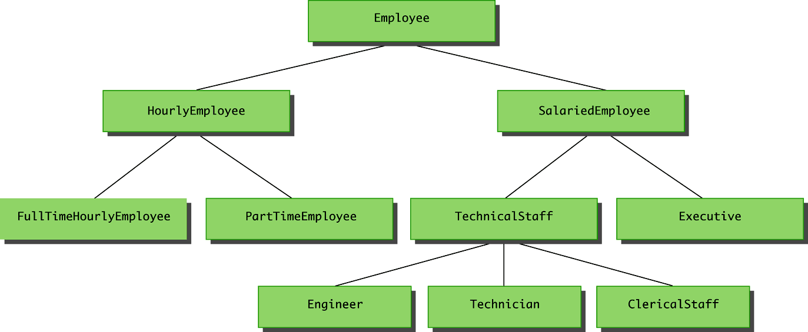

```java
    class Employee { // base class
        int employeeNumber;
    }

    class HourlyEmmployee extends Employee { // derived class
        double hourlyRate;
    }
```

# 2. Overriding a method definition

Overriding a method is much more powerful than just defining a new method.  It can also change the behaviour of other methods that haven't been overridden.  This is called **polymorphism**, and will be discussed more later in this lesson.

```java
class Main {
    void sayHello () {
        System.out.println("Hello, World!");
    }

    void sayHelloHello () {
        sayHello();
        sayHello();
        System.out.println();
    }

    static public void main (String[] args) {
        new Main   ().sayHelloHello();
        new Chinese().sayHelloHello(); 

        Main zh = new Chinese();
        zh.sayHelloHello(); 
    }
}

class Chinese extends Main {
    @Override
    void sayHello () {
        System.out.println("你好、世界!");
    }
}
```
Results
```shell
Hello, World!
Hello, World!

你好、世界!
你好、世界!

你好、世界!
你好、世界!
```

In the above example, the function sayHelloHello called the function sayHello.  When the derived class overrode sayHello, it changed the behaviour of sayHelloHello, because the overridden form was called instead.

**This allows the base class to describe a general procedure for doing things, and the derived classes to specify details that are different for different cases.**

## 2.1 Pitfall: Overriding vs Overloading

  + **Overridden**: the new method definition given in the derived class has _the same "signature"_.  That is, the exact same number and types of parameters as in the base class.

  + **Overloading**: When a method in a derived class has a _different signature_ from the method in the base class
    + Note that when the derived class overloads the original method, it still inherits the original method from the base class as well.
  
    ```java
        class Main {
            public static void main (String[] args) {
            }
        }

        class Child extends Main {
            public static void main (String[] args) {
                // This overrides the main class
            }

            public static void main (int i) {
                // This overloads main
            }
        }
    ```

## 2.2 Multiple types and permissions
  1. An object of a derived class has multiple types. It has the type of the derived class, but it also has the type of the base class -- and all ancestor classes.

      ```JAVA
      class Main {
          public static void main (String[] args) {
              Main var = new Child (); // In particular, it can be assigned to a variable of any of its ancestor classes.
          }
      }

      class Child extends Main {
      }
      ```
        
   1. That is the motivation for **covariant return types** introduced in Java 5.0.

   + If a method returns a primitive type (int, double, ...) or an array, then the overriding method must return the same type.

   + However, if the return type is a class type, then the returned type may be changed to that of any descendant class of the return type. (The reason for it to be a descendant is so that code written for the original function will still receive an object of a type it can handle.)
    
        ```JAVA
        // An example of covariant return types is:

        public class BaseClass {
            // method in base class
            public Employee getSomeone (int someKey) {

            }
        }

        class DerivedClass extends BaseClass {
            // overridden method
            public HourlyEmployee getSomeone(int SomeKey) {

            }
        }
        ```

  3. Changing the access Permission of an Overridden Method

      即如果ancestor class的一个方法是permissive的, 其子代class的对应overridden method也应该是permissive的

      + The access permission of an overridden method can be changed from, say, protected in the base class to public (or some other more permissive access) in the derived class.

      + However, the access permission of an overridden method must be at least as accessible as method in the base class.  Again, this is so that any code written for the base class can still be used with the derived class.

        Example:
        ```java
        // Given the following method header in a base case:
        protected void doSomething()

        // The following method header is valid in a derived class:
        public void doSomething()

        // However, the opposite is not valid------------------------------------
        // Given the following method header in a base case:
        public void doSomething()

        // The following method header is not valid in a derived class:
        private void doSomething()        // illegal

        ```     

## 2.3 Preventing overriding and inheritance
   
  + If the modifier **final** is placed before the definition of a **method**, then that method may not be redefined in a derived class.

  + If the modifier **final** is placed before the definition of a **class**, then that class may not be used as a base class to derive other classes.


    ```java
    class Main {
        final static public void main (String[] args) {
        }
    }

    final class Major extends Main {
        static public void main (String[] args) { // error: you cannot overridden a final method
        }
    }

    class Minor extends Major { // error: you cannot extend a fina class

    }
    ```

# 3. Constructors
## 3.1 The super constructor

**A derived class uses a constructor from the base class to initialize all the data inherited from the base class.** 因为a derived class的构造器不能访问base class的私有字段.

>Note: 
>+ A private instance variable in a base class is not accessible by name in the definition of a method in any other class, not even in a method definition of a derived class. Otherwise private variable in a base class is not safe.
>+ The private methods of the base class are like private variables in terms of not being directly available. This should not be a problem because private methods should just be used as helping methods.  If a method is not just a helping method, then it should be public (or package access), not private.

In order to invoke a constructor from the base class, it uses a special syntax.  **The parent's class (and in particular, the parent class's constructor) is called "super". You can regard 'super' as the name of parent class, as a constructor has the same name of its class**

```java
public derivedClass(int p1, int p2, double p3)
{
    super(p1, p2);        // call parent's constructor whose parameters is (int, int)
    instanceVariable = p3;
}
```

There are some rules that apply to the super constructor:
+ A call to the base class constructor can never use the name of the base class, but uses the keyword super instead

+ A call to super must always be the first action taken in a constructor definition

+ An instance variable cannot be used as an argument to super.

> Note: If a derived class constructor does not include an invocation of super, then the no-argument constructor of the base class will automatically be invoked.  This can result in an error if the base class has not defined a no-argument constructor. Since the inherited instance variables should be initialized, and the base class constructor is designed to do that, _then an explicit call to super should always be used_.


## 3.2 Using super to access an overridden method

Within the definition of a method of a derived class, the base class version of an overridden method of the base class can still be invoked.  Simply preface the method name with super and a dot
```java
public String toString()
{
    return (super.toString() + "$" + wageRate);
}
```

However, using an object of the derived class outside of its class definition, there is no way to invoke the base class version of an overridden method.

If you think of super as being the name of the parent class, then this syntax corresponds to the syntax for calling static methods.  Similarly, using super as a constructor corresponds to the fact that a constructor is normally called by the class name.

<br>

> Note: super这种用法只refer to 上一层parent!  
> It is only valid to use super to invoke a method from a direct parent.  Repeating super will not invoke a method from some other ancestor class. 
> For example, if the Employee class were derived from the class Person, and the HourlyEmployee class were derived form the class Employee, it would not be possible to invoke the toString method of the Person class within a method of the HourlyEmployee class
> ```java
> super.super.toString() // ILLEGAL!
> ```

As explained at [super](https://www.geeksforgeeks.org/accessing-grandparents-member-in-java-using-super/), using super within an overriding method effectively bypasses the behaviour of the class you are defining, which is up to you.  However, you shouldn't be allowed to bypass the behaviour of the class you are derived from.  For example, the implementer of that class should be able to derive it from a different base class.

:question:???what???

## 3.3 The this constructor

Within the definition of a constructor for a class, ==this== can be used as a name for invoking another constructor **in the same class**. The same restrictions on how to use a call to super apply to the this constructor. 在这里可以把this当作derived class name, 毕竟constructor和class同名.

<br>

If it is necessary to include a call to both super and this, the call using this must be made first, and then the constructor that is called must call super as its first action: 

```java
// base class =========================================
class Main { 
// field-----------------------------------
int value;

// constructor-----------------------------
Main () {
    
}

// methods---------------------------------
static public void main (String[] args) {
}
}

// derived class =======================================
class Child extends Main {
// fields-------------------------------
int another;

// Constructor--------------------------
// Explicit-value constructor---
Child (int i) {
    super(); // call Main()
    another = i;
}

// Non-argument constructor---
Child () {
    // the call using this must be made first
    this(1);  // call Child(int)
}
}
```

<br>

Often, a no-argument constructor uses this to invoke an explicit-value constructor.

```java
// No-argument constructor (invokes explicit-value constructor using this and default arguments):
public HourlyEmployee()
{
this("No name", new Date(), 0, 0); // calls below explicit-value constructor
}
// Explicit-value constructor (receives default values):
public HourlyEmployee(String theName, Date theDate, double theWageRate, double theHours){
...
}

```

# 4. Practice

[Demo: Enhanced String Tokenizer](UniMelb/EnhancedStringTokenizer.java)

# 5. Protected and Package access

## 5.1 Protected modifier 
If a method or instance variable is modified by **protected** (rather than public or private), then it can be accessed by name in the following conditions:
+ Inside its own class definition

+ Inside any class derived from it (even not in the same package)

+ In the definition of any class in the same package (even the class not being derived from it). This shows that protected access implies package access, but not vice versa.

The protected modifier provides very weak protection compared to the private modifier.  It allows direct access to any programmer who defines a suitable derived class. _Therefore, instance variables should normally not be marked protected_.

## 5.2 Package access
An instance variable or method definition that is not preceded with a modifier has **package access**. Package access is also known as **default or friendly access**.

Instance variables or methods having package access can be accessed by name inside the definition of any class in the same package.  However, neither can be accessed outside the package

Note that package access is more restricted than protected (Protected access implies Package access, but not vice versa). Package access gives more control to the programmer defining the classes. Whoever controls the package directory (or folder) controls the package access.

> Note:
> "Access" here means direct access, that is, access by name.

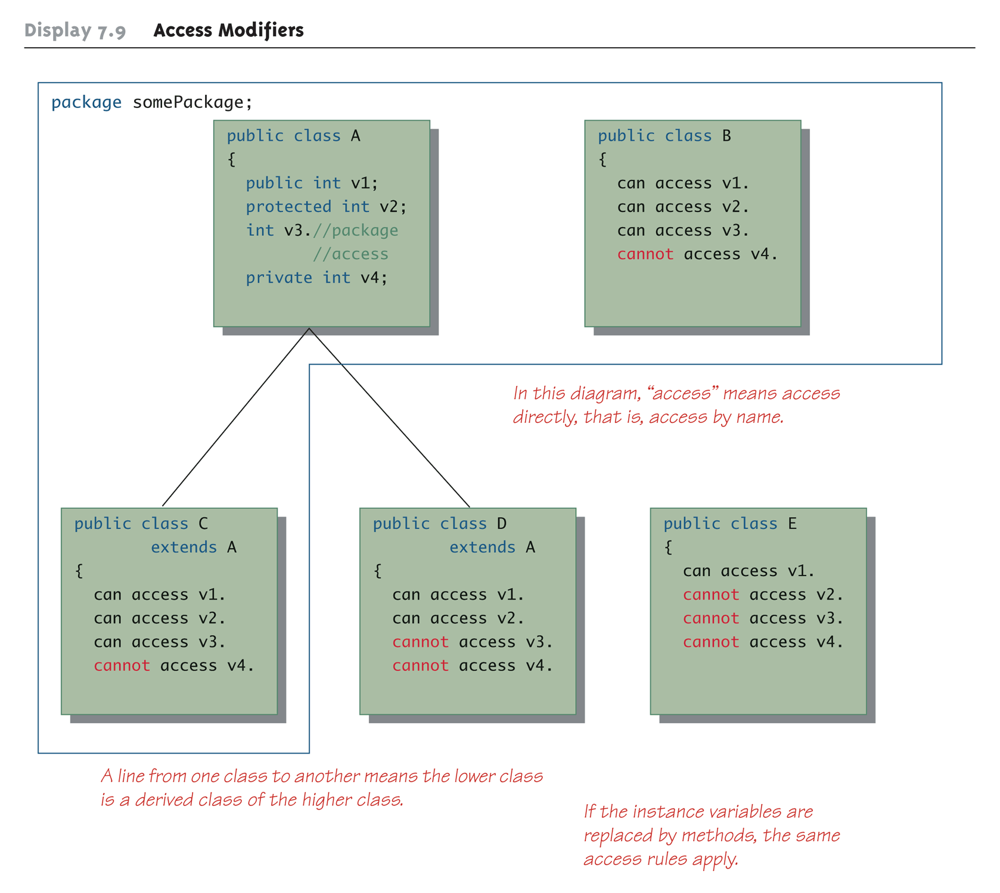

## 5.3 Pitfall and tips
### 5.3.1 Forgetting the default package
If a class in the current directory is not in any other package, then it is in the default package.  If an instance variable or method has package access, it can be accessed by name in the definition of any other class in the default package.

### 5.3.2 A restriction on protected access
Refer to the fig in 5.2, if a class D is derived from class A, and class A has a protected instance variable v2, but the classes A and D are in different packages, then the following is true:
+ A method in class D can access v2 by name (n is inherited from class A)
+ A method in class D can create a local object of itself, which can access v2 by name (again, n is inherited from class A)

However, if a method in class D creates an object of class A, it can not access v2 by name.  

  + This is because a class knows about its own inherited variables and methods. However, it cannot directly access any instance variable or method of an ancestor class unless they are public.  Therefore, D can access v2 whenever it is used as an instance variable of D, but D cannot access v2 when it is used as an instance variable of A.

This is true if A and D are not in the same package. If they were in the same package there would be no problem, because protected access implies package access

### 5.3.3 Tip: Static variables are inherited
**Static variables in a base class are inherited by any of its derived classes.**

The modifiers public, private, and protected, and package access have the same meaning for static variables as they do for instance variables

# 6. Relationship between two classes
There are many ways in which objects can be related.  Two of these are called the "is a" hierarchy and the "has a" hierarchy.
## 6.1 "is a"

JavaCore

子类的对象同时也是超类的对象

"is-a"规则的另一种表述是替换原则(substitution principle). 它指出程序中出现超类对象的任何地方都可以使用子类对象来替换.

即在Java中, 对象变量是多态的(polymorphic). 一个Employee类型的变量既可以引用一个Employee类型的对象, 也可以引用Employee类的任何一个子类的对象(e.g. Manager, Executive, Secretary...)

基于此: 
+ 可以将子类对象引用赋给超类变量

    ```java
    Manager boss = new Manager(...);
    Employee[] staff = new Employee[3];
    staff[0] = boss;
    ```
    这里, 变量staff[0]与boss引用同一个对象. 但编译器只将staff[0]看成是一个Employee对象. 
    ```java
    boss.setBonus(5000); // OK

    staff[0].setBonus(5000); // error! 因为staff[0]的声明类型是Employee, 而setBonus不是Employee类的方法
    ```


+ 但是, 不能将超类的引用赋给子类变量

    ```java
    Manager m = staff[i];
    ```

    因为不是所有的员工都是经理. 如果赋值成功, m有可能引用一个不是经理的Employee对象, 而在后面有可能会调用m.setBonus(...), 这时就会发生运行错误

--- 

A derived class demonstrates an "is a" relationship between it and its base class. Forming an "is a" relationship is one way to make a more complex class out of a simpler class.

For example, an HourlyEmployee "is an" Employee. HourlyEmployee is a more complex class compared to the more general Employee class

---

## 6.2 "has a"
Another way to make a more complex class out of a simpler class is through a "has a" relationship.

For example, the Employee class contains an instance variable, hireDate, of the class Date, so therefore, an Employee "has a" Date.

---

Both kinds of relationships are commonly used to create complex classes, often within the same class.  Since HourlyEmployee is a derived class of Employee, and contains an instance variable of class Date, then HourlyEmployee "is an" Employee and "has a" Date.

[Demo: "is a"&"has a"-practice](UniMelb/isaHasa_practice.java)

## 6.3. class Object
In Java, every class is a descendent of the class Object.

+ Every class has Object as its ancestor

+ Every object of every class is of type Object, as well as being of the type of its own class

If a class is defined that is not explicitly a derived class of another class, it is still automatically a derived class of the class Object. The class Object is in the package java.lang which is always imported automatically.

The class Object has some methods that every Java class inherits. For example, the equals and toString methods. Every object inherits these methods from some ancestor class: either the class Object itself, or a class that itself inherited these methods (ultimately) from the class Object.

However, these inherited methods should be overridden with definitions more appropriate to a given class. Some Java library classes assume that every class has its own version of such methods.

### 6.3.1 getClass() 
Every object inherits the same getClass() method from the Object class.  This method is marked final, so it cannot be overridden.

An invocation of getClass() on an object returns a representation only of the class that was used with new to create the object.  The results of any two such invocations can be compared with == or != to determine whether or not they represent the exact same class

```java
(object1.getClass() == object2.getClass())
```

### 6.3.2 instanceof

The instanceof operator checks if an object is of the type given as its second argument

```java
object instanceof ClassName // This will return true if object is of type ClassName, and otherwise return false.
```

Note that this means it will return true if object is the type of any descendent class of ClassName.

The most common use of instanceof is to find out whether a particular method can be used on an object.  That is because a method in a particular class will often take an argument that is a base class, and it doesn't know which descendant of that class the actual object is. 子类可以调用超类中的方法, 但这个方法需要直到是哪个子类来具体化该怎么操作.

[Demo: instanceof](UniMelb/instanceof_Demo.java)

:question: demo中的ExperiencedMusician的打印问题: if else  ,   if 

In contrast getClass() is used when you want to check the exact class of the object, not just that it is in a particular branch of the hierarchy.

### 6.3.3 equals()
In most cases, instanceof is a better choice than getClass(), but there is one big exception: testing for equality.

1. The overridden version of equals must meet the following conditions

   + The parameter otherObject of type Object must be type cast to the given class (e.g., Employee)

   The right way to define equals:
   ```java
   public boolean equals(Object otherObject)
   {
       if(otherObject == null)                           // NULL object
           return false;
       else if(getClass( ) != otherObject.getClass( ))   // not the same class, can't compare so return false
           return false;
       else {                                           // same class, but what about content?
           // the parameter otherObject of type Object must be type cast to the given class
           Employee otherEmployee = (Employee)otherObject;
           
           // compare each of the instance variables
           return (name.equals(otherEmployee.name) &&
               hireDate.equals(otherEmployee.hireDate));
       }
   }
   ```

   What would this look like using  instanceof?  For class Employee, we would have
   ```java
   . . . //excerpt from bad equals method
   else if(!(OtherObject instanceof Employee))
       return false; . . .
   ```

   and from class HourlyEmployee, we would have
   ```java
   . . . //excerpt from bad equals method
   else if(!(OtherObject instanceof HourlyEmployee))
   return false; . . .
   ```

   In order to use instanceof, you need to know the type of this object in the first place.

2. Now consider the following example :
    ```java
    Employee e = new Employee("Joe", new Date());
    HourlyEmployee h = new HourlyEmployee("Joe", new Date(),8.5, 40);
    boolean testH = e.equals(h);
    boolean testE = h.equals(e);
    ```
    Results:
    + testH will be true, because h is an Employee with the same name and hire date as e

    + testE will be false, because e is not an HourlyEmployee, and cannot be compared to h

    Note that this problem would not occur if the getClass() method were used instead, as in the previous equals method example :question: what does this mean?


# 7. Modularity

Some OOB philosophy:

Modularity is a way to manage complexity and improve quality.

A **module** is the basic unit of decomposition of our systems. It will often correspond to a Java class, a file containing multiple classes, or a "package", which is a set of Java classes that cooperate to achieve a task.

**Modular design and programming** is designing or constructing software based on modules.

Modules typically form a hierarchy: modules can consist of smaller modules.  For example, a java program may consist of multiple packages. A package consists of multiple classes.  Each class consists of multiple methods, or even of sub-classes.

## 7.2 Modular design criteria
There are five criteria that underlie modular design.

+ Decomposability.

+ Composability.

+ Understandability.

+ Continuity.

+ Protection.

References:

[1] Meyer, Bertrand. “Object-Oriented Software Construction, 2nd Edition.” (1997).

## 7.3 Modular design rules
The guiding principles that allow modular design to meet the above criteria are as follows.

+ Direct mapping

+ Few interfaces

+ Small interfaces

+ Explicit interfaces

+ Information hiding

## 7.4 Unified modelling language (UML)

The Unified modelling language (UML) is a graphical representation of modules and their interactions. UML is designed to reflect modularity, and the object-oriented programming philosophy.

### 7.4.1 Structural diagrams
UML diagrams show relationships between classes.  

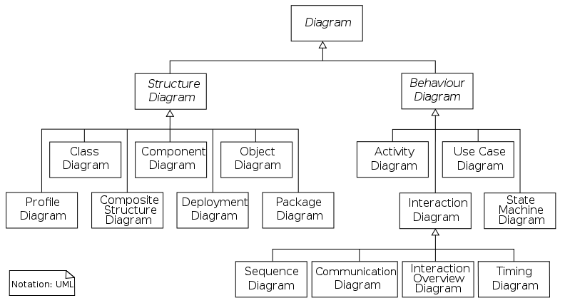

### 7.4.2 Class diagrams

A class diagram is divided up into three sections:

+ The top section contains the class name

+ The middle section contains the data specification for the class

+ The bottom section contains the actions or methods of the class

The data specification for each piece of data in a UML diagram consists of its name, followed by a colon, followed by its type

Each name is preceded by a character that specifies its access type:

+ A minus sign (-) indicates private access

+ A plus sign (+) indicates public access

+ A sharp (#) indicates protected access

+ A tilde (~) indicates package access

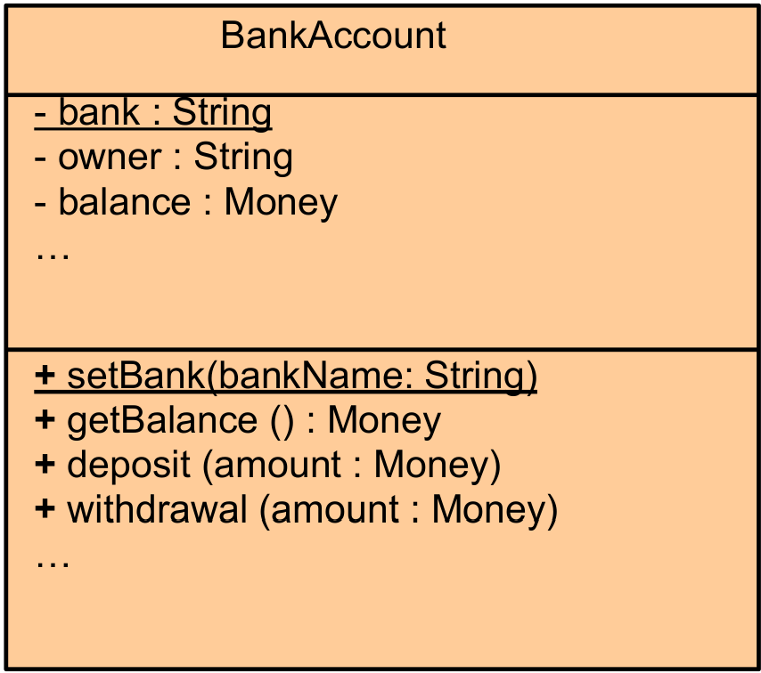

A class diagram need not give a complete description of the class.  If a given analysis does not require that all the class members be represented, then those members are not listed in the class diagram.  Missing members are indicated with an ellipsis (three dots).

### 7.4.3 Class interactions

Rather than show just the interface of a class, class diagrams are primarily designed to show the interactions
among classes.
[Stackoverflow: UML Arrow](https://stackoverflow.com/questions/1874049/explanation-of-the-uml-arrows)

#### Inheritance

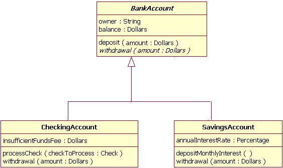

#### Associations

Unidirectional 


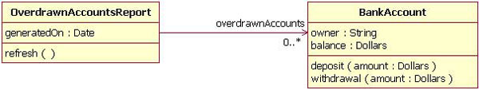
Bidirectional

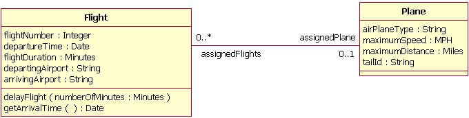

The numbers have have the following meanings:

n : exactly  n

\* : zero or more

0..n : any number from zero to n

m..n:  any number from m to n.

#### UML Packages

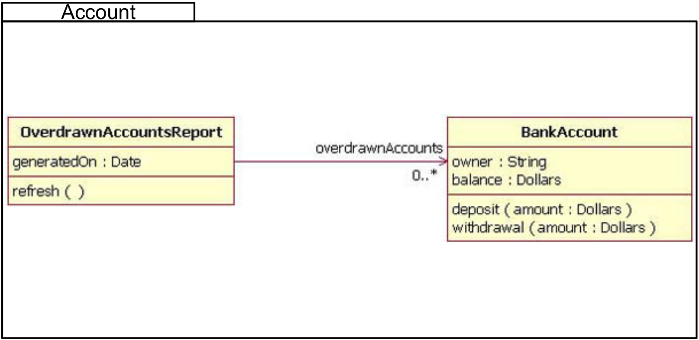

# 8. Polymorphism

Firstly: refer to 6.1 "is-a"

Polymorphism is the ability to associate many meanings to one method name.  It does this through a special mechanism known as _late binding or dynamic binding_.

+ **Inheritance** allows a base class to be defined, and other classes derived from it. Code for the base class can then be used for its own objects, as well as objects of any derived classes.

+ **Polymorphism** allows changes to be made to method definitions in the derived classes, and _have those changes apply to the software written for the base class_.


## 8.1 Late binding 

> About binding
>+  **Binding**: The process of associating a method definition with a method invocation.
>+ **Early binding or static binding**: If the method definition is associated with its invocation when the code is compiled. 
>+ **Late binding or dynamic binding**: If the method definition is associated with its invocation when the method is invoked (at run time).

Java uses late binding for all methods (except private, final, and static methods) .


### e.g.1

If an appropriate toString method is defined for a class, then an object of that class can be output using System.out.println

```java
Sale aSale = new Sale("tyre gauge", 9.95);
System.out.println(aSale); // println an object! but you need to define toString method for class Sale first
```

Output produced:

```java
tyre gauge price and total cost = $9.95
```

This works because of late binding. One definition of the method println takes a single argument of type Object (see below code). In turn, It invokes the version of println that takes a String argument.

```java
public void println(Object theObject)
{
    System.out.println(theObject.toString());
}
```

Note that the println method was defined before the Sale class existed.

Yet, because of late binding, the toString method from the Sale class is used, not the toString from the Object class.

### practice

```java
HourlyEmployee joe = new HourlyEmployee("Joe Worker", new Date("January", 1, 2004),
                                        50.50, 160);
Employee mike = new Employee("Mike Jordan", new Date("March", 1, 1984));

System.out.println();
System.out.println("joe's record is as follows:");
System.out.println(joe);

System.out.println();
System.out.println("mike's record is as follows:");
System.out.println(mike);
```
Exercise: Write suitable toString functions for HourlyEmployee and Employee.

### e.g.2
Because of late binding, a method can be written in a base class to perform a task, even if portions of that task aren't yet defined (有点像abstract class).

For an example, the relationship between a base class called Sale and its derived class DiscountSale will be examined.  Consider the following two classes:


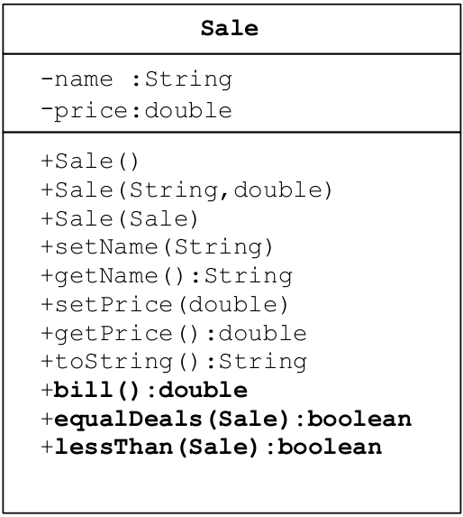

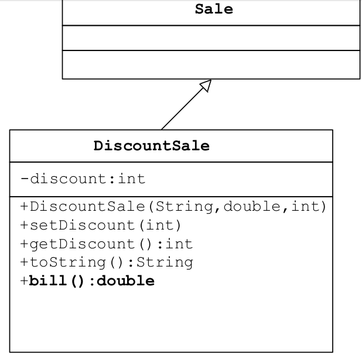

Note lessThan() method is defined in based class, while bill() method is overridden in the derived class

```java
// Class Sale
public boolean lessThan (Sale otherSale) 
{
// the method defined in base class can also be called in its derived class object
{
    if (otherSale == null)
    {
        System.out.println("Error: null object");
        System.exit(0);
    }

    // when a derived class object calls this method, 
    // it knows which bill() to call:
    // if the object is just an instance of class Sale (not  DiscountSale),
    // then bill() calls the methods in Sale; 
    // if the object is an instance of class DiscountSale, 
    // then bill() calls the methods in DiscountSale
    // -------------------------------------------------
    // e.g. if this object is an instance of DiscountSale,
    // then below bill() calls the methods defined in DiscountSale
    // e.g. if this object is an instance of Sale,
    // then below bill() calls the methods defined in Sale
    // -------------------------------------------------
    // this is because late binding is working, we didn't 
    // explicitly specify class.bill() in the first place 
    // while the program understand which bill() we are calling
    // according to who's calling lessThan()
    return (bill( ) < otherSale.bill( )); 
}

public double bill( )
{
    return price;
}
```

```java
// Class DiscountSale
@overridden
public double bill( )
{
    double discountedPrice = getPrice() * (1-discount/100);
    return discountedPrice + discountedPrice * SALES_TAX/100;
}
```

Main function:

```java
Sale simple = new sale("floor mat", 10.00); // price
DiscountSale discount = new DiscountSale("floor mat", 11.00, 10); // price, discount
. . .
if (discount.lessThan(simple)) // here is the point! 
    System.out.println ("$" + discount.bill() +
                        " < " + "$" + simple.bill() +
                        " because late-binding works!");
. . .
```

will produce：

```shell
$9.90 < $10 because late-binding works!
```

In this example, the boolean expression in the if statement returns true.

As the output indicates, when the lessThan method in the Sale class is executed, it knows which bill() method to invoke: the DiscountSale class bill() method for discount, and the Sale class bill() method for simple.

Note that when the Sale class was created and compiled, the DiscountSale class and its bill() method did not yet exist.  These results are made possible by late-binding.

> Advanced: Late binding is achieved by each object having a table of references to methods.  The name of the method corresponds to the index into the table.  The value of the entry corresponds to the appropriate method for that object to call when that method name is used.  This process is an example of indirection, common in lower level languages.

## 8.2 :question:Upcasting and downcasting

:full_moon: 先看后面接着的网上找的解释, UniMelb Java的解释是一坨屎看不懂

### 8.2.1 :question:Upcasting

想让超类对象变量引用一个子类对象, legal, 但是这个超类对象变量在编译器看来依然是超类对象变量, 无法使用子类对象的额外方法与字段. 就像你爸想登录你的wow账号, 却无法游玩一样.

超类对象变量 <-- 子类对象变量: legal因为车(derived class)是载具(base class)

Upcasting is when an object of a derived class is assigned to a variable of a base class (or any ancestor class)

```java
// create class type variable----------------------------
Sale saleVariable;                                                //Base class
DiscountSale discountVariable = new DiscountSale("paint", 15,10); //Derived class

// upcasting---------------------------------------------
saleVariable = discountVariable;    // 本质还是赋给指针的值  
// now that saleVariable and discountVariable points to the same
// object in memory, 
// --------------------
// but saleVariable cannot access exclusive 
// methods defined in DiscountSale class, 因为编译器依然把
// saleVariable看作是Sale class (base class)
System.out.println(saleVariable.toString());
```
Because of late binding, toString above still uses the definition given in the DiscountSale class.
:question:what? this conflicts with javaCore 5.1.5 多态, experiment it!!!

### 8.2.2 :question:Downcasting

想让子类对象变量引用一个超类对象, 经常会出现问题, 因为这个子类对象变量...

子类对象变量 <-- 超类对象变量: usually problematic as 载具(base class)不一定就得是车(derived class)

Downcasting is when a type cast is performed from a base class to a derived class (or from any ancestor class to any descendent class).

**Downcasting has to be done very carefully.  In many cases it doesn't make sense, or is illegal**:

```java
//will produce compiler error
discountVariable = saleVariable

//will produce run-time error
discountVariable = (DiscountSale)saleVariable;
```

#### when downcasting is necessary

There are times, however, when downcasting is necessary, e.g., inside the equals method for a class:

```java
Sale otherSale = (Sale)otherObject;    //downcasting
```

We also saw downcasting, protected by instanceof, used in the previous slide.

> Note!
> It is the responsibility of the programmer to use downcasting only in situations where it makes sense.  The compiler does not check to see if downcasting is a reasonable thing to do.
> Using downcasting in a situation that does not make sense usually results in a run-time error.


## 8.2 Upcasting and downcasting

[resource](https://www.codejava.net/java-core/the-java-language/what-is-upcasting-and-downcasting-in-java#:~:text=1%20What%20is%20Upcasting%20in%20Java%3F%20Upcasting%20is,tree.%20...%204%20Why%20is%20Downcasting%20in%20Java%3F)

Before we go into the details, suppose that we have the following class hierarchy:

Mammal > Animal > Dog, Cat

Mammal is the super interface:
```java
public interface Mammal {
    public void eat();
 
    public void move();
 
    public void sleep();
}
```

Animal is the abstract class:
```java
public abstract class Animal implements Mammal {
    public void eat() {
        System.out.println("Eating...");
    }
 
    public void move() {
        System.out.println("Moving...");
    }
 
    public void sleep() {
        System.out.println("Sleeping...");
    }
 
}
```

Dog and Cat are the two concrete sub classes:
```java
public class Dog extends Animal {
    public void bark() {
        System.out.println("Gow gow!");
    }
    public void eat() {
        System.out.println("Dog is eating...");
    }
}
 
public class Cat extends Animal {
    public void meow() {
        System.out.println("Meow Meow!");
    }
}
```

### 8.2.1 Upcasting

超类对象变量 <-- 子类对象变量:

Upcasting is casting a subtype to a supertype, upward to the inheritance tree. Let’s see an example:

```java
Dog dog = new Dog();
Animal anim = (Animal) dog;
anim.eat();
```

Here, we cast the Dog type to the Animal type. Because Animal is the supertype of Dog, this casting is called upcasting.

> :star::star::star:**Note that the actual object type does not change because of casting. The Dog object is still a Dog object. Only the reference type gets changed.** Hence the above code produces the following output:
> ```shell
> Dog is eating…
> ```

Upcasting is always safe, as we treat a type to a more general one. In the above example, an Animal has all behaviors of a Dog. 说白了还是 "is-a"关系, a dog is a dog, and also an animal.

This is also another example of upcasting:
```java
Mammal mam = new Cat();
Animal anim = new Dog();
```

#### :star: why upcasting in java?
Generally, upcasting is not necessary. However, we need upcasting when we want to write general code that deals with only the supertype. Consider the following class:
```java
public class AnimalTrainer {
    public void teach(Animal anim) {
        anim.move();
        anim.eat();
    }
}
```

Here, the teach() method can accept any object which is subtype of Animal. So objects of type Dog and Cat will be upcasted to Animal when they are passed into this method:
```java
Dog dog = new Dog();
Cat cat = new Cat();
 
AnimalTrainer trainer = new AnimalTrainer();
trainer.teach(dog);
trainer.teach(cat);
```


### 8.2.2 Downcasting

子类对象变量 <-- 超类对象变量:

Downcasting is casting to a subtype, downward to the inheritance tree. Let’s see an example:
```java
Animal anim = new Cat();
Cat cat = (Cat) anim;
```
Here, we cast the Animal type to the Cat type. As Cat is subclass of Animal, this casting is called downcasting.

Unlike upcasting, downcasting can fail if the actual object type is not the target object type. For example:

```java
Animal anim = new Cat();
Dog dog = (Dog) anim;       //mismatch
```
This will throw a ClassCastException because the actual object type is Cat. And a Cat is not a Dog so we cannot cast it to a Dog.

The Java language provides the instanceof keyword to check type of an object before casting. For example:
```java
if (anim instanceof Cat) {
    Cat cat = (Cat) anim;
    cat.meow();
} else if (anim instanceof Dog) {
    Dog dog = (Dog) anim;
    dog.bark();
}
```

So if you are not sure about the original object type, use the instanceof operator to check the type before casting. This eliminates the risk of a ClassCastException thrown.


#### :star:why downcasting in java?
Downcasting is used more frequently than upcasting. Use downcasting when we want to access specific behaviors of a subtype.

Consider the following example:
```java
public class AnimalTrainer {
    public void teach(Animal anim) {
        // do animal-things
        anim.move();
        anim.eat();
 
        // if there's a dog, tell it barks
        if (anim instanceof Dog) {
            Dog dog = (Dog) anim;
            dog.bark();
        }
    }
}
```
Here, in the teach() method, we check if there is an instance of a Dog object passed in, downcast it to the Dog type and invoke its specific method, bark().

### 8.2.3 Summary of upcasting and downcasting
Okay, so far you have got the nuts and bolts of upcasting and downcasting in Java. Remember:
+ Casting does not change the actual object type. Only the reference type gets changed.
+ Upcasting is always safe and never fails.
+ Downcasting can risk throwing a ClassCastException, so the instanceof operator is used to check type before casting.


# 9. Abstract classes

## 9.1 Background

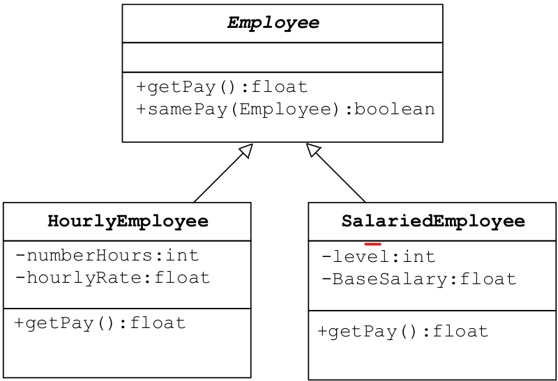

Imagine the following method is added to the Employee class. It compares employees to to see if they have the same pay:

```java
public boolean samePay(Employee other)
{
return(this.getPay() == other.getPay());
}
```

There are several problems with this method:

+ The getPay method is invoked in the samePay method

+ There are getPay methods in each of the derived classes

+ There is no getPay method in the Employee class, nor is there any way to define it reasonably without knowing whether the employee is hourly or salaried.


The ideal situation would be if there were a way to
+ Postpone the definition of a getPay method until the type of the employee were known (i.e., in the derived classes)

+ Leave some kind of note in the Employee class to indicate that it was accounted for

---
## 9.2 Abstract method

Java allows this using "abstract" classes and methods. It has a complete method heading, to which has been added the modifier abstract. It cannot be private, otherwise derived class won't be able to override it.

_In order to postpone the definition of a method, Java allows an **abstract method** to be declared._
+ An abstract method has a heading, but no method body

+ The body of the method is defined in the derived classes. And its derived class must define the body of the method.
  
```java
// e.g. abstract method
public abstract double getPay();  // watch the semicolon
public abstract void doIt(int count);
```

An abstract method is like a placeholder for a method that will be fully defined in a descendent class.

## 9.3 Abstract class

> Abstract class: the class that has at least one abstract method.
> Concrete class: the class that has no abstract methods.

An abstract class must have the modifier abstract included in its class heading:

```java
public abstract class Employee
{
private instanceVariables;
. . .
public abstract double getPay();
. . .
}
```

If a derived class of an abstract class adds to or does not define all of the abstract methods, then it is abstract also, and must add abstract to its modifier.


## Pitfall

An abstract class can only be used to derive more specialized classes. You cannot create an instance of an abstract class

An abstract class constructor cannot be used to create an object of the abstract class.  However, a derived class constructor will include an invocation of the abstract class constructor in the form of super. The constructor in an abstract class is only used by the constructor of its derived classes.

Exercise: Any abstract class can be replaced by a class that simply has methods with an empty method body replacing all virtual methods.  What is the advantage of using an abstract class over the class just described?  (Hint: the answer relates to this pitfall.)

## Tip: An Abstract Class Is a Type

Although an object of an abstract class cannot be created, it is perfectly fine to have a parameter of an abstract class type.  This makes it possible to plug in an object of any of its descendant classes.

It is also fine to use a variable of an abstract class type, as long as it names objects of its concrete descendant classes only.

# 10. Demo
## 10.1 Demo: Dungeons & Dragons (DND)

### 10.1.1 Week7 demo

[Task Description](UniMelb/DND/DND.md)

[Demo: DND Game](UniMelb/DND/DNDGame.java)

[Demo: DND Player](UniMelb/DND/Player.java)

[Demo: DND Warrior](UniMelb/DND/Warrior.java)

### 10.1.2 Week8 demo

[Task Description](UniMelb/DND/DND.md)

[Demo: DND Game]()

[Demo: DND Player]()

[Demo: DND Warrior]()


## 10.2 Demo: Town simulator

[Task Description](UniMelb/wk8Tut/townSimulator.md)

### base class

[Demo: TownSimulator](UniMelb/wk8Tut/TownSimulator.java)

[Demo: Town](UniMelb/wk8Tut/Town.java)

[Demo: Entity](UniMelb/wk8Tut/Entity.java)

### extend Entity

[Demo: Building](UniMelb/wk8Tut/Building.java)

[Demo: Resident](UniMelb/wk8Tut/Resident.java)

#### extend Resident

[Demo: Cat](UniMelb/wk8Tut/Cat.java)

[Demo: Dog](UniMelb/wk8Tut/Dog.java)

[Demo: Person](UniMelb/wk8Tut/Person.java)