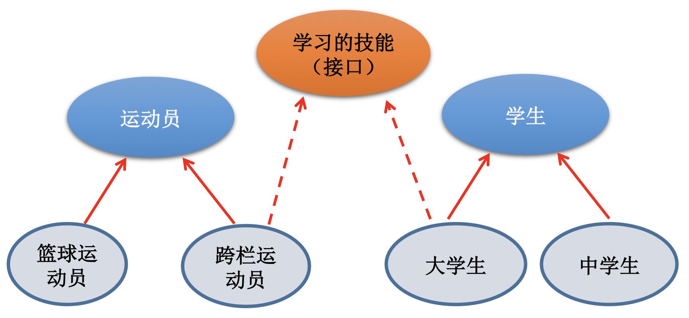
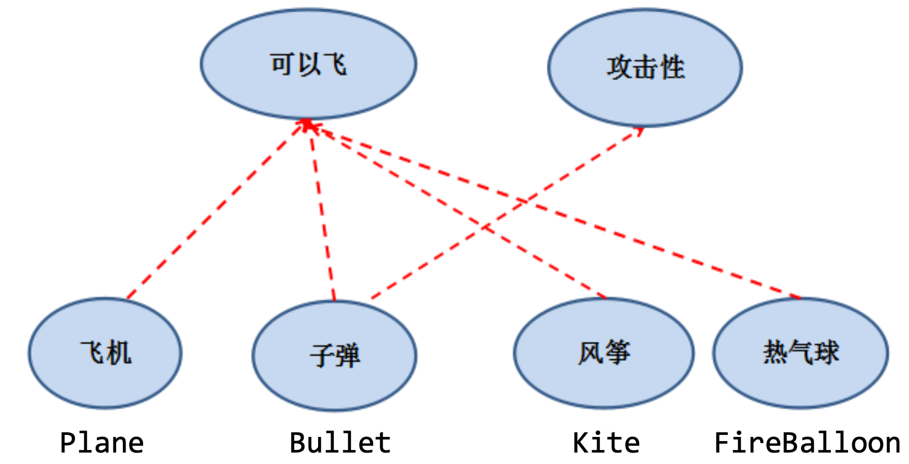
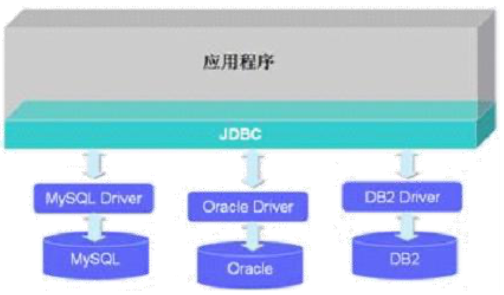

Interface

:computer: [尚硅谷: 抽象类 341-347](https://www.bilibili.com/video/BV1Kb411W75N?p=343&vd_source=c6866d088ad067762877e4b6b23ab9df)

:computer: [尚硅谷: 接口 348-358 ](https://www.bilibili.com/video/BV1Kb411W75N?p=350&vd_source=c6866d088ad067762877e4b6b23ab9df)

:computer: [尚硅谷: 内部类 359-363](https://www.bilibili.com/video/BV1Kb411W75N?p=361&vd_source=c6866d088ad067762877e4b6b23ab9df)


尚硅谷第6章: 面向对象(下): static, main语法, 代码块, final 以及下面的三个知识点

---

# Part1 Abstract class

用abstract关键字来修饰一个类，这个类叫做抽象类。
+ 用abstract来修饰一个方法，该方法叫做抽象方法。 
+ 抽象方法:只有方法的声明，没有方法的实现。以分号结束:
比如:public abstract void talk();
+ 含有抽象方法的类必须被声明为抽象类。

:bangbang: 注意:
+ **抽象类不能被实例化, 抽象类是用来被<u>继承</u>的**. abstract 与 inheritance, polymorph有着天然的关联性
  + 抽象类的子类必须重 写父类的抽象方法，并提供方法体。若没有重写全部的抽象方法，仍为抽象类。
+ 不能用abstract修饰变量、代码块、构造器
+ 不能用abstract修饰私有方法、静态方法、final的方法、final的类。 原因如下:
  + private method (父类中的抽象方法总是要被其后代重写的， 如果有抽象方法为私有的, 那么后代类就没法重写抽象父类中的抽象方法了, 那抽象方法就失去了它的意义)
  + static method ( A static method belongs to class not to object instance thus it cannot be overridden or implemented in a child class. So there is no use of making a static method as abstract.) "abstract" means: "Implements no functionality", and "static" means: "There is functionality even if you don't have an object instance". And that's a logical contradiction.
  + final class, final method (如果可以修饰, 那当前的抽象类就不能被继承了， 定义抽象类就没有意义了; 抽象类就是鼓励你去提供子类, final class禁止提供子类, abstract与final是死对头 )
+ 抽象类也可以定义构造器, 尽管它自己不能实例化, 但是它的子类可以用super()来调用它的构造器
+ 抽象类中可以没有抽象方法(比如UniMelb Java final project里我们的BaseProgram, 我们只是不想实例化BaseProgram但想让它的子类Program继承它内部的读文件的实现方法), 但抽象方法一定包含在抽象类里


## 抽象类的应用场景

Rogue游戏中: 

```java
abstract class Player(
    private int intelligence;
    private int strength;

    public abstract void attack();      // beacuse we don't know specific behaviour of attack at the moment
)

class mage extends Player{
    @Overwrite
    public void attack(){
        System.out.print("attack is " + intelligence);
    }
}

class warrior extends Player{
    @Overwrite
    public void attack(){
        System.out.print("attack is " + strength);
    }
}


```


抽象性的练习

344

见Practice


## 创建抽象类的匿名子类对象

345

主要为了省事, 抽象类不能实例化, 想要实例化必须实现其中的抽象方法.  我们可以现成地提供抽象类里的抽象方法的实现, 然后实例化它.

:bangbang: 抽象类不能实例化, 但是实现了它所有抽象方法的子类可以被实例化

```java
public static void main(String[] args) {
    // 创建匿名子类的匿名对象 --------------
    // talk() 和 breath()是抽象类Person中的仅有两个抽象方法
    System.out.println("创建匿名子类的匿名对象 ");
  
    method1(new Person(){	// 看似在实例化抽象类, 其实是在实例化实现抽象类里所有抽象方法的(匿名)子类
        @Override
        public void talk() {
          System.out.println("创建匿名子类的匿名对象: I am Iron man!");
        }
        @Override
        public void breath() {
          System.out.println("创建匿名子类的匿名对象: take a deep breath");
        }
    });
}

public static void method1(Person p){
        p.breath();
        p.eat();
        p.walk();
        p.talk();
}
```


## 模版方法的设计模式及应用场景

346

多态的应用:模板方法设计模式(TemplateMethod)

+ 当功能内部一部分实现是确定的，一部分实现是不确定的。这时可以 把不确定的部分暴露出去，让子类去实现。

+ 换句话说，在软件开发中实现一个算法时，整体步骤很**<u>*固定、通用*</u>**， 这些步骤已经在父类中写好了。但是某些部分***<u>易变</u>***，**易变部分可以抽象出来**，供不同子类实现.  这就是一种模板模式。

:gem: demo:

```java
abstract class Template{

    // 计算某段代码执行所需要花费的时间
    // 利用到模版方法的设计模式
    public void  spendTime(){
        long start = System.currentTimeMillis();

        code();     // ********不确定的, 易变的部分, 钩子方法, 哪个子类调用, 就使用哪个子类重写的方法*********

        long end = System.currentTimeMillis();

        System.out.println("time spent is "+ (end - start));
    }
  
    public abstract void code();
}

class SubTemplate extends Template{
    @Override
    public void code(){
        // 求1000 以内所有的质数
        for(int i = 2; i <= 1000; i++){
            boolean isFlag = true;
            for(int j = 2; j <= Math.sqrt(i); j++){
                if(i % j == 0){
                    isFlag = false;
                    break;
                }
            }

            if(isFlag){
                System.out.println(i);
            }
        }
    }
}
```


模板方法设计模式是编程中经常用得到的模式。各个框架、类库中都有他的 影子，比如常见的有:

+ 数据库访问的封装
+ Junit单元测试 

+ JavaWeb的Servlet中关于doGet/doPost方法调用  Hibernate中模板程序
+ Spring中JDBCTemlate、HibernateTemplate等


:gem: 抽象类课后练习

见 Intellij package: practice2


# Part2 Interface

348 

why Interface?

+ 一方面，有时必须从几个类中派生出一个子类，继承它们所有的属性和方法。但是，Java不支持多重继承(C++支持) 有了接口，就可以得到多重继承的效果。
+ 另一方面，有时必须从几个类中抽取出一些*共同的行为特征*，而它们之间又没有is-a (继承性的关系)的关系，仅仅是具有相同的行为特征而已。例如:鼠标、键盘、打 印机、扫描仪、摄像头、充电器、MP3机、手机、数码相机、移动硬盘等都 ***支持USB连接***。
  + 接口就是规范，定义的是一组规则，体现了现实世界中“如果你是/要...则 必须能...”的思想。***继承是一个"是不是"的关系，而接口实现则是 "能不能" 的关系。***接口的本质是契约，标准，规范，就像我们的法律一样。制定好后大家都 要遵守。

e.g.1 大学生和跨栏运动员都实现了学习的技能接口



e.g.2 子弹实现了两个接口: 可以飞, 攻击性




## 2.1 接口的定义与使用

349

如何定义接口: 定义接口中的成员

+ JDK7及以前

  * 接口中只能定义 全局常量 和 抽象方法

    + 全局常量: public static final的, 但在interface里书写可以省略 (默认自动给你加上了)

    + 抽象方法: public abstract的, 但在interface里书写可以省略

+ JDK8: 除了定义 全局常量 和 抽象方法外, 接口中还可定义静态方法, 默认方法


:bangbang: 接口中是不能定义构造器的!!! 意味着接口不可以被实例化。 Java开发中, 接口通过让类去实现(implements)的方式来使用

+ 如果实现接口的类重写(override)了接口中的所有抽象方法, 则该实现类就可以实例化

+ 如果实现类没有实现接口中的所有抽象方法, 则此实现类仍然为抽象类, 不能够实例化


## 2.2 接口的多实现与接口的继承性

350

Java class可以实现多个接口 ---> 弥补了Java class的单继承性的局限性

+ 格式: class AA extends BB implements CC, DD, EE{}


接口与接口之间可以继承, **且可以*多继承***

```java
interface AA {
    void method1();
}

interface BB{
    void method2();
}

interface CC extends AA, BB{

}
```


## 2.3 接口的具体使用

351

+ 接口的具体使用, 体现多态性

+ 接口实际上可以被看作一种协议, 规范, 它的主要用途就是被实现类实现 (面向接口编程)
  + 项目的具体需求是多变的, 我们必须以不变应万变才能从容开发, 此处"不变的"就是"规范". 因此我们开发项目往往都是面向接口编程!


:gem: USBTest.java: Computer use Flash/Printer implements USB to transfer data

```java

// 主函数---------------------------------------------------------------
public class USBTest {
    public static void main(String[] args) {
        Computer com = new Computer();
        Flash flash = new Flash();
        com.transferData(flash);        // 我们不能实例化接口, 但可以实例化实现了接口内所有抽象方法的类
    }

}

// 接口的使用 ---------------------------------------------------------------
class Computer{
    /**
     *
     * @param usb USB usb = new Flash(), 把USB接口作为函数的argument是为了说明, Computer的这个方法需要实现了USB接口的类作为参数输入
     */
    public void transferData(USB usb){
        usb.start();

        System.out.println("transfer details: ************");

        usb.stop();
    }
}

// USB interface与其实现类 ----------------------------------------------------
interface USB{
    // 常量: 定义了长, 宽, 最大最小的传输速度
    void start();
    void stop();

}

class Flash implements USB{

    @Override
    public void start() {
        System.out.println("Flash start to work");
    }

    @Override
    public void stop() {
        System.out.println("Flash drive end work");
    }
}

class Printer implements USB{

    @Override
    public void start() {
        System.out.println("Printer starts to work");
    }

    @Override
    public void stop() {
        System.out.println("Printer ends work");
    }
}
```


:gem: JDBC体现多态性

JDBC封装了了大量如何操纵数据库的interface

+ MySQL Driver (MySQL驱动) 是一组实现了JDBC内的接口的实现类的集合




### 2.3.1 :moon: 创建接口匿名实现类的对象

352

:bangbang: **接口不可以实例化, 但可以实例化实现了接口内所有抽象方法的实现类**

+ 接口的匿名实现类
+ 接口的非匿名实现类

:gem: USBTest.java

```java
public class USBTest {
    public static void main(String[] args) {
        Computer com = new Computer();
        // 1. 创建接口非匿名实现类的非匿名对象
        Flash flash = new Flash();
        com.transferData(flash);        // 我们不能实例化接口, 但可以实例化实现了接口内所有抽象方法的类

        // 2. 创建接口非匿名实现类的匿名对象
        com.transferData(new Printer());

        // 3. 创建接口的匿名实现类的非匿名对象 (看似在实例化接口, 实则是在实例化接口的匿名实现类) **************
        USB phone = new USB(){

            @Override
            public void start() {
                System.out.println("Phone starts to work");
            }

            @Override
            public void stop() {
                System.out.println("phone ends work");
            }
        };
        com.transferData(phone);

        // 4. 创建接口的匿名实现类的匿名对象 (看似在实例化接口, 实则是在实例化接口的匿名实现类) **************
        com.transferData(new USB(){

            @Override
            public void start() {
                System.out.println("mp3 starts to work");
            }

            @Override
            public void stop() {
                System.out.println("mp3 ends work");
            }
        });

    }

}
```


## 2.4 :moon: 接口的应用:

### 2.4.1 代理模式 (Proxy)

353

这部分先做了解即可, 后面框架会再讲, 尚硅谷的资料里也有设计模式pdf

代理模式是Java开发中使用较多的一种设计模式。代理设计就是为其 他对象提供一种代理以控制对这个对象的访问。

:question: Optional类相当于一个代理类?


:gem: 见NetWorkTest.java, StaticProxyTest.java


应用场景:

+ 安全代理:屏蔽对真实角色的直接访问。
+ 远程代理:通过代理类处理远程方法调用(RMI)
+ 延迟加载:先加载轻量级的代理对象，真正需要再加载真实对象

比如你要开发一个大文档查看软件，大文档中有大的图片，有可能一个图片有 100MB，在打开文件时，不可能将所有的图片都显示出来，这样就可以使用代理 模式，当需要查看图片时，用proxy来进行大图片的打开。


分类

+ 静态代理(静态定义代理类)  动态代理(动态生成代理类)

+ JDK自带的动态代理，需要反射等知识


### 2.4.2 工厂模式

354

该看这个了


# Part3 Inner class
359

开发中用的相对较少, 了解即可