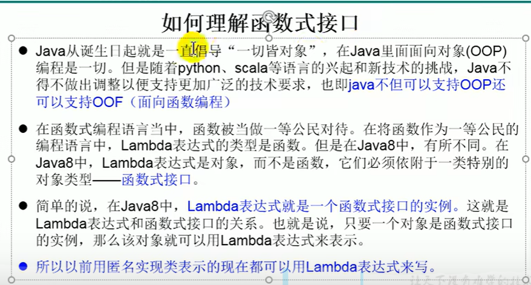
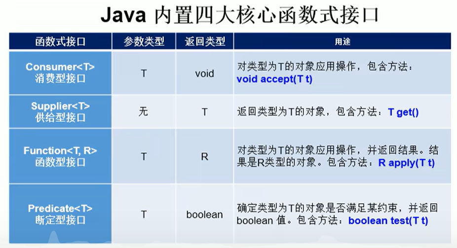
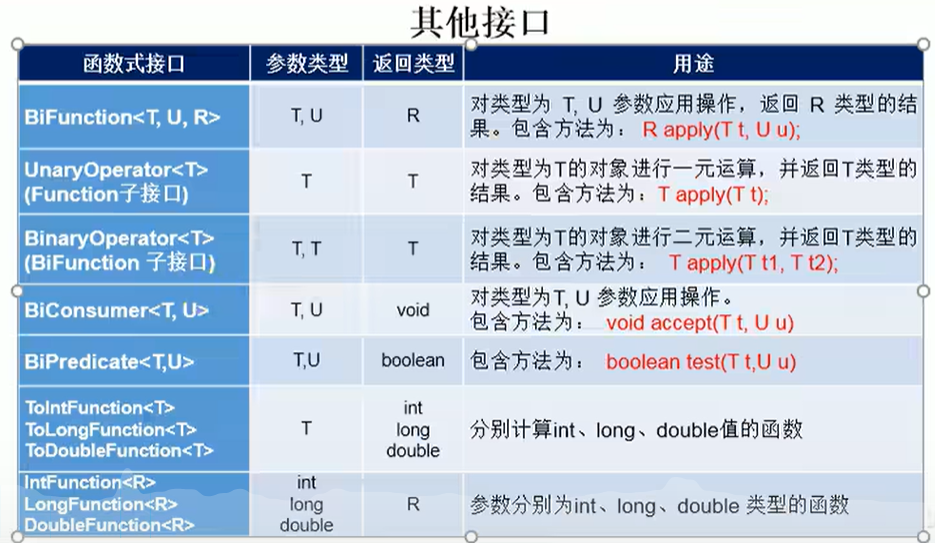

视频教程

:computer: [尚硅谷chap16 Java8新特性： lamda & functional interface P666-690 (685-690复习)](https://www.bilibili.com/video/BV1Kb411W75N?p=666&vd_source=c6866d088ad067762877e4b6b23ab9df)

---
- [1. :moon: Lambda](#1-moon-lambda)
  - [1.1 Functional Interface](#11-functional-interface)
  - [1.2 Method Reference](#12-method-reference)
    - [Constructor Reference](#constructor-reference)


---

# 1. :moon: Lambda

动机: 在java中传递代码块并不是容易的事情, 你不能直接传递代码块. 因为java是面向对象的编程语言, 要想传递代码块, 我们所以必须先构造一个对象, 这个对象的类需要有一个方法包含所需要的代码块.

lambda表达式正是为了能够更方便地传递代码块而被发明的, 它就像函数式(它本质是一个匿名函数)那样可以使得代码块之后被执行一次或多次. 

> 本质上Lambda就是Java想引入函数式编程的一些特点来使得代码更加紧凑.将函数作为另一个函数的argument, 我们在需要时便可以随时更改函数的实现代码来支持特定功能. 在一些API(尤其是stream API)的argument中实例化functional interface, 我们可以直接建立一些可复用的, 具有特定功能的"函数对象". API只提供规范, 具体的函数内容我们可以在规范的基础上进行编辑.
> + Lambda表达式本质是functional interface的instance
> + Lambda表达式可以改写成method reference的形式, 它们是等价的
>   + constructor reference是method reference的特殊情况

基本语法:
像JS中的箭头函数

```java
(para1, para2) -> your_codes     // 这个整体我们成为lambda表达式
```


## 1.1 Functional Interface
对于**只有一个抽象方法(abstract method)**的接口(interface), 需要这种接口的对象时, 可以提供一个lambda表达式. 这种**只有一个抽象方法**的接口称为**函数式接口(functional interface)**


:gem: e.g.1
考虑Arrays.sort(), 它的第二个argument是一个Comparator interface instance, Comparator就是函数式接口. 所以我们可以提供一个lambda表达式, 更加简洁:

```java
Arrays.sort(words, (first, second) -> first.length()-second.length());
```
**最好把lambda表达式看作一个函数, 而不是一个对象.** nm尚硅谷说的是相反的:



---
functional interface的object 一般会作为 一个method的argument, 来使得这个method具有更广的作用. 即一个method(指functional interface的object中的abstract method)作为另一个method的argument, 很神奇. 具体见尚硅谷的代码示例.

Java内置的functional interface: 



+ Consumer<T> 消费型interface, 只接收参数, 不return
+ Supplier<T> 供给型interface, 只return, 不接收参数
+ Function<T, R>, 函数型interface, 接收类型为T的参数, return类型为R的参数
+ Predicate<T>, 断定型接口, 接收类型为T的参数, return boolean值 




## 1.2 Method Reference

### Constructor Reference

