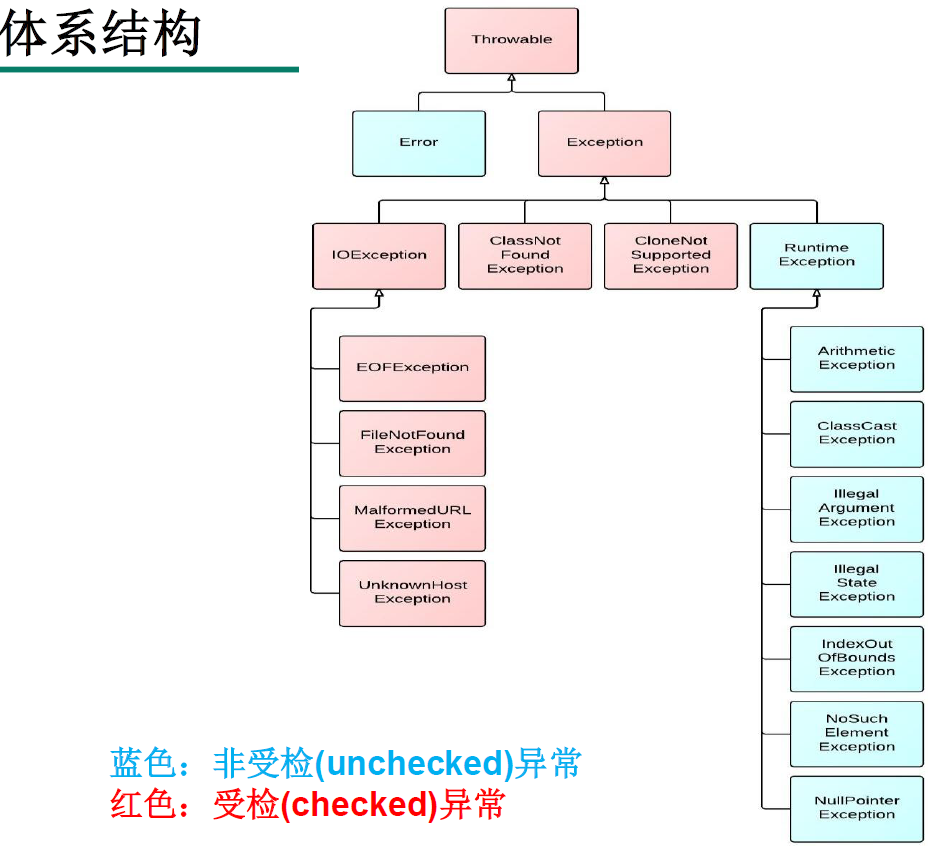

:computer: [Bilibili 尚硅谷: Exception handing 369-383](https://www.bilibili.com/video/BV1Kb411W75N?p=371&vd_source=c6866d088ad067762877e4b6b23ab9df)

---

# 1. Exception概述与体系结构
系统运行的过程中会遇到代码之外的因素带来的一些问题, 如: 客户输入数据的格式, 读取文件是否存在, 网络是否始终通畅... 此时应该给客户以提醒来提升用户体验.

Exception: Java中, 将程序执行中发生的不正常情况成为Exception (代码语法错误, 逻辑错误不是Exception)

Java程序在执行中所发生的Exception event(广义的异常)可以分为两类:
+ **Error**:    JVM无法解决的严重问题. 如： JVM系统内部错误, 资源耗尽... StackOverflowError, OutOfMemoryError. 一般不编写针对性代码进行处理
+ **Exception**: 其他因编程错误或偶然的外在因素导致的一般性问题, 可以使用针对性的代码进行处理. e.g.:
  + NullPointerException
  + FileNotFoundException
  + 网络连接中断
  + IndexOutOfBound

对于这些Exception, 一般有两种solution:
+ 一遇到Exception就终止程序
+ 在编写程序时, 就考虑到Exception的检测, 错误信息的提示以及处理

## 1.1 Exception体系结构
捕获Exception最理想的是在编译期间, 但有的Exception只有在运行时才会发生 (e.g. 除数为0, 数组下标越界), 分类: 
+ **编译时异常**: 下图红色
+ **运行时异常**: 下图中`Exception`下的蓝色

  

# 2. 常见Exception

该看371

# 3. Exception handling: 
## 3.1 `try-catch-finally`

## 3.2 `throws`

## 3.3 手动抛出Exception: `throw`

# 4. 用户自定义Exception class