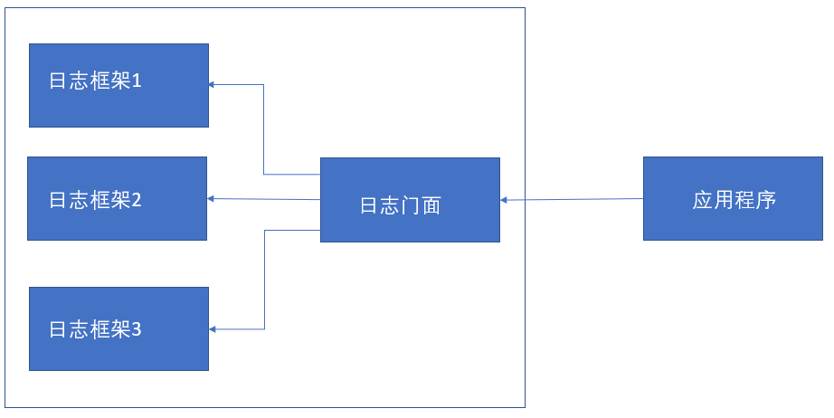

:computer: [黑马程序员: Java Log](https://www.bilibili.com/video/BV1vA41137P2/?spm_id_from=333.337.search-card.all.click&vd_source=c6866d088ad067762877e4b6b23ab9df)

:computer: [动力节点L 门面 & slf4j (更为全面的介绍Java Log)](https://www.bilibili.com/video/BV1Mb4y1Z74W?p=60&vd_source=c6866d088ad067762877e4b6b23ab9df) 


---
主学 slf4j + logback

- [1. 日志的概念](#1-日志的概念)
  - [1.1 日志文件](#11-日志文件)
    - [1.1.1 调试日志](#111-调试日志)
    - [1.1.2 系统日志](#112-系统日志)
- [2. Java日志框架](#2-java日志框架)
  - [2.1 JUL](#21-jul)
    - [2.1.1 JUL入门](#211-jul入门)
    - [2.1.2 日志的level](#212-日志的level)
    - [2.1.3 Logger之间的继承关系](#213-logger之间的继承关系)
    - [2.1.4 日志的配置文件(.properties file)](#214-日志的配置文件properties-file)
    - [2.1.5 日志原理分析](#215-日志原理分析)
  - [2.2 LOG4J](#22-log4j)
  - [2.3 LOG4J2](#23-log4j2)
  - [2.4 :full\_moon: logback](#24-full_moon-logback)
  - [2.5 JCL](#25-jcl)
- [3. :full\_moon: 门面模式 \& slf4j](#3-full_moon-门面模式--slf4j)
  - [3.1 Facade Pattern](#31-facade-pattern)
  - [3.2 SLF4J introduction](#32-slf4j-introduction)
  - [3.2.1 SLF4J 案例实现](#321-slf4j-案例实现)

---

# 1. 日志的概念
## 1.1 日志文件
> 一句话: 在代码中替换System.out.print(), 直接将调试信息写入到log文件中方便查找

日志文件(.log)是用于记录系统操作事件的文件集合, 分为事件日志和消息日志. 具有处理历史数据, 诊断问题的追踪以及理解系统活动等重要功能.

在计算机中, 日志文件时记录在操作系统或其他软件运行中发生的事件或在通信软件的不同用户之间的消息的文件. 记录是保持日志的行为, 在最简单的情况下, 消息被写入单个日志文件.


### 1.1.1 调试日志
软件开发中, 我们经常需要取调试程序, 做一些信息, 状态的输出便于我们查询程序的运行状况.


### 1.1.2 系统日志
系统日志用来记录系统中硬件, 软件和系统问题的信息, 同时还可以监视系统中发生的事件. 用户可以通过它来检查错误发生的原因, 或者寻找攻击时攻击者留下的痕迹. 

系统日志包括
+ 系统日志
+ 应用程序日志
+ 安全日志


# 2. Java日志框架

> 匠人: 
> + In production, do not use System.out as log tool
> + suggest to use slf4j ([slf4j教程](https://www.slf4j.org/)) 


## 2.1 JUL
`java.util.logging` java原生的log框架, 因此使用时不需要引用第三方类库, 相对其他日志框架使用方便, 学习简单, 能够在小型应用中灵活使用.


### 2.1.1 JUL入门
+ **Logger**: 应用程序通过获取Logger对象, 调用其API来发布日志信息. Logger通常是应用程序访问日志系统的入口程序.
+ **Handlers(Appender)**: 每个Logger会关联一组Handlers, Logger会将日志交给关联的Handlers处理, 由Handlers负责做日志记录. Handlers在此是一个抽象, 其具体的实现决定了日志记录的位置可以是控制台, 文件, 网络上的其他日志服务或操作系统日志等.
+ **Layouts(Formatters)**: 被Handlers调用, 它负责对日志事件中的数据进行转换和格式化. Layouts决定了数据在一条日志记录中的最终形式.
+ **level**: 每条日志消息都有一个关联的日志level, 该level粗略指导日志消息的重要性, 我们可以将Level和Loggers, Handlers做关联以便过滤消息 
+ **Filter**: 根据需求指定哪些消息会被记录, 哪些不会.

总结: 用户使用Logger来进行日志记录, Logger持有若干个Handlers, 日志的输出操作是由Handlers来完成的. 在Handler在输出日志前, 会经过Filter过滤, 判断哪些日志level应该被记录, Handler会将日志内容输出到指定位置(日志文件, 控制台...). Handler在输出日志时会使用Layout, 将输出内容进行排版. 

```java
@Test
    public void test1(){
        // 1. 获取Logger
        Logger logger = Logger.getLogger("test1Logger");     // static method

        // 2. 日志记录输出
        // 2.1 info级别消息
        logger.info("Hello JUL");

        // 2.2 通用方法记录
        logger.log(Level.INFO, "info msg");     // 第一个参数指定level, 第二个参数实在的消息

        // 2.3 通过占位符的方式输出变量值
        String name = "itcast";
        Integer age = 13;
        logger.log(Level.INFO, "user info: {0}, {1}", new Object[]{name, age});
    }
```

### 2.1.2 日志的level

`Level`枚举类中允许的取值:
+ SEVERE
  ```java
   public static final Level SEVERE = new Level("SEVERE",1000, defaultBundle);
  ``` 
+ WARNING
+ INFO
+ CONFIG
+ FINE
+ FINER
+ FINEST
+ ALL: value: min
+ OFF: value: max

### 2.1.3 Logger之间的继承关系

### 2.1.4 日志的配置文件(.properties file)
在代码中设置logger以及和它link的handler很不方便, 可以采用日志配置文件来配置更加方便, 达到同样的效果

从源码来讲解 :question: 没太懂

:gem: .properties file: 直接输入参数即可
+ 定义与logger关联的handlers有哪几个
+ 分别定义关联的handlers的属性

```properties
handlers = java.util.logging.ConsoleHandler, java.util.logging.FileHandler

.level = ALL

java.util.logging.FileHandler.pattern = java.log
java.util.logging.FileHandler.limit = 50000
java.util.logging.FileHandler.count = 1
java.util.logging.FileHandler.formatter = java.util.logging.XMLFormatter

java.util.logging.ConsoleHandler.level = ALL
java.util.logging.ConsoleHandler.formatter = java.util.logging.SimpleFormatter
```

有了logger的配置文件后, 我们还需要需要使用LogManage instance 和 I/O stream来加载 logger配置文件: 
```java
/**
  *加载自定义配置文件来更方便地定义logger, handlers
  */
@Test
public void testLogProperties() throws Exception {
    // 1. read log property file
    // -- 1.1 use class loader to generate an InputStream
    InputStream ins = JULTest.class.getClassLoader().getResourceAsStream("logging.properties");       // 注意对应file应放在Module的resource path下, 而不是直接放在Module path下

    // -- 1.2 instantiate LogManager
    LogManager logManager = LogManager.getLogManager();

    // -- 1.3 use LogManage instance to load log property file
    logManager.readConfiguration(ins);      // TODO: why ins is null????

    // 创建日志记录器
    Logger logger = Logger.getLogger("logger1");

    logger.severe("severe");
    logger.warning("warning");
    logger.info("info");            // JUL默认日志级别为info, 所以默认: 级别高于info的才输出, 低于info的不输出
    logger.config("config");
    logger.fine("fine");
    logger.finer("finer");
    logger.finest("finest");

}
```

---

日志配置文件的详细配置 09

更多的在.properties file中关于logger的配置

没太懂

### 2.1.5 日志原理分析


## 2.2 LOG4J
第三方log框架

11-17


## 2.3 LOG4J2
第三方log框架

32-38


## 2.4 :full_moon: logback
第三方log框架, 高性能, 学这个 + slf4j

26-31


## 2.5 JCL
第三方log框架

有时间再看

# 3. :full_moon: 门面模式 & slf4j 
:computer: [动力节点: 门面 & slf4j 60-78](https://www.bilibili.com/video/BV1Mb4y1Z74W?p=60&vd_source=c6866d088ad067762877e4b6b23ab9df)

## 3.1 Facade Pattern

门面模式(Facade Pattern), 也称之为外观模式, 其核心是: 外部(指应用程序)与一个子系统(指五花八门的日志框架)的通信必须通过一个统一的外观对象进行, 使得子系统更加易于使用.

前面介绍的日志框架, 每一种日志框架都有自己独立的API, 要使用对应的框架就要使用其对应的API, 这就大大提高了应用程序代码对于日志框架的耦合性要求.

为了解决这个问题, 就需要在五花八门的日志框架与应用程序之间建立一个桥梁, 对于应用程序来说, 无论底层的日志框架如何改变, 都不应该有任何感知. 只要门面服务做到足够好, 随意切换到另一个日志框架, 应用程序都不需要修改任何一行代码, 就可直接上线.



---

常见的日志实现: JUL, log4j, logback, log4j2
常见的日志门面: JCL, slf4j
出现顺序: log4j --> JUL --> JCL --> slf4j --> logback --> log4j2

## 3.2 SLF4J introduction
Simple Logging Facade for Java(SLF4j) 主要是为了给Java日志访问提供一套标准, 规范的API框架, 其主要意义在于提供接口, 具体的实现交给其他日志框架, 例如log4j, logback等.

对于一般的Java project而言, 日志框架会选择slf4j-api作为门面, 配上具体的实现框架(log4j, logback等), 中间用桥接器完成桥接. SLF4J最重要的两个功能即:
+ 对于日志框架的绑定
+ 日志框架的桥接

SLF4J桥接

为了解决某些日志框架不适配SLF4J API的问题(比如 log4j, JUL先于SLF4J问世), SLF4J附带了桥接模块, 这些模块会将对log4j, JCL和JUL API的调用重定向为行为, 就好像是对SLF4J API进行操作一样. 

## 3.2.1 SLF4J 案例实现

62 搭环境 没太懂, 视频用的Mavern

[StackOverflow: How to set SLF4J in IntelliJ with Gradle](https://stackoverflow.com/questions/59178076/how-to-set-slf4j-in-intellij-with-gradle?newreg=3baca917d5404dd991527cd8af67fcc2)

[SLF4J manual](https://www.slf4j.org/manual.html#swapping)

[20分钟搞懂日志](https://www.bilibili.com/video/BV11J411d7Gp/?spm_id_from=333.788.recommend_more_video.2&vd_source=c6866d088ad067762877e4b6b23ab9df)

[Introduction to Java Logging](https://www.baeldung.com/java-logging-intro)

一般步骤:
+ step1 环境搭建: 在build.gradle file中引入日志框架的dependency
```java
// slf4j 核心dependency
implementation 'org.slf4j:slf4j-log4j1:1.7.29'  

// slf4j自带的简单日志实现(一般不用)
implementation 'org.slf4j:slf4j-simple:1.7.29'
```


+ step2 配置文件: configure对应logging framework的配置文件. 注意不同logging framework的配置文件的格式不同, 网上一搜一大把
+ step3: 用