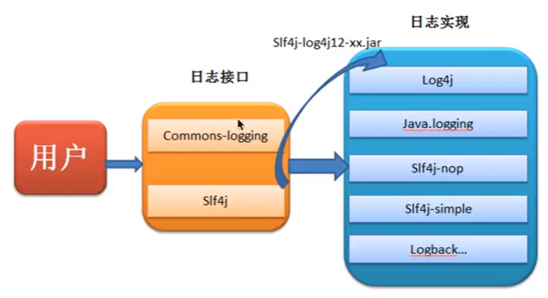
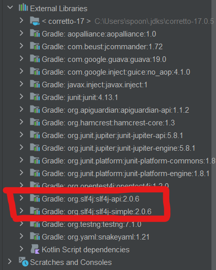
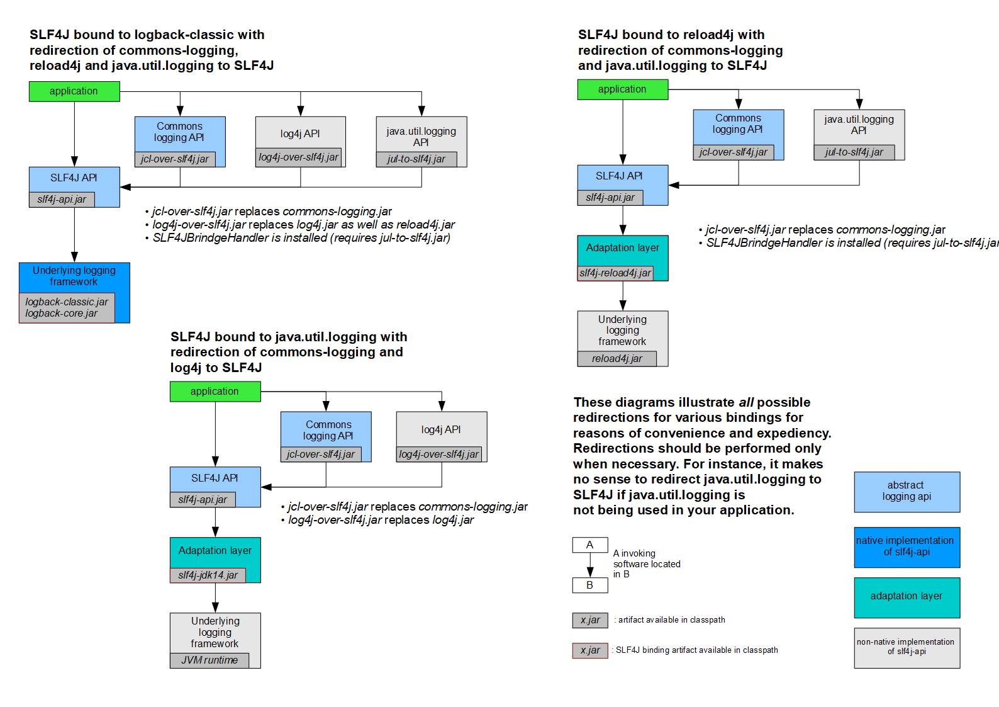

:computer: [黑马程序员: Java Log (这个文档主要笔记来源)](https://www.bilibili.com/video/BV1vA41137P2/?spm_id_from=333.337.search-card.all.click&vd_source=c6866d088ad067762877e4b6b23ab9df)

:computer: [动力节点L 门面 & slf4j (更为全面的介绍Java Log)](https://www.bilibili.com/video/BV1Mb4y1Z74W?p=60&vd_source=c6866d088ad067762877e4b6b23ab9df) 


---
主学 slf4j + logback

- [1. 日志的概念](#1-日志的概念)
  - [1.1 日志文件](#11-日志文件)
    - [1.1.1 调试日志](#111-调试日志)
    - [1.1.2 系统日志](#112-系统日志)
- [2. Part1](#2-part1)
  - [2.1 JUL](#21-jul)
    - [2.1.1 JUL入门](#211-jul入门)
    - [2.1.2 日志的level](#212-日志的level)
    - [2.1.3 Logger之间的继承关系](#213-logger之间的继承关系)
    - [2.1.4 日志的配置文件(.properties file)](#214-日志的配置文件properties-file)
    - [2.1.5 日志原理分析](#215-日志原理分析)
  - [2.2 LOG4J](#22-log4j)
  - [2.5 JCL](#25-jcl)
- [3. Part2](#3-part2)
  - [3.1 :full\_moon: 门面模式 \& slf4j](#31-full_moon-门面模式--slf4j)
    - [3.1.1 Facade Pattern](#311-facade-pattern)
    - [3.1.2 SLF4J introduction](#312-slf4j-introduction)
    - [3.1.3 SLF4J 快速入门](#313-slf4j-快速入门)
    - [3.1.4 SLF4J日志绑定](#314-slf4j日志绑定)
    - [3.1.5 slf4j日志桥接器](#315-slf4j日志桥接器)
  - [3.2 :full\_moon: logback](#32-full_moon-logback)
    - [3.2.1 logback 入门](#321-logback-入门)
    - [3.2.2 logback configuration](#322-logback-configuration)
  - [3.3 LOG4J2](#33-log4j2)

---

# 1. 日志的概念
## 1.1 日志文件
> 一句话: 在代码中替换System.out.print(), 直接将调试信息写入到log文件中方便查找

日志文件(.log)是用于记录系统操作事件的文件集合, 分为事件日志和消息日志. 具有处理历史数据, 诊断问题的追踪以及理解系统活动等重要功能.

在计算机中, 日志文件时记录在操作系统或其他软件运行中发生的事件或在通信软件的不同用户之间的消息的文件. 记录是保持日志的行为, 在最简单的情况下, 消息被写入单个日志文件.


### 1.1.1 调试日志
软件开发中, 我们经常需要取调试程序, 做一些信息, 状态的输出便于我们查询程序的运行状况.


### 1.1.2 系统日志
系统日志用来记录系统中硬件, 软件和系统问题的信息, 同时还可以监视系统中发生的事件. 用户可以通过它来检查错误发生的原因, 或者寻找攻击时攻击者留下的痕迹. 

系统日志包括
+ 系统日志
+ 应用程序日志
+ 安全日志


# 2. Part1

> 匠人: 
> + In production, do not use System.out as log tool
> + suggest to use slf4j ([slf4j教程](https://www.slf4j.org/)) 


## 2.1 JUL
`java.util.logging` java原生的log框架, 因此使用时不需要引用第三方类库, 相对其他日志框架使用方便, 学习简单, 能够在小型应用中灵活使用.


### 2.1.1 JUL入门
+ **Logger**: 应用程序通过获取Logger对象, 调用其API来发布日志信息. Logger通常是应用程序访问日志系统的入口程序.
+ **Handlers(Appender)**: 每个Logger会关联一组Handlers, Logger会将日志交给关联的Handlers处理, 由Handlers负责做日志记录. Handlers在此是一个抽象, 其具体的实现决定了日志记录的位置可以是控制台, 文件, 网络上的其他日志服务或操作系统日志等.
+ **Layouts(Formatters)**: 被Handlers调用, 它负责对日志事件中的数据进行转换和格式化. Layouts决定了数据在一条日志记录中的最终形式.
+ **level**: 每条日志消息都有一个关联的日志level, 该level粗略指导日志消息的重要性, 我们可以将Level和Loggers, Handlers做关联以便过滤消息 
+ **Filter**: 根据需求指定哪些消息会被记录, 哪些不会.

总结: 用户使用Logger来进行日志记录, Logger持有若干个Handlers, 日志的输出操作是由Handlers来完成的. 在Handler在输出日志前, 会经过Filter过滤, 判断哪些日志level应该被记录, Handler会将日志内容输出到指定位置(日志文件, 控制台...). Handler在输出日志时会使用Layout, 将输出内容进行排版. 

```java
@Test
    public void test1(){
        // 1. 获取Logger
        Logger logger = Logger.getLogger("test1Logger");     // static method

        // 2. 日志记录输出
        // 2.1 info级别消息
        logger.info("Hello JUL");

        // 2.2 通用方法记录
        logger.log(Level.INFO, "info msg");     // 第一个参数指定level, 第二个参数实在的消息

        // 2.3 通过占位符的方式输出变量值
        String name = "itcast";
        Integer age = 13;
        logger.log(Level.INFO, "user info: {0}, {1}", new Object[]{name, age});
    }
```

### 2.1.2 日志的level

`Level`枚举类中允许的取值:
+ SEVERE
  ```java
   public static final Level SEVERE = new Level("SEVERE",1000, defaultBundle);
  ``` 
+ WARNING
+ INFO
+ CONFIG
+ FINE
+ FINER
+ FINEST
+ ALL: value: min
+ OFF: value: max

### 2.1.3 Logger之间的继承关系

### 2.1.4 日志的配置文件(.properties file)
在代码中设置logger以及和它link的handler很不方便, 可以采用日志配置文件来配置更加方便, 达到同样的效果

从源码来讲解 :question: 没太懂

:gem: .properties file: 直接输入参数即可
+ 定义与logger关联的handlers有哪几个
+ 分别定义关联的handlers的属性

```properties
handlers = java.util.logging.ConsoleHandler, java.util.logging.FileHandler

.level = ALL

java.util.logging.FileHandler.pattern = java.log
java.util.logging.FileHandler.limit = 50000
java.util.logging.FileHandler.count = 1
java.util.logging.FileHandler.formatter = java.util.logging.XMLFormatter

java.util.logging.ConsoleHandler.level = ALL
java.util.logging.ConsoleHandler.formatter = java.util.logging.SimpleFormatter
```

有了logger的配置文件后, 我们还需要需要使用LogManage instance 和 I/O stream来加载 logger配置文件: 
```java
/**
  *加载自定义配置文件来更方便地定义logger, handlers
  */
@Test
public void testLogProperties() throws Exception {
    // 1. read log property file
    // -- 1.1 use class loader to generate an InputStream
    InputStream ins = JULTest.class.getClassLoader().getResourceAsStream("logging.properties");       // 注意对应file应放在Module的resource path下, 而不是直接放在Module path下

    // -- 1.2 instantiate LogManager
    LogManager logManager = LogManager.getLogManager();

    // -- 1.3 use LogManage instance to load log property file
    logManager.readConfiguration(ins);      // TODO: why ins is null????

    // 创建日志记录器
    Logger logger = Logger.getLogger("logger1");

    logger.severe("severe");
    logger.warning("warning");
    logger.info("info");            // JUL默认日志级别为info, 所以默认: 级别高于info的才输出, 低于info的不输出
    logger.config("config");
    logger.fine("fine");
    logger.finer("finer");
    logger.finest("finest");

}
```

---

日志配置文件的详细配置 09

更多的在.properties file中关于logger的配置

没太懂

### 2.1.5 日志原理分析


## 2.2 LOG4J
第三方log框架

11-17


## 2.5 JCL
第三方log框架

有时间再看

# 3. Part2

## 3.1 :full_moon: 门面模式 & slf4j 

20-25

### 3.1.1 Facade Pattern

门面模式(Facade Pattern), 也称之为外观模式, 其核心是: 外部(指应用程序)与一个子系统(指五花八门的日志框架)的通信必须通过一个统一的外观对象进行, 使得子系统更加易于使用.

前面介绍的日志框架, 每一种日志框架都有自己独立的API, 要使用对应的框架就要使用其对应的API, 这就大大提高了应用程序代码对于日志框架的耦合性要求.

为了解决这个问题, 就需要在五花八门的日志框架与应用程序之间建立一个桥梁, 对于应用程序来说, 无论底层的日志框架如何改变, 都不应该有任何感知. 只要门面服务做到足够好, 随意切换到另一个日志框架, 应用程序都不需要修改任何一行代码, 就可直接上线.



---

常见的日志实现: JUL, log4j, logback, log4j2
常见的日志门面: JCL(被淘汰了), slf4j
出现顺序: log4j --> JUL --> JCL --> slf4j --> logback --> log4j2

### 3.1.2 SLF4J introduction
Simple Logging Facade for Java(SLF4j) 主要是为了给Java日志访问提供一套标准, 规范的API框架, 其主要意义在于提供接口, 具体的实现交给其他日志框架, 例如log4j, logback等.

slf4j自己也提供了功能较为简单的实现, 但一般很少被用到.

对于一般的Java project而言, 日志框架会选择`slf4j-api`作为门面, 配上具体的实现框架(log4j, logback等), 中间用桥接器完成桥接. SLF4J最重要的两个功能即:
1. **对于日志框架的绑定**
2. **对于日志框架的桥接**

https://www.slf4j.org/

---

SLF4J桥接

为了解决某些日志框架不适配SLF4J API的问题(比如 log4j, JUL先于SLF4J问世), SLF4J附带了桥接模块, 这些模块会将对log4j, JCL和JUL API的调用重定向为行为, 就好像是对SLF4J API进行操作一样. 

### 3.1.3 SLF4J 快速入门


[20分钟搞懂日志](https://www.bilibili.com/video/BV11J411d7Gp/?spm_id_from=333.788.recommend_more_video.2&vd_source=c6866d088ad067762877e4b6b23ab9df)

[Introduction to Java Logging](https://www.baeldung.com/java-logging-intro)

一般步骤:
+ step1 环境搭建: 在build.gradle file中引入
  + slf4j日志门面的的dependency 与 
  + 一个 日志实现的 dependency
  ```java
  // slf4j 核心dependency (日志门面)
  implementation 'org.slf4j:slf4j-api:2.0.6'
  // slf4j自带的简单日志实现dependency(实际中一般不用)
  implementation 'org.slf4j:slf4j-simple:2.0.6'
  ```

  成功之后, external resources会出现对应的包 (可以在`file`-->`setting`-->`build`中设置自动更新resources on update of dependencies)

  


+ step2 配置文件 (optional): configure对应logging framework的配置文件. 注意不同logging framework的配置文件的格式不同, 网上一搜一大把
+ step3: 用

### 3.1.4 SLF4J日志绑定

:book: [slf4j 报错信息说明](https://www.slf4j.org/codes.html#noProviders)


上图中源生适配slf4j API的日志实现:
+ logback
+ slf4j-simple
+ slf4j-nop (no-operation): 用来暗示no provider is found

不直接适配slf4j API的日志实现 (因为它们出现早于slf4j):
+ log4j
+ JUL

它们需要用adaptation layer来间接地适配slf4j的API

---

使用slf4j的日志绑定流程:
1. 添加slf4j-api的依赖
2. 使用slf4j的API在项目中进行统一的日志记录
3. 绑定具体的日志实现框架
   + 绑定已经实现了slf4j的日志框架时(slf4j-simple, slf4j-nop, logback), 只需导入对应日志框架的依赖
   + 绑定还未实现slf4j的日志框架时(log4j, JUL), 先添加adapter依赖, 再添加日志框架依赖
4. slf4j 有且仅有一个日志实现框架的绑定(如果出现多个, 默认只使用第一个) 

如果要切换日志框架, 只需要替换class path上的slf4j的绑定即可.

---
以下, dependency的写法:

首先必须导入slf4j核心依赖
```java
// slf4j core dependency=====================================
implementation 'org.slf4j:slf4j-api:2.0.6'
```

然后, 取决于想用哪个日志框架, 再对应导入:

+ 只引入 slf4j-nop 
  + 不开启logger功能
  ```java
  // https://mavenlibs.com/maven/dependency/org.slf4j/slf4j-nop
  implementation 'org.slf4j:slf4j-nop:2.0.6'
  ```
+ 只引入 log4j  
  + [apache: how-to-bind-slf4j-with-log4j](https://logging.apache.org/log4j/2.x/log4j-slf4j-impl/) 

  ```java
  // 由于版本更新, dependency的写法和视频中不同了
  // bind log4j==========================================
  // -- firstly, we need to import the adapter
  // https://mavenlibs.com/maven/dependency/org.apache.logging.log4j/log4j-slf4j-impl
  implementation 'org.apache.logging.log4j:log4j-slf4j2-impl:2.19.0'
  // -- then, import log4j
  // https://mavenlibs.com/maven/dependency/org.apache.logging.log4j/log4j-api
  implementation 'org.apache.logging.log4j:log4j-api:2.19.0'
  // https://mavenlibs.com/maven/dependency/org.apache.logging.log4j/log4j-core
  implementation 'org.apache.logging.log4j:log4j-core:2.19.0'
  ```
+ 只引入JUL 
  + [slf4j: bridge with JUL](https://www.slf4j.org/api/org/slf4j/bridge/SLF4JBridgeHandler.html)
  ```java
  // 仅需要导入adapter, 因为JUL是Java源生的
  // https://mavenlibs.com/maven/dependency/org.slf4j/slf4j-jdk14
  implementation 'org.slf4j:slf4j-jdk14:2.0.6'
  ```
+ 只引入Logback
  ```java
  // bind logback to slf4j ====================================================
  implementation 'ch.qos.logback:logback-classic:1.4.5'
  ```

---

注意:

+ 当class-path下出现多个日志框架时, slf4j自动加载第一个来工作, 所以最好只选择一个日志实现放在class path的dependency里, 避免歧义
  ```java
  SLF4J: Class path contains multiple SLF4J providers.
  SLF4J: Found provider [org.slf4j.simple.SimpleServiceProvider@6cd8737]
  SLF4J: Found provider [ch.qos.logback.classic.spi.LogbackServiceProvider@22f71333]
  ```
+ 注意及时更新slf4j-api 与 对应的logger framework(日志实现), 它们的版本如果不适配也会报错.
  ```java
  SLF4J: Class path contains SLF4J bindings targeting slf4j-api versions 1.7.x or earlier.
  SLF4J: Ignoring binding found at [jar:file:/C:/Users/spoon/.gradle/caches/modules-2/files-2.1/org.slf4j/slf4j-log4j12/1.7.12/485f77901840cf4e8bf852f2abb9b723eb8ec29/slf4j-log4j12-1.7.12.jar!/org/slf4j/impl/StaticLoggerBinder.class]
  SLF4J: See https://www.slf4j.org/codes.html#ignoredBindings for an explanation.
  ```

---
slf4j 日志绑定原理

24 源码讲解 没懂 有时间再看

### 3.1.5 slf4j日志桥接器

25

通常, 你依赖的某些组件依赖于slf4j以外的日志记录API, 假设这些组件再将来依然不会切换到slf4j. 为了解决这种情况, slf4j附带了几个桥接模块, 这些模块将对log4j, JCL和JUL API的调用重定向, 就好像它们是对slf4j API一样.

桥接解决的的是项目中日志的遗留问题, 当系统中存在之前的日志API, 可以通过桥接转换到slf4j的实现.
1. 先去除之前老的日志框架的依赖
2. 添加slf4j提供的桥接组件
3. 为项目添加slf4j的具体实现



具体代码的执行案例见视频, 用到的时候再学

## 3.2 :full_moon: logback
第三方log框架, 高性能, 学这个 + slf4j

26-31

logback是log4j创始人设计的另一个开源日志组件, 性能要比log4j好

Logback主要分为3个模块:
+ logback-core: 其他两个模块的基础模块
+ logback-classic: 它是log4j的一个改良版本, 同时它完整了实现了slf4j API
+ logback-access: 访问模块与Servlet容器集成, 提供通过Http来访问日志的功能

后续的日志代码都是通过slf4j日志门面搭建日志系统, 所以在代码上没有区别, 主要是通过修改配置文件和dependency

### 3.2.1 logback 入门

添加dependency见3.1


### 3.2.2 logback configuration

:book: [logback manual](https://logback.qos.ch/manual/configuration.html)

27

logback会依次读取以下类型的配置文件(在resources文件夹下):
+ logback.groovy
+ logback-test.xml
+ logback.xml 

如果均不存在则采用默认配置

logback组件之间的关系:
+ Logger: 日志的记录器, 把它关联到应用的对应context上后, 主要用于存放日志对象, 也可定义日志类型, 级别
+ Appender: 用于指定日志输出的目的地, 目的地可以是控制台, 文件, 数据库等等
+ Layout: 负责把事件转换成字符串, 格式化的日志信息的输出. 在Logback中layout对象被封装在encoder中.

:gem: e.g. of a logback.xml file: 

```xml
<?xml version="1.0" encoding="UTF-8"?>
<configuration>
    <!--centralized-management property, later on we can directly change the value of a property
    format: ${name}
    -->
    <property name="pattern" value="[%-5level] %d{yyyy-MM-dd HH:mm:ss.SSSS} %c %M %L [%thread] %m%n"></property>
    <!--
        output format:
        %-5level: occupy 5 char
        %d{yyyy-MM-dd HH:mm:ss.SSSS}: data
        %c: class full name
        %M: method
        %L: row index
        %thread: thread name
        %m or %msg: message we want to output
        %n: turn to the next row
    -->

    <!--appender-->
    <!--console appender-->
    <appender name="console" class="ch.qos.logback.core.ConsoleAppender">
        <!--control OutputStream instance: System.out(by default) -> System.err -->
        <target>System.err</target>
        <!--define log message format (layout)-->
        <encoder class="ch.qos.logback.classic.encoder.PatternLayoutEncoder">
            <pattern>${pattern}</pattern>
        </encoder>
    </appender>
    <!--file appender-->
    <appender name="FILE" class="ch.qos.logback.core.FileAppender">
        <file>testFile.log</file>
        <!--append the file instead of overwritten-->
        <append>true</append>
        <!-- set immediateFlush to false for much higher logging throughput -->
        <immediateFlush>true</immediateFlush>
        <!-- encoders are assigned the type
             ch.qos.logback.classic.encoder.PatternLayoutEncoder by default -->
        <encoder>
            <pattern>${pattern}</pattern>
        </encoder>
    </appender>

    <!--logger instance: define which appenders should be added onto the logger-->
    <!--root logger configuration-->
    <root level="ALL">
        <appender-ref ref="console"></appender-ref>
        <appender-ref ref="FILE"></appender-ref>>
    </root>

</configuration>
```
这里分为三个步骤:
1. 定义集中管理属性
    + optional, 只是更为方便
2. 定义appenders
   + 定义每个appender中的消息格式 
3. 定义logger instance: 哪些appenders附加在logger上

网上有很多配置文件, 直接搜拿来用也行


## 3.3 LOG4J2
第三方log框架

32-38