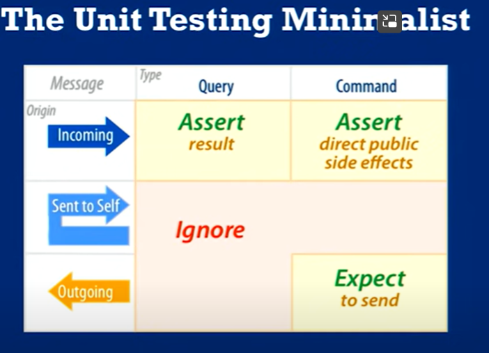

+ :pencil: [7.1~7.3 Exception](./Part1_Exception/Exception.md)
+ :pencil: [7.4 Assertion (断言)](./Part2_Assertion/Assertion.md)
+ :pencil: [7.5 Log (日志)](./Part3_Log/Log.md)
+ :pencil: 7.6 Debug techniques

---
# 断点调试

[韩顺平: 断点调试](https://www.bilibili.com/video/BV1fh411y7R8/?p=328&vd_source=c6866d088ad067762877e4b6b23ab9df)

---

# Unit test philosophy

https://www.youtube.com/watch?v=URSWYvyc42M 

有点理论式的讲解unit test philosophy, 没太懂太抽象. 先写着代码积攒经验回头再看.

Systems are way too complex, focus on messages of object would be better: unit test

Message Origin for an Object: 
+ incoming
+ sent to self
+ outgoing

Message can be:
+ query: return something/ change nothing e.g. getter
+ command: return nothing/ change something e.g. setter

rules of test messages:
+ Test incoming query messages by making assertions about what they send back
+ Test incoming command messages by making assertions about direct public side effects
+ ...

