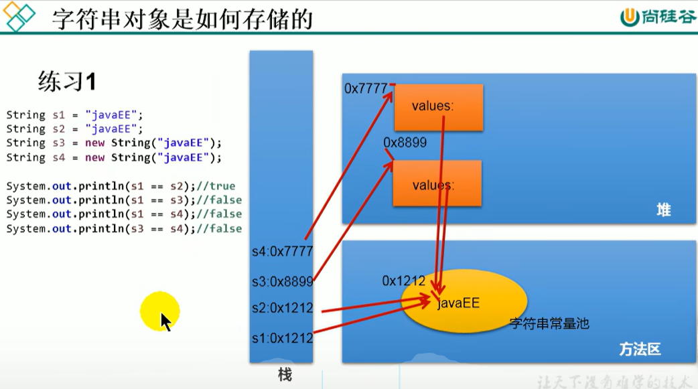
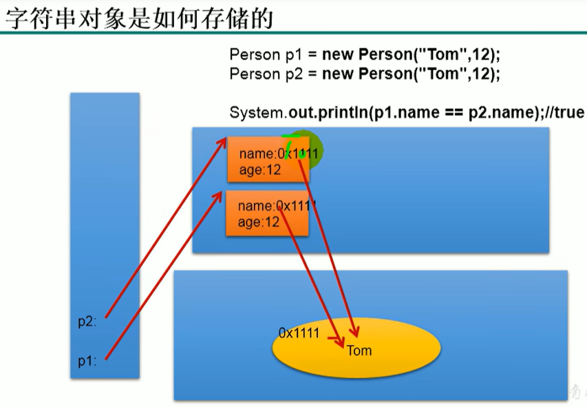
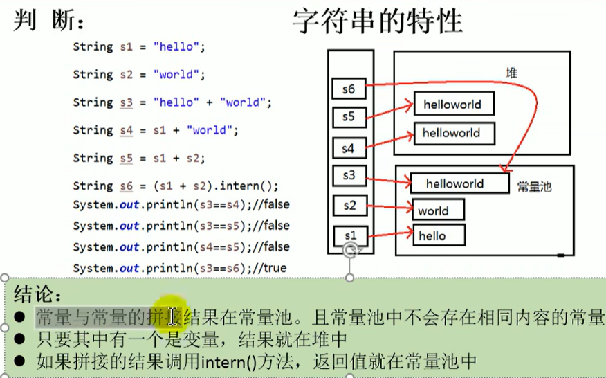
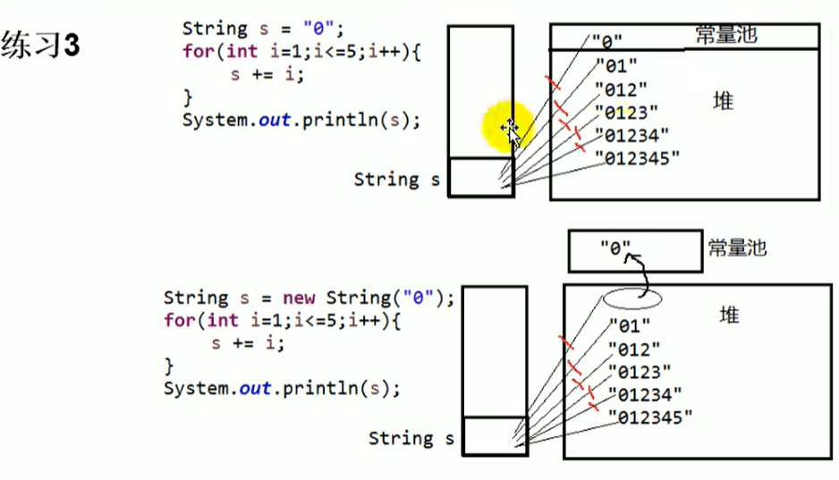
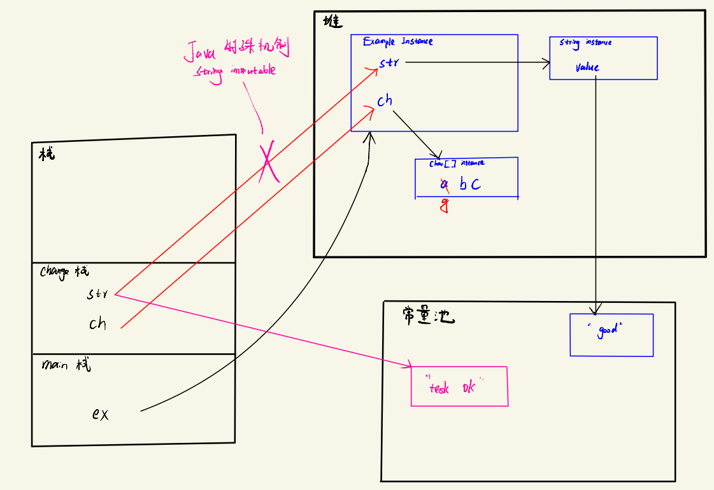
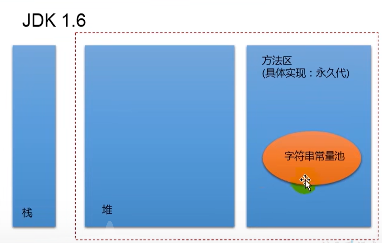
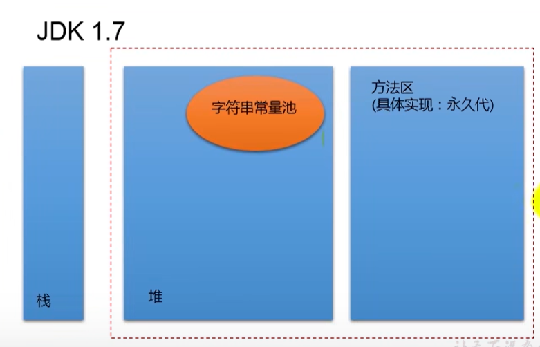
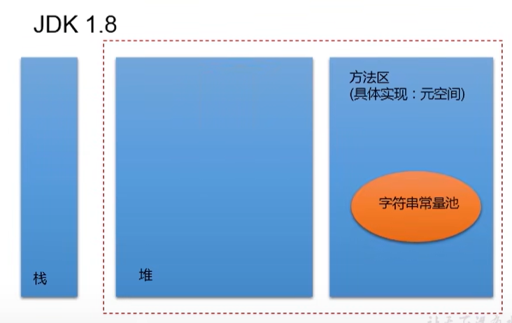

:computer:[Bilibili: 常用类 448-495](https://www.bilibili.com/video/BV1Kb411W75N?p=450&vd_source=c6866d088ad067762877e4b6b23ab9df)

---
- [1. :full\_moon: String](#1-full_moon-string)
  - [1.1 `String`](#11-string)
    - [1.1.1 :full\_moon: Instantiate `String`](#111-full_moon-instantiate-string)
    - [1.1.2 String拼接](#112-string拼接)
    - [1.1.3 String class 常用方法](#113-string-class-常用方法)
  - [1.2 `StringBuffer`](#12-stringbuffer)
  - [1.3 `StringBuilder`](#13-stringbuilder)
- [2. JDK8之前的日期和时间API](#2-jdk8之前的日期和时间api)
- [3. JDK8中新的日期和时间API](#3-jdk8中新的日期和时间api)
  - [`LocalDate`, `LocalTime`, `LocalDateTime`](#localdate-localtime-localdatetime)
  - [`Instant`](#instant)
  - [`DateTimeFormatter`](#datetimeformatter)
- [4. Java `Comparator`](#4-java-comparator)
  - [`Comparable` interface](#comparable-interface)
  - [`Comparator` interface](#comparator-interface)
- [5. `System` class](#5-system-class)
- [6. `Math` class](#6-math-class)
- [7.  `BigInteger` \& `BigDecimal`](#7--biginteger--bigdecimal)


---

# 1. :full_moon: String 
## 1.1 `String` 
```java
public final class String implements java.io.Serializable, Comparable<String>, 
CharSequence, Constable, ConstantDesc {
    @Stable
    private final byte[] value;     // byte 与 char可以相互转换

    private int hash; // Default to 0

    ...
}
```

+ String是一个`final` class, 无法被继承
+ 通过**字面量**的方式给一个String变量赋值, 此时的字符串值声明在方法区的**字符串常量池**中
  + 注意字符串常量池中是不会存储在相同内容的字符串的.
  

+ :star: String对象的字符内容是存储在一个btye数组 value中, value也是`final`的, 代表**不可变的字符序列**. 表面上看似我们修改String变量的赋值, 其实是在方法区的常量池又创建了新的字符串常量, 然后让String变量指向那个新建的常量, 而不是对字符串常量池中原有的value进行修改. 这体现在:
  + 当对字符串重新赋值时
  + 对现有字符串进行连接操作时
  + 当调用String的replace()修改指定字符串片段时


### 1.1.1 :full_moon: Instantiate `String`
首先明确一点: String变量名实际上只是栈中的一个指针, 保存地址值, 它要么保存方法区StringTable(字符串常量池)中的地址, 要么保存堆中的地址.

+ 通过字面量的形式: **一步指向**
  + s1, s2保存的值(地址值), 是对应的数据"javaEE"声明在方法区的字符串常量池中的地址值. 换言之, s1, s2指向字符串常量池中的"javaEE"对象 (一个byte[]).
+ 通过new String("javaEE")的方式: **两步指向**
  + 同时 s3, s4保存的值(地址值) 是 堆空间中的通过new创建出的对象的地址值, 而这些对象的内部的value属性(即byte[])保存的值(地址值) 则是字符串常量池中的"javaEE"对象的地址值
  + 没错, 此时有两个对象: 一个是堆空间中通过new创建的String对象, 另一个是String对象内部属性value指向的, 在字符串常量池中的byte[]对象
+ String还有其他很多constructor, 见官方doc

:gem: e.g.1

 

:gem: e.g.2

```java
Person p1 = new Person("Tom", 12);
Person p2 = new Person("Tom", 12);

System.out.println(p1.name.equals(p2.name));    // true, check content
System.out.println(p1.name == p2.name);         // true

p1.name = "Jerry";                              // try to modify a String, but actually create another byte[] object in StringTable(字符串常量池)
System.out.println(p2.name);                    // Tom, because String is immutable

class Person {
    String name;
    int age;
    public Person(String name, int age) {
        this.name = name;
        this.age = age;
    }
}

```


 

### 1.1.2 String拼接

结论:
+ 常量与常量的拼接结果在常量池中, 而常量池中不会存在相同内容的常量
+ 只要拼接中有一方为变量, 结果就在堆中 (在堆中new一个String对象)
+ 如果拼接的结果调用`intern()`, 返回值就在常量池中



:gem: e.g.1  
注意通过字面量方式给String变量赋值是一步指向, 而通过new String("...")给String变量赋值则是两步指向



:gem: 一道面试题

```java
链接：https://www.nowcoder.com/questionTerminal/ea89183b5d5349f7ac6a11da2308d935
来源：牛客网

public class Example{
    String str = new String("good");
    char[ ] ch = { 'a' , 'b' , 'c' };
    public static void main(String args[]){
        Example ex = new Example();
        ex.change(ex.str,ex.ch);
        System.out.print(ex.str + " and ");
        System.out.print(ex.ch);
    }
    public void change(String str,char ch[ ]){
        str = "test ok";
        ch[0] = 'g';
    }
}
```



JVM涉及字符串的数据结构

三种JVM
+ sun公司的HotSpot, 我们默认装的是这个, 我们默认提到的JVM的也是指这个
+ BEA公司的JRockit
+ IBM公司的J9 Vm

Heap(堆): 一个JVM实例只存在一个堆内存, 堆内存的大小是可以调节的. 类加载器读取了类文件之后, 需要把类, 方法, 常变量放到堆内存中, 保存所有引用类型的真实信息, 以方便执行器执行, 堆内存分为三部分:
+ Young generation space 新生区
+ Tenure generation space 养老区
+ Permanent Space 永久存储区 (可以看作方法区, 规范里是认为归在heap中, 但是实施时方法区和heap是分开的)

如下: StringTable在JVM中位置随3个版本的变化







之后康师傅讲JVM调优中也会讲到


### 1.1.3 String class 常用方法


该看456


## 1.2 `StringBuffer`

## 1.3 `StringBuilder`


# 2. JDK8之前的日期和时间API


# 3. JDK8中新的日期和时间API

## `LocalDate`, `LocalTime`, `LocalDateTime`

## `Instant`

## `DateTimeFormatter`

# 4. Java `Comparator`

## `Comparable` interface

## `Comparator` interface

# 5. `System` class

# 6. `Math` class

# 7.  `BigInteger` & `BigDecimal`