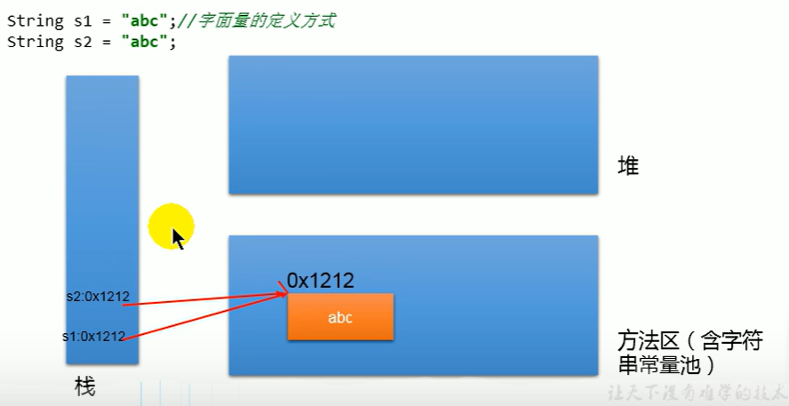

:computer:[Bilibili: 常用类 448-495](https://www.bilibili.com/video/BV1Kb411W75N?p=450&vd_source=c6866d088ad067762877e4b6b23ab9df)

---
- [1. :full\_moon: String](#1-full_moon-string)
  - [1.1 `String`](#11-string)
  - [1.2 `StringBuffer`](#12-stringbuffer)
  - [1.3 `StringBuilder`](#13-stringbuilder)
- [2. JDK8之前的日期和时间API](#2-jdk8之前的日期和时间api)
- [3. JDK8中新的日期和时间API](#3-jdk8中新的日期和时间api)
  - [`LocalDate`, `LocalTime`, `LocalDateTime`](#localdate-localtime-localdatetime)
  - [`Instant`](#instant)
  - [`DateTimeFormatter`](#datetimeformatter)
- [4. Java `Comparator`](#4-java-comparator)
  - [`Comparable` interface](#comparable-interface)
  - [`Comparator` interface](#comparator-interface)
- [5. `System` class](#5-system-class)
- [6. `Math` class](#6-math-class)
- [7.  `BigInteger` \& `BigDecimal`](#7--biginteger--bigdecimal)


---

# 1. :full_moon: String 
## 1.1 `String` 
```java
public final class String implements java.io.Serializable, Comparable<String>, 
CharSequence, Constable, ConstantDesc {
    @Stable
    private final byte[] value;     // byte 与 char可以相互转换

    private int hash; // Default to 0

    ...
}
```

+ String是一个`final` class, 无法被继承
+ 通过**字面量**的方式给一个String变量赋值, 此时的字符串值声明在方法区的**字符串常量池**中
  + 注意字符串常量池中是不会存储在相同内容的字符串的.
  

+ :star: String对象的字符内容是存储在一个btye数组 value中, value也是`final`的, 代表**不可变的字符序列**. 表面上看似我们修改String变量的赋值, 其实是在方法区的常量池又创建了新的字符串常量, 然后让String变量指向那个新建的常量, 而不是对字符串常量池中原有的value进行修改. 这体现在:
  + 当对字符串重新赋值时
  + 对现有字符串进行连接操作时
  + 当调用String的replace()修改指定字符串片段时


该看451


## 1.2 `StringBuffer`

## 1.3 `StringBuilder`


# 2. JDK8之前的日期和时间API


# 3. JDK8中新的日期和时间API

## `LocalDate`, `LocalTime`, `LocalDateTime`

## `Instant`

## `DateTimeFormatter`

# 4. Java `Comparator`

## `Comparable` interface

## `Comparator` interface

# 5. `System` class

# 6. `Math` class

# 7.  `BigInteger` & `BigDecimal`