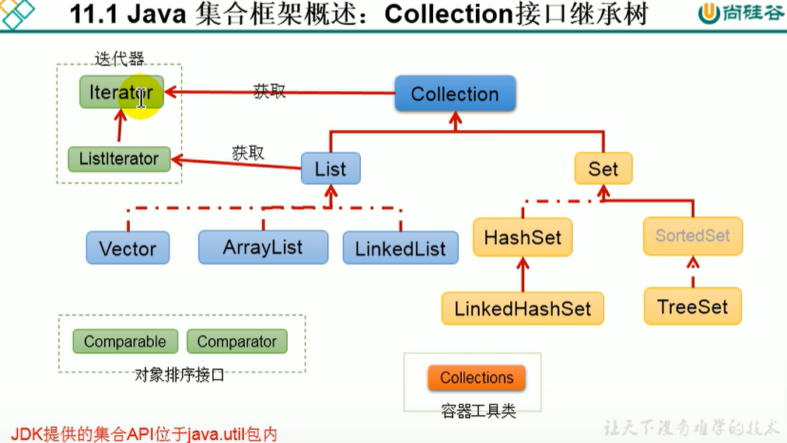
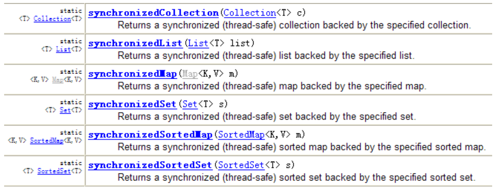

:computer:[Bilibili 尚硅谷: 集合 511-562 (514-517,  560-562 revision)](https://www.bilibili.com/video/BV1Kb411W75N?p=513&vd_source=c6866d088ad067762877e4b6b23ab9df)


# 0. Abstract

两条主线: 

+ `Collection` interface

  + List
    + ArrayList
    + LinkedList
  + Set
    + HashSet
    + LinedHashSet
    + TreeSet

+ `Map` interface

  + HashMap

    

后续结合Generics使用, 限定容器内元素的类型达到类型安全的目的


# 1. Java 集合框架概述

Array在内存存储方面的特点:
+ 数组初始化后, 长度就确定了
+ 数组声明的类型, 就决定了进行元素初始化时的类型

Array在存储数据方面的弊端:
+ 数组初始化后, 长度不可变, 不便于扩展
+ 数组中提供的属性和方法少, 不便于进行添加, 删除, 插入等操作, 且效率不高, 同时无法直接获取存储元素的个数
+ 数组存储的数据是有序的, 可以重复的， 这就导致存储数据的特点单一


---

为了克服Array的弊端, **Java集合类**可以用来存储数量不等的多个对象, 还可以用于保存具有映射关系的关联数组.

Java集合可以分为Collection和Map两种体系:

+ `Collection` interface: **单列数据**, 定义了存取一组对象的方法的集合
  + `List` interface: 元素有序 (index有意义), 可重复的集合
  + `Set` interface: 元素无序, 不可重复的集合
+ `Map` (映射) interface: **双列数据**, 保存具有映射关系的"key-value pair"的集合





# 2. Collection Interface

## 2.1 :full_moon: Collection的常用方法

由于继承, Collection的常用方法也可被List和Set使用


:bangbang: 注意向Collection接口的实现类的对象中添加数据obj时, **要求obj所在类要@override equals()** ---> 这样contains(), remove()等方法才能有效, 因为它们底层调用了equals()

### CRUD

增

+ `add(Object e)`: add e into coll
+ `addAll(Collection coll1)`: all all elements in coll1 into coll

---

"查"

+ `contains(Object obj)`: 判断当前集合是否包含obj. 需要调用equals()方法, 需要重写equals()
+ `constainsAll(Collection coll1)`: 判断coll1中的所有元素是否都存在于当前集合中.

---

删

+ `remove(Object obj)`: 从当前集合中删除obj元素.  同样需要调用equals()方法, 同样需要重写equals()
+ `removeAll(COllection coll1)`: 从当前集合中移除coll1中所有元素 (差集操作)

+ `retainAll(Collection coll1)`: 交集操作, 获取当前集合和coll1的交集, 并将结果返回给当前集合.

+ `equals(Object obj)`: 要想返回true, 当前集合和形参集合的元素都得相同(顺序, 值都得相同)


### 其他基本操作

+ `size()`
+ `clear()`
+ `isEmpty`

+ `hashCode()`: 返回当前对象的hash值


### 集合与数组相互转化

+ `toArray()`: 集合 ---> 数组

+ 拓展: Array --> Collection (即list): 调用Arrays class的static method asList()

  + 注意 Arrays.asList(arr) 内array元素的类型得是wrapper class, 如果是基本数据类型则如下

    + ```java
      List ints = Arrays.asList(new int[]{123, 456});     // int[] 整体看作一个元素
      System.out.println(ints.size());          // 1
      ```

    


## 2.2 Iterator Interface

:book: [JDK17 doc: Iterator](https://docs.oracle.com/en/java/javase/17/docs/api/java.base/java/lang/Iterable.html) JDK1.8之后新添加了几个方法, 这里没有体现

+ Iterator对象称为迭代器(23种设计模式之一), 主要用于遍历**Collection集合(不包括Map集合)**中的元素.
+ GOF给迭代器的定义为: **提供一种方法访问一个容器(container)对象中各个元素, 而又不需要暴露该容器对象的内部细节**. 迭代器模式, 就是为容器而生. 类似于"公交车上的售票员"
+ Collection接口继承了java.lang.Iterable接口, Iterable接口有一个iterator()方法, 那么所有实现了Collection接口的集合类都有一个iterator()方法, 用以返回一个实现了Iterator接口的对象
+ **Iterator仅仅用于遍历集合, Iterator本身并不提供承装对象的能力.** 如果需要创建Iterator对象, 则必须有一个被迭代的集合, 也就是说, Iterator对象是依附于被迭代的集合而存在的.
+ **集合对象每次调用iterator()方法都得到一个全新的Iterator对象**, 默认游标都在集合的第一个元素之前. 所以注意不要对一个集合反复地使用iterator()方法，容易死循环


### 2.1.1 迭代器的执行原理

next(), hasNext()搭配使用

其实原理就像单链表遍历一样

注意next()实际包含两部操作: 1) 指针下移; 2) 返回指针下移后指向的元素


`remove()`


增强for loop, 注意是shallowCopy集合元素来操作


## 2.3 :full_moon: Collection: List

+ 鉴于Java中数组用来存储数据的局限性，我们通常使用List替代数组. **List相当于动态数组.**

+ List集合类中**元素有序, 可重复**, 集合中的每个元素都有其对应的顺序索引.

+ List容器中的元素都对应一个整数型的序号记载其在容器中的位置，可以根据 序号存取容器中的元素.

+ JDK API中List接口的实现类常用的有:ArrayList、LinkedList和Vector


List接口: 存储有序的(元素在集合中的前后顺序是有意义), 可重复的数据.  又名 --> 动态数组; List接口Java1.2出现
*              ArrayList: 作为List interface的主要实现类, 线程不安全的因而效率高(用Collections的synchronizedList() 可以返回线程安全的List); 
               *              底层使用**Object[]** elementData存储
*              LinkedList: 对于频繁的插入, 删除操作, 使用此类效率比ArrayList高 ; 
               *              底层使用**双向链表**存储; Java1.2才出现
*              Vector 作为List接口的古老实现类 Java1.0 就有了, 线程安全因而效率低;  
               *              底层使用**Object[]** elementData存储


尚硅谷课件里有对应的pdf讲这些实现类的源码

+ `command` + `O`: search for the class and check the source code

+  `command` + `fn` + `F12`: display all methods in current class


### ArrayList

源码分析 527

+ **jdk7的情况下**

```java
ArrayList list = new ArrayList();   // 底层创建了长度为10的Object[] elementData

list.add(123);                      // elementData[0] = new Interger(123);

list.add(11);                       // 如果此次的add, 导滞elementData[0]的容量不够, 则扩容
```

默认情况下, 扩容为原来的容量的1.5倍， 同时需要将原有的数组中的数据复制到新的数组中.

结论: 建议开发中去使用带参数的constructor: ArrayList list = new ArrayList(int capacity)


+ **jdk8中的ArrayList的变化**

```java
ArrayList list = new ArrayList();  //底层Object[] elementData初始化为{}, 而不是一个长度为10的Object[]

list.add(123);                     // 第一次调用add()时, 底层才创建了长度为10的数组, 并将数据123添加到elementData中
```

后续的添加与扩容操作与jdk7无异


小结:

jdk7中的ArrayList的对象的创建类似于单例的**饿汉式**

jdk8中的ArrayList的对象创建类似于单例的**懒汉式**, 延迟了数组的创建, 节省内存


### LinkedList

源码分析 528

```java
LinkedList list = new LinkedList();   //内部声明了Node类型的first和last属性, 默认值为null
list.add(123);           // 将123封装到Node中, 创建了Node对象
```

其中Node定义为: 体现了LinkedList本质是双向链表

```java
private static class Node<E> {
      E item;
      Node<E> next;
      Node<E> prev;

      Node(Node<E> prev, E element, Node<E> next) {
          this.item = element;
          this.next = next;
          this.prev = prev;
      }
}
```


### Vector

源码分析 529

知道就行, 现在都不用Vector了


### List 接口中常用方法的测试

除了2.1中Collection的常用方法, List接口中额外还有一些和索引有关的方法 (因为List存储的是有序的数据).   而Set中则不会有如下这些方法:

* void add(int index, Object ele):在index位置插入ele元素

* boolean addAll(int index, Collection eles):从index位置开始将eles中的所有元素添加进来

* Object get(int index):获取指定index位置的元素

* int indexOf(Object obj):返回obj在集合中首次出现的位置

* int lastIndexOf(Object obj):返回obj在当前集合中末次出现的位置 

* Object remove(int index):移除指定index位置的元素，并返回此元素 

  * 注意与Collection.remove(Object obj)区分

    ```java
    list.remove(2);  // 默认指的是remove element with index = 2
    
    list.remove(new Integer(2)); // remove element '2'
    ```

* Object set(int index, Object ele):设置指定index位置的元素为ele 

* List subList(int fromIndex, int toIndex):返回从fromIndex到toIndex位置的子集合


---

ArrayList常用方法总结:
* 增: add(Object obj), 指的是在末尾增加元素
* 删: remove(int index) / remove(Object obj)
* 改: set(int index, Object obj)
* 查: get(int index)
* 插: add(int index, Object obj), 指的是在中间插入元素
* 长度: size()
* 遍历: Iterator / enhanced for loop  / normal loop


## 2.4 :moon: Collection: Set

Collection接口: 单列集合, 用来存储一个个的对象(int, boolean等基础类型不行)

+ Set接口: 存储无序的(元素在集合中的前后顺序没有意义), 不可重复的数据. 又名 --> 集合(高中意义的)
  + HashSet
    + LinkedHashSet
  + TreeSet


:bangbang: **Set 中没有定义额外的方法, 只能用Collection的方法**


### HashSet

一: Set接口: 存储无序的(元素在集合中的前后顺序没有意义), 不可重复的数据. 以HashSet为例:

* **无序性**: 不等于随机性. 存储的数据在底层的数组中的位置并未按照添加时的数组索引顺序决定, 而是由数据的hashCode来决定

* **不可重复性**: 保证添加的元素按照equals()方法判断时, 不能返回true, 即相同的元素只能添加一个

  

:full_moon: 二: 添加元素的过程 (HashSet底层为HashMap), 以HashSet为例:

核心思想是想通过hashCode来减少判断成本： 

+ 如果两个成员的hashCode一样, 则它们不一定想等, 还需用equals()来double check是否真的想等; 
+ 如果两个成员的hashCode不想等, 则它们一定不相等, 这样就大大减少使用equals()的次数

```bash
我们向HashSet中添加元素a, 首先调用a所在类的hashCode()方法计算a的hashValue, 接着该hashValue被转化为a应该在HashSet底层数组的存放位置, 之后判断该存放位置是否已经有元素:
		如果没有其他元素, 则a就放在这个位置上, a添加成功;        ---> 添加成功情况1
		如果此位置上已经有其他元素b (或以linked lis的形式存在多个元素了), 则首先比较a与b的hashValue:
					如果hashValue不相同, 则a添加成功;        ---> 添加成功情况下2
					如果hashValue相同, 继续调用a所在类的equals()方法:
								若equals()返回true, a添加失败;
								若equals()返回false, a添加成功.        ---> 添加成功情况3
```

对于添加成功情况2,3: 元素a与已经存在在索引位置上的元素用linked list的形式连接存储.

jdk7:  元素a放到数组中, 指向原来的元素

jdk8:  元素a挂在原来的元素下面


HashSet的底层: 数组 + 链表, 装入HashSet的元素需要同时重写equals()与hashCode()方法


**要求: 向HashSet中添加的数据, 其所在类一定要重写: 1) hashCode()  2) equals()**

*     要求: 重写的hashCode()与equals()要尽可能保持一致性: 即想等的对象必须具有相等的hashCode (不同的对象很小概率也有相同的hashCode)
*     技巧: 对象中用作equals()比较的fields, 都应该参与到hashCode的计算; 直接用Intellij的command + N 生成即可


### LinkedHashSet

LinkedHashSet作为HashSet的子类, 在添加数据的同时, 还维护了两个引用, 记录此数据的前一个数据和后一个数据,  使得我们遍历其内部数据时, 可以按照添加的顺序去遍历; 

优点: 对于频繁的遍历操作, LinkedHashSet的查找效率要比HashSet高


### TreeSet

底层用红黑树实现, 可以按照添加的元素的指定属性来排序

:bangbang: 要求: 向TreeSet中添加的数据, 要求是相同类, 且实现了Comparable接口, 不然add时就会报错

两种排序方式: 

+ 自然排序(实现**Comparable接口**): 当构造器参数为空, 默认采用自然排序
  + 自然排序中 判断TreeSet的成员相同, 不是调用equals(), 而是调用Comparable接口中的compareTo()返回0

+ 定制排序(**Comparator接口**): 当构造器参数为Comparator的instance时采用定制排序
  + 定制排序中, 判断成员相等,  不再是equals(), 而是调用Comparator接口中compare()返回
  


**因而小心! 如果两个成员本身是不相等的, 只是他们中某个成员变量想等, 而你恰恰仅使用那个成员变量作为compare()或者compareTo()的判断依据, 此时这两个成员也会被认为是相等的**, 而想等的成员不会被重复加入Set中!


P544 TreeSet课后练习

见intellij practice


P545 Set两道面试题

:gem: Practice: 去除一个List中的重复数据, 要求尽量简单


:gem::gem: 面试题: 

当中途改变set中某个成员的属性时, 该成员的hashCode若被计算就会和原来不同, 但该成员依旧呆在底层数组原来的位置上

```java
@Test
public void test2(){
    HashSet set = new HashSet();
    Person p1 = new Person(1001,"AA");      // Person 已重写hashCode(), equals()
    Person p2 = new Person(1002,"BB");

    set.add(p1);
    set.add(p2);
    System.out.println(set);        // [Person{name='BB', age=1002}, Person{name='AA', age=1001}]

    p1.name = "CC";     // 再次计算p1的hashCode就变了, 但p1放置在底层数组中的位置保持不变(这不就带来很多bug了吗?)
    set.remove(p1);     // remove时先判断有没有, 有了再删除: 先判断hashCode, 此时计算出来的hashCode和p1被加入时不同， 因而被判断为p1不存在, 删除无效
    System.out.println(set);        // [Person{name='BB', age=1002}, Person{name='CC', age=1001}]

    set.add(new Person(1001,"CC")); //同理, Person(1001, "CC）的hashCode对应在底层数组上位置没被占领, 被加入成功
    System.out.println(set);

    set.add(new Person(1001,"AA"));// 虽然hashCode计算的位置上被p1占了, 但二者并不equals, 所以加入成功
    System.out.println(set);
}
```


# 3. :full_moon: Map Interface

546

SortedMap是接口, 其他5个子类是实现类


Map中存储的key-value的特点 547

(key, value) 等效于 (x, f(x))

+ value是可重复的

+ key是无序的, 不可重复的, 一个key只能对应一个value ---> entry也一定是无序的, 不可重复的

实际上放入Map中的数据是一个个的entry, 一个entry有两个属性: key, value


## 3.1 HashMap

原理描述 548-549

`HashMap` 和 `ConcurrentHashMap`之间的区别 ---> GPT


**HashMap底层实现原理, 以jdk7为例 (P548,549)**

```java
HashMap map = new HashMap();
```

底层在实例化后, 创建了一个长度为16的数组Entry[] table

```java
// ...可能已执行多次put
map.put(key1, value1):
```

put()的底层过程:

首先, 调用key1所在类的hashCode()方法计算key1的hashCode, 再通过算法把这个hashCode转化为Entry在数组中的位置

+ 如果此位置上数据为空, 此时entry添加成功         ---> 添加成功情况1

+ 如果此位置上数据不为空 (此位置上存在一个或多个数据(链表形式)), 比较key1和当前位置上数据的hashCode

  + 如果key1的hashCode与已经存在的数据都不同, 此时entry添加成功         ---> 添加成功情况2

  + 如果key1的hashCode与某个已经存在的数据(key2-value2)的相同, 调用key1所在类的equals()

    + 如果equals()返回true, **<u>则使用value1替换key2的value2值</u>**. 这点和HashSet不同

    + 如果equals()返回false, entry添加成功                  ---> 添加成功情况3


resize的过程:

补充: 关于情况2和3: 此时key1-value1和已经存在的数据使用链表形式存储

在不断的添加过程中, 会涉及到扩容问题： 当当前Map中已有entry个数超过threshold(且此次put进来的entry要放置的位置非空)时扩容.

默认扩容方式: 扩容为原来容量的2倍, 并将原有的数据复制过来, 重新计算每个数据应该放在新数组的哪个位置(rehashing)


在JDK8中, 相较于JDK7的不同:

+ JDK8底层的数组是: Node[], 而非Entry[]  改了名字而已本质一样
+ new HashMap(): 底层还没有创建一个长度为16的数组; 首次调用put()时, 底层才会创建长度为16的Node[]

+ 底层结构的不同:

  + JDK7底层结构只有: 数组 + 连标,

  *      JDK8中底层结构: 数组 + 链表 + 红黑树
         *      当数组某个索引位置上的元素以链表形式存在的数据个数 > 8, 且当前数组长度 > 64, 此索引位置上的所有数据改为用红黑树存储(O(n) --> O(logn))


JDK7, 8 HashMap源码分析 550-551 

(尚硅谷的学习资料里有更为详细的pdf讲解(包括HashMap的其他性质), 课堂上只是讲上面put()过程对应的代码)

+ 源码中用到位运算来提高效率
  + 位运算表示%: num & (16-1)  <==> num % 16

+ if( con1 && con2) 与if (con1 || con2)

  ```java
  // 不能拆分, con1 作为先判断的condition, 如果con1==false, con2就不看了
  if(con1 && con2){
    ...
  }
  
  // con1 作为先判断的条件, 如果con1 == true, con2就不看了
  if(con1 || con2){  
    ...
  }
  
  // if(con1 || con2)可以拆分为如下两个if, 但还不是完全等效
  if(con1)
  {...}
  if (con2)
  {...}
  ```

  

:bangbang: JDK8 HashMap重要常量与成员变量

```java
DEFAULT_INITIAL_CAPACITY : HashMap的默认容量，16
MAXIMUM_CAPACITY : HashMap的最大支持容量，2^30 
DEFAULT_LOAD_FACTOR: HashMap的默认加载因子: 0.75, 通过统计学选的(兼顾底层数组利用率, 又兼顾链表不能太长)
TREEIFY_THRESHOLD:Bucket中链表长度大于该默认值，转化为红黑树 
UNTREEIFY_THRESHOLD:Bucket中红黑树存储的Node小于该默认值，转化为链表: 8 
MIN_TREEIFY_CAPACITY:桶中的Node被树化时最小的hash表容量: 64。(当桶中Node的 数量大到需要变红黑树时，若hash表容量小于MIN_TREEIFY_CAPACITY时，此时应执行 resize()扩容操作, 这个MIN_TREEIFY_CAPACITY的值至少是TREEIFY_THRESHOLD的4 倍。)
  
table:存储元素的数组，总是2的n次幂 
entrySet:存储具体元素的集 
size:HashMap中存储的键值对的数量 
modCount:HashMap扩容和结构改变的次数。 
threshold:扩容的临界值，= 容量*填充因子 0.75*16 = 12
loadFactor:填充因子
```

为什么要'提前扩容'？ (即why load factor要选0.75 而不是1或者0.3?)

+ 如果load factor太低, 底层数组还没多少实际内容就扩容, 底层数组利用率很低, 浪费了很多内存

+ 如果load factor太高, 底层数组已经有很多数据了(而这些数据往往不会平均分配在每一个索引位置, 通常会导致某几条链表过长), 影响查找性能


### LinkedHashMap

LinkedHashMap中重写了putVal()中的newNode()

```java
// 源码中:
static class Entry<K,V> extends HashMap.Node<K,V> {
    Entry<K,V> before, after;           // 能够记录添加数据的顺序
    Entry(int hash, K key, V value, Node<K,V> next) {
      super(hash, key, value, next);
    }
}
```


## Map中的常用方法

**增删改:**

put()既可以增也可改

+ Object put(Object key,Object value):将指定key-value添加到(或修改)当前map对象中
+ void putAll(Map m):将m中的所有key-value对存放到当前map中
+ Object remove(Object key):移除指定key的key-value对，并返回value
+ void clear():清空当前map中的所有数据


---

**元素查询:**

+ Object get(Object key):获取指定key对应的value
+ boolean containsKey(Object key):是否包含指定的key
+ boolean containsValue(Object value):是否包含指定的value
+ int size():返回map中key-value对的个数
+ boolean isEmpty():判断当前map是否为空
+ boolean equals(Object obj):判断当前map和参数对象obj是否相等


---

**元视图操作的方法:**

+ Set keySet():返回所有key构成的Set集合
+ Collection values():返回所有value构成的Collection集合 
+ Set entrySet():返回所有key-value对构成的Set集合


---

**总结**

```
增: put(Object key, Object value)
*      删: remove(Object key)
*      改: put(Object key, Object value)
*      查: get(Object key)
*      插?: map内数据无序, 没有插入这个概念
*      长度: size()
*      遍历: keySet() / values() / entrySet() / loop over key + get(key)
```


## 3.2 SortedMap

### TreeMap

:bangbang: 向TreeMap中添加key-value, 要求key必须是由同一个类创建的对象 (Map自己没这个要求), 因为要按照key进行排序: 自然排序， 定制排序


我们同样可以自然排序(Comparable interface), 或者定制排序(Comparator interface)


## 3.3 Hashtable

### Properties

```java
// Properties: 结合IO流来处理配置文件. key和value都是String类型
public static void main(String[] args) {
  FileInputStream fis = null;
  try {
    // IO stream step1: file class
    Properties pros = new Properties();
    // 然后手动在project下创建jdbc.properties 文件, 写入
    //name=Tom
    //password=abc123
    //注意=两边别写空格

    // IO stream step2: generate stream given file
    fis = new FileInputStream("jdbc.properties");

    // IO stream step3: load stream and perform read | write operation
    pros.load(fis); // 加载对应流的文件, 注意文件的编码应该和IDEA的编码匹配(尤其是文件中存在中文时)
    String name = pros.getProperty("name");
    String password = pros.getProperty("password");

    System.out.println("name = " + name + ", password = " + password );
  } catch (IOException e) {
    e.printStackTrace();
  } finally {
    // IO stream step4: close resource
    if (fis != null) {
      try {
        fis.close();
      } catch (IOException e) {
        e.printStackTrace();
      }
    }
  }

}
```


## 3.4 多线程环境下的线程安全Map

我自己加的, 更加全面的JUC(java.util.concurrect)并发编程, 见尚硅谷2022年教程

```java
public class ConcurrentHashMapTest {
    public static void main(String[] args) {
        ConcurrentHashMap<String, Integer> map = new ConcurrentHashMap<>();
        AtomicInteger sharedId = new AtomicInteger(0);       // JUC 原子类

        // Create two threads that will access the same ConcurrentHashMap object
        Thread t1 = new Thread(() -> {
            for (int i = 1; i <= 100; i++) {
                map.put("t1: Key" + i, i);
                sharedId.getAndIncrement();
                System.out.println(Thread.currentThread().getName()+" just put its "+i+" th key, sharedId:"+ sharedId.get());
            }
        });

        Thread t2 = new Thread(() -> {
            for (int i = 1; i <= 100; i++) {
                map.put("t2: Key" + i, i);
                sharedId.getAndIncrement();
                System.out.println(Thread.currentThread().getName()+" just put its "+i+" th key, sharedId:"+ sharedId.get());
            }
        });

        // set name
        t1.setName("t1");
        t2.setName("t2");

        // Start both threads
        t1.start();
        t2.start();

        // Wait for both threads to finish
        try {
            t1.join();      // wait for t1 to finish, then proceed with main thread
            System.out.println("t1 finished ------------------------");
            t2.join();      // wait for t2 to finish, then proceed with main thread
            System.out.println("t2 finished ------------------------");
        } catch (InterruptedException e) {
            e.printStackTrace();
        }

        // Check the size of the map
        System.out.println("Size of ConcurrentHashMap: " + map.size());
    }
```

可能的Result:   t2先执行完了

```java
t2 just put its 1 th key, sharedId:2			// t2 后进行 sharedId.getAndIncrement(), 然后先拿这个更新后的值打印
t1 just put its 1 th key, sharedId:1			// t1 先进行 sharedId.getAndIncrement(), 然后后拿这个更新后的值打印
t2 just put its 2 th key, sharedId:3
t1 just put its 2 th key, sharedId:4
t2 just put its 3 th key, sharedId:5
t1 just put its 3 th key, sharedId:6
...
t1 just put its 97 th key, sharedId:197
t1 just put its 98 th key, sharedId:198
t1 just put its 99 th key, sharedId:199
t1 just put its 100 th key, sharedId:200
t1 finished ------------------------
t2 finished ------------------------
Size of ConcurrentHashMap: 200  
```

可能的Result:  t1执行完毕后, proceed with main thread

````java
t1 just put its 1 th key, sharedId:2
t2 just put its 1 th key, sharedId:1
t1 just put its 2 th key, sharedId:3
t2 just put its 2 th key, sharedId:4
...
t1 just put its 100 th key, sharedId:191
t2 just put its 91 th key, sharedId:189
t1 finished ------------------------
t2 just put its 92 th key, sharedId:192
t2 just put its 93 th key, sharedId:193
t2 just put its 94 th key, sharedId:194
t2 just put its 95 th key, sharedId:195
t2 just put its 96 th key, sharedId:196
t2 just put its 97 th key, sharedId:197
t2 just put its 98 th key, sharedId:198
t2 just put its 99 th key, sharedId:199
t2 just put its 100 th key, sharedId:200
t2 finished ------------------------
Size of ConcurrentHashMap: 200
````


# 4. `Collections` 容器工具类

557

+ Collections是一个操作Set, List和Map的工具类 (操作数组的工具类是Arrays),

+ Collections中提供了一系列static method来对集合元素进行排序, 查询和修改等操作, 还提供了对集合对象设置不可变, 对集合对象实现同步控制等方法


## Collections的常用方法

**排序操作:(均为static方法)**

+ :star: **reverse(List):**反转 List 中元素的顺序

* :star: **shuffle(List)**:对 List 集合元素进行随机排序
* sort(List):根据元素的自然顺序对指定 List 集合元素按升序排序
* sort(List，Comparator):根据指定的 Comparator 产生的顺序对 List 集合元素进行排序
* :star: **swap(List，int， int):**将指定 list 集合中的 i 处元素和 j 处元素进行交换


**查找、替换**

+ Object max(Collection):根据元素的自然顺序，返回给定集合中的最大元素

* Object max(Collection，Comparator):根据 Comparator 指定的顺序，返回给定集合中的最大元素
* Object min(Collection)
* Object min(Collection，Comparator)
* :star: **int frequency(Collection，Object):**返回指定集合中指定元素的出现次数 
* :star: **void copy(List dest,List src):**将src中的内容复制到dest中
* :star: **boolean replaceAll(List list，Object oldVal，Object newVal)**:使用新值替换 List 对象的所有旧值

:bangbang: 其中copy()的使用注意:

```java
// 报异常写法
//        List destList = new ArrayList(list.size());
//        System.out.println(destList.size());        // 0, 因为ArrayList的底层数组长度虽然为list.size(), 但是它的size属性依然为0, size的含义是ArrayList中有值的元素的个数
//        Collections.copy(destList,list);
//        System.out.println(destList);

// 正确写法:array --> list
List destList = Arrays.asList(new Object[list.size()]);
System.out.println(destList.size());        // 5
Collections.copy(destList, list);
System.out.println(destList);               // [123, 43, 765, -97, 0]
```


**同步控制(多线程相关)**

Collections 类中提供了多个 `synchronizedXxx() `方法，该方法可使将指定集合包装成线程同步的集合，从而可以解决多线程并发访问集合时的线程安全问题

```java
// 返回的list1即为线程安全的
List list1 = Collections.synchronizedList(list);
```




# 5. 数据结构简述

转左程云算法课


