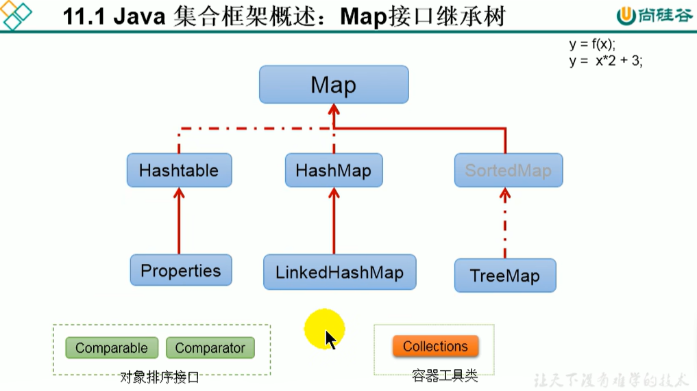

:computer:[Bilibili 尚硅谷: 集合 511-559](https://www.bilibili.com/video/BV1Kb411W75N?p=513&vd_source=c6866d088ad067762877e4b6b23ab9df)

---
- [Java 集合框架概述](#java-集合框架概述)
- [Collection Interface](#collection-interface)
  - [Iterator Interface](#iterator-interface)
  - [Collection: List](#collection-list)
  - [Collection: Set](#collection-set)
- [Map Interface](#map-interface)
- [`Collections` 容器工具类](#collections-容器工具类)
- [数据结构简述](#数据结构简述)

---

# Java 集合框架概述

Array在内存存储方面的特点:
+ 数组初始化后, 长度就确定了
+ 数组声明的类型, 就决定了进行元素初始化时的类型

Array在存储数据方面的弊端:
+ 数组初始化后, 长度不可变, 不便于扩展
+ 数组中提供的属性和方法少, 不便于进行添加, 删除, 插入等操作, 且效率不高, 同时无法直接获取存储元素的个数
+ 数组存储的数据是有序的, 可以重复的， 这就导致存储数据的特点单一

Java集合类可以用来存储数量不等的多个对象, 还可以用于保存具有映射关系的关联数组.

# Collection Interface

## Iterator Interface

## Collection: List

## Collection: Set

# Map Interface

# `Collections` 容器工具类

# 数据结构简述
