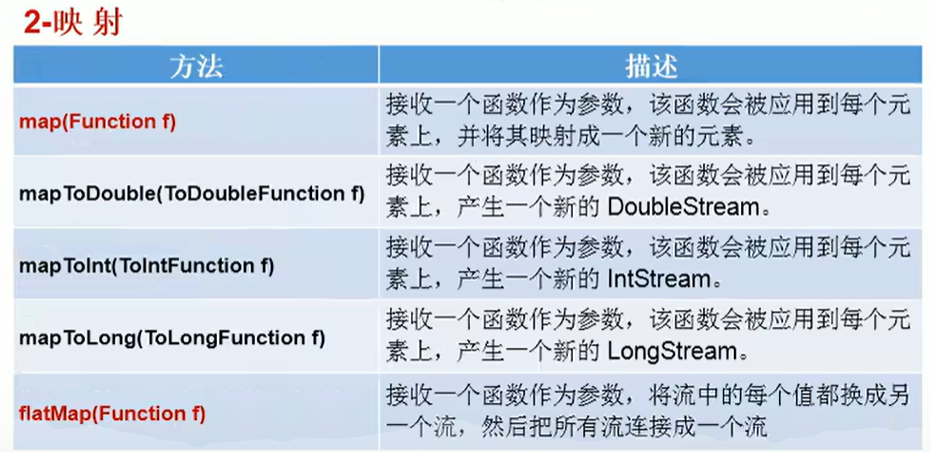
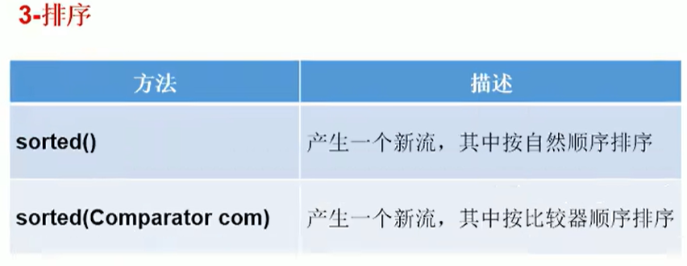
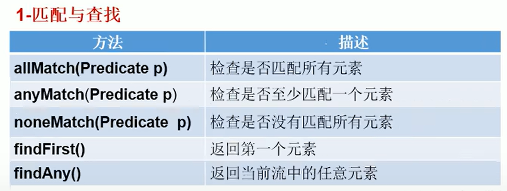
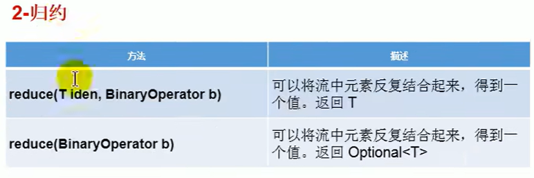
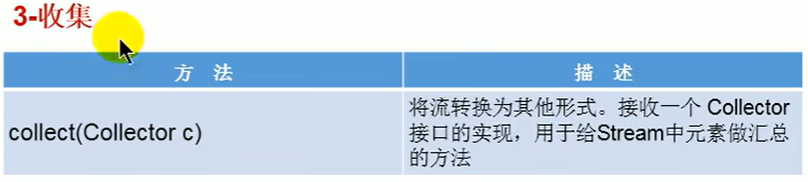

采用类似SQL的语法对数据集合进行运算, 可以有效地减少for loop, if else...
.filter() .sort()  .map()


optional class


---
- [尚硅谷讲解:](#尚硅谷讲解)
  - [Stream API Introduction](#stream-api-introduction)
  - [Step1: Stream 的创建](#step1-stream-的创建)
    - [by set](#by-set)
    - [by array](#by-array)
    - [无限流](#无限流)
  - [Step2: Stream API 中间操作](#step2-stream-api-中间操作)
    - [筛选与切片](#筛选与切片)
    - [映射](#映射)
    - [排序](#排序)
  - [Step3: Stream API 终止操作](#step3-stream-api-终止操作)
    - [匹配与查找](#匹配与查找)
    - [归约](#归约)
    - [收集](#收集)
  - [Optional Class](#optional-class)
- [1. Intro: 从迭代到流](#1-intro-从迭代到流)
- [2. Stream](#2-stream)
  - [2.1 Stream的创建](#21-stream的创建)
  - [2.2 filter, map, flatMap](#22-filter-map-flatmap)
  - [2.2](#22)
- [7. optional类型](#7-optional类型)


---
# 尚硅谷讲解:
:computer: [Bilibili尚硅谷: Java8 Stream API](https://www.bilibili.com/video/BV1Kb411W75N?p=677&vd_source=c6866d088ad067762877e4b6b23ab9df)

## Stream API Introduction
What is Stream API?

Stream API (java.util.stream)把真正的函数式编程风格引入到Java. Stream是Java8中处理集合的关键抽象概念, 它可以指定你希望对集合进行的操作(e.g. 查找, 过滤, 映射...). 使用Stream API对集合数据进行操作, 就类似使用SQL执行的数据库查询, 还可以利用Stream API来进行并行操作.

Why Stream API?
+ 实际开发中, 项目中多数数据都来源于MySQL, Oracle等关系型数据库(Relational database). 但现在数据源更多了, 有MongDB, Radis等等, 而这些NoSQL的数据就需要Java层面去处理, 这时就需要Stream API.
+ Stream vs. Collection: 
  + Collection是一种静态的内存数据结构, 主要是面向内存, 存储在内存中.
  + 而Stream是有关计算的, 主要是面向CPU, 通过CPU来实现计算

什么是Stream?
是数据渠道(管道), 用于操作数据源(集合, 数组)所生成的元素序列. 可以想象stream是一个处理数据的管道或者传送带, 而集合相当于一筐筐的原材料. 我们把一箱箱的原材料倒入管道或者传送带, 数据才会被加工处理(即计算), 这些加工处理我们称之为Stream API的中间操作. 集合和stream一般都需要指定其内部元素的类型
```java
ArrayList<Character>

Stream<Integer>
```

**集合讲的是数据, 而Stream讲的是计算, 这体现在:**
- Stream自己不会存储元素
- Stream不会改变源对象. 相反, 它们只会返回一个持有结果的新Stream
- Stream操作是延迟执行(惰性的)的, 这意味着它们会等到需要结果的时候才执行.

Stream的操作3个步骤:
1. 创建Stream
   从一个数据源(e.g. Set, Array)那里创建一个初始Stream
2. 中间操作
   中间操作链, 在初始流的基础上生成Stream链(流水线). 
3. 终止操作
   一旦执行终止操作, 就执行中间操作链表, 并产生结果. 之后, Stream不会再被使用.


## Step1: Stream 的创建

### by set

### by array

### 无限流

## Step2: Stream API 中间操作
多个中间操作可以连起来形成一个**流水线**, 除非流水线上触发终止操作, 否则中间操作不会执行任何的处理!而在终止操作时一次性全部处理, 这被称为"惰性操作"

### 筛选与切片


### 映射


map会对stream中的每个元素进行操作

### 排序


:question: Comparator 是functional interface, 但它里面怎么不止一个method?


## Step3: Stream API 终止操作

### 匹配与查找



### 归约


https://www.bilibili.com/video/BV1Kb411W75N?p=683

### 收集



## Optional Class

---

# 1. Intro: 从迭代到流
动机: java8引入了流库, 与集合(set)相比, 流(stream)提供了一种可以让我们在更高概念级别上去指定计算任务的数据视图, 用来"做什么而不是怎么做". 就像SQL语句那样更加方便地去数据集合展开操作, 而不用关心操作是如何实现的.

:gem: e.g.1

假设我们想计数一本书的words count:
```java
// firstly import contents of a book into a list named words
var contents = new String (Files.readAllBytes(Path.get("alice.txt")), StandardCharsets.UTF_8);      // read file into String
List<String> words = List.of(contents.split("\\PL+"));  // split into words

// 方法一: iteration
int count = 0;
for(String W:words){
    if(w.length() > 12) count++;
}

// 方法二: use stream
long count = words.stream()         // initial stream
    .filter(w ->w.length>12)        // 返回另一个stream, 其中只包含长度大于12的单词
    .count();                       // 进一步将filter()返回的stream化简为一个结果
```

方法二use stream的工作流程:
1. 创建一个stream
2. 指定将initial stream转换为其他stream的中间操作, 可能包含多个步骤
3. 应用终止操作, 从而产生结果. 从此之后, 这个流就再也不能用了.


集合 vs. stream的工作特点:
+ **stream不会存储其元素**
  + 元素可能存储在底层的集合中, 或按需产生. 
+ **stream的操作不会修改其数据源.** 
  + 如上面filter()并不修改initial stream而是返回另一个stream
+ **stream的操作是尽可能惰性执行的**


# 2. Stream
## 2.1 Stream的创建
可以使用Collection interface的stream方法将任何集合转化为一个stream

+ `stream.of()` 将array转换为一个stream
    ```java
    Stream<String> song = Stream.of("gently", "down", "the", "stream")
    ```
+ `Array.stream(array, from, to)`可以利用array的片段创建一个stream

+ `Stream.empty()`创建empty stream, 不包含任何元素
+ 创建无限stream:
  + `generate`
  + `iterate`

## 2.2 filter, map, flatMap

## 2.2 

# 7. optional类型