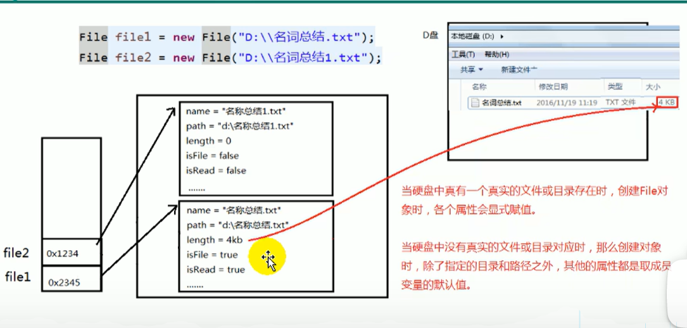
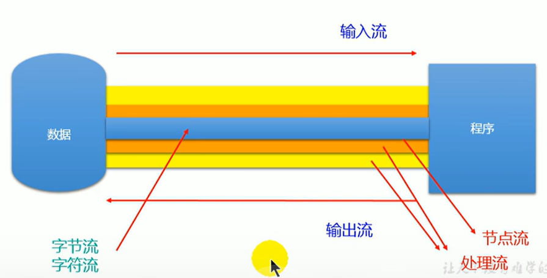
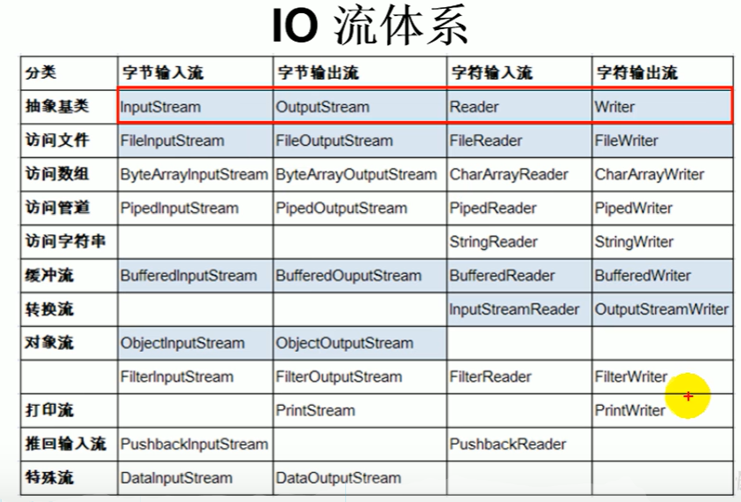

:computer: [尚硅谷: Java file class 575-578](https://www.bilibili.com/video/BV1Kb411W75N?p=577&vd_source=c6866d088ad067762877e4b6b23ab9df)

:computer: [Bilibili 尚硅谷: I/O stream 583-608](https://www.bilibili.com/video/BV1Kb411W75N?p=584&vd_source=c6866d088ad067762877e4b6b23ab9df)

---
- [1. File class](#1-file-class)
  - [1.1 File class constructor](#11-file-class-constructor)
  - [1.2 File class的常用方法](#12-file-class的常用方法)
    - [:moon: File class的获取功能](#moon-file-class的获取功能)
    - [File class的重命名](#file-class的重命名)
    - [File class的判断功能](#file-class的判断功能)
    - [:full\_moon: File class的创建文件\&文件夹](#full_moon-file-class的创建文件文件夹)
- [2. IO stream体系结构](#2-io-stream体系结构)
  - [stream的分类](#stream的分类)
  - [IO stream体系结构](#io-stream体系结构)
- [3. 节点流(文件流)](#3-节点流文件流)
- [4. 缓冲流](#4-缓冲流)
- [5. 转换流](#5-转换流)
- [6. 标准输入, 输出流](#6-标准输入-输出流)
- [7. 打印流](#7-打印流)
- [8. 数据流](#8-数据流)
- [9. 对象流](#9-对象流)
- [10. 随机存取文件](#10-随机存取文件)
- [11. NIO.2中Path, Paths, Files class的使用](#11-nio2中path-paths-files-class的使用)

---

# 1. File class
:cry: UniMelb Java final project就栽在这个上面了


File object不仅可以代表文件, 还可以代表文件夹(即允许File object中有另一个File object)

注意路径分隔符在不同的OS中不同
+ Windows: '\\\\'
+ MAC: '/'

## 1.1 File class constructor

```java
File(String filePath)
File(String parentPath, String childPath)
File(File parentFile, String childPath)
```

## 1.2 File class的常用方法

### :moon: File class的获取功能
+ `public String getAbsolutePath()`
+ `public String getPath()`: 如果File instance是相对路径, 则get相对路径; 如果File instance是绝对路径, 则返回绝对路径
+ `public String getName()`
+ `public String getParent`: 获取上层文件的目录路径. 若无, 返回null

如下两个方法适用于文件目录
+ `public long length()`: 获取文件长度(in bytes). 不能获取目录长度
+ `public long lastModified()`: 获取最后一次修改时间, 毫秒值  


+ `public String[] list()`: return指定目录下的所有文件或者文件目录的**名称**构成的数组
+ `public File[] listFiles()`: return指定目录下的所有文件或者文件目录的**File(绝对路径的形式)**构成的数组

---

### File class的重命名
+ `public boolean renameTo(File dest)`: 把文件重命名为指定的文件路径
```java
file1.renameTo(file2)
// 想要保证返货true(重命名成功), 需要file1代表的文件实际存在, 且file2代表的文件不存在
```

---
### File class的判断功能
+ `public boolean isDirectory()`: 判断是否是文件目录 (File instance 可以是文件, 也可是文件目录)
+ `public boolean isFile()`: 判断是否是文件
+ `public boolean exists()`: 判断是否存在
+ `public boolean canRead()`: 判断是否可读
+ `public boolean canWrite()`: 判断是否可写
+ `public boolean isHidden()`: 判断是否隐藏


---
### :full_moon: File class的创建文件&文件夹
+ `public boolean createNewFile()`: 创建文件. 若文件已经存在, 则不创建, 并返回false;
  + :cry: UniMelb Java Final Project 栽在这个函数上了! 
+ `public boolean mkdir()`: 创建文件目录(文件夹). 如果此文件目录存在, 就不创建了. 如果此文件目录的上层目录不存在, 也不创建.
+ `public boolean mkdirs()`: 创建文件目录(文件夹). 如果上层文件目录不存在, 一并创建.

**注意: 如果创建的文件或者文件目录没有写盘符路径, 那么默认创建在项目路径下**

---
File class的删除功能
+ `public boolean delete()`: 删除文件或文件夹

**注意: Java中的删除不走回收站. 要删除一个文件目录, 该文件目录内不能包含文件或文件目录**

---



+ 如果File class的instance只是内存层面的(硬盘中不存在对应地文件或文件夹, 该File instance的name, path, length等属性都是默认值


# 2. IO stream体系结构


I/O stream原理与stream的分类

I/O用于处理设备之间的数据传输, 如read/write, 网络通讯等. Java中, 对于数据的I/O操作以"stream"的方式进行, 可以将stream想象为管道, 供数据流动. java.io package下提供了各种stream class & interface.

+ input: 读取外部数据(磁盘, 光盘等存储设备中的数据)到程序(内存)中
+ output: input的逆过程

## stream的分类
+ 按操作数据单位分: 
  + 字节流(byte stream, 基本单位 8 bit) 适合处理binary file, 比如图片视频
  + 字符流(char stream, 基本单位 16 bit) 适合处理txt file
+ 按数据流的流向分: 
  + 输入流
  + 输出流
+ 按流的角色分: 
  + 节点流: 直接连接文件和内存的stream
  + 处理流: 在已有的stream的基础上, 外面包的那层stream



## IO stream体系结构
Java的IO stream共涉及40多个class, 但实际上它们都是从如下4个抽象基类中派生的.

抽象类| byte stream |char stream
-----|-----|-----
input stream  |  `InputStream`   |  `Reade`
output stream |  `OutputStream`  | `Writer`


由这4个class派生的子类名称都是以其父类名作为子类名后缀:



+ 访问文件的四个流: 节点流
+ 之后的流: 都是处理流
+ 做到看到一个stream class的名字, 就知道是input/output stream, byte/char stream

看至585, 得回去看file class

# 3. 节点流(文件流)

# 4. 缓冲流

# 5. 转换流

# 6. 标准输入, 输出流

# 7. 打印流

# 8. 数据流

# 9. 对象流


# 10. 随机存取文件

# 11. NIO.2中Path, Paths, Files class的使用