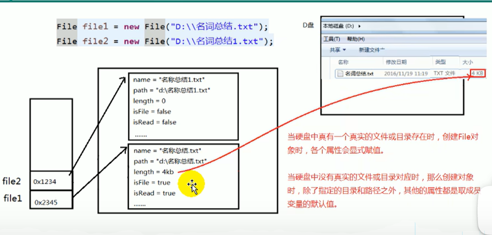

:computer: [尚硅谷: Java file class 575-578](https://www.bilibili.com/video/BV1Kb411W75N?p=577&vd_source=c6866d088ad067762877e4b6b23ab9df)

:computer: [尚硅谷: I/O stream part1 583-608 (604-608 revision)](https://www.bilibili.com/video/BV1Kb411W75N?p=584&vd_source=c6866d088ad067762877e4b6b23ab9df)

:computer: [尚硅谷:  I/O stream part2 609-617](https://www.bilibili.com/video/BV1Kb411W75N?p=611&vd_source=c6866d088ad067762877e4b6b23ab9df) 讲对象流, 随机存取...

I/O流与网络编程紧密相关, 网络编程见 [chap4: 网络编程](../chap4/readme.md)

---
[TOC]

---

# 1. :moon: File class

**<u>作为I/O stream的基础前置, File class允许我们创建File的实例, 不仅可以对应硬盘中真实存在的文件, 还可以代表路径</u>**


:cry: UniMelb Java final project就栽在这个上面了


File object不仅可以代表文件, 还可以代表文件夹(即允许File object中有另一个File object)

注意路径分隔符在不同的OS中不同
+ Windows: '\\\\'
+ MAC: '/'


## 1.1 File class constructor

```java
File(String filePath)
File(String parentPath, String childPath)
File(File parentFile, String childPath)
```

## 1.2 File class的常用方法

### :moon: File class的获取功能
+ `public String getAbsolutePath()`
+ `public String getPath()`: 如果File instance是相对路径, 则get相对路径; 如果File instance是绝对路径, 则返回绝对路径
+ `public String getName()`
+ `public String getParent`: 获取上层文件的目录路径. 若无, 返回null

+ `public long length()`: 获取文件长度(in bytes). 不能获取目录长度
+ `public long lastModified()`: 获取最后一次修改时间, 毫秒值  

如下两个方法适用于文件目录

+ `public String[] list()`: return指定目录下的所有文件或者文件目录的**名称**构成的数组 (不会遍历到更深层的文件或文件夹)
+ `public File[] listFiles()`: return指定目录下的所有文件或者文件目录的**File(绝对路径的形式)**构成的数组 (同样不会遍历到更深层的文件或文件夹)

---

### File class的重命名
+ `public boolean renameTo(File dest)`: 把文件重命名为指定的文件路径
```java
file1.renameTo(file2)
// 想要保证返货true(重命名成功), 需要file1代表的文件实际存在, 且file2代表的文件不存在
```

---
### :full_moon: File class的判断功能
+ `public boolean isDirectory()`: 判断是否是文件目录 (File instance 可以是文件, 也可是文件目录)
+ `public boolean isFile()`: 判断是否是文件
+ `public boolean exists()`: 判断是否存在
+ `public boolean canRead()`: 判断是否可读
+ `public boolean canWrite()`: 判断是否可写
+ `public boolean isHidden()`: 判断是否隐藏


---
### :full_moon: File class的创建文件&文件夹
+ `public boolean createNewFile()`: 创建文件. 若文件已经存在, 则不创建, 并返回false;
  + :cry: UniMelb Java Final Project 栽在这个函数上了! 
+ `public boolean mkdir()`: 创建文件目录(文件夹). 如果此文件目录存在, 就不创建了. 如果此文件目录的上层目录不存在, 也不创建.
+ `public boolean mkdirs()`: 创建文件目录(文件夹). 如果上层文件目录不存在, 一并创建.

:bangbang:**注意: 如果创建的文件或者文件目录没有写盘符路径, 那么默认创建在项目路径下**

---

### File class的删除功能

+ `public boolean delete()`: 删除文件或文件夹

:bangbang:**注意: Java中的删除不走回收站. 要删除一个文件目录, 该文件目录内不能包含文件或文件目录**

---



:bangbang:注意: 如果File class的instance只是内存层面的(硬盘中不存在对应地文件或文件夹, 该File instance的name, path, length等属性都是默认值


# 2. IO stream体系结构


I/O stream原理与stream的分类

I/O用于处理设备之间的数据传输, 如read/write, 网络通讯等. Java中, 对于数据的I/O操作以"stream"的方式进行, 可以将stream想象为管道, 供数据流动. java.io package下提供了各种stream class & interface.

+ input: 读取外部数据(磁盘, 光盘等存储设备中的数据)到程序(内存)中
+ output: input的逆过程

## stream的分类
+ 按操作数据单位分: 
  + 字节流(byte stream, 基本单位 8 bit) 适合处理binary file, 比如图片视频 (word文件就属于binary file)
    + 此类stream的类名结尾为 Reader / Writer
  + 字符流(char stream, 基本单位 16 bit) 适合处理txt file
    + 此类stream的类名结尾为 InputStream / OutputStream
+ 按数据流的流向分: 
  + 输入流
  + 输出流
+ 按流的角色分: 
  + 节点流: **直接**连接文件和内存的stream
  + 处理流: 在已有的stream的基础上, 外面包的那层stream


## IO stream体系结构
Java的IO stream共涉及40多个class, 但实际上它们都是从如下4个抽象基类中派生的.

抽象类| byte stream |char stream
-----|-----|-----
input stream  |  `InputStream`   |  `Reade`
output stream |  `OutputStream`  | `Writer`


由这4个class派生的子类名称都是以其父类名作为子类名后缀:


+ **直接**连接文件的四个流 (上面第三排的): 节点流

+ 第三排之后的流: 都是处理流

  

# 3. :full_moon:节点流(文件流)
**节点流直接与file相连, 完成与file之间的数据交换, 此类stream的类名以File开头.** 之后可以套接处理流, 完成更加特定的输入输出任务.


I/O stream的使用一般都分成3步:

```java
// step 1. instantiate FileReader stream (inlcuding instantiate File class )
// step 2. read
// step 3. close stream 为了能够保证顺利关闭资源, 需要使用try-catch-finally

try{
  	// step1
    // step2
}catch(IOException e) {
  	e.print()
}finally{
  	// step3
}
```

:bangbang: 注意:
+ main function中相对路径是针对当前project而言
+ unit test中的相对路径是针对当前module而言


## 3.1 Char stream (字符流)

:star: 注意处理I/O stream中的可能会被throw Exception:
  + Exception from step1: instantiate I/O stream `fr = new FileReader(file);`

  + Exception from step2: loading `fr.read();`

  如果处理不妥当, I/O stream没有被关闭, 会造成严重的资源浪费和泄露. 因此 I/O stream .close()最好放在finally block里, 保证stream一定会被关掉.

:gem: e.g. 一个标准的FileReader的使用模板, 写的时候先不写try-catch-finally, 最后再加上, 也分两步: 1) step1,2,3放进try-catch-finally 中的try block; 2) step4 放入finally block
> `command+`alt`+`t`: surround with 

---

#### `read()` 读取一个char

一次只读取一个char

```java
/**
     * load hello.txt into main memory and display the content
     * 1. read(): return 读入的一个char对应的int. 如果达到文件末尾, return -1
     * 2. Exception handling: 为了保证流资源一定可以执行close(), 需要使用try-catch-finally
     * 3. 读入的文件必须存在, 否则Step2 ` fr = new FileReader(file);`会throw FileNotFoundException
     *
     */
    @Test
    public void testFileReader() {
        FileReader fr = null;
        try {
            //  step1: instantiate File class, point out which file you want to manipulate over
            File file = new File("hello.txt");      // unit test中相对路径相较于当前Module(C:\1_Java\GuiguShang_Bilibili\IO_Stream)
            // step2: provide stream
            fr = new FileReader(file);      // TODO: might throw FileNotFoundException
            // step3: load data
            //          read(): return 读入的一个字符. 如果达到文件末尾, return -1
            int data = fr.read();           // char 也对应int值     TODO: might throw Exception
            while(data != -1){
                System.out.print((char)data);
                data = fr.read();           // 相当于i++, condition for next loop  TODO: might throw Exception
            }
        } catch (IOException e) {
            throw new RuntimeException(e);
        } finally {
            // step4: close stream  千万别忘!  因为JVMl垃圾回收对于物理连接无能为力
            try {
                if(fr != null){     // TODO:in case fr is not instantiated when `fr = new FileReader(file)` throws exception
                    fr.close();
                }
            } catch (IOException e) {
                throw new RuntimeException(e);
            }
        }

    }
```


---

#### `read(char[])` 批量读取char数据

一次读取一个char[]; 需要用到辅助变量char[]作为buffer

+ **一般遵循一个原则: 读了几个char就操作几个char** 
  + :bangbang:注意每次读取时, 只是反复修改作为buffer的char[]. 假设作为buffer的char[]的长度为5, 有一次loop我们只往buffer中读入了3个char, 那么buffer上次loop中读入的后两个char也还在.
```java
/**
  * 对read()操作升级: 使用read重载方法
  *      read(char[]):  loop over char in the file, write them into char[] every time
  *                      return the number of char read into cbuf; return -1 if reaching end of the file
  */
@Test
public void testFileReader1()  {
    FileReader fr = null;
    try {
        // 1. instantiate File class
        File file = new File("hello.txt");

        // step1 instantiate FileReader stream
        fr = new FileReader(file);

        // step2 read(char[]) 批量读取
        // read(char[] cbuf): return the number of char read into cbuf; return -1 if reaching end of the file

        char[] cbuf = new char[5];      // char[] buffer
        int len;
        while( (len=fr.read(cbuf)) != -1){          // 每读取5个char打印一次 TODO: fr.read(cbuf)每次把file中的char[5]写入cbuf中
            // 方式一 错误写法 !!!!!!
//          for(int i=0; i<cbuf.length; i++){       // for loop 是loop over all elements of char[5]
//              System.out.print(cbuf[i]);
//          }
            // 方式二 正确写法 ------------------------------------------
            for(int i=0; i<len; i++){       // cbuf取了几个char就打印几个
                System.out.print(cbuf[i]);
            }

//          // 方式三 错误写法!!!! 错误原理和方式一相同
//          String str = new String(cbuf);      // String constructor: char[] -> String
//          System.out.println(str);

            // 方式四 正确写法, 对应方式二 ---------------------------------------
            String str1 = new String(cbuf,0,len);
            System.out.print(str1);
        }
    } catch (IOException e) {
        throw new RuntimeException(e);
    } finally {
        if(fr != null){
            try {
                // step3 close stream
                fr.close();
            } catch (IOException e) {
                throw new RuntimeException(e);
            }
        }
    }

}
```
---

FileWriter
```java
/**
  * export data from main memory into hard drive
  * Note:
  * 1. output stream, corresponding file in the hard drive is allowed to be not existed.
  *            If not existing, create the file automatically
  *            If existing, depending on the second argument of FileWriter constructor (append, false by default)
  *                                 append = true, append the file not overwrite
  *                                 append = false, overwrite the file
  *
  */
@Test
public void testFileWriter()  {
  FileWriter fw = null;
  try {
      // 1. instantiate file class
      File file = new File("hello1.txt");
      // 2. instantiate writer stream
      fw = new FileWriter(file);
      // 3. write
      fw.write("I have a dream!\n".toCharArray());
      fw.write("you need to have a dream!");
  } catch (IOException e) {
      throw new RuntimeException(e);
  } finally {
      // 4. close writer stream
      if(fw != null){
          try {
              fw.close();
          } catch (IOException e) {
              throw new RuntimeException(e);
          }
      }
  }
}
```


---
:gem: practice: copy a file 
```java
/**
  *
  * copy a file
  * 注意: 
  * 1. 当创建了一系列的I/O Stream, 最好按创建时的倒序来close它们
  */
@Test
public void testFileReaderFileWriter() {
    FileReader  fr = null;
    FileWriter fw = null;
    try {
        // 1. instantiate File class
        File srcFile = new File("hello.txt");
        File destFile = new File("helloCopy.txt");

        // 2. instantiate I/O stream
        fr = new FileReader(srcFile);
        fw = new FileWriter(destFile);

        // 3. read & write
        char[] cbuf = new char[5];
        int len;        // record the number of char read into cbuf
        while((len=fr.read(cbuf))!=-1){
            fw.write(cbuf, 0, len);     // export len char just read
        }
    } catch (IOException e) {
        throw new RuntimeException(e);
    } finally {
        // 4. close stream      TODO: better close in the reverse order of creating streams
        try {
            if(fw != null)
                fw.close();
        } catch (IOException e) {
            throw new RuntimeException(e);
        }

        try {
            if(fr != null)
                fr.close();
        } catch (IOException e) {
            throw new RuntimeException(e);
        }
    }
}
```

:bangbang: 注意: Char stream(字符流) is not suitable to deal with picture, because pictures (e.g. .jpg) are binary files. Sometimes using char stream to deal with binary file will lead to error!


## 3.2 Byte stream (字节流)
形式和char stream一致, 还是分4步.

可以单独处理一个Byte, 也可批量处理一个Byte[]


# 4. :moon: 常用处理流

## 4.1 缓冲流(buffered stream)
为了提高节点流的效率, 开发中我们一般都使用缓冲流, 而不是直接用节点流; 原因是buffered stream class中提供了缓存区, 由constant DEFAULT_BUFFER_SIZE (see source code)决定

+ step2 instantiate stream中, 先instantiate节点流, 再instantiate对应的处理流
+ step4 close stream中, 先close outer stream, 再close inner stream. 但实际上, close outer stream时, inner stream会自动close

byte stream:
+ `BufferedInputStream`
  + `read(btye[] buffer)` 
+ `BufferedOutputStream`
  + `write(btye[] buffer, 0, len])` 
  

char stream:
+ `BufferedReader`
  + `read(char[] cbuf)`
  + `readLine()`
+ `BufferedWriter`
  + `write(char[] cbuf, 0, len)` 
### 4.1.1 缓冲流 vs. 节点流

用了缓冲流速度果然变快了(使用相同的buffer size时)


### 4.1.2 Practice
:gem: buffered stream practice 1: 图片加密
```java
e.g.
int b =0;
while((b=fis.read()) != -1){
  fos.write(b^5); // XOR
}
```
:gem: buffered stream practice 1: 统计txt file中每个字符出现的次数


## 4.2 转换流
`InputStreamReader`: 用来byte stream --> char stream (解码)
`OutputStreamWriter`: 用来 char stream --> byte stream (编码)

名字里代表byte stream的`InputStream`, `OutputStream`和`Reader`,`Writer`同时出现, 但本身是char stream(因为名字以Reader, Writer结尾). 
+ 比较特殊, 之前我们提到的char stream, 输入输出都是以char为最小单位, 这里`InputStreamReader`输入时以byte为最小单位处理, 输出时以char为最小单位处理.
  

转换流提供byte stream 与 char stream之间的转换. 

下图中, utf8.txt必须先通过节点流才能被程序访问, test1中我们先用节点流FileInputStream()来用将utf8.txt转化为byte stream, 然后用InputStreamReader将byte stream转化为char stream, 再用char[]作为buffer来**在程序中**读取并处理这个char stream


:gem: test1
```java
/**
     * InputStreamReader: 实现字节流的输入转换为字符流的输入
     *
     */
    @Test
    public  void test1() {
        InputStreamReader isr1  = null;
        try {
            // 1,2
            FileInputStream fis = new FileInputStream("dbcp.txt");
            //InputStreamReader isr  = new InputStreamReader(fis);        // 使用系统默认字符集(charSet), IDEA默认是UTF-8
            // argument2 points out charSet, 具体用哪个字符集取决于文件保存的时候使用的字符集
            isr1 = new InputStreamReader(fis,"UTF-8");

            // 3
            char[] cbuf = new char[20];
            int len;
            while((len = isr1.read(cbuf)) != -1){
                String str = new String(cbuf, 0, len);
                System.out.print(str);
            }
        } catch (IOException e) {
            throw new RuntimeException(e);
        } finally {
            // 4
            if (isr1 != null) {
                try {
                    isr1.close();
                } catch (IOException e) {
                    throw new RuntimeException(e);
                }
            }
        }
    }
```

:gem: test2

```java
/**
     * InputStreamReader, OutputStreamWriter work together
     *
     */
    @Test
    public void test2()  {
        InputStreamReader isr = null;
        OutputStreamWriter osw = null;
        try {
            // 1.
            File file1 = new File("dbcp.txt");
            File file2 = new File("dbcp_gbk.txt");
            // 2.
            FileInputStream fis = new FileInputStream(file1);
            FileOutputStream fos = new FileOutputStream(file2);

            isr = new InputStreamReader(fis, "utf-8");
            osw = new OutputStreamWriter(fos, "gbk");

            // 3.
            char[] cbuf = new char[20];
            int len;
            while((len = isr.read(cbuf)) != -1){
                osw.write(cbuf, 0, len);
            }

            System.out.println("to gbk successfully");
        } catch (IOException e) {
            throw new RuntimeException(e);
        } finally {
            // 4. close
            if (osw != null) {
                try {
                    osw.close();
                } catch (IOException e) {
                    throw new RuntimeException(e);
                }
            }
            if (osw != null) {
                try {
                    isr.close();
                } catch (IOException e) {
                    throw new RuntimeException(e);
                }
            }
        }
    }
```


### 4.2.1 补充: charSet(字符集)
常见编码表:
+ ASCII: 美国标准信息交换码, 用一个byte的7 bits可以表示
+ ISO8859-1: 拉丁码表. 欧洲码表. 用一个byte的8 bits表示
+ GB2312: 中国的中文编码表. 最多两个byte编码所有字符
+ GBK: 中国的中文编码表升级, 融合了更多的中文文字符号. 最多2个byte编码
+ Unicode: 国际标准码, 融合了目前人类使用的所有字符. 为每个字符分配唯一的字符码. **所有的文字都用2个byte来表示.** 注意Unicode只是定义了charSet, 并不是具体的编码方式.
+ UTF-8: 变长的编码方式, 可用1-4个byte表示一个字符(char), 修正后可以用6个byte表示一个字符

Unicode与UTF-8的关系:


编码发展历史:


UTF-8编码原理:
+ 先把char按Unicode标准查到对应Unicode编码值(十进制数), 再把这个数转化为二进制, 然后看这个二进制数是有几个byte, 填入对应的UTF-8编码方式里. 如下`尚`字对应二进制有2个byte(16 bits), 填入UTF-8的3个byte的编码方式(因为里面允许16个bits)里.


# 5. 其他处理流

## 5.1 标准输入, 输出流 

+ `System.in`: standard input, 属于byte stream
+ `System.out`: standard output , 属于byte stream


```java
/**
     *
     * 1. standard input/output stream
     * 1.1
     * System.in: input by keyboard by default  (注意System.in是个byte stream)
     * System.out: output to terminal by default
     * 1.2 重定向
     * System class 的 setIn(InputStream in) / setOut(PrintStream out) 重新指定输入和输出的流
     *
     * 1.3 practice:
     * 从键盘输入字符串, 要求将读取到的整行字符串转成大写输出. 然后继续进行输入操作, 直到输入'e' or 'exit', 退出程序
     *  方法一: Scanner, 调用next()返回一个字符串
     *  方法二: System.in, System.in ---> 转换流 ---> BufferedReader的readLine()
     *  注意IDEA中unit test中无法在terminal type in
     */
    public static void main(String[] args)  {
        BufferedReader br = null;

        try {
            // 1,2
            InputStreamReader isr = new InputStreamReader(System.in);       // System.in is a byte stream, need to convert it to char stream firstly
            br = new BufferedReader(isr);

            // 3
            String data;
            while(true){
                System.out.println("please type in a string: ");
                data = br.readLine();
                if(data.equalsIgnoreCase("e")||data.equalsIgnoreCase("exit") ){
                    System.out.println("program exit");
                    break;
                }
                String upperCase = data.toUpperCase();
                System.out.println(upperCase);

            }
        } catch (IOException e) {
            throw new RuntimeException(e);
        } finally {
            // close
            if (br != null) {
                try {
                    br.close();
                } catch (IOException e) {
                    throw new RuntimeException(e);
                }
            }

        }
    }
```

:question: step1,2 中节点流呢?谁和system.in直接连接?
+ 节点流的作用是将file转化为byte stream or char stream, 然后再套接处理流进行处理
+ 这里System.in本身就是一个byte stream, 因此可以直接套接一个处理流来处理

---

:gem: Practice: 自己造一个class, 功能和Scanner一样, 可以从键盘读取int, byte, double...等类型的数据

思路: System.in(本身是byte stream) ---> char stream ---> BufferedReader 读取String, 针对每种数据类型再将String转换为对应类型 (e.g. Double.parseDouble())

[solution](./Practice/MyInput.java)


## 5.2 打印流

将基本数据类型的数据格式转化为String输出

+ `PrintStream`: byte stream
+ `PrintWrier`: char stream

:gem: 一个应用: `System.setOut(PrintStream out)`: 将System.out从terminal输出改为对应的打印流输出到指定file. 因为System.out本身是byte stream, 所以argument为属于byte stream的`PrintStream`


## 5.3 数据流
为了更方便地操作Java中的基本数据类型和String类型(或char[])的数据.  与对象流向对应.
e.g. 将计算结果的data输出到file, 下次可以再从file中读取data到程序中.

+ `DataInputStream`
  + 套接在`InputStream`上 
+ `DataOutputStream`
  + 套接在`OutputStream`上 


## 5.4 :full_moon: 对象流: 序列化机制

:computer: [尚硅谷： IO流 part2 609-617](https://www.bilibili.com/video/BV1Kb411W75N?p=611&vd_source=c6866d088ad067762877e4b6b23ab9df)

与数据流相对应, 将基本数据类型data和对象data从程序export到file, 或读取file中的基本数据类型data和对象data

+ **序列化**: 用`ObjectOutputStream`类保存基本类型data或对象data的机制
+ **反序列化**: 用`ObjectInputStream`类读取基本类型data或对象data的机制

注意: `ObjectOutputStream`和`ObjectInputStream`不能序列化`static`和`transient`修饰的成员变量

### 5.4.1 序列化机制

**对象的序列化机制**允许将*程序内存中的Java对象*转换成**与platform无关的二进制流** (与这种二进制流相对应的, 我们后面课程中还可用json file来作为序列化和反序列化的中专媒介), 从而允许把这些二进制流持久地保存在磁盘上, 或通过网络将这种二进制流传输到另一个网络节点. 当其他程序获取了这种二进制流, 就可以恢复成原来的Java对象.

序列化的好处在于可将任何实现了Serializable interface的object转化为byte stream data, 使其在保存和传输时可被复原. 序列化是RMI(Remote Method Invoke - 远程方法调用)过程的参数和返回值都必须先实现的机制, 而RMI又是JavaEE的基础. 因此序列化机制是JavaEE平台的基础.

:bangbang: 自定义类可序列化(serializable)要求:

如果需要让某个对象支持序列化机制, 则必须让对象所属的类及其属性是Serializable的, 即对象所属的类必须实现如下2个interface之一(否则会抛出NotSerializableException):
+ Serializable
  + 同时当前class必须提供一个serialVersionUID来做版本控制. 
  + 同时当前class内部涉及的class也必须implement Serializable interface
+ Externalizable

### 5.4.2 SerialVersionUID

凡是实现Serializable interface的class都有一个表示序列化版本(SerialVersion)标识符的static variable:
+ `private static final long serialVersionUID`
+ serialVersionUID用来表明class的不同版本之间的兼容性. 简言之, 其目的是以序列化对象进行版本控制, 有关各版本反序列化时是否兼容.
  + Java的序列化机制是通过运行时判断class的serialVersionUID来检验class版本的一致性的. 在进行反序列化时, JVM会把传来的byte stream中的serialVersionUID与本地相应class instance的serialVersionUID相比较. 如果相同就认为是一致的, 可以进行反序列化; 否则就会出现序列化版本不一致的异常(InvalidCastException) 
+ 如果没有显示地声明serialVersionUID, 它的值是Java运行时环境根据class内部细节自动生成的. 如果class的instance做了修改, serialVersionUID可能就会发生变化, 引起兼容性问题. 故建议显示声明.


# 6. 随机存取文件

614, 615

有需求再看

# 7. NIO.2中Path, Paths, Files class的使用

616

有需求再看

# 8. 使用第三方jar包实现数据读写

617