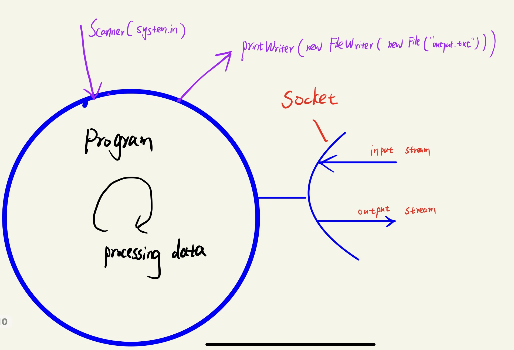
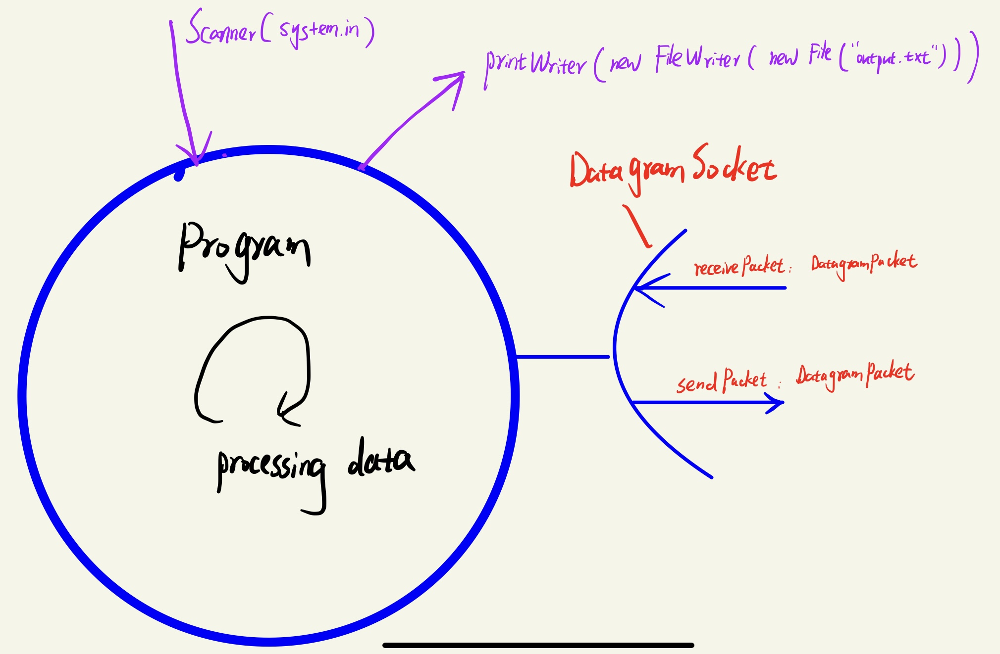

:computer: [尚硅谷: 网络编程 618-633 (629-633 revision)](https://www.bilibili.com/video/BV1Kb411W75N?p=620&vd_source=c6866d088ad067762877e4b6b23ab9df)

---

更多网络编程细节在Java Web基础

# 1. 网络编程概述
Java是 Internet 上的语言，它从语言级上提供了对网络应用程
序的支持，程序员能够很容易开发常见的网络应用程序。

Java提供的网络类库，可以实现无痛的网络连接，联网的底层 细节被隐藏在 Java 的本机安装系统里，由 JVM 进行控制。并 且 Java 实现了一个跨平台的网络库，程序员面对的是一个统一 的网络编程环境。


网络编程的目的:  
+ 直接或间接地通过网络协议与其它计算机实现数据交换，进行通讯。

网络编程中的两个主要问题:
+ 如何准确地定位网络上一台或多台主机 - IP;定位主机上的特定的应用 - port
+ 找到主机后如何可靠高效地进行数据传输 - internet communication protocol
  + OSI model vs. TCP/IP model(实际上广为应用)


# Par1. 网络通信要素概述


## 3. 通信要素1: IP, port
### 3.1 IP
619

IP address: `InetAddress`

+ uniquely identify a host on the internet
+ 本地回环地址(hostAddress): 127.0.0.1  主机名(hostName): localHost
+ IP地址分类方式1: **IPV4**, **IPV6**
  + IPV4: 4 bytes, 4个0-255. 以点分十进制表示. 2011年初已用尽.
    + e.g. 192.168.0.1
  + IPV6: 16 bytes, 写成8个无符号整数, 每个整数用4个hexdeciaml number表示. 整数之间用':'分隔 
    + e.g. 3ffe:3201:1401:1280:c8ff:fe4d:db39:1984
+ IP地址分类方式2: **公网地址(万维网使用)**, **私有地址(局域网使用)**


---

Java中的`InetAddress` class:

```java
实例化InetAddress (注意这里不是用new): getByName(String host), getLocalHost()
			InetAddress对象的两个常用方法: getHostName() / getHostAddress()
```


### 3.2 port
620

端口号标识正在计算机上运行的进程(程序), 

+ 不同的进程有不同的端口号 (同一host上两个进程用一个port number会造成port conflict), 被规定为一个 16 位的整数 0~65535。

端口分类:
+ **公认端口**: 0~1023。被预先定义的服务通信占用(如:HTTP占用端口 80，FTP占用端口21，Telnet占用端口23)
+ **注册端口**: 1024~49151。分配给用户进程或应用程序。(如:Tomcat占 用端口8080，MySQL占用端口3306，Oracle占用端口1521等)。
+ **动态/私有端口:** 49152~65535。


端口号与IP地址的组合得出一个网络套接字: **Socket**


## 4. 通信要素2: protocol

621

TCP/IP 协议簇: 实用角度 physical layer  -->  data link layer --> Network Layer --> transport layer --> application layer

其中Transport layer 的两种重要protocol:

+ TCP: 可靠
  + 使用TCP协议前, 必须先建立TCP connect, 形成数据传输通道
  + TCP connect的建立: **3-way handshake**, reliable for point-to-point communication
  + TCP协议进行通信的两个应用进程: 客户端(client side), 服务端(server side)
  + 在连接中可进行大数据量的传输
  + 传输完毕, 需要release connect, 效率低 
    + Release connection: **四次挥手**
      + 一般由客户端发起四次挥手的第一次挥手
+ UDP: 快
  + 将数据, source, destnation封装成数据包, no need for connection
  + 每个数据包的大小限制在64k内
  + 发送不管对方是否准备好, 接收方收到也不会确认, not reliable
  + 可以broadcasting
  + 发送数据结束时无需释放资源, cheap & fast


# Part2. 网络编程

## 5. :full_moon: TCP网络编程

622-625


### TCP总结

参考上个章节中I/O stream的操作, 这里把Server - Client 通讯也看做是I/O 操作, 依然分为3大步:

1. Step1: 建立 本程序 (呈现为program的socket) 和 其他数据源 (socket)的信息交流渠道 (I/O stream). 这步想象成连接管道和物料池. 分为几个小步骤:

   + step 1.1: Socket实例化. 这里相当于做出物料池的入口

     ```java
     // Server端, 涉及到转接request的 liseningSocket 和 真正处理request的clientSocket
     // liseningSocket应该一直存在, 而clientSocket则是需要时才被创建 (尤其是多线程的情况下)
     ServerSocket listeningSocket = null;
     Socket clientSocket = null;
     
     listeningSocket = new ServerSocket(4444);
     // listeningSokcet 转接 incoming request到clientSocket上 (底层是 3-way handshake )
     clientSocket = listeningSocket.accept(); // This method will block until a connection request is received
     ```

     ```java
     // Client端实例Socket, 只需要指明要通讯的Server的IP 与 port即可
     socket = new Socket("localhost", 4444);
     ```

   + step 1.2: 为socket intance提供 I/O stream. 这里相当于用管道连接两个物料池的入口 

     + 涉及各种I/O stream 的套接, 一般我们用缓冲流里面套转换流里面套Socket提供的字节流

       ```java
       BufferedReader in = new BufferedReader(new InputStreamReader(clientSocket.getInputStream()));
       BufferedWriter out = new BufferedWriter(new OutputStreamWriter(clientSocket.getOutputStream()));
       ```

2. Step2: communicate: R&W. 想象为管道.出料, 也是业务操作所在. 

   + ```java
     // 调用 I/O stream的 read()/write(), 即开始真正的通讯了
     clientMsg = in.readLine()
     out.write("Server Ack " + clientMsg + "\n");
     ```

3. Step3: close resources (socket + I/O stream) for communication

   + 一般, 后创建的resources先关闭

   + 要确保step1, step2即使出现了Exceptions, resources也可以被关闭掉, 避免资源浪费. 因此常常需要try-catch-finally block, 将close的操作放在finally block中

   + 用来register server的ServerSocket一般不需要关闭, 但是ServerSocket接听到Client request转接Client到的socket需要关闭


其中step1,step3比较mechanical,主要是reources的分配连接以及关闭,   step2是集中业务代码所在

:bangbang:上面 有些步骤往往是被包在while( ) loop里， 因为Server需要处理源源不断的request, Client side也应该能够一直发送请求. 具体看需求决定哪些步骤包在while() 里

:bangbang: Server 要先起来, Client才能向Server发送请求


Program的通讯模型:

+ 一个Program上可以有多个socket, 用来和其他在internet上的program进行end-to-end communication
+ 除了socket, 一个Program上还可以有别的Stream来接入, 用来进行在本地的输入输出 e.g. 键盘的输入指令， 将程序内的数据输出到本地的文件里去
+ 只要是进入了Program的数据一视同仁, 都可以被操作和处理




### :gem: Demo0: UniMelb demo

SimpleServer: 只处理1个request就dead了

```java
// SimpleServer.java: a simple server program
import java.net.*;
import java.io.*;
public class SimpleServer {
  public static void main(String args[]) throws IOException {
    // step1: Register service on port 1234
    ServerSocket s = new ServerSocket(1234);
    
    // step2: 
    // step2.1 Wait and accept a connection
    Socket s1=s.accept(); 
    
    // step2.2 Get a communication stream associated with the socket
    OutputStream s1out = s1.getOutputStream();
    DataOutputStream dos = new DataOutputStream (s1out);
    
    // step2.3 implement communication 
    dos.writeUTF("Hi there");
    
    // step3: Close the connection, but not the server socket
    dos.close();
    s1out.close();
    s1.close();
  }
}
```


SimpleServerLoop 处理源源不断的request

```java
// SimpleServerLoop.java: a simple server program that runs forever in a single thead
import java.net.*;
import java.io.*;
public class SimpleServerLoop {
  public static void main(String args[]) throws IOException {
    // step1.1: Register service on port 1234
    ServerSocket s = new ServerSocket(1234);
    
    while(true)
    {
      // step1.1 
   	 Socket s1=s.accept(); // Wait and accept a connection
      
      // step1.2
    	// Get a communication stream associated with the socket
    	OutputStream s1out = s1.getOutputStream();
    	DataOutputStream dos = new DataOutputStream (s1out);
      
      // step2
    	// Send a string!
    	dos.writeUTF("Hi there");
    	// Close the connection, but not the server socket
      
      // step3 
      dos.close();
      s1out.close();
      s1.close();
    }
  }
}
```


SimpleClient

```java
// SimpleClient.java: a simple client program
import java.net.*;
import java.io.*;
public class SimpleClient {
  public static void main(String args[]) throws IOException {
    // step1.1: Open your connection to a server, at port 1234
    Socket s1 = new Socket(“clouds.cis.unimelb.edu.au",1234);
                           
    // step1.2 Get an input file handle from the socket and read the input
    InputStream s1In = s1.getInputStream();
    DataInputStream dis = new DataInputStream(s1In);
    
    // step2 communicate                 
    String st = new String (dis.readUTF());
    System.out.println(st);
                           
    // step3: When done, just close the connection and exit
    dis.close();
    s1In.close();
    s1.close();
  }
}
```


### :gem: Demo1: TCPTest1

client side send a message to server side, server side show the message


### :gem: Demo2: TCPTest2

客户端发送文件给服务端, 服务端将文件保存在本地


至少需要4个stream:

Client side:

+ socket的OutputStream
+ 本地的InputStream

Server side:

+ socket的InputStream
+ 本地的OutputStream


Client > -------socket------- < Server

​	:arrow_up:						 				:arrow_down:

​    file						 				file


### :gem: Demo3:  TCPTest3

从客户端发送文件给服务端, 服务端保存到本地, 并返回"发送成功"给客户端, 并关闭相应的连接

+ 阻塞式方法


### :gem: Demo4: Interactive Server & client

UniMelb的demo


### TomCat

625

客户端 --- 服务端

+ 客户端:

  + 自定义客户端(e.g. 微信, QQ)

  + 浏览器

+ 服务端:

  + 自定义服务端

  + 现成的TomCat服务器


#### :gem: Demo1: 

康师傅展示通过浏览器(客户端)来访问TomCat(服务端)的资源; 更多细节见Java Web, 这里不展示代码了

+ 通过terminal启动TomCat
+ 通过URL: localhost:8080/examples/hello.txt 来访问TomCat资源 


## 6. :moon: UDP网络编程

626

+ UDP数据报通过 `DatagramSocket` 为载体进行发送和接收，系统不保证 UDP数据报一定能够安全送到目的地，也不能确定什么时候可以抵达
+ `DatagramPacket` 对象封装了UDP数据包，在datagram packet中包含了发送端的IP 地址和端口号以及接收端的IP地址和端口号
  + UDP协议中每个数据报都给出了完整的地址信息，因此无须建立发送方和 接收方的连接. 如同发快递包裹一样. 比TCP的接收过程要简单许多


### UDP 总结

Sender --- Receiver

:bangbang: 相比TCP, 采用UDP时 进行通讯时 接收与发送 不需要I/O Stream, 数据以DataPacket为载体,   因此关闭资源时只需要关闭 DatagramSocket. 不过当然你可以在程序内使用stream进行用户输入,

虽然在和外界的处在internet上的program进行通讯时不需要使用到I/O stream, 这里我们还是分为3步 (把大象放进冰箱也分3步):

1. Step1: 启动通讯所需要的资源
2. Step2: 进行通讯
3. Step3: 关闭通讯所启动的资源

```java
sender{
  // step1: instantiate DatagramSocket
  
  // step2: communicate via DataPacket
    // step2.1: 封装数据包(encoding): readable ---> btye[]
    // step2.2: send
  
  // step3: close resource
}

receiver{
  // step1: instantiate DatagramSocket
  
  // step2: communicate via DataPacket
    // step2.1: receive
    // step2.2: 解封数据包(decoding):  byte[] ---> Readable
    // step2.3: reply if necessary
  
  // step3: close DatagramSocket
}
```


UDP 通讯模型




### :gem: Demo from UniMelb

UDPServer: 处理源源不断的request

```java
import java.net.InetAddress;
import java.net.DatagramPacket;
import java.net.DatagramSocket;
import java.net.SocketException;
import java.io.IOException;

public class udpServer {
	
	public static void main(String args[]) {
    // step1 -------------------------------------------------------------------------------
		DatagramSocket serverSocket = null;
	
		try
		{	
      // step2: Communication --------------------------------------------------------------
			// prepare for communication
		  serverSocket = new DatagramSocket(9884);
      byte[] receiveData = new byte[1024];
      byte[] sendData = new byte[1024];

      // Listen for incoming connections forever
      while(true){
    		  System.out.println("This is  UDP server- Waiting for data to recieve");
    		    
    		  // 2.1 Receive: Create a receive Datagram packet and receive through socket
          DatagramPacket receivePacket = new DatagramPacket(receiveData, receiveData.length);
          serverSocket.receive(receivePacket);
					
        	// 2.2 拆包
          String receivesentence = new String( receivePacket.getData());
        	 
          String sendSentence= "This is Server, I recieved from client- ";
          sendSentence += receivesentence;
          System.out.println(" Server Data: " + sendSentence);

          // 2.3 Reply: Get client attributes from the received data 
          InetAddress IPAddress = receivePacket.getAddress();
          int port = receivePacket.getPort();
          String capitalizedSentence = sendSentence.toUpperCase();
          sendData = capitalizedSentence.getBytes();

          // Create a send Datagram packet and send through socket
          DatagramPacket sendPacket = new DatagramPacket(sendData, sendData.length, IPAddress, port);
          serverSocket.send(sendPacket);
      }
      
		}
		catch(SocketException e){
			System.out.println("Socket: " + e.getMessage());
			
		}catch(IOException e){
			System.out.println("Socket: " + e.getMessage());
			
		}finally {
      
      // step3: close resources ----------------------------------------------------------
			if(serverSocket != null) 
				serverSocket.close();
		}

    }
}

```


UDPClient

```java
import java.io.BufferedReader;
import java.io.IOException;
import java.io.InputStreamReader;
import java.net.InetAddress;
import java.net.SocketException;
import java.net.DatagramPacket;
import java.net.DatagramSocket;


public class UDPClient {
	
	public static void main(String args[]) {
		// step1: 
		DatagramSocket clientSocket = null;
		  
		try
		{
			  
      System.out.println("This is UDP Client- Enter some text to send to the UDP server");
      BufferedReader inFromUser = new BufferedReader(new InputStreamReader(System.in));

      // Create a UDP socket object
      clientSocket = new DatagramSocket();
      //IP and port for socket
      InetAddress IPAddress = InetAddress.getByName("localhost");
      int port = 9884;

      // As UDP Datagrams are bounded by fixed message boundaries, define the length
      byte[] sendData = new byte[1024];
      byte[] receiveData = new byte[1024];

      String sentence = inFromUser.readLine();
      sendData = sentence.getBytes();

      // Create a send Datagram packet and send through socket
      DatagramPacket sendPacket = new DatagramPacket(sendData, sendData.length, IPAddress, port);
      clientSocket.send(sendPacket);

      // Response: Create a receive Datagram packet and receive through socket 
      DatagramPacket receivePacket = new DatagramPacket(receiveData, receiveData.length);
      clientSocket.receive(receivePacket);
      String modifiedSentence = new String(receivePacket.getData());
      System.out.println("This is client,  SERVER SENT: " + modifiedSentence);
      
      //Close the Socket
      clientSocket.close();
		  
		}catch(SocketException e){
      System.out.println("Socket: " + e.getMessage());

    }catch(IOException e)
    {
      System.out.println("Socket: " + e.getMessage());

    }finally {
      // step3: close resources
      if(clientSocket != null) 
        clientSocket.close();

    }
 }
}

```


### :gem: Demo1: UDPTest1


## 7. :moon: URL编程

627-628

**URL(Uniform Resource Locator)**:统一资源定位符，它表示 Internet 上某一 资源的地址

+ 它是一种具体的URI，即URL可以用来标识一个资源，而且还指明了如何locate 这个资源
+ 通过 URL 我们可以访问 Internet 上的各种网络资源，比如最常见的 www，ftp 站点。浏览器通过解析给定的 URL 可以在网络上查找相应的文件或其他资源。


URL的基本结构由5部分组成:

```bash
<传输协议>://<主机名>:<端口号>/<文件名>#片段名?参数列表
e.g.
http://192.168.1.100:8080/helloworld/index.jsp#a?username=shkstart&password=123

#片段名:即锚点，例如看小说，直接定位到章节
?参数列表格式:参数名=参数值&参数名=参数值....
```


### :gem: Demo1: 


康师傅演示如何通过URL对象来下载其对应的网络上的资源


# Revision

之后刷Java Web