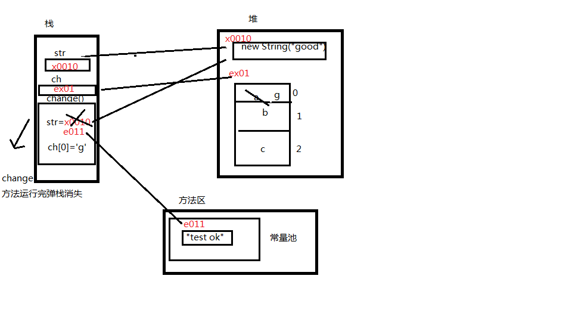

牛客网刷题

# Java basics

[1. Java String对象和array的区别](https://www.nowcoder.com/questionTerminal/ea89183b5d5349f7ac6a11da2308d935)
+ String和array在java中都属于object type, 按引用传递: 
  + Java的真正的对象是存在堆中的, 运行时的对象变量只是取真正对象的引用(地址)
+ 函数运行时, 在栈中单独创建副本和形参来运算
+ 根本的原因就是 由于java字符串对象是不能修改的，无法像数组一样可以在原来的地址上对数组的值进行修改。

+ 类似解释见笔记[JavaCore1 chap4 4.5.1](../javaCore/chap4/README.md)

[2. Switch 支持类型](https://www.nowcoder.com/questionTerminal/0759a1dea0e94804963557e60d1c699b)

# OOB

[1. final modifier](https://www.nowcoder.com/questionTerminal/60f59a1944f34da0a0daaac3eb7f0af7)

# Java Sets
[1. Collection](https://www.nowcoder.com/questionTerminal/03162f63b91545a6ac4cbd9c51cfadee)

# JVM

