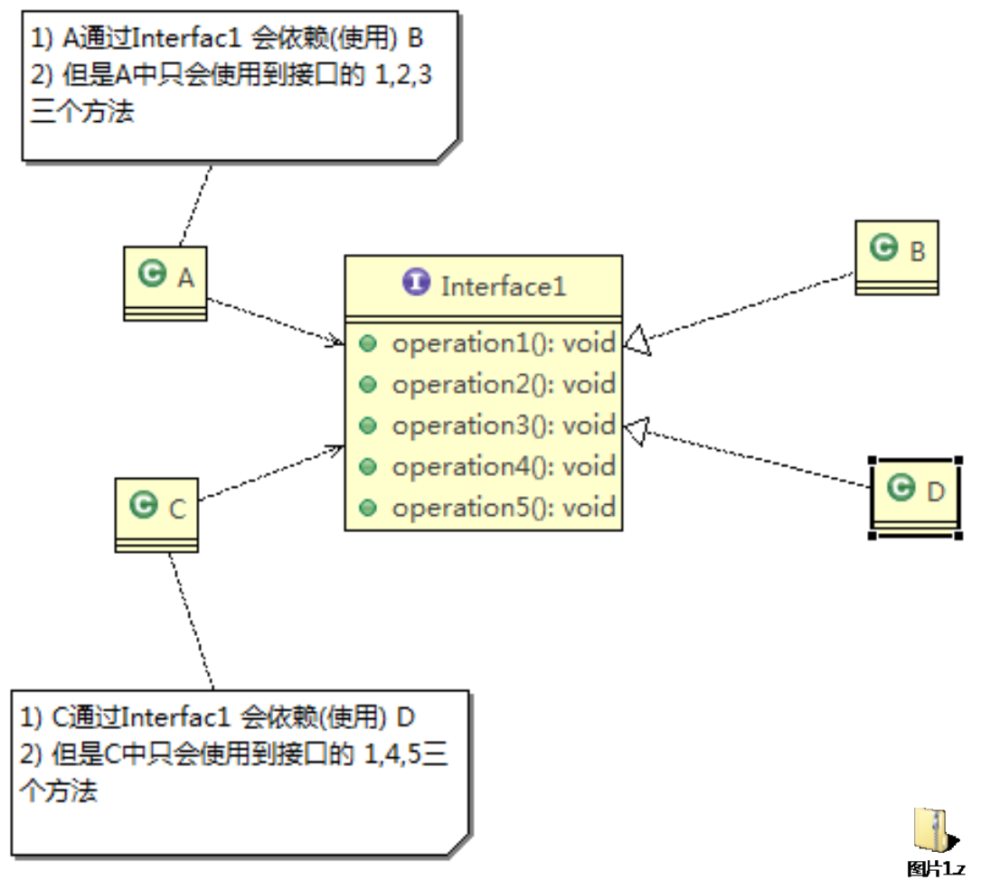
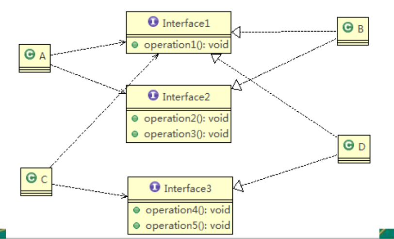
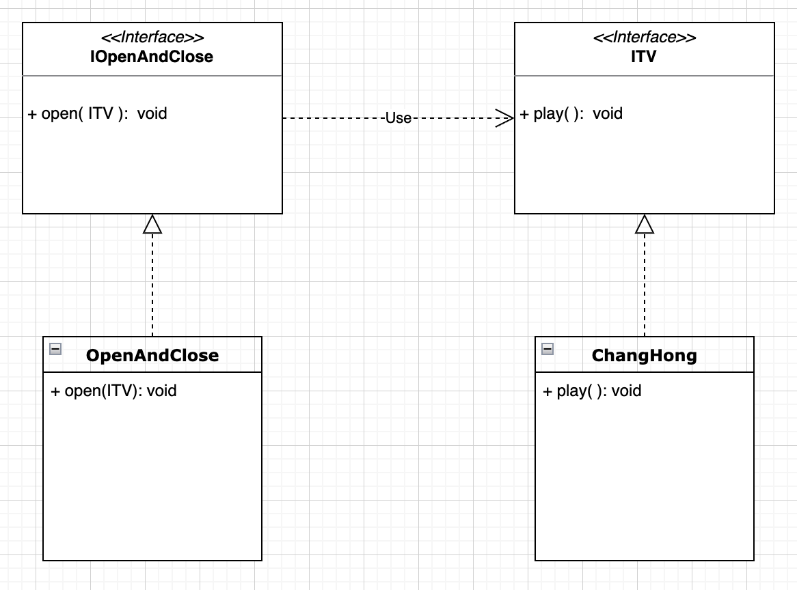
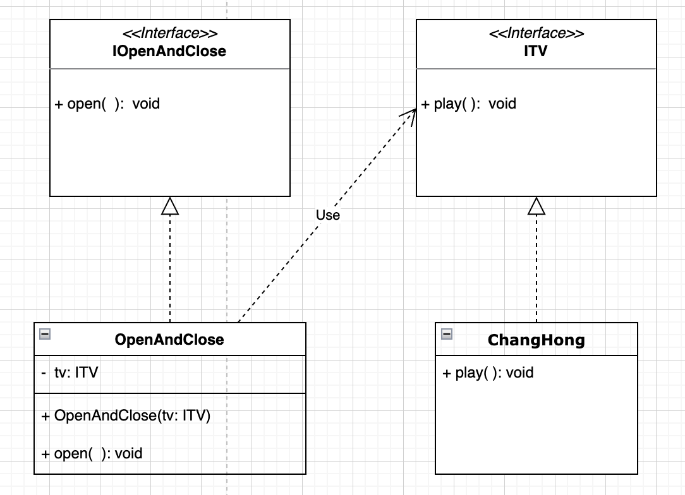
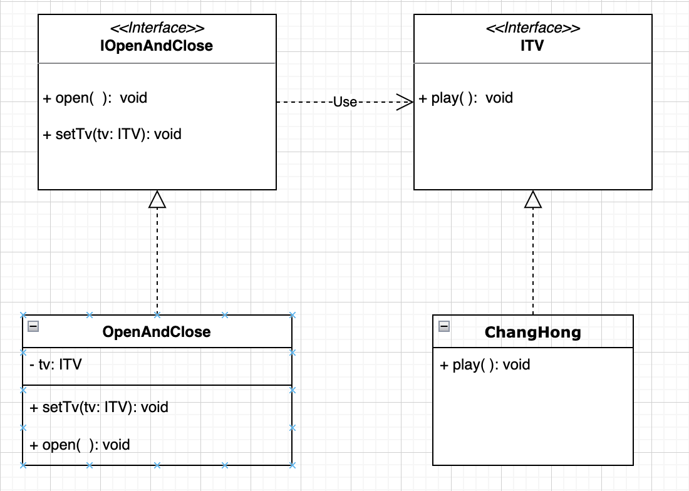

设计模式中的七大设计原则
05-22

# 1. 七大设计原则概述

设计模式的目的:
编写软件过程中，程序员面临着来自 耦合性，内聚性以及可维护性，可扩展性，重用性，灵活性 等多方面的挑战，设计模式是为了让程序(软件)，具有更好的

+ 代码重用性 
   + 相同功能的代码，不用多次编写
+ 可读性
  + 编程规范性,便于其他程序员的阅读和理解
+ 可扩展性 
  + 当需要增加新的功能时，非常的方便，称为可维护
+ 可靠性 
  + 当我们增加新的功能后，对原来的功能没有影响
+ 根本目的是最终使程序呈现**高内聚，低耦合**的特性

SOLID 原则


# 2. 设计模式七大原则

七大原则作为23种设计模式的指导思想


## 2.1 单一职责原则 (Single Responsibility Principle)
06-07

对类来说的，即一个类应该只负责一项职责。如类A负责两个不同职责:职责1，职责2。 当职责1需求变更而改变A时，可能造成职责2执行错误，所以需要将类A的粒度分解为 A1，A2


### case study

方式一 不遵守单一职责原则

```java
public class SingleResponsibility1 {
    public static void main(String[] args) {
        Vehicle vehicle = new Vehicle();
        vehicle.run("motor cycle");
        vehicle.run("car");

        vehicle.run("plane");
    }
}

// 交通工具类
// 方式一:
// 1. 在方式一的run()方法中, 违反了单一职责原则
// 2. 解决方案: 根据交通工具运行的方式不同, 将Vehicle分解为不同的类
class Vehicle{
    public void run(String vehicle){
        System.out.println(vehicle + "runs on the road");
    }

}
```

方式二 严格遵守单一职责原则

```java
public class SingleResponsibility2 {

    public static void main(String[] args) {
        RoadVehicle roadVehicle = new RoadVehicle();
        roadVehicle.run("motor cycle");
        roadVehicle.run("car");

        AirVehicle airVehicle = new AirVehicle();
        airVehicle.run("plane");
    }
}

/**
 * 分析:
 * 方案二遵守了单一职责原则
 * 但是这样做的改动很大, 即需要将类分解, 同时修改客户端
 * 改进: 直接修改Vehicle类, 改动的代码比较少
 *
 */

class RoadVehicle{
    public void run(String vehicle){
        System.out.println(vehicle + " runs on the road");
    }
}


class AirVehicle{
    public void run(String vehicle){
        System.out.println(vehicle + " flies in the air");
    }
}

class WaterVehicle{
    public void run(String vehicle){
        System.out.println(vehicle + " runs on the water");
    }
}
```

方式三 部分遵守单一职责原则

```java
public class SingleResponsibility3 {
    public static void main(String[] args) {
        Vehicle2 vehicle2 = new Vehicle2();
        vehicle2.run("car");
        vehicle2.runAir("plane");
        vehicle2.runWater("ship");
    }
}

/**
 * 方式三的分析:
 * 1. 这种修改方法没有对原来的类做大的修改, 只是增加了方法
 * 2. 这里虽然没有在类的级别上遵守单一职责原则, 但是在方法级别上, 仍然是遵守了单一职责原则
 */

class Vehicle2{
    public void run(String vehicle){
        System.out.println(vehicle + "runs on the road");
    }

    public void runAir(String vehicle){
        System.out.println(vehicle + "runs in the air");
    }

    public void runWater(String vehicle){
        System.out.println(vehicle + "runs on the water");
    }
}
```


### 单一职责原则总结

1. 降低类的复杂度，一个类只负责一项职责。

2. 提高类的可读性，可维护性

3. 降低变更引起的风险

4. 通常情况下，我们应当遵守单一职责原则

   + 只有逻辑足够简单，才可以在代码级违反单一职责原则 (换句话说, 逻辑越是复杂的代码, 越应该遵守单一职责原则)

   + 只有类中方法数量足够少，可以在方法级别保持单一职责原则 (换句话说, 如果类中方法众多, 你还是得把这个类拆成好几个类来使得每个类中的方法足够少, 使其能够在方法级别保持单一职责原则.)


## 2.2 接口隔离原则 (Interface Segregation Principle)
08-10


客户端不应该依赖它不需要的接 口，**即一个类对另一个类的依赖(使用) 应该建立在最小的接口上**


### Case study

方式一: 不采用接口隔离原则



+ 类B, D实现了Interface1, 但它们其实没必要实现Interface1中的所有方法
+ 类A, C依赖Interface1
  + 间接地, 类A通过Interface1依赖类B
  + 间接地, 类C通过Interface1依赖类D

问题描述: 类A通过接口Interface1依赖类B, 类C通过 接口Interface1依赖类D, 如果接口 Interface1对于类A和类C来说不是最小接口,  那么类B和类D必须去实现他们不需要的方法, 这样就造成了不必要的redundency和耦合度

解决方案: 将接口Interface1拆分为独立的几个接口， 类A和类C分别与他们需要的接口建立依赖 关系。也就是采用接口隔离原则


上面UML类图对应代码:

```java
public class InterfaceSegregation1 {
    B b = new B();      // B implements Interface1
    A a = new A();      // A depends on B via Interface1, but only use method 1, 2, 3
    a.depend1(b);
    a.depend2(b);
    a.depend3(b);

    D d = new D();      // D implements Interface1
    C c = new C();      // C depends on B via Interface1, but only use method 1, 4, 5
    c.depend1(d);
    c.depend4(d);
    c.depend5(d);

}

interface Interface1{
    void operation1();
    void operation2();
    void operation3();
    void operation4();
    void operation5();
}

class B implements Interface1{
    public void operation1(){
        System.out.println("B implements operation1");
    };
    public void operation2(){
        System.out.println("B implements operation2");
    };
    public void operation3(){
        System.out.println("B implements operation3");
    };
    public void operation4(){
        System.out.println("B implements operation4");
    };
    public void operation5(){
        System.out.println("B implements operation5");
    };
}

class D implements Interface1{
    public void operation1(){
        System.out.println("D implements operation1");
    };
    public void operation2(){
        System.out.println("D implements operation2");
    };
    public void operation3(){
        System.out.println("D implements operation3");
    };
    public void operation4(){
        System.out.println("D implements operation4");
    };
    public void operation5(){
        System.out.println("D implements operation5");
    };
}

/**
 * A 类通过Interface1 依赖（使用）B类, 但是只会使用到1,2,3 方法
 */
class A {
  // 多态： i是实现了Interface1的类的实例
    public void depend1(Interface1 i){
        i.operation1();
    }

    public void depend2(Interface1 i){
        i.operation2();
    }

    public void depend3(Interface1 i){
        i.operation3();
    }
}

/**
 * C类通过Interface1 依赖（使用）D类, 但是只会使用到1,4,5 方法
 */
class C {
    public void depend1(Interface1 i){
        i.operation1();
    }

    public void depend4(Interface1 i){
        i.operation4();
    }

    public void depend5(Interface1 i){
        i.operation5();
    }
}
```


方式二: 采用接口隔离原则




上面的UML类图对应的代码

```java
public class InterfaceSegregation2 {
    public static void main(String[] args) {

        A a = new A();      // A depends on B via Interface1, 2, but only use method 1, 2, 3
        a.depend1(new B()); // 体现A类通过接口依赖(使用)类B
        a.depend2(new B());
        a.depend3(new B());
        
        C c = new C();      // C depends on B via Interface1, 3, but only use method 1, 4, 5
        c.depend1(new D()); 
        c.depend4(new D());
        c.depend5(new D());
    }

}


interface Interface1{
    void operation1();
}

interface Interface2{
    void operation2();
    void operation3();
}

interface Interface3{
    void operation4();
    void operation5();
}

class B implements  Interface1, Interface2{
    public void operation1(){
        System.out.println("B implements operation1");
    };
    public void operation2(){
        System.out.println("B implements operation2");
    };
    public void operation3(){
        System.out.println("B implements operation3");
    };

}


class D implements Interface1, Interface3{
    public void operation1(){
        System.out.println("D implements operation1");
    };
    public void operation4(){
        System.out.println("D implements operation4");
    };
    public void operation5(){
        System.out.println("D implements operation5");
    };
}


class A {
    public void depend1(Interface1 i){
        i.operation1();
    }

    public void depend2(Interface2 i){
        i.operation2();
    }

    public void depend3(Interface2 i){
        i.operation3();
    }
}


class C {
    public void depend1(Interface1 i){
        i.operation1();
    }

    public void depend4(Interface3 i){
        i.operation4();
    }

    public void depend5(Interface3 i){
        i.operation5();
    }
}
```


## 2.3 依赖倒转原则 (Dependency Inversion Principle)
11-13

依赖倒转原则(Dependence Inversion Principle)是指:

1. 高层模块(指抽象类或接口, 画UML类图时一般它们在顶部)不应该依赖低层模块(指底层实现类)，二者都应该依赖其抽象
2. 抽象不应该依赖细节，细节应该依赖抽象
3. **依赖倒转(倒置)的中心思想是面向接口编程**
4. 依赖倒转原则是基于这样的设计理念:  相对于细节的多变性，抽象的东西要稳定的多。以抽象为基础搭建的架构比以细节为基础的架构要稳定的多。**在java中，抽象 指的是接口或抽象类，细节就是具体的实现类**
5. 使用接口或抽象类的目的是制定好规范，而不涉及任何具体的操作，把展现细节的 任务交给他们的实现类去完成


### 2.3.1 Case study

方式一: 不实用依赖倒转原则

```java
public class DependencyInversion {
    public static void main(String[] args) {
        Person p = new Person();
        p.receive(new Email());
    }

}

class Email{
    public String getInfo(){
        return "email info: hello world!";
    }
}

// 完成Person接收消息的功能
// 方式一:
// 1. 优点: 简单容易想到
// 2. 缺点: 如果我们获取的对象是微信, 短信等, 则新增类, 同时Person也要增加相应的接收方法 (需要重载receive()方法比较麻烦)
//  解决思路: 引入一个抽象的接口 IReceiver, 表示接收者, 这样Person类与接口发生依赖
//  这时因为Email, 微信都属于接收的范围, 则他们各自实现IReceiver接口就ok, 这样就符合依赖倒转原则
class Person{
    public void receive(Email email){
        System.out.println(email.getInfo());
    }
}
```


方式二: 使用依赖倒转原则


```java
public class DependencyInversion2 {
    public static void main(String[] args) {
        // 客户端(指Person)无需改变
        Person p = new Person();
        p.receive(new Email());

        p.receive(new Wechat());
    }
}

/**
 * 定义抽象: 接口
 */
interface IReceiver{
    public String getInfo();
}

// 定义细节: 实现类
class Email implements IReceiver{
    public String getInfo(){
        return "email info: hello world!";
    }
}

class Wechat implements IReceiver{
    @Override
    public String getInfo() {
        return "wechat info: hello wechat!";
    }
}

// 完成Person接收消息的功能
// 方式二:
class Person{
    public void receive(IReceiver receiver){
        System.out.println(receiver.getInfo());
    }
}
```


### 2.3.2 :full_moon: 依赖关系传递的三种方式与案例

Case: 通过开关(抽象)打开电视(抽象) . 

以下三种方式在使用时, 对外体现的都是开关(具体)打开电视机(具体), 或者说开关(具体)使用 or 依赖电视机(具体); 这是就是依赖传递, 即两个并没有直接依赖的类通过依赖传递而发生依赖关系了

方式一: 通过接口传递

```java
public class DependencyPass {

	public static void main(String[] args) {
		// TODO Auto-generated method stub
		// 方式一: 通过接口传递依赖
		ChangHong changHong = new ChangHong();
		OpenAndClose openAndClose = new OpenAndClose();
		openAndClose.open(changHong);
	}
}

// 方式1: 通过接口传递实现依赖 --------------------------------------
// 抽象: 开关的接口, 定义开关的抽象行为 -- 打开一个电视
interface IOpenAndClose {
 		void open(ITV tv); //抽象方法, 接收ITV接口的实现类的实例
}

// 具体: 实现开关接口, 具体定义开关的行为
class OpenAndClose implements IOpenAndClose{
  public void open(ITV tv){
    tv.play();
  }
}

// 抽象: 电视的接口, 定义电视的抽象行为 -- 播放
interface ITV { 
 		void play();
}

// 具体: 实现电视的接口 --> 长虹电视机, 具体定义TV的行为
class ChangHong implements ITV {
  @Override
  public void play() {
    System.out.println("changhong TV is opened");
  }
}


```

对应UML类图如下, 此时如果ITV下有另一个实现类比如 Haier电视, 那么OpenAndClose通过interface也可以间接地依赖(使用)Haier电视, 这就体现了interface作为依赖传递的媒介的作用, 可以极大地提升扩展性. 或者可以认为, 如果接口A依赖接口B, 那么接口A的实现类也可以依赖(使用)接口B的实现类




方式二: 构造方法传递

```java
public class DependencyPass {
  
	public static void main(String[] args) {
		// 方式二: 通过构造器进行依赖传递
		ChangHong changHong = new ChangHong();
		OpenAndClose openAndClose = new OpenAndClose(changHong);
		openAndClose.open();
	}
}

// 方式2: 通过构造方法依赖传递 -----------------------------------
// 抽象: 开关的接口, 定义开关的抽象行为 -- 打开一个电视
interface IOpenAndClose {
  public void open(); //抽象方法
}

// 具体: 实现开关接口, 具体定义开关的行为
class OpenAndClose implements IOpenAndClose{
  private ITV tv; // 成员
  public OpenAndClose(ITV tv){ // 构造器
    this.tv = tv;
  }
  public void open(){
    this.tv.play();
  }
}

// 抽象: 电视的接口, 定义电视的抽象行为 -- 播放
interface ITV { 
  public void play();
}

// 具体: 实现电视的接口 --> 长虹电视机, 具体定义TV的行为
class ChangHong implements ITV {
  @Override
  public void play() {
    System.out.println("changhong TV is opened");
  }
}
```




方式三: setter方式传递

```java
public class DependencyPass {

	public static void main(String[] args) {
    
		// 方法三: 通过setter方法进行依赖传递
		ChangHong changHong = new ChangHong();
		OpenAndClose openAndClose = new OpenAndClose();
		openAndClose.setTv(changHong);
		openAndClose.open();
	}
}

// 方式3: 通过setter方法传递 --------------------------------------
// 抽象: 开关的接口, 定义开关的抽象行为 -- 打开一个电视
interface IOpenAndClose {
  public void open(); // 抽象方法

  public void setTv(ITV tv);
}

// 具体: 实现开关接口, 具体定义开关的行为
class OpenAndClose implements IOpenAndClose {
  private ITV tv;

  public void setTv(ITV tv) {
    this.tv = tv;
  }

  public void open() {
    this.tv.play();
  }
}

// 抽象: 电视的接口, 定义电视的抽象行为 -- 播放
interface ITV { 
  public void play();
}

// 具体: 实现电视的接口 --> 长虹电视机, 具体定义TV的行为
class ChangHong implements ITV {
  @Override
  public void play() {
    System.out.println("changhong TV is opened");
  }
}
```




### 2.3.3 总结

依赖倒转原则的注意事项和细节

1. 低层模块尽量都要有抽象类或接口，或者两者都有，程序稳定性更好.
2. 变量的声明类型尽量是抽象类或接口, 这样我们的变量引用和实际对象间，就存在一个缓冲层，利于程序扩展和优化. 

```java
// e.g.
List<Integer> list = new ArrayList<Integer>();
```

3. 继承时遵循里氏替换原则


## 2.4 里氏替换原则 (Liskov Substitution Principle)
14-15

该看这个了


## 2.5 开闭原则 (Open Close Principle)
16-18


## 2.6 迪米特原则 (Demeter Principle)
19-21


## 2.7 合成复用原则 (Composite Reuse Principle)
22