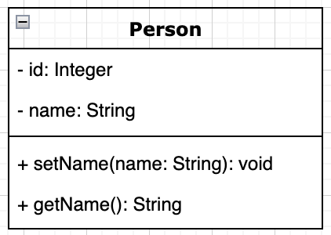
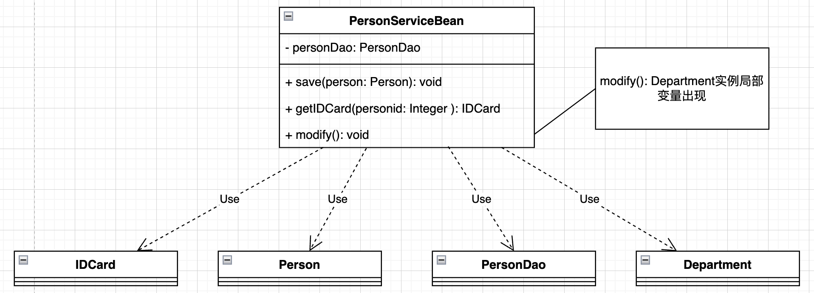
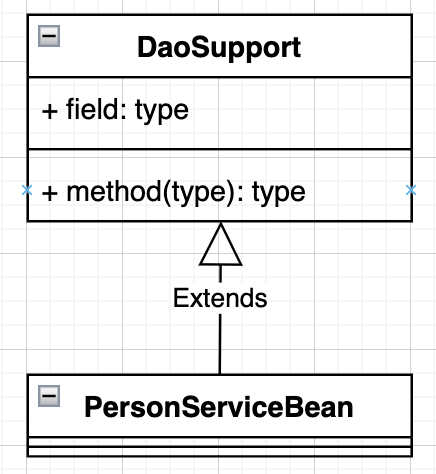
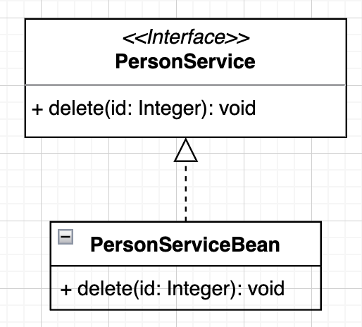
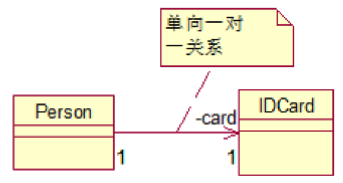
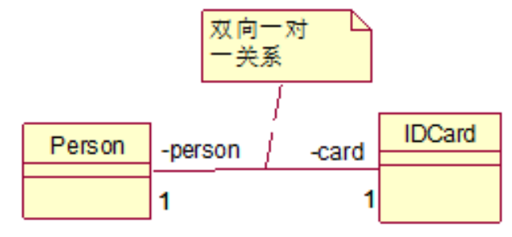
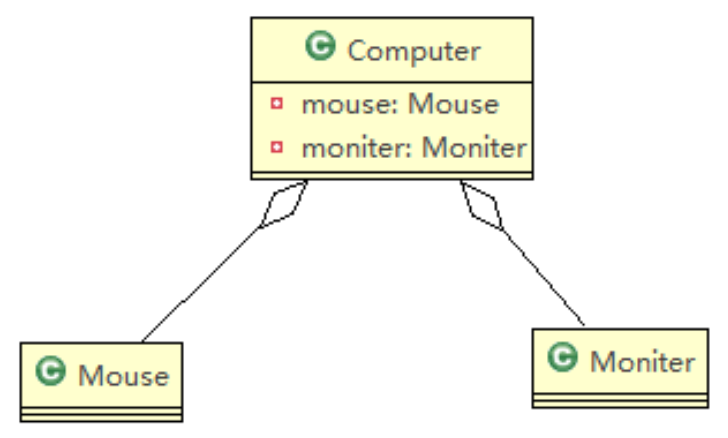
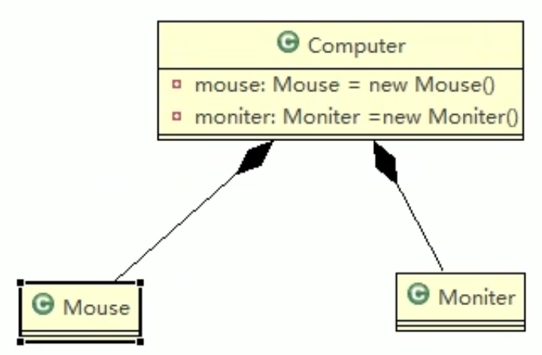
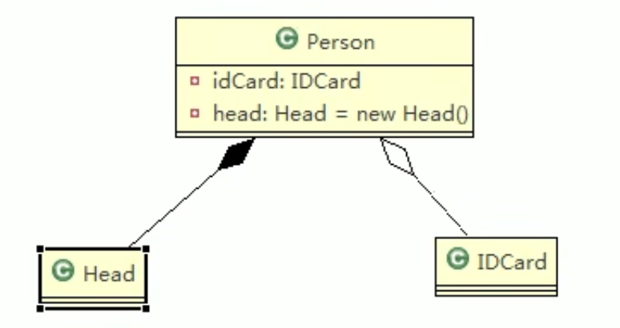

UML

23-27


# 1. UML基本介绍

(1) UML——Unified modeling language UML(统一建模语言)，是一种用于软件系统分析和设计的语言工具，它用于帮助软件开发人员进行思考和记录思路的结果 

(2) UML本身是一套符号的规定，就像数学 符号和化学符号一样，这些符号用于描述软件模型中的各个元素和他们之间的 关系，比如类、接口、实现、泛化、依 赖、组合、聚合等，如下图:


(3) 使用UML来建模，常用的工具有 Rational Rose , 也可以使用一些插件来建模


Intellij 使用UML (需要Intellij Ultimate)

https://www.jetbrains.com/help/idea/class-diagram.html#analyze_graph

# 2. UML图分类

24

画UML图与写文章差不多，都是把自己的思想描述给别人看，关键在于思路和条理

UML图分类:

1) 用例图(use case)
2) 静态结构图:  ***类图***、对象图、包图、组件图、部署图
3) 动态行为图:  交互图(时序图与协作图)、状态图、活动图

说明:

1.  类图是描述类与类之间的关系的，是UML图中最核心的
2. 在讲解设计模式时，我们必然会使用类图，为了让学员们能够把设计模式学到 位，需要先给大家讲解类图


## 2.1 UML类图

用于描述系统中的类(对象)本身的组成和类(对象)之间的各种静态关系


类之间的6大关系: 

+ 依赖, 泛化(继承), 实现

+ 关联, 聚合, 组合


但本质上其实是1种: 依赖


:gem:  e.g.

```java
public class Person{ //代码形式->类图 
  private Integer id;
	private String name;
  
  public void setName(String name){
  	this.name=name;
  }
  
  public String getName(){
    return name;
  } 

}
```

对应类图




### 2.1.1 类的依赖, 泛化(继承)与实现

#### 依赖 (Dependency)

只要是在类中用到了对方，那么他们之间就存在依赖关系。如果没有对方，连编绎都通过不了。

```java
// 根据我们在Demeter Principle中讲到的:
// PersonServiceBean的直接朋友: PersonDao, IDCard, Person
// Department的实例作为局部变量存在, 是PersonServiceBean的陌生类
public class PersonServiceBean {
		private PersonDao personDao;
  
		public void save(Person person){
      
    } 
  
  	public IDCard getIDCard(Integer personid){
      
    }
  
		public void modify(){
    		Department department = new Department();
    } 
}

public class PersonDao{} 
public class IDCard{} 
public class Person{} 
public class Department{}
```



##### :moon: 依赖发生的情况:

1) 类中用到了对方
2) 如果是类的成员属性  ---> 直接朋友, 后面的关联, 聚合, 组合大部分属于这种
3) 如果是方法的返回类型  ---> 直接朋友
4) 是方法接收的参数类型 ---> 直接朋友
5) 方法中使用到


#### 泛化 (Generalization)

泛化关系实际上就是继承关系，是依赖关系的特例. 

如果类A继承了类B, 就说A和B之间存在泛化关系

```java
public abstract class DaoSupport{
		public void save(Object entity){
      
    }
		public void delete(Object id){
      
		}
}

public class PersonServiceBean extends Daosupport{ }
```




#### 实现 (Implementation)

实现关系实际上就是A类实现B接口，他是依赖关系的特例

```java
public interface PersonService {
		void delete(Interger id);
}

public class PersonServiceBean implements PersonService { 
  	public void delete(Interger id){
      System.out.println("delete...");
    }
}
```




### 2.1.2 类的关联, 聚合与组合

#### 关联 (Association)

关联关系实际上就是类与类之间的联系，他是依赖关系的特例

+ 关联具有导航性(方向性): 即双向关系或单向关系

+ 关系具有多重性:如“1”(表示有且仅有一个)，“0...”(表示0个或者多个)， “0，1”(表示0个或者一个)，“n...m”(表示n到 m个都可以),“m...*”(表示至少m 个)。

单向一对一关系

```java
public class Person{
  private IDCard card;
}

public class IDCard{
  
}
```



双向一对一关系

```java
public class Person{
  private IDCard card;
}

public class IDCard{
  private Person person;
}
```



#### 聚合 (Aggregation): 好聚好散

聚合关系(Aggregation)表示的是整体和部分的关系，**整体与部分可以分开**。聚合关系是关联关系的特例，所以他具有关联的导航性(是谁聚合了谁, 是把谁聚合到谁里面) 与多重性。如:一台电脑由键盘(keyboard)、显示器(monitor)，鼠标等组成;组成电脑的各个 配件是可以从电脑上分离出来的，使用带空心菱形的实线来表示:

```java
public class Computer{
  	private Mouse mouse;
  	private Monitor monitor;
  
  	public void setMouse(Mouse mouse){
      	this.mouse = mouse;
    }
  	public void setMonitor(Monitor monitor){
      	this.monitor = monitor;
    }
}
```




#### 组合 (Composition): 同生共死

组合关系:也是整体与部分的关系，**但是整体与部分不可以分开**

e.g.1

如果我们认为Mouse,Monitor和Computer是不可分离的，则升级为组合关系

```java
// 一旦Computer被new, 其内部的mouse与monitor也会被new
// 一旦Computer实例被删除, 其内部的mouse与monitor也会被删除
// Computer和它内部的组件是同生共死的
public class Computer{
  	private Mouse mouse = new Mouse();
  	private Monitor monitor = new Monitor();
}

```



e.g.2

Head 和 Person 就是组合关系 (Head 和 Person不可分离), IDCard 和 Person 就是聚合关系 (IDCard和Person可以分离)

```java
public class Person{
  	private IDCard card;
  	private Head head = new Head();
}

public class IDCard{}
public class Head{}
```




:bangbang: 体现组合关系, 不一定非得是在IDCard作为成员变量时new( ),  还有一种情况: 如果在程序中Person实体中定义了对IDCard进行**级联删除**，即删除Person时 连同IDCard一起删除，那么IDCard 和 Person 就是组合了.


#### :moon: Aggregation vs. Composition

In Unified Modeling Language (UML), aggregation and composition are two types of associations that represent relationships between classes, specifically "whole-part" relationships. They help in understanding the structure and organization of a system, by showing how objects or classes are composed or related to one another. Here are the main differences between aggregation and composition:

`Aggregation`:

- Aggregation is a weaker form of association, which represents a `"has-a"` relationship between classes or objects.
- In an aggregation relationship, the whole (parent) object can exist independently of its parts (child objects).
- :star: **The child objects can be shared between different parent objects.**
- :star: **If the parent object is destroyed or removed, the child objects can continue to exist independently.**
- In a UML diagram, aggregation is represented by a hollow diamond at the end of the association line connected to the whole (parent) class.


`Composition`:

- Composition is a stronger form of association, which represents a `"part-of"` relationship between classes or objects.
- In a composition relationship, the whole (parent) object has ownership and responsibility for the life cycle of its parts (child objects).
- :star: **The child objects are exclusive to the parent object and cannot be shared between different parent objects.**
- :star: **If the parent object is destroyed or removed, the child objects are also destroyed or removed.**
- In a UML diagram, composition is represented by a solid (filled) diamond at the end of the association line connected to the whole (parent) class.

In summary, the main difference between aggregation and composition lies in <u>the strength of the relationship</u> and <u>the life cycle of the related objects</u>. Aggregation implies a weaker, more flexible relationship, while composition implies a stronger, more dependent relationship between the whole and its parts.


