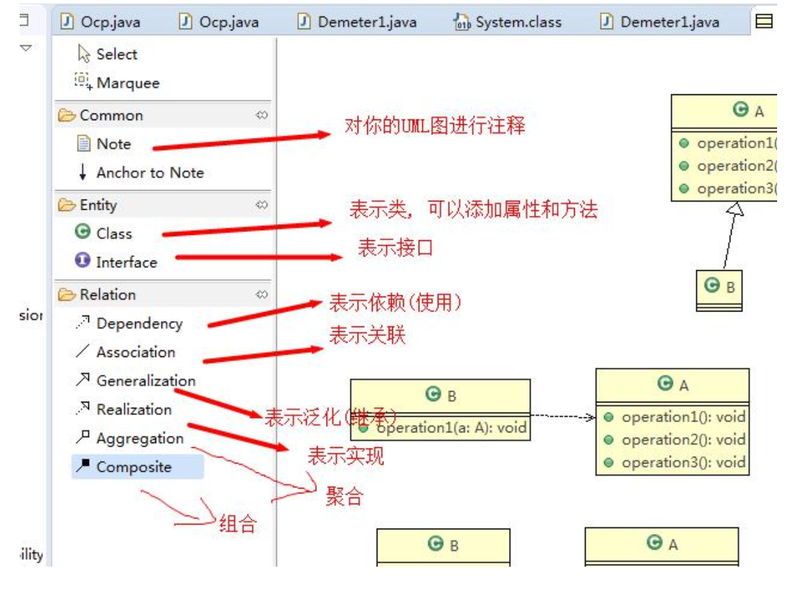

UML

23-27


# UML基本介绍

(1) UML——Unified modeling language UML(统一建模语言)，是一种用于软件系统分析和设计的语言工具，它用于帮助软件开发人员进行思考和记录思路的结果 


(2) UML本身是一套符号的规定，就像数学 符号和化学符号一样，这些符号用于描述软件模型中的各个元素和他们之间的 关系，比如类、接口、实现、泛化、依 赖、组合、聚合等，如下图:




(3) 使用UML来建模，常用的工具有 Rational Rose , 也可以使用一些插件来建模


Intellij 使用UML (需要Intellij Ultimate)

https://www.jetbrains.com/help/idea/class-diagram.html#analyze_graph


# UML图分类

24

画UML图与写文章差不多，都是把自己的思想描述给别人看，关键在于思路和条理


UML图分类:

1) 用例图(use case)
2) 静态结构图:  ***类图***、对象图、包图、组件图、部署图
3) 动态行为图:  交互图(时序图与协作图)、状态图、活动图


说明:

1.  类图是描述类与类之间的关系的，是UML图中最核心的
2. 在讲解设计模式时，我们必然会使用类图，为了让学员们能够把设计模式学到 位，需要先给大家讲解类图


## UML类图

用于描述系统中的类(对象)本身的组成和类(对象)之间的各种静态关系。


类之间的6大关系: 

+ 依赖, 泛化(继承), 实现

+ 关联, 聚合, 组合


:gem:  e.g.

```java
public class Person{ //代码形式->类图 
  private Integer id;
	private String name;
  
  public void setName(String name){
  	this.name=name;
  }
  
  public String getName(){
    return name;
  } 

}
```

对应类图


### 类的依赖, 泛化与实现

该看25了


### 类的关联, 聚合与组合


### 总结