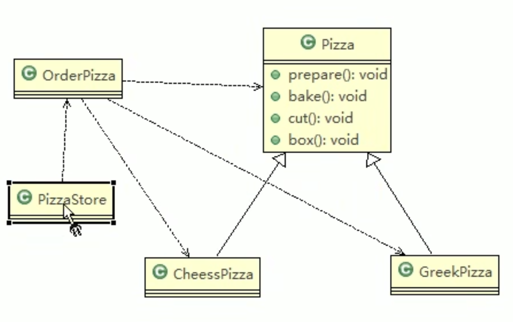

创建型模式: 如何创建对象


# 1. :full_moon: 单例模式 (Singleton)
28-38

所谓类的单例设计模式，就是采取一定的方法保证在整个的软件系统中，对某个类只能存在一个对象实例，并且该类只提供一个取得其对象实例的方法(静态方法)。

> 比如Hibernate的SessionFactory，它充当数据存储源的代理，并负责创建Session 对象。SessionFactory并不是轻量级的，一般情况下，一个项目通常只需要一个 SessionFactory就够，这是就会使用到单例模式。


单例模式有8种方式 (本质只有4种), 加:star:表示推荐使用

1. :star:饿汉式(静态常量)
2. :star:饿汉式(静态代码块)
3. 懒汉式(线程不安全)
4. 懒汉式(线程安全，同步方法) 
5. 懒汉式(线程安全，同步代码块) 
6. :star:懒汉式(双重检查)
7. :star:静态内部类
8. :star:枚举


## 1.1 饿汉式

核心的思想都是

+ 构造器私有化, 不能让外界直接new 对象

+ 将类的单例对象作为类的属性, 对外暴露get该属性的方法. 下面两种方式不同之处在于作为属性的单例对象的初始化方式不同


### 静态常量

29

步骤如下:

1) 构造器私有化 (防止外部可以 new )
2) 类的内部创建私有的自身的对象
3) 向外暴露一个静态的公共方法 getInstance( )

```java
public class SingletonTest01 {

    public static void main(String[] args) {
        Singleton instance = Singleton.getInstance();
        Singleton instance1 = Singleton.getInstance();

        System.out.println(instance == instance1);      // true
        System.out.println("instance.hashCOde = " + instance.hashCode());
        System.out.println("instance1.hashCOde = " + instance1.hashCode());
    }
}

// 饿汉式 (静态变量)
class Singleton{
    // step1: 构造器私有化, 外部不能new
    private Singleton(){

    }

    // step2: 本类内部创建对象实例作为属性
    private final static Singleton instance = new Singleton();

    // step3: 对外提供一个公有的静态方法, 返回实例对象
    public static Singleton getInstance(){
        return instance;
    }
}
```


优缺点说明:

1. 优点:这种写法比较简单，就是在类装载的时候就完成实例化。避免了线程同步问题。
2. 缺点:在类装载的时候就完成实例化，没有达到Lazy Loading的效果。如果从始至终从未使用过这个实例，则会造成内存的浪费
3. 这种方式基于classloder机制避免了多线程的同步问题，不过，instance在类装载时就实例化，在单例模式中大多数都是调用getInstance方法， 但是导致类装载的原因有很多种，因此不能确定有其他的方式(或者其他的静态方法)导致类 装载，这时候初始化instance就没有达到lazy loading的效果

结论: 这种单例模式可用，但可能造成内存浪费


### 静态代码块

30

```java
public class SingletonTest02 {

    public static void main(String[] args) {
        Singleton instance = Singleton.getInstance();
        Singleton instance1 = Singleton.getInstance();

        System.out.println(instance == instance1);      // true
        System.out.println("instance.hashCOde = " + instance.hashCode());
        System.out.println("instance1.hashCOde = " + instance1.hashCode());
    }
}

// 饿汉式 (静态代码块)
class Singleton{
    // step1: 构造器私有化, 外部不能new
    private Singleton(){

    }

    // step2: 本类内部创建对象实例 作为属性
    private static Singleton instance;
    // 在静态代码块中创建单例对象
    static {
        instance = new Singleton();
    }

    // step3: 对外提供一个公有的静态方法, 返回实例对象
    public static Singleton getInstance(){
        return instance;
    }
}
```

优缺点说明:

这种方式和上面的方式其实类似，只不过将类实例化的过程放在了静态代码块(当加载类时会执行静态代码块中的代码) 中，也是在类装载的时候，就执行静态代码块中的代码，初始化类的实例。优 缺点和上面是一样的。

结论:这种单例模式可用，但是可能造成内存浪费


## 1.2 懒汉式

### 线程不安全


```java
public class SingletonTest03 {
    public static void main(String[] args) {
        System.out.println("lazy mode, 线程不安全");
        Singleton instance = Singleton.getInstance();
        Singleton instance1 = Singleton.getInstance();

        System.out.println(instance == instance1);      // true
        System.out.println("instance.hashCOde = " + instance.hashCode());
        System.out.println("instance1.hashCOde = " + instance1.hashCode());
    }
}

class Singleton{

    private static Singleton instance;
		
  	// 构造器私有化, 外部不能new
    private Singleton(){

   	}

    // 对外提供一个public static method, 当该方法被用到时, 才去创建instance
    // 即懒汉式
    public static Singleton getInstance(){
        if(instance == null){
            instance = new Singleton();
        }
        return instance;
    }

}
```


优缺点说明:

1. 起到了Lazy Loading的效果，但是只能在单线程下使用。
2. 如果在多线程下，一个线程进入了if (singleton == null)判断语句块，如果还未来得及往下执行，另一个线程也通过了这个判断语句，这时便会产生多个实例 (很明显这里应该有一个线程同步的状态)。所以 在多线程环境下不可使用这种方式.
3. 结论:在实际开发中，不要使用这种方式.


### 线程安全, 同步方法

32

```java
public class SingletonTest04 {
    public static void main(String[] args) {
        System.out.println("lazy mode, 线程安全");
        Singleton instance = Singleton.getInstance();
        Singleton instance1 = Singleton.getInstance();

        System.out.println(instance == instance1);      // true
        System.out.println("instance.hashCOde = " + instance.hashCode());
        System.out.println("instance1.hashCOde = " + instance1.hashCode());
    }
}

class Singleton{
    private static Singleton instance;
  
    private Singleton(){

    }
    // 对外提供一个static public method, 当该方法被用到时, 才去创建instance
    // 同步方法解决线程安全问题
    // 即懒汉式
    public static synchronized Singleton getInstance(){
        if(instance == null){
            instance = new Singleton();
        }
        return instance;
    }

}
```


优缺点:

1) 解决了线程不安全问题
2) 但是效率太低了，每个线程在想获得类的实例时候，执行getInstance()方法都要进行 同步。而其实这个方法只执行一次实例化代码就够了，后面的想获得该类实例，直接return就行了。方法进行同步效率太低 
3) 结论:在实际开发中，不推荐使用这种方式


### 线程安全, 同步代码块

33


```java
public class SingletonTest05 {
    public static void main(String[] args) {
        System.out.println("lazy mode, 线程安全");
        Singleton instance = Singleton.getInstance();
        Singleton instance1 = Singleton.getInstance();

        System.out.println(instance == instance1);      // true
        System.out.println("instance.hashCOde = " + instance.hashCode());
        System.out.println("instance1.hashCOde = " + instance1.hashCode());
    }
}

class Singleton{
    private static Singleton instance;
  
    private Singleton(){

    }
    // 对外提供一个static public method, 当该方法被用到时, 才去创建instance
    // 试图使用同步代码块解决效率问题, 但是顾此失彼了, 线程安全问题没有解决
    // 即懒汉式
    public static  Singleton getInstance(){
      
        if(instance == null){
          
          	synchronized (Singleton.class){
              instance = new Singleton();
            }
        }
        return instance;
    }

}
```

优缺点说明:

1) 这种方式，本意是想对第四种实现方式的改进，因为前面同步方法效率太低， 改为同步产生实例化的的代码块
2) 但是这种同步并不能起到线程同步的作用。跟第3种实现方式遇到的情形一 致，假如一个线程进入了if (singleton == null)判断语句块，还未来得及往下执行， 另一个线程也通过了这个判断语句，这时便会产生多个实例  ----> 解决方案看DoubleCheck方式
3) 结论:在实际开发中，不能使用这种方式


### DoubleCheck （同步代码块的改进版）

34


```java
public class SingletonTest06 {
    public static void main(String[] args) {
        System.out.println("Double check: lazy mode, 线程安全");
        Singleton instance = Singleton.getInstance();
        Singleton instance1 = Singleton.getInstance();

        System.out.println(instance == instance1);      // true
        System.out.println("instance.hashCOde = " + instance.hashCode());
        System.out.println("instance1.hashCOde = " + instance1.hashCode());
    }
}

class Singleton{
    private static volatile Singleton instance;

    private Singleton(){

    }

    // 对外提供一个static public method, 当该方法被用到时, 才去创建instance
    // DoubleCheck方式, 实现了lazy mode 同时解决线程安全问题和l效率问题
    // 即懒汉式
    public static Singleton getInstance(){
        if(instance == null){       // 当第一个线程已经创建好instance后, 之后的线程不需要再等待同步监视器被释放才能return instance, 提升效率

            synchronized (Singleton.class){
                if(instance == null){       // 防止跟在第一个new instance的线程后面的几个线程再次new instance, 解决线程安全问题
                    instance = new Singleton();
                }
            }
        }
        return instance;
    }

}
```

+ Person的成员变量 instance需要多一个`volatile`作为修饰
+ DoubleCheck: 在getInstance()中有两次判断`intance == null` , 分别解决线程安全和效率问题


优缺点说明:

1) Double-Check概念是多线程开发中常使用到的, 如代码中所示, 我们进行了两 次if (singleton == null)检查，这样就可以保证线程安全了。

1. 这样，实例化代码只用执行一次，后面再次访问时，判断if (singleton == null)， 直接return实例化对象，也避免的反复进行方法同步.
2. 线程安全;延迟加载;效率较高
3. 结论:在实际开发中，推荐使用这种单例设计模式


## 1.3 静态内部类

35

不太好理解

```java

/**
 * 35
 * 使用静态内部类完成单例模式
 * @author xueshuo
 * @create 2023-02-12 9:31 am
 */
public class SingletonTest07 {
    public static void main(String[] args) {
        System.out.println("静态内部类实现Singleton");
        Singleton instance = Singleton.getInstance();
        Singleton instance1 = Singleton.getInstance();

        System.out.println(instance == instance1);      // true
        System.out.println("instance.hashCOde = " + instance.hashCode());
        System.out.println("instance1.hashCOde = " + instance1.hashCode());
    }
}

// 静态内部类完成, 推荐使用
class Singleton{

    private static volatile Singleton instance;

    // 构造器私有化
    private Singleton(){

    }

    // 静态内部类, 该类中有一个静态的属性 Singleton
    private static class SingletonInstance{
        private static final Singleton INTANCE = new Singleton();
    }


    // 对外提供一个static public method, 直接返回SingletonInstance.INSTANCE
    public static Singleton getInstance(){
        return SingletonInstance.INTANCE;
    }

}
```


:bangbang: 需要先去学习final, static 关键字背后的机理


优缺点说明:

1. 这种方式采用了类装载的机制来保证初始化实例时只有一个线程。
2. 静态内部类方式在Singleton类(外部类)被装载时并不会立即实例化，而是在需要实例化 时，调用getInstance方法，才会装载SingletonInstance类，从而完成Singleton的实例化。
3. 类的静态属性只会在第一次加载类的时候初始化，所以在这里，JVM帮助我们 保证了线程的安全性，在类进行初始化时，别的线程是无法进入的。
4. 优点:避免了线程不安全，利用静态内部类特点实现延迟加载，效率高
5. 结论:推荐使用.


## 1.4 枚举

36

```java
public class SingletonTest08 {
    public static void main(String[] args) {
        Singleton instance = Singleton.INSTANCE;
        Singleton instance2 = Singleton.INSTANCE;

        System.out.println(instance == instance2);          // true

        System.out.println(instance.hashCode());
        System.out.println(instance2.hashCode());

        instance.sayOK();           // OK
    }
}

// 使用枚举可以实现单例, 推荐使用
enum Singleton{
    INSTANCE;       // 属性

    public void sayOK(){
        System.out.println("OK");
    }
}
```


优缺点说明:

1) 这借助JDK1.5中添加的枚举来实现单例模式。不仅能避免多线程同步问题，而 且还能防止反序列化重新创建新的对象。
2) 这种方式是Effective Java作者Josh Bloch 提倡的方式 3) 结论:推荐使用


## JDK单例模式举例

37

Java.lang.Runtime 使用饿汉式实现单例模式


## 单例模式总结

38

推荐使用: 枚举，静态内部类, 懒汉式double-check, 饿汉式


单例模式注意事项和细节说明

1) 单例模式保证了 系统内存中该类只存在一个对象，节省了系统资源，对于一些需 要频繁创建销毁的对象，使用单例模式可以提高系统性能
2) 当想实例化一个单例类的时候，必须要记住使用相应的获取对象的方法，而不是使 用new
3) 单例模式使用的场景: 需要频繁的进行创建和销毁的对象、创建对象时耗时过多或 耗费资源过多(即:重量级对象)，但又经常用到的对象、工具类对象、频繁访问数 据库或文件的对象(比如数据源、session工厂等)


回顾复习Singleton, 之后复习再看!


# 2. :moon: 工厂方法模式 (Factory Method)
看一个具体的需求

看一个披萨的项目:要便于披萨种类的扩展，要便于维护 

1. 披萨的种类很多(比如 GreekPizz、CheesePizz 等)

2) 披萨的制作有 prepare，bake, cut, box
3) 完成披萨店订购功能。


## 简单工厂模式

39-42

### 披萨订购 传统方式

39-40



Pizza

```java
public abstract class Pizza {
    protected String name;

    // 准备原材料，不同的披萨不一样, 因此我们做成抽象方法
    public abstract void prepare();
    public void bake() {
        System.out.println(name + " baking;");
    }
    public void cut() {
        System.out.println(name + " cutting;");
    }
    public void box() {
        System.out.println(name + " boxing;");
    }

    public void setName(String name) {
        this.name = name;
    }
}
```

Cheeze

```java
public class CheesePizza extends Pizza{
    @Override
    public void prepare() {
        System.out.println("Prepare cheese for cheese pizza");
    }
}
```


Greek

```java
public class GreekPizza extends Pizza{

    @Override
    public void prepare() {
        System.out.println("Prepare materials for Greek Pizza");
    }
}
```

OrderPizza

```java
public class OrderPizza {
    // 在构造器里写这么多方法, 第一次见到
    public OrderPizza(){
        Pizza pizza = null;
        String orderTypes; // 订购Pizza的类型
        do{
            orderTypes = getType();
            if(orderTypes.equals("greek")){
                pizza = new GreekPizza();
                pizza.setName("greek pizza");
            }else if(orderTypes.equals("cheese")){
                pizza = new CheesePizza();
                pizza.setName("cheese pizza");
            } else{
                break;
            }
            // 输出Pizza制作过程
            pizza.prepare();
            pizza.bake();
            pizza.cut();
            pizza.box();
        }while(true);
    }

    // 可以动态获取客户希望的披萨种类
    private String getType() {
        try {
            BufferedReader strin = new BufferedReader(new InputStreamReader(System.in));
            System.out.println("input pizza type:");
            String str = strin.readLine();
            return str;
        } catch (IOException e) {
            e.printStackTrace();
            return "";
        }
    }

}
```

PizzaStore (entry of program)

```java
public class PizzaStore {

    public static void main(String[] args) {
        OrderPizza orderPizza = new OrderPizza();
    }

}
```


传统的方式的优缺点

1) 优点是比较好理解，简单易操作。
2) 缺点是违反了设计模式的ocp原则，即对扩展开放，对修改关闭。即当我们给类增加新功能的时候，尽量不修改代码，或者尽可能少修改代码.
   + 比如我们这时要新增加一个Pizza的种类(Pepper披萨)，我们需要在OrderPizza类中增加else if 代码.

改进的思路

分析 :修改代码可以接受，但是如果我们在其它的地方也有创建Pizza的代码，就意味也需要修改，而创建Pizza的代码，往往有多处。 

思路:把创建Pizza对象封装到一个类中，这样我们有新的Pizza种类时，只需要修改该 类就可，其它有创建到Pizza对象的代码就不需要修改了.-> 简单工厂模式


### 改进: 简单工厂模式

41

看到这里


## 工厂方法模式

43-44


# 3. 抽象工厂模式 (Abstract Factory)
45-48


# 4. 原型模式 (Prototype)
49-54


# 5. :moon: 建造者模式 (Builder)
55-59