结构型模式: 如何将类或对象结合在一起形成一个更强大的结构


# 1. :moon: 适配器模式(类 / 对象) (Adapter)
60-65

UniMelb week9


:bangbang: **适配器往往意味着indirection和转化, 将不想要的 (e.g. 不可用, 不兼容)的东西转化为想要的 (e.g. 可以用, 可兼容) 的东西**


现实生活中的适配器例子

带着国内的插头去泰国, 但泰国插座用的是两孔的(欧标)，可以买个多功能转换插头 (适配器) ，这个适配器可以插在两孔的插座上, 而其上面则提供国内的三孔的插座, 这样就可以在泰国使用国内的插头了


基本介绍

1. 适配器模式(Adapter Pattern)将某个类的接口转换成客户端期望的另一个接口表 示，主的目的是兼容性，让原本因接口不匹配不能一起工作的两个类可以协同 工作。其别名为包装器(Wrapper)
2. 适配器模式属于结构型模式
3. 主要分为三类: `类适配器模式`、`对象适配器模式`、`接口适配器模式`


## 工作原理

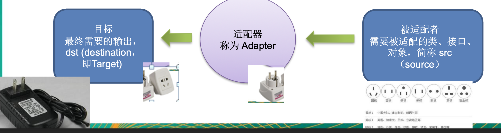

1) 适配器模式:将一个类的接口转换成另一种接口.让原本接口不兼容的类可以兼容

2) 从用户的角度看不到被适配者，是解耦的
3) 用户调用适配器转化出来的目标接口方法，适配器再调用被适配者的相关接口方法

4) 用户收到反馈结果，感觉只是和目标接口交互，如图


## class adapter

61

类适配器模式介绍

基本介绍:Adapter类，通过继承 src类，实现 dst 类接口，完成src->dst的适配。


类适配器模式应用实例

以生活中充电器的例子来讲解适配器，充电器本身相当于Adapter，220V交流电 相当于src (即被适配者)，我们的目dst(即 目标)是5V直流电

```java
// 被适配的类
public class Voltage220V {

    // 输出220V的电压
    public int output220V(){
        int src = 220;
        System.out.println("voltage is " + src + " V");
        return src;
    }
}
```

```java
public interface IVoltage5V {
    public int output5V();

}
```

```java
// 适配器类
public class VoltageAdapter extends Voltage220V implements IVoltage5V {
    
    @Override
    public int output5V() {
        int srcV = output220V();
        int dstV = srcV/44;
        return dstV;
    }
}
```

使用者:

```java
public class Phone {
    // charging
    public void charging(IVoltage5V iVoltage5V){
        if(iVoltage5V.output5V() == 5){
            System.out.println("Voltage is 5V, we can charge the phone");
        } else if (iVoltage5V.output5V() > 5){
            System.out.println("Voltage is bigger than 5V, don't charge");
        }
    }
}

public class Client {
    public static void main(String[] args) {
        System.out.println(" class adapter mode");
        Phone phone = new Phone();
        phone.charging(new VoltageAdapter());
    }
}
```


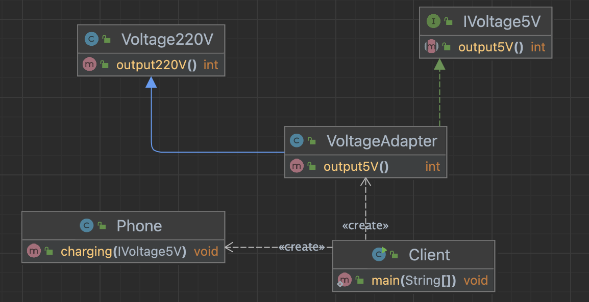


类适配器模式注意事项和细节

1. 增加adapter和被适配类的耦合

   + Java是单继承机制，所以类适配器需要继承src类这一点算是一个缺点, 因为这要 求dst必须是接口，有一定局限性; <u>这点在object adapter中会被address到</u>

   + src类的方法在Adapter中都会暴露出来，也增加了使用的成本。

2. 由于其继承了src类，所以它可以根据需求重写src类的方法，使得Adapter的灵活性增强了。


## object adapter

62

对象适配器模式介绍

1) 基本思路和类的适配器模式相同，只是将Adapter类作修改，**不是继承src类，而 是持有src类的实例**，以解决兼容性的问题。 即:持有 src类，实现 dst 类接口， 完成src->dst的适配
2) 根据“合成复用原则”，在系统中尽量使用关联关系来替代继承关系。 
3) 对象适配器模式是适配器模式常用的一种


接下来我们采用object adapter来改进上面的手机充电按例. 核心思想为Adapter类聚合被适配类的对象

```java
// 适配器类
public class VoltageAdapter implements IVoltage5V {

    private Voltage220V voltage220V;        // 想access被适配类的方法, 采用aggregation, 而不是采用继承

    public VoltageAdapter(Voltage220V voltage220V) {
        this.voltage220V = voltage220V;
    }

    @Override
    public int output5V() {
        int dst = 0;
        if(null != voltage220V){
            int src = voltage220V.output220V();     // 获取220V 电压
            System.out.println("use object adapter to convert service");
            dst = src/44;
            System.out.println("output voltage is " + dst + " V");
        }

        return dst;
    }
}

public class Client {
    public static void main(String[] args) {
        System.out.println(" class adapter mode");
        Phone phone = new Phone();
        phone.charging(new VoltageAdapter(new Voltage220V()));
    }
}

// 其他类不变
```


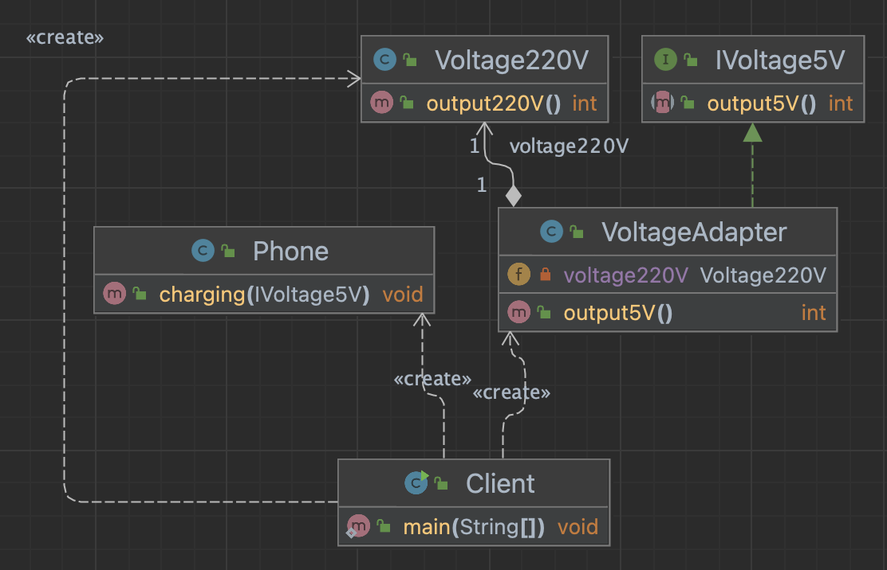

对象适配器模式注意事项和细节

1) 对象适配器和类适配器其实算是同一种思想，只不过实现方式不同。 根据合成复用原则，使用组合替代继承， 所以它解决了类适配器必须继承src的 局限性问题，也不再要求dst必须是接口。
2) 使用成本更低，更灵活。


## interface adapter

63

接口适配器模式介绍. 一些书籍称为:适配器模式(Default Adapter Pattern)或缺省适配器模式。

1) 当不需要全部实现接口提供的方法时，可先设计一个抽象类实现接口，并为该接 口中每个方法提供一个默认实现(空方法)，那么该抽象类的子类可有选择地覆盖父类的某些方法来实现需求

2. 适用于一个接口不想使用其所有的方法的情况。


:gem: e.g.1

Android中的属性动画ValueAnimator类可以 通过addListener(AnimatorListener listener)方 法添加监听器， 那么常规写法如下

```JAVA
ValueAnimator valueAnimator = ValueAnimator.ofInt(0,100)
valueAnimator.addListener(new Animator.AnimatorListener(){
  @Override
  public void onAnimationStart(Animator animation) {

  }
  @Override
  public void onAnimationEnd(Animator animation) {

  }
  @Override
  public void onAnimationCancel(Animator animation){

  }
  @Override
  public void onAnimationRepeat(Animator animation){

  } 
});

valueAnimator.start();
```

有时候我们不想实现 Animator.AnimatorListener接口的全部方法， 我们只想监听onAnimationStart，我们会如 下写:

```java
ValueAnimator valueAnimator = ValueAnimator.ofInt(0,100);

valueAnimator.addListener(new AnimatorListenerAdapter() {
  @Override
  public void onAnimationStart(Animator animation) {
  //xxxx具体实现 
  }
}); 

  valueAnimator.start();
```

这其中:

```java
public static interface AnimatorListener {
  void onAnimationStart(Animator animation);
  void onAnimationEnd(Animator animation);
  void onAnimationCancel(Animator animation);
  void onAnimationRepeat(Animator animation);
}

public abstract class AnimatorListenerAdapter implements AnimatorPauseListener {
  @Override //默认实现
  public void onAnimationCancel(Animator animation) { }
  @Override
  public void onAnimationEnd(Animator animation) { }
  @Override
  public void onAnimationRepeat(Animator animation) { }
  @Override
  public void onAnimationStart(Animator animation) { }
  @Override
  public void onAnimationPause(Animator animation) { }
  @Override
  public void onAnimationResume(Animator animation) { }
}
```


:gem: e.g.2

```java
public interface Interface4 {
    public void m1();
    public void m2();
    public void m3();
    public void m4();
}

// 在AbsAdapter里, 将Interface4中的方法进行默认实现
public abstract class AbsAdapter implements Interface4{
    public void m1(){}
    public void m2(){}
    public void m3(){}
    public void m4(){}
}


public class Client {
    public static void main(String[] args) {
        AbsAdapter m1Adapter = new AbsAdapter() {
            // 只需要override我们关心的接口方法
            @Override
            public void m1() {
                System.out.println("use m1 method");
            }
        };
        m1Adapter.m1();
    }
}
```


## Dispatcher 源码

64

待看


# 2. 桥接模式 (Bridge)
66-70 GRASP: indirection + polymorphism

抽象类和接口同时使用, 主要是基于类的最小设计原则, 利用抽象类聚合接口 解决类爆炸的问题

https://refactoring.guru/design-patterns/bridge


手机操作问题

现在对不同手机类型 (翻盖, 滑动, 旋转...)的 不同品牌实现操作编程(比如: 开机、关机、上网，打电话等)

传统方案:

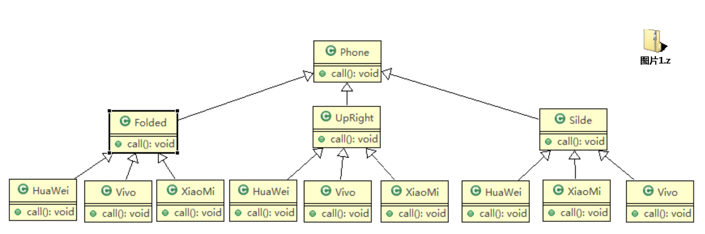

Cons: 

+ 扩展性问题(类爆炸)，如果我们再增加手机的样式(旋转式)，就需要增加各个品牌手机的类，同样如果我们增加一个手机品牌，也要在各个手机样式类下增加。
+ 违反了单一职责原则，当我们增加手机样式时，要同时增加所有品牌的手机，这样增加了代码维护成本.

Solution: use Bridge pattern


## 基本介绍

+ 桥接模式(Bridge模式)是指: <u>将实现与抽象放在两个不同的类层次中，使两个层次可以独立改变</u>

+ 是一种结构型设计模式
+ Bridge pattern基于<u>**类的最小设计原则**</u> (即通过定义尽量少数量的类来实现功能)，通过使用封装、聚合及继承等行为让不同的类承担不同的职责。它的主要特点是把抽象(Abstraction)与行为实现 (Implementation)分离开来，从而可以保持各部分的独立性以及应对他们的功能 扩展


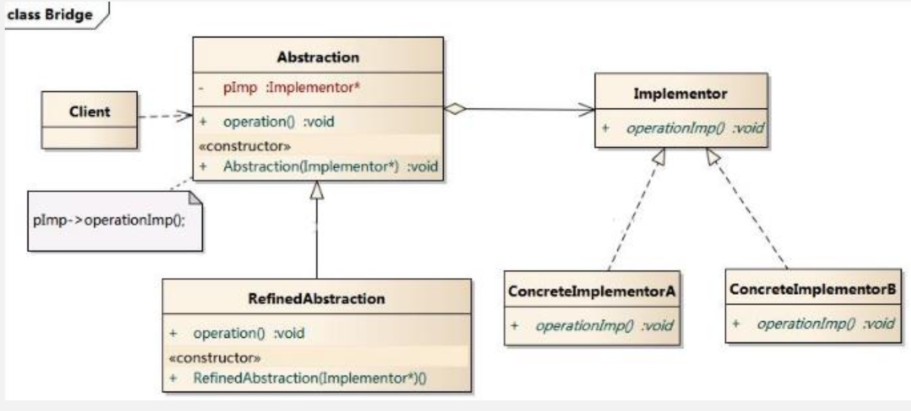

+ Client类: 桥接模式的调用者
+ Abstract class 'Abstraction': 维护了Implementor  / 即它的实现子类ConcreteImplementorA...
  + 'Abstraction' 充当了桥接类, 它把抽象和实现桥接了起来
  + RefinedAbstraction: 是桥接类的子类
+ Implementor: 行为实现类的借口, 
  + ConcreteImplementorA/B: 行为的具体实现类
+ 从UML图中我们可以看出, 这里的抽象类和借口是聚合的关系, 其实就是调用者与被调用者的关系.


## :gem: Demo Case

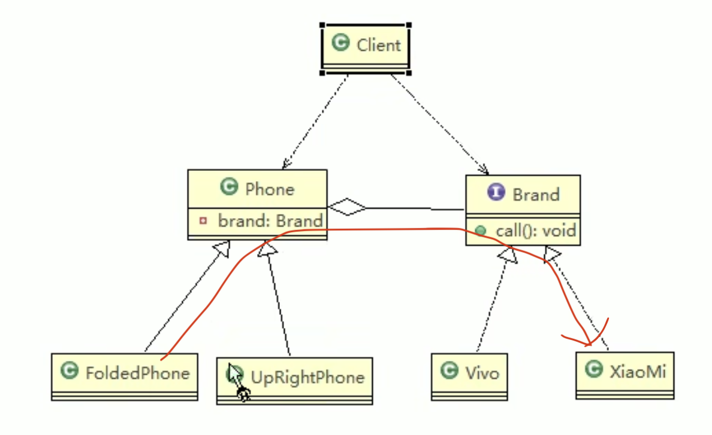

Client

+ 还是体现一个套娃, 调用phone1.open(), 其实是去通过Phone这个桥接类去调用Xiaomi(实现类)的open()

```java
public class Client {
    public static void main(String[] args) {
        // 获取折叠式手机(样式 + 品牌)
        Phone phone1= new FoldablePhone(new Xiaomi());
        phone1.open();
        phone1.call();
        phone1.close();

        System.out.println("======================");
        Phone phone2= new FoldablePhone(new Vivo());
        phone2.open();
        phone2.call();
        phone2.close();

        System.out.println("=======================");
        Phone phone3 = new UprightPhone(new Xiaomi());
        phone3.open();
        phone3.call();
        phone3.close();
    }
}
```

Implementor

+ the interface

```java
public interface Brand {
    void open();
    void close();
    void call();
}

public class Xiaomi implements Brand{
    @Override
    public void open() {
        System.out.println("Xiaomi phone turn on");
    }

    @Override
    public void close() {
        System.out.println("Xiaomi phone turn off");
    }

    @Override
    public void call() {
        System.out.println("Xiaomi phone calling");
    }
}

public class Vivo implements Brand{
    @Override
    public void open() {
        System.out.println("Vivo phone turn on");
    }

    @Override
    public void close() {
        System.out.println("Vivo phone turn off");
    }

    @Override
    public void call() {
        System.out.println("Vivo phone calling");
    }
}
```

Phone

+ the abstract class

```java
public abstract class Phone {
    private Brand brand;

    public Phone(Brand brand) {
        this.brand = brand;
    }

    protected void open(){
        this.brand.open();
    }

    protected void close(){
        this.brand.close();
    }

    protected void call(){
        this.brand.call();
    }
}


public class FoldablePhone extends Phone{
    public FoldablePhone(Brand brand) {
        super(brand);
    }

    public void open(){
        super.open();
        System.out.println("foldable phone:");
    }

    public void close(){
        super.close();
        System.out.println("foldable phone:");
    }

    public void call(){
        super.call();
        System.out.println("foldable phone:");
    }

}

public class UprightPhone extends Phone{

    public UprightPhone(Brand brand) {
        super(brand);
    }

    public void open(){
        super.open();
        System.out.println("Upright phone:");
    }

    public void close(){
        super.close();
        System.out.println("Upright phone:");
    }

    public void call(){
        super.call();
        System.out.println("Upright phone:");
    }
}
```


## JDBC 源码赏析

69

先不看


# 3. :full_moon: 装饰器模式 (Decorator)
71-76 GRASP: polymorphism

UniMelb week8: 参考case https://refactoring.guru/design-patterns/decorator very helpful and informative, along with intuitive UML diagram 

:gem: demo 自定义读写器, 可为读写器添加encryption, decryption, compression, decompression等功能而不改变基础的读写器的代码


## 核心

:bangbang: Decorator意味着recursive composition以及套娃, 在不改变基本的被装饰类的代码的情况下, 为其增添新的功能.


+ 四要素
  + Component
  + ConcreteComponent
  + Decorator
  + ConcreteDecorator
+ 组合 + 继承
  + Decorator和被装饰者实现(继承)相同的接口(抽象类), 这个祖先接口(类)我们称之为Component
  + Decorator内组合一个Component
+ 套娃
  + 新功能可以定义到一个新的ConcreteDecorator上, 然后套娃, 套在现有的功能外面, 这样就实现了动态地添加新功能
  + 由于套娃, 所以往往用到递归求某个属性的值


## 星巴克咖啡案例

星巴克咖啡订单项目 星巴克咖啡订单项目(咖啡馆):

1) 咖啡种类/单品咖啡:Espresso(意大利浓咖啡)、ShortBlack、LongBlack(美式 咖啡)、Decaf(无因咖啡)
2) 调料:Milk、Soy(豆浆)、Chocolate

要求在扩展新的咖啡种类时，具有良好的扩展性、改动方便、维护方便

使用OO的来计算不同种类咖啡的费用:客户可以点单品咖啡，也可以单品咖啡+调料组合。


方案一: 定义所有单品咖啡 + 调料的组合 类


1. Drink 是一个抽象类，表示饮料
2. description就是对咖啡的描述, 比如咖啡的名字
3. cost()方法就是计算费用，Drink类中做成一个抽象方法.
4. Decaf 就是单品咖啡， 继承Drink, 并实现cost
5. Espress && Milk 就是单品咖啡+调料，继承Drink, 并实现cost,  这个组合很多

问题: 这样设计，会有很多类，当我们增加一个单品咖啡，或者一个新的调料，类的数量就会倍增，就会出现类爆炸


方案二

前面分析到方案1因为咖啡单品+调料 组合会造成类的倍增，因此可以做改 进，将调料内置到Drink类，这样就不 会造成类数量过多。从而提高项目 的维护性(如图). 说明: milk,soy,chocolate 可以设计为 Boolean,表示是否要添加相应的调料.

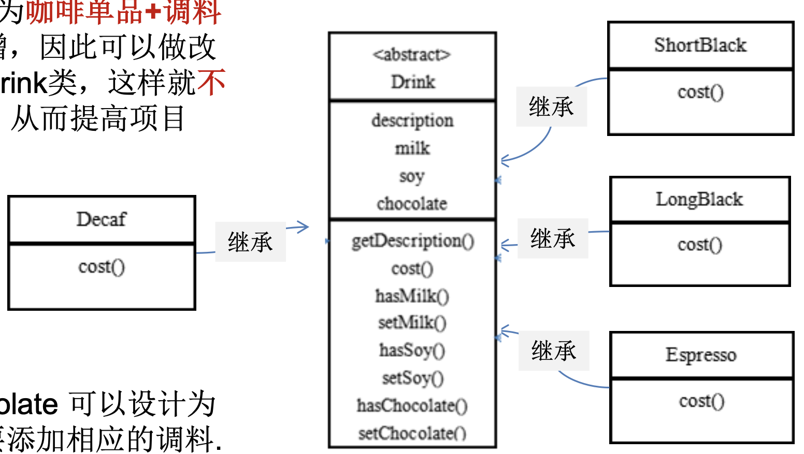

优点:

+ 方案2可以控制类的数量，不至于造成很多的类

缺点:

+ 在增加或者删除调料种类时，代码的维护量很大, 不符合OCP(open-close)原则

+ 考虑到用户可以添加多份调料时，可以将hasMilk 返回一个对应int, 比如hasMilk 返回2表示添加2份milk

考虑使用装饰者模式


## 工作原理

73


装饰者模式定义

1) 装饰者模式: `动态的将新功能附加到对象上`。在对象功能扩展方面，它比继承更 有弹性，装饰者模式也体现了开闭原则(ocp)
2) 这里提到的动态的将新功能附加到对象和ocp原则，在后面的应用实例上会以代 码的形式体现，请同学们注意体会。


装饰者模式原理

装饰者模式就像打包一个快递

+ `主体`: 比如:陶瓷、衣服 (Component) // 被装饰者
+ `包装`: 比如:报纸填充、塑料泡沫、纸板、木板(Decorator)


The decorator design pattern is a structural design pattern used in object-oriented programming that allows for the addition of new functionality to an existing object without modifying its structure. This pattern involves a set of decorator classes that mirror the type of the object they are going to extend (i.e., the same interface or superclass) but add or override behavior.

**The main idea behind the decorator pattern is to wrap an object with a decorator object that provides the additional functionality.** This way, you can dynamically and transparently extend an object's functionality at runtime without affecting other instances of the same class. The decorator pattern is particularly useful when you want to adhere to the Open/Closed Principle, which states that classes should be open for extension but closed for modification. 

The decorator design pattern can be seen in practice in various scenarios, such as in Java's I/O classes (e.g., BufferedReader, BufferedWriter), where decorators are used to add functionality like buffering, compression, or encryption to input and output streams. 比如FileInputStream外面套一个BufferedReader来提供新的功能, 就是套娃, 每套一层, 对外就像拥有新的功能一样


Here's a basic structure of the decorator pattern:

1. `Component`: This is an interface or abstract class that defines the common behavior of objects that can have additional responsibilities added to them. 主体, 比如类似前面的Drink
2. `ConcreteComponent`: A class that implements the Component interface or extends the abstract class. It represents the basic object that can be decorated with additional responsibilities. 具体的主体， 比如前面的各个单品咖啡
3. `Decorator`: This is an abstract class or interface that inherits from or implements the Component. It has a reference to a Component object and maintains the same interface as the Component.  装饰者，比如各调料.
4. `ConcreteDecorator`: These are the classes that implement or inherit from the Decorator. They add or override the behavior of the Component they are decorating.


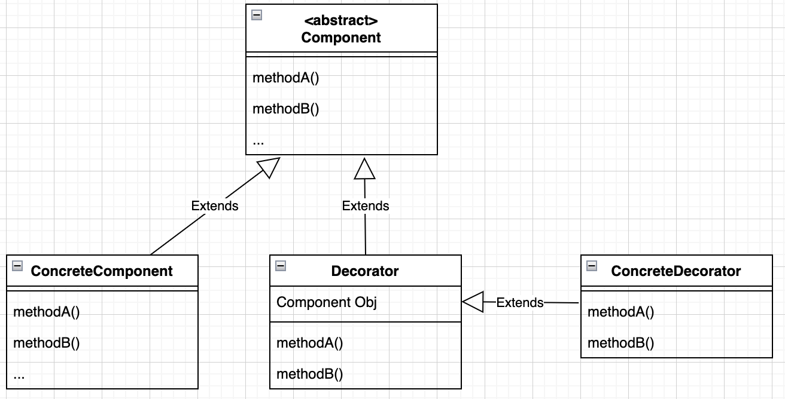

解读:

+ 在如图的Component与ConcreteComponent之间，如果 ConcreteComponent类很多,还可以设计一个缓冲层，将共有的部分提取出来， 抽象层一个类

+ Decorator和被装饰者实现(继承)相同的接口(抽象类), 这是为了利用多态来实现套娃
  + Decorator类中聚合了Component类型的对象, 利用多态, Obj可以是Component的实现类的对象, 后面会看到, Decorator里不仅可以包ConcreteComponent还可以包另一个Decorator对象
  + 就像俄罗斯套娃, 外面的娃相当于decorator, 每套一层 decorator, 对外就像原来的娃增添了decorator的某些特征; 用现实世界的人穿衣服来做比喻可能不太恰当, 因为decorator和被装饰者的具有共同祖先类 (接口), 不过你想在software domain来model人穿衣服则也可以, 让人和衣服继承相同的父类(接口), 最里面的是被装饰者--人, 然后给人套衣服, 每穿一层衣服对外就像人有了衣服添加的特征(比如保暖, 美观...)

## :gem: Demo case


### 案例1: 星巴克咖啡

74

看到这里

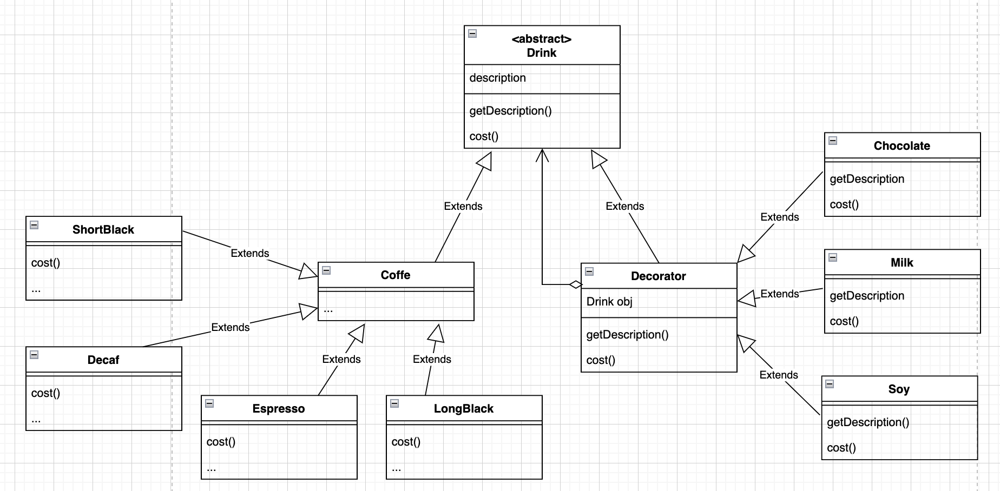

说明

1. Drink 类就是前面说的抽象类， Component
2. ShortBlack 就单品咖啡
3. Decorator 是一个装饰类，含有一个被装饰的对象(Drink obj)
4. Decorator 的cost 方法 进行一个费用的叠加计算，递归的计算价格 下面会看到


新需求: 2份巧克力+一份牛奶的LongBlack, 装饰者模式下:

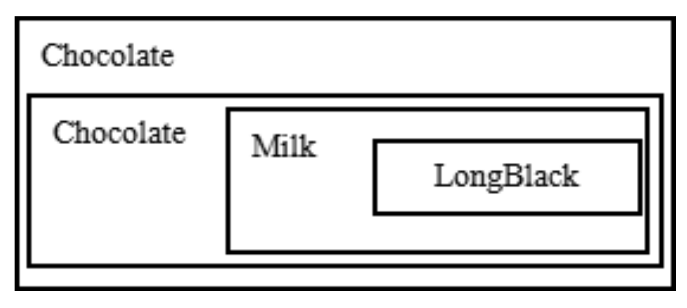

说明

1) Milk包含了LongBlack
2) 一份Chocolate包含了(Milk+LongBlack)
3) 一份Chocolate包含了(Chocolate+Milk+LongBlack)
4) 这样不管是什么形式的单品咖啡+调料组合，通过递归方式可以方便的组合和维护。


```java
// 要素1: Component
public abstract class Drink {
    private String description;
    private float price = 0.0f;

    public String getDescription() {
        return description;
    }

    public void setDescription(String description) {
        this.description = description;
    }

    public float getPrice() {
        return price;
    }

    public void setPrice(float price) {
        this.price = price;
    }

    // 让子类去实现
    public abstract float cost();
}
```


```java
// 要素2: Concrete Component
public class Coffee extends Drink{
    @Override
    public float cost() {
        return super.getPrice();
    }
}

public class Espresso extends Coffee{

    public Espresso() {
        setDescription("this is an Espresso coffee");
        setPrice(6.0f);
    }
}

public class LongBlack extends Coffee{
    public LongBlack() {
        setDescription("this is a LongBlack coffee");
        setPrice(7.0f);
    }
}

public class ShortBlack extends Coffee{
    public ShortBlack() {
        setDescription("this is a ShortBlack coffee");
        setPrice(5.0f);

    }
}
```


```java
// 要素3: Decorator
public class Decorator extends Drink{
    private Drink obj;      // 被装饰者

    public Decorator(Drink obj) {           // 组合关系
        this.obj = obj;
    }

    @Override
    public float cost() {
        // 自己的价格 + 被装饰者的总体价格
        return super.getPrice() + obj.cost();		// 递归求价格
    }

    @Override
    public String getDescription(){

        return super.getDescription() +" "+ super.getPrice() + " && " + obj.getDescription();
    }
}
```


```java
// 要素4: ConcreteDecorator
public class Milk extends Decorator{
    public Milk(Drink obj) {
        super(obj);
        setDescription("Milk");
        setPrice(2.0f);
    }
}

public class Soy extends  Decorator{
    public Soy(Drink obj) {
        super(obj);
        setDescription("Soy");
        setPrice(1.5f);
    }
}

public class Chocolate extends Decorator{

    public Chocolate(Drink obj) {
        super(obj);
        setDescription("Chocolate");
        setPrice(3.0f);
    }
}
```


```java
// main
// 可见此时搞各种coffee和调味品的组合非常灵活, 也不用大改代码, 只需要套娃
public class CoffeeBar {
    // 装饰者模式下的订单:2份巧克力+一份牛奶的LongBlack
    public static void main(String[] args) {
        // 1. 被装饰者
        Drink order = new LongBlack();
        System.out.println(order.cost());
        System.out.println(order.getDescription());

        // 2. 加入1份牛奶
        order = new Milk(order);
        System.out.println(order.cost());
        System.out.println(order.getDescription());

        // 3. 加入1份巧克力
        order = new Chocolate(order);
        System.out.println(order.cost());
        System.out.println(order.getDescription());

        // 4. 再加入1份巧克力
        order = new Chocolate(order);
        System.out.println(order.cost());
        System.out.println(order.getDescription());

        // order 2 ==========================
        System.out.println("order2: ");

        Drink order2 = new Espresso();
        System.out.println(order2.cost());
        System.out.println(order2.getDescription());

        order2 = new Milk(order2);
        System.out.println(order2.cost());
        System.out.println(order2.getDescription());
    }
}
```


### 案例2: JDK I/O stream

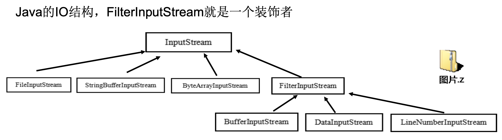


```java
public abstract class InputStream implements Closeable{} //是一个抽象类，即Component public class 

class FileInputStream{	// 被装饰者
  
}

class FilterInputStream extends InputStream { //是一个装饰者类Decorator
	protected volatile InputStream in //被装饰的对象 
}
  
  
class DataInputStream extends FilterInputStream implements DataInput { 
  //FilterInputStream 子类，相当于ConcreteDecorator
}
```


### 案例3: chatGPT例子

见Intellij代码


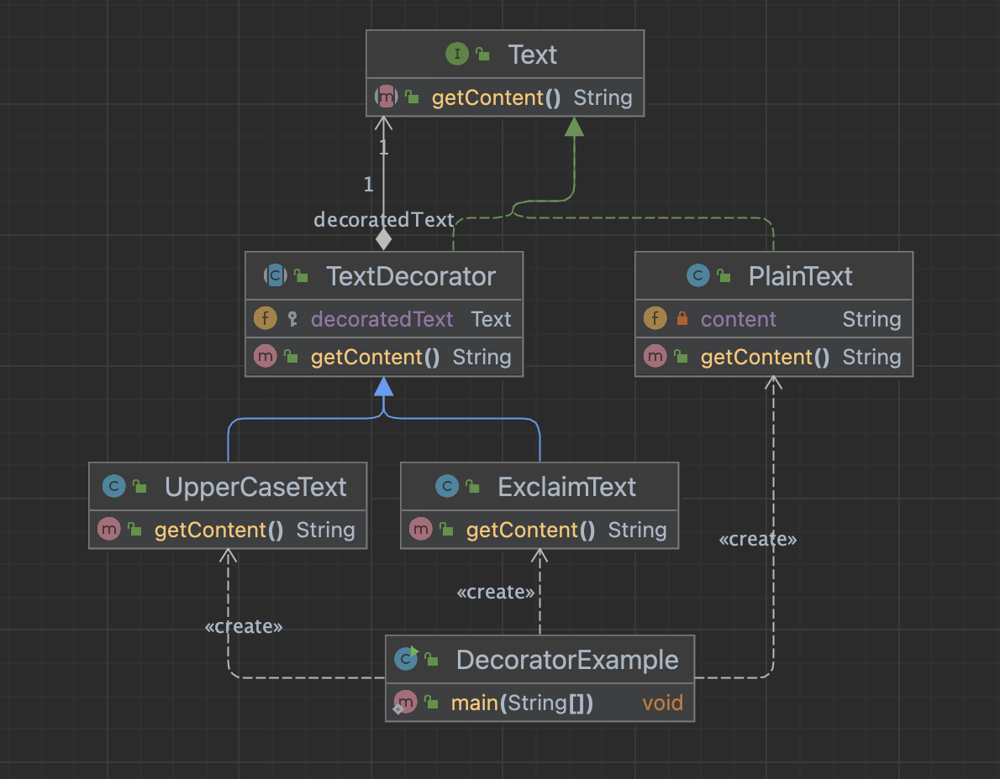


# 4. :full_moon: 组合模式 (Composite)
77-80 GRASP: polymorphism

UniMelb week9 https://refactoring.guru/design-patterns/composite

:bangbang: **Composite** is a structural design pattern that lets you <u>compose objects into tree structures</u> and then work with these structures as if they were individual objects.

:bangbang:  Relation with Decorator pattern:

[Composite](https://refactoring.guru/design-patterns/composite) and [Decorator](https://refactoring.guru/design-patterns/decorator) have similar structure diagrams since both rely on recursive composition to organize an open-ended number of objects.

+ A *Decorator* is like a *Composite* but only has one child component. 

+ There’s another significant difference: *Decorator* adds additional responsibilities to the wrapped object, while *Composite* just “sums up” its children’s results.

However, the patterns can also cooperate: you can use *Decorator* to extend the behavior of a specific object in the *Composite* tree.


使用场景:

:bangbang: 凡是object在逻辑上存在一种recursive关系的, 就可以使用composite pattern, 将某种响应从composite tree传递给每一层的node (SMD考试最爱考这个pattern). composite pattern也可有多种变种， 如同一个component interface 下有多个leaf class, 多个container class

+ e.g. 游戏模拟效果, 楼房爆炸, 要求楼房里面的人, 人身上的衣服, 手里的物品, 都会随着爆炸做出响应
+ e.g. 1个大包裹里面可能还有4个小包裹和1个物品,


---


看一个学校院系展示: 需求编写程序展示一个学校院系结构:需求是这样，要在一个页面中展示出学校的院系组成，一个学校有多个学院，一个学院有多个系。如图:

```java
清华大学
  |-- 计算机学院
  			|-- 计算机科学与技术
  		  |-- 软件工程
  			|-- 网络工程
  |-- 信息工程学院
  			|-- 通信工程
  			|-- 信息工程
```


传统方案解决学校院系展示存在的问题分析

1) 将学院看做是学校的子类，系是学院的子类，这样实际上是站在组织大小来进行分层次的
2) 实际上我们的要求是: 在一个页面中展示出学校的院系组成，一个学校有多个学院，一个学院有多个系， 因此这种方案，不能很好实现的管理的操作，比如 对学院、系的添加，删除，遍历等
3) 解决方案: 把学校、院、系都看做是组织结构，<u>他们之间没有继承的关系，而是 一个树形结构</u>，可以更好的实现管理操作。 => `组合模式`


## 基本介绍

1. 组合模式(Composite Pattern)，又叫部分整体模式，<u>它创建了对象组的树形结构</u>，将对象组合成树状结构以表示“整体-部分”的层次关系
2. 这种类型的设计模式属于结构型模式
3. 组合模式使得用户对单个对象和组合对象的访问具有一致性，即:组合能让客户以一致的方式处理个别对象以及组合对象


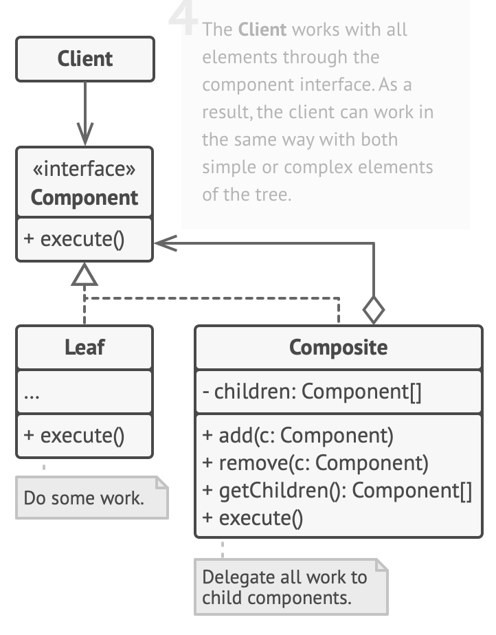

+ The **Client** works with all elements through the component interface. As a result, the client can work in the same way with both simple or complex elements of the tree.
+ The **Component** interface describes operations that are common to both simple and complex elements of the tree.
  + Component可以是Abstract class or interface
+ The **Leaf** is a basic element of a tree that <u>*doesn’t have sub-elements*</u>. Leaf充当最底层的劳动力
  + Usually, leaf components end up doing most of the real work, since they don’t have anyone to delegate the work to.
+ The **Container** (aka ***composite***) is <u>*an element that has sub-elements: leaves or other containers*</u>.  Container充当管理层
  + A container doesn’t know the concrete classes of its children. It works with all sub-elements only via the component interface. 
  + *Upon receiving a request, a <u>container delegates the work to its sub-elements</u>*, processes intermediate results and then returns the final result to the client. 

> :bangbang: 组合模式解决这样的问题，当我们的要处理的对象可以生成一颗树形结构，而我们要对树上的节点和叶子进行操作时，它能够提供一致的方式，而不用考虑 它是节点还是叶子. 一个典型的例子就是二叉树求节点上的数值的总和


## :gem: demo

上代码 78

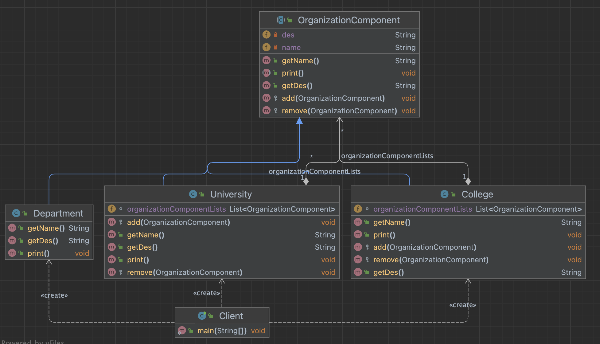


OrganizationComponent

```java
public abstract class OrganizationComponent {
    private String name;
    private String des;

    public OrganizationComponent(String name, String des) {
        this.name = name;
        this.des = des;
    }

    protected  void add(OrganizationComponent organizationComponent){
        // 默认实现, 不强制让实现类实现这个方法
        throw new UnsupportedOperationException();
    }

    protected  void remove(OrganizationComponent organizationComponent){
        // 默认实现, 不强制让实现类实现这个方法 (leaf node 不需要实现这个方法)
        throw new UnsupportedOperationException();
    }

    public abstract void print();

    public String getName() {
        return name;
    }

    public String getDes() {
        return des;
    }
}
```

University.java

```java
public class University extends OrganizationComponent{

    // List里存的是college
    List<OrganizationComponent> organizationComponentLists = new ArrayList<>();

    public University(String name, String des) {
        super(name, des);

    }

    @Override
    protected void add(OrganizationComponent organizationComponent){
        organizationComponentLists.add(organizationComponent);
    }

    @Override
    protected void remove(OrganizationComponent organizationComponent){
        organizationComponentLists.remove(organizationComponent);
    }


    @Override
    public String getName(){
        return super.getName();
    }

    @Override
    public String getDes(){
        return super.getDes();
    }

    // 输出University里包含的学院
    @Override
    public void print() {
        System.out.println("-----------" + getName()+ "----------");
        // loop over list
        for (OrganizationComponent ele : organizationComponentLists){
            ele.print();
        }
    }
}
```

College.java

```java
public class College extends OrganizationComponent{

    // List 中存的是department
    List<OrganizationComponent> organizationComponentLists = new ArrayList<>();

    public College(String name, String des) {
        super(name, des);

    }

    @Override
    protected void add(OrganizationComponent organizationComponent){
        // 实际业务中, college.add() 和university.add() 的逻辑可能不会完全相同
        organizationComponentLists.add(organizationComponent);
    }

    @Override
    protected void remove(OrganizationComponent organizationComponent){
        organizationComponentLists.remove(organizationComponent);
    }

    @Override
    public String getName(){
        return super.getName();
    }

    @Override
    public String getDes(){
        return super.getDes();
    }

    // 输出University里包含的学院
    @Override
    public void print() {
        System.out.println("-----------" + getName()+ "----------");
        // loop over list
        for (OrganizationComponent ele : organizationComponentLists){
            ele.print();
        }
    }
}
```

Department.java: 作为leaf node

```java
public class Department extends OrganizationComponent{

    public Department(String name, String des) {
        super(name, des);

    }

    @Override
    public String getName(){
        return super.getName();
    }

    @Override
    public String getDes(){
        return super.getDes();
    }


    @Override
    public void print() {
        System.out.println("-----------" + getName()+ "----------");
    }
}
```

Client.java

+ 使用时, 不管是container还是leaf, 都使用`print()`方法就可, 不必去关心到底是leaf还是container, 这是composite pattern带来的好处
+ 调用`university.print()`时有点DFS的意思

```java
public class Client {
    public static void main(String[] args) {
        // 从大到小创建对象
        // 创建university
        University university = new University("清华大学", "666");

        // 创建college
        College college1 = new College("计算机学院", "计算机学院");
        College college2 = new College("信息工程学院", "信息工程学院");

        // 创建专业
        college1.add(new Department("software engineering","love java"));
        college1.add(new Department("cyber engineering", "aa"));
        college1.add(new Department("computer science", "CS"));

        college2.add(new Department("communication engineering", "通信不好学"));
        college2.add(new Department("information engineering", "信工好学"));

        university.add(college1);
        university.add(college2);

        //
        university.print();

        System.out.println("\n");
        college1.print();
    }
}
```


## HashMap 源码

79 

有空回来看


# 5. :moon: 外观模式 (Facade)
81-85

UniMelb week 8, 参考case:  https://refactoring.guru/design-patterns/facade very helpful and informative

Having a facade is handy when you need to integrate your app with a sophisticated library that has dozens of features, but you just need a tiny bit of its functionality. 即把一个复杂的lib, 简化凝聚到最小满足需求的水平放到一个Facade类, 以降低我们自己的的类与第三方lib之间的耦合

:gem: 代码见refactoring_guru package


:bangbang: Facade的核心思想在于, mask the system complexity and hide the details behind, 往往作为indirection 用于连接system之间的通信. 这样可以减少当前系统和其他系统之间的耦合, 如果其他系统发生变动, 只需要修改Facade就行了, 不需要去大量修改当前系统的代码. 像Java RMI, socket都属于Facade思想, 将complex system的detail mask掉, 对外只提供single interface


# 6. 享元模式 (Flyweight)
86-90


# 7. :moon: 代理模式 (Proxy)
91-95 GRASP: indirection + aggregation (通过套接来添加额外的behaviour)

Refactoring guru: https://refactoring.guru/design-patterns/proxy

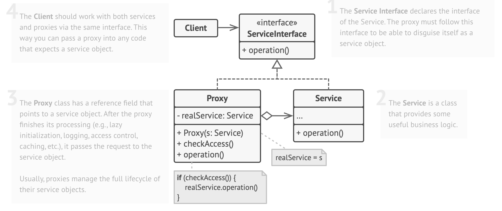


1) 代理模式:为一个对象提供一个替身，以控制对这个对象的访问。即通过代理 对象访问目标对象.

   + **这样做的好处是: 可以在目标对象实现的基础上, 增强额外的功能操作, 即扩展目标对象的功能。** 
   + :gem: e.g. 网易在中国代理暴雪游戏, 除去正常的运营暴雪游戏的业务外, 网易作为代理者还需要额外增加适应中国法律的业务条款与服务. 有一点像decorator, 将target obj aggregate into a proxy obj, 然后定义个同名方法, 里面除了调用target method外还加上一些额外的操作.

2) 被代理的对象可以是

   + 远程对象(remote object): 参见Java RMI

   + 创建开销大的对象

   + 需要安全控制的对象

3) :bangbang: 代理模式有不同的形式, 主要有三种 

   + 静态代理

   + 动态代理 (aka. JDK代理, 接口代理).  
     + 目标对象需要实现接口使用这个

   + Cglib代理 (aka. 子类代理) (可以在内存动态的创建对象，而不需要实现接口， 他是属于动态代理的范畴) 
     + 目标对象不需要实现接口时使用这个


## 7.1 static proxy

92

静态代理在使用时,需要定义接口或者父类,被代理对象(即目标对象)与代理对象一起实现相同的接口或者是继承相同父类


```java
public interface ITeacherDao {
    void teach();
}

public class TeacherDao implements ITeacherDao{
    @Override
    public void teach() {
        System.out.println("Teacher is teaching...");
    }
}

public class TeacherDaoProxy implements ITeacherDao{
    private ITeacherDao targetTeacherDao;   // 真正的目标对象, 通过接口来聚合

    public TeacherDaoProxy(ITeacherDao targetTeacherDao) {      // dependency injection
        super();
        this.targetTeacherDao = targetTeacherDao;
    }

    @Override
    public void teach() {
        // 1. TODO: work to do before proxy business logic
        System.out.println("proxy starts... do some operation");

        // 2. business logic
        targetTeacherDao.teach();

        // 3. TODO: work to do after proxy business logic
        System.out.println("proxy ends... do some operation");
    }
}

public class Client {
    public static void main(String[] args) {
        // step1. instantiate target object
        TeacherDao teacherDao = new TeacherDao();

        // step2. instantiate proxy object and inject target into proxy object
        TeacherDaoProxy teacherDaoProxy = new TeacherDaoProxy(teacherDao);

        // step3: 通过代理对象, 间接调用target object的方法.
        teacherDaoProxy.teach();
    }
}
```


Pros & cons:

+ Pros: 在不修改目标对象的功能前提下,能通过代理对象对目标功能扩展
+ Cons: 因为代理对象需要与目标对象实现共同的接口,所以会有很多代理类 ; 一旦接口增加方法,目标对象与代理对象都要维护 (e.g. in DS A2, adding new methods in Remote interface could cost a lot efforts)


## 7.2 dynamic proxy

93

1) 代理对象不需要实现接口，但是目标对象要实现接口，否则不能用动态代理 
2) 代理对象的生成，其实是利用JDK的API (利用反射机制)，动态的在内存中构建代理对象
3) 动态代理也叫做: JDK代理、接口代理


JDK中生成代理对象的API

1. 代理类所在包: java.lang.reflect.Proxy

2. JDK实现代理只需要使用`newProxyInstance`方法,但是该方法需要接收三个参数,完整的写法是:

   ```java
   java static Object newProxyInstance(ClassLoader loader, 
                                       Class<?>[] interfaces,
                                       InvocationHandler h )
   
   // InvocationHandler interface is a functional interface with only 1 method:
   public interface InvocationHandler {
       public Object invoke(Object proxy, Method method, Object[] args)
           throws Throwable;
   }
   ```


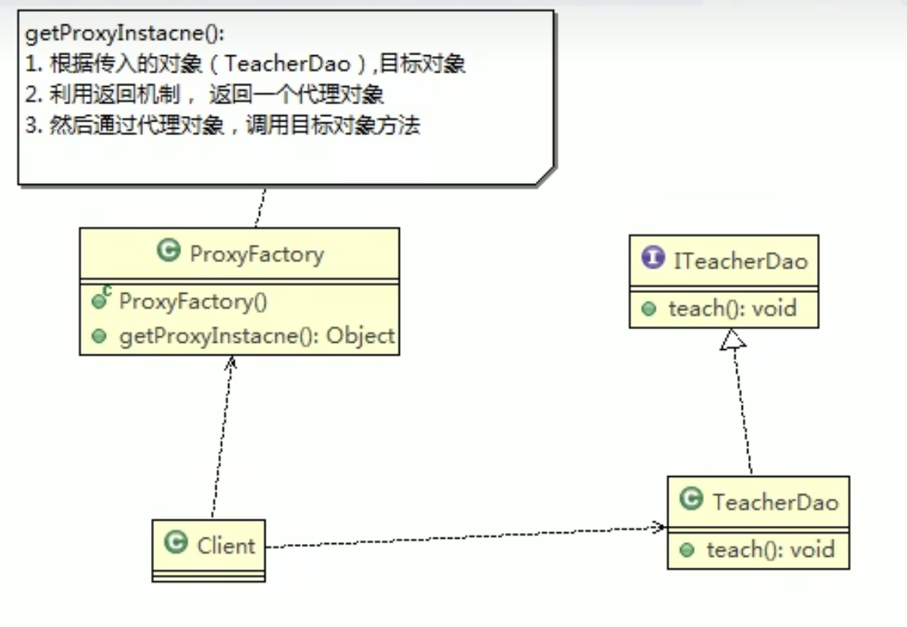


:gem: demo

```java
public interface ITeacherDao {
    void teach();
    void sayHello(String name);
}

public class TeacherDao implements ITeacherDao{
    @Override
    public void teach() {
        System.out.println("teacher is teaching ...");
    }
    @Override
    public void sayHello(String name) {
        System.out.println("hello, " + name);
    }
    
}

public class ProxyFactory {

    private Object target;   // 维护target object

    public ProxyFactory(Object target) {    // inject dependency
        this.target = target;
    }

    // 给target object生成proxy object
    public Object getProxyInstance(){

        /**
         * java static Object newProxyInstance(ClassLoader loader,
         *                                     Class<?>[] interfaces,
         *                                     InvocationHandler h )
         *   1. Classloader loader: 指定当前target object的类加载器, 获取加载器的方法固定
         *   2. Class<?>[] interfaces: target object实现的接口类型, 使用泛型方法确认类型
         *   3. InvocationHandler h: 事件处理, 执行目标对象的方法, 会去触发事件处理器的方法, 会把当前执行的target object的方法作为
         *      参数传入
         */
        return Proxy.newProxyInstance(target.getClass().getClassLoader(), target.getClass().getInterfaces(), new InvocationHandler() {
            @Override
            public Object invoke(Object proxy, Method method, Object[] args) throws Throwable {

                System.out.println("JDK proxy starts... do some operation");

                // 调用target object's method
                Object returnVal = method.invoke(target, args);

                System.out.println("JDK proxy ends... do some operation");

                return returnVal;
            }
        });
    }
    
}

public class Client {
    public static void main(String[] args) {
        // 创建target obj
        ITeacherDao teacherDao = new TeacherDao();

        // 给target obj创建proxy obj
        ITeacherDao proxyInstance = (ITeacherDao) new ProxyFactory(teacherDao).getProxyInstance();

        // proxyInstnace = class jdk.proxy1.$Proxy0
        // 内存中动态地生成了proxy object
        System.out.println("proxyInstnace = " + proxyInstance.getClass());

        // 通过proxy obj, 调用目标对象的方法
        proxyInstance.teach();		// break point here

        proxyInstance.sayHello("tom");		// break point here

    }
}
```


采用debug mode, 可以看到在调用 

```java
proxyInstance.teach();		// break point here
proxyInstance.sayHello("tom");		// break point here
```

时, 其实是在调用newProxyInstance()中InvocationHandler的 invoke() 方法


Pros: 采用动态代理，只需要定义好 proxyFactory专注产生proxy object,  如果interface添加新的method, 只需要维护target object

Cons: target obj has to implements an interface


## 7.3 Cglib proxy

94

`静态代理`和`JDK代理`模式都要求目标对象是实现一个接口. 但是有时候目标对象只是一个单独的对象, 并没有实现任何的接口, 这个时候可使用目标对象子类来实现 代理-这就是`Cglib代理`

1. Cglib代理也叫作`子类代理`, 它是在内存中构建一个子类对象从而实现对目标对象功 能扩展, 有些书也将Cglib代理归属到动态代理。:bangbang: Cglib似乎不支持Java9及以后版本了, 2019年就停更了...

2. Cglib是一个强大的高性能的代码生成包,它可以在运行期扩展java类与实现java接口. 它广泛的被许多AOP的框架使用,例如Spring AOP，实现方法拦截

   + 在AOP编程中如何选择代理模式:

     + 目标对象需要实现接口，用JDK代理

     + 目标对象不需要实现接口，用Cglib代理 

3. Cglib包的底层是通过使用字节码处理框架ASM来转换字节码并生成新的类


实现步骤

```java
1) 需要引入cglib的jar文件 (问GPT): asm.jar, asm-commons.jar, asm-tree.jar, cglib-2.2.jar
2) 在内存中动态构建子类，注意代理的类不能为final，否则报错 java.lang.IllegalArgumentException:
3) 目标对象的方法如果为final/static,那么就不会被拦截, 即不会执行目标对象额外的业务方法.
```


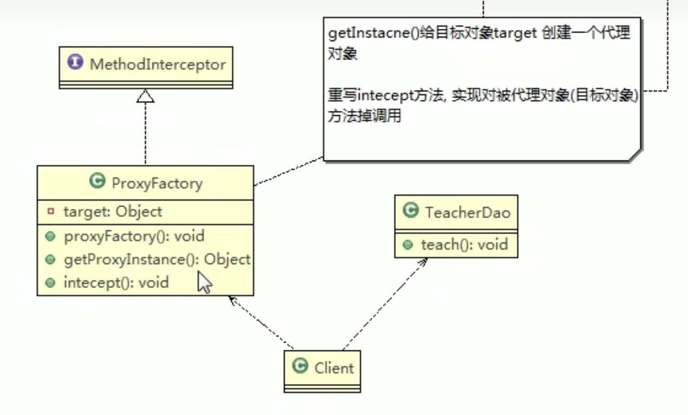


```java
public class TeacherDao {
    public void teach(){
        System.out.println("teacher is teaching... I am proxyed by cglib, no need to implement any interface");
    }
}

public class ProxyFactory implements MethodInterceptor {
    private Object target;  // maintain a target object

    public ProxyFactory(Object target) {        // dependency injection
        this.target = target;
    }

    public Object getProxyInstance(){       // return a proxy object for target object
        // 1. 创建一个工具类
        Enhancer enhancer = new Enhancer();

        // 2. 设置一个父类
        enhancer.setSuperclass(target.getClass());

        // 3. 设置callback function
        enhancer.setCallback(this);

        // 4. 创建子类对象, 即代理对象
        return enhancer.create();
    }


    /**
     * 重写intercept方法， 会调用目标对象的方法
     * @param obj "this", the enhanced object
     * @param method intercepted Method
     * @param args argument array; primitive types are wrapped
     * @param proxy used to invoke super (non-intercepted method); may be called
     * as many times as needed
     * @return
     * @throws Throwable
     */
    @Override
    public Object intercept(Object obj, Method method, Object[] args, MethodProxy proxy) throws Throwable {
        System.out.println("Cglib proxy starts... do some operations");

        Object returnVal = method.invoke(target, args);

        System.out.println("Cglib proxy ends... do some operations");
        return returnVal;
    }
}

public class Client {
    public static void main(String[] args) {
        // 创建目标对象
        TeacherDao teacherDao = new TeacherDao();
        // 创建代理工厂, inject target obj to proxy obj
        TeacherDao proxyInstance = (TeacherDao) new ProxyFactory(teacherDao).getProxyInstance();
        // 执行proxy obj的方法 ---> trigger intercept() method, 从而实现对target obj的方法调用
        proxyInstance.teach();

    }
}
```

类似JDK的动态代理, 只是不需要target obj implements any interface了


## 7.4 几种变体

几种常见的代理模式介绍— 几种变体 

+ 防火墙代理: 内网通过代理穿透防火墙，实现对公网的访问。

+ 缓存代理: 比如: 当请求图片文件等资源时，先到缓存代理取，如果取到资源则ok; 如果取不到资源， 再到公网或者数据库取，然后缓存。

+ 远程代理: 远程对象的本地代表，通过它可以把远程对象当本地对象来调用。远程代理通过网络和 真正的远程对象沟通信息。e.g. RPC, Java RMI 
+ 同步代理: 主要使用在多线程编程中，完成多线程间同步工作

