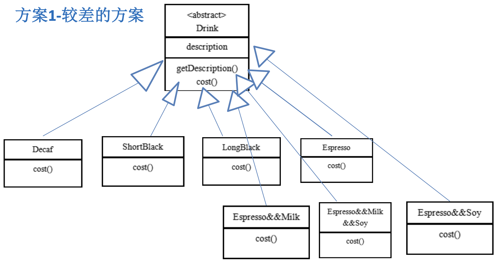

结构型模式: 如何将类或对象结合在一起形成一个更强大的结构

# 1. :moon: 适配器模式(类 / 对象) (Adapter)
60-65

UniMelb week9

# 2. 桥接模式 (Bridge)
66-70

# 3. :moon: 装饰器模式 (Decorator)
71-76

UniMelb week8

## 星巴克咖啡案例

星巴克咖啡订单项目 星巴克咖啡订单项目(咖啡馆):

1) 咖啡种类/单品咖啡:Espresso(意大利浓咖啡)、ShortBlack、LongBlack(美式 咖啡)、Decaf(无因咖啡)
2) 调料:Milk、Soy(豆浆)、Chocolate

要求在扩展新的咖啡种类时，具有良好的扩展性、改动方便、维护方便

使用OO的来计算不同种类咖啡的费用:客户可以点单品咖啡，也可以单品咖啡+调料组合。

方案一: 定义所有单品咖啡 + 调料的组合 类

1. Drink 是一个抽象类，表示饮料
2. description就是对咖啡的描述, 比如咖啡的名字
3. cost()方法就是计算费用，Drink类中做成一个抽象方法.
4. Decaf 就是单品咖啡， 继承Drink, 并实现cost
5. Espress && Milk 就是单品咖啡+调料，继承Drink, 并实现cost,  这个组合很多

问题: 这样设计，会有很多类，当我们增加一个单品咖啡，或者一个新的调料，类的数量就会倍增，就会出现类爆炸

方案二

前面分析到方案1因为咖啡单品+调料 组合会造成类的倍增，因此可以做改 进，将调料内置到Drink类，这样就不 会造成类数量过多。从而提高项目 的维护性(如图). 说明: milk,soy,chocolate 可以设计为 Boolean,表示是否要添加相应的调料.

优点:

+ 方案2可以控制类的数量，不至于造成很多的类

缺点:

+ 在增加或者删除调料种类时，代码的维护量很大, 不符合OCP(open-close)原则

+ 考虑到用户可以添加多份调料时，可以将hasMilk 返回一个对应int, 比如hasMilk 返回2表示添加2份milk

考虑使用装饰者模式

## 工作原理

73

装饰者模式定义

1) 装饰者模式: `动态的将新功能附加到对象上`。在对象功能扩展方面，它比继承更 有弹性，装饰者模式也体现了开闭原则(ocp)
2) 这里提到的动态的将新功能附加到对象和ocp原则，在后面的应用实例上会以代 码的形式体现，请同学们注意体会。

装饰者模式原理

装饰者模式就像打包一个快递

+ `主体`: 比如:陶瓷、衣服 (Component) // 被装饰者
+ `包装`: 比如:报纸填充、塑料泡沫、纸板、木板(Decorator)

The decorator design pattern is a structural design pattern used in object-oriented programming that allows for the addition of new functionality to an existing object without modifying its structure. This pattern involves a set of decorator classes that mirror the type of the object they are going to extend (i.e., the same interface or superclass) but add or override behavior.

**The main idea behind the decorator pattern is to wrap an object with a decorator object that provides the additional functionality.** This way, you can dynamically and transparently extend an object's functionality at runtime without affecting other instances of the same class. The decorator pattern is particularly useful when you want to adhere to the Open/Closed Principle, which states that classes should be open for extension but closed for modification. 

The decorator design pattern can be seen in practice in various scenarios, such as in Java's I/O classes (e.g., BufferedReader, BufferedWriter), where decorators are used to add functionality like buffering, compression, or encryption to input and output streams. 比如FileInputStream外面套一个BufferedReader来提供新的功能, 就是套娃, 每套一层, 对外就像拥有新的功能一样

Here's a basic structure of the decorator pattern:

1. `Component`: This is an interface or abstract class that defines the common behavior of objects that can have additional responsibilities added to them. 主体, 比如类似前面的Drink
2. `ConcreteComponent`: A class that implements the Component interface or extends the abstract class. It represents the basic object that can be decorated with additional responsibilities. 具体的主体， 比如前面的各个单品咖啡
3. `Decorator`: This is an abstract class or interface that inherits from or implements the Component. It has a reference to a Component object and maintains the same interface as the Component.  装饰者，比如各调料.
4. `ConcreteDecorator`: These are the classes that implement or inherit from the Decorator. They add or override the behavior of the Component they are decorating.

解读:

+ 在如图的Component与ConcreteComponent之间，如果 ConcreteComponent类很多,还可以设计一个缓冲层，将共有的部分提取出来， 抽象层一个类

+ Decorator类中聚合了Component类型的对象, 利用多态, Obj可以是ConcreteComponent的对象

## 代码

74

看到这里

# 4. :moon: 组合模式 (Composite)
77-80

UniMelb week9

# 5. :moon: 外观模式 (Facade)
81-85

UniMelb week 8

# 6. 享元模式 (Flyweight)
86-90

# 7. :moon: 代理模式 (Proxy)
91-95

