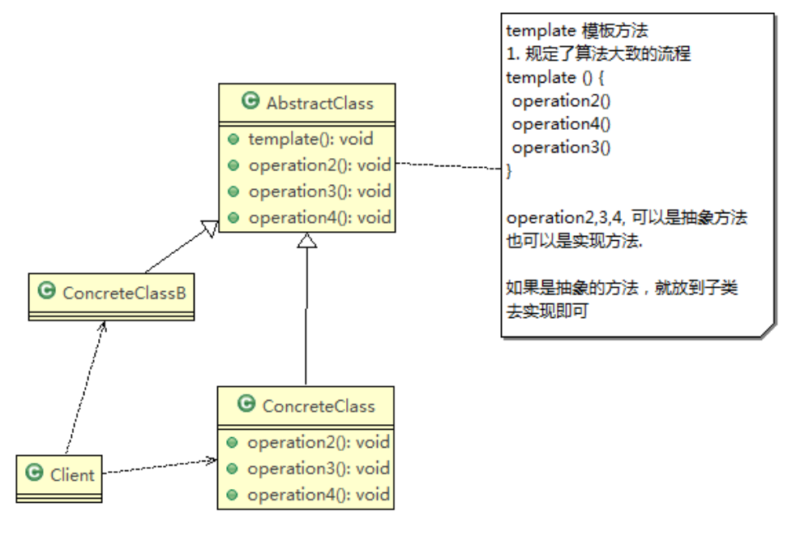
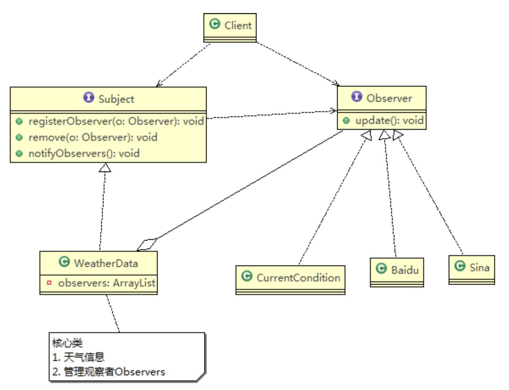

行为型模式: 类或对象如何交互, 如何划分职责, 从而更好地完成任务


# 1. :moon: 模版方法模式 (Template Method)
96-100 GRASP: polymorphism

UniMelb week 10 https://refactoring.guru/design-patterns/template-method


:bangbang: 大体的流程骨架固定, 但是具体某个步骤要求有不同的实现 

+ e.g. binary tree的递归套路


编写制作豆浆的程序，说明如下:

1) 制作豆浆的流程 选材--->添加配料--->浸泡--->放到豆浆机打碎
2) 通过添加不同的配料，可以制作出不同口味的豆浆
3) 选材、浸泡和放到豆浆机打碎这几个步骤对于制作每种口味的豆浆都是一样的
4) 请使用 模板方法模式 完成 (说明:  因为模板方法模式，比较简单，很容易就 想到这个方案，因此就直接使用，不再使用传统的方案来引出模板方法模式 )


基本介绍

1. 模板方法模式(Template Method Pattern)，又叫模板模式(Template Pattern)，在一个抽象类公开定义了执行它的方法的模板。它的子类可以按需要重写方法实现，但调用将以抽象类中定义的方式进行。 这种类型的设计模式属于行为型模式。
2. 简单说，**<u>模板方法模式 定义一个操作中的算法的骨架，而将一些步骤延迟到子类中，使得子类可以不改变一个算法的结构，就可以重定义该算法的某些特定步骤</u>**




对原理类图的说明-即(模板方法模式的角色及职责)

1) AbstractClass 抽象类， 类中实现了模板方法(template)，**规定了算法的骨架**，具体子类需要去实现 其它的抽象方法operation 2,3,4
   + 再次体现面向接口, 面向抽象编程

2) ConcreteClass 实现抽象方法operationr2,3,4, 以完成算法中特点子类的步骤


## 代码实现

制作豆浆的流程 选材--->添加配料--->浸泡--->放到豆浆机打碎

+ 通过添加不同的配料，可以制作出不同口味的豆浆
+ 选材、浸泡和放到豆浆机打碎这几个步骤对于制作每种口味的豆浆都是一样的(红豆、花生豆浆...)


```java
public abstract class SoyaMilk {

    // 模板方法, 一般做成final, 不让子类去override
    final void make(){
        select();
        addCondiments();		// 行为可变
        soak();
        beat();
    }

    // select materials
    void select(){
        System.out.println("step1: select freshing soy");
    }

    // 添加配料
    abstract void addCondiments();

    // 浸泡
    void soak(){
        System.out.println("第三部, 黄豆和配料开始浸泡, needing 3 hours");
    }

    //
    void beat(){
        System.out.println("第四步, 黄豆和配料放到豆浆机去打碎");
    }
}

```

```java
public class RedBeanSoyMilk extends SoyaMilk{
    @Override
    void addCondiments() {
        System.out.println("加入上好的红豆");
    }
}

public class PeanutSoyMilk extends  SoyaMilk{
    @Override
    void addCondiments() {
        System.out.println("加入上好的花生");
    }
}
```

```java
public class Client {
    public static void main(String[] args) {
        // 制作红豆豆浆
        System.out.println("制作红豆豆浆");
        SoyaMilk redBeanSoyMilk = new RedBeanSoyMilk();
        redBeanSoyMilk.make();

        System.out.println("制作花生豆浆");
        SoyaMilk peanutSoyMilk = new PeanutSoyMilk();
        peanutSoyMilk.make();
    }
}
```


## 模板方法模式的钩子方法

98

1) 在模板方法模式的父类中，我们可以定义一个方法，它默认不做任何事，子类可以 视情况要不要覆盖它，该方法称为“钩子”。
2) 还是用上面做豆浆的例子来讲解，比如，我们还希望制作纯豆浆，不添加任何的配 料，请使用钩子方法对前面的模板方法进行改造


Template

+ 定义一个钩子方法, 决定模版中某个方法是否被执行

````java
public abstract class SoyaMilk {

    // 模板方法, 一般做成final, 不让子类去override
    final void make(){
        select();
        if (customerWantCondiments()) {
            addCondiments();
        }
        soak();
        beat();
    }

    // select materials
    void select(){
        System.out.println("step1: select freshing soy");
    }

    // 添加配料
    abstract void addCondiments();

    // 浸泡
    void soak(){
        System.out.println("第三部, 黄豆和配料开始浸泡, needing 3 hours");
    }

    //
    void beat(){
        System.out.println("第四步, 黄豆和配料放到豆浆机去打碎");
    }

    // 钩子方法: 决定是否需要添加配料
    boolean customerWantCondiments(){
        return true;
    };
}

````

```java
public class PureSoyMilk extends SoyaMilk {

    @Override
    void addCondiments() {

    }

    @Override
    boolean customerWantCondiments() {
        return false;
    }
}
```

```java
public class Client {
    public static void main(String[] args) {
        // 制作红豆豆浆
        System.out.println("制作红豆豆浆");
        SoyaMilk redBeanSoyMilk = new RedBeanSoyMilk();
        redBeanSoyMilk.make();

        System.out.println("制作花生豆浆");
        SoyaMilk peanutSoyMilk = new PeanutSoyMilk();
        peanutSoyMilk.make();

        System.out.println("制作纯豆浆");
        SoyaMilk pureSoyMilk = new PureSoyMilk();
        pureSoyMilk.make();
    }
}
```


## IOC 源码

99

有时间再看


# 2. 命令模式 (Command)
101-105


# 3. 访问者模式 (Visitor)
106-110


# 4. :moon: 迭代器模式 (Iterator)
111-116


# 5. :moon: 观察者模式 (Observer)
117-122

UniMelb week 10 https://refactoring.guru/design-patterns/observer

:gem: UniMelb distributed system A2: distributed whiteboard 


:bangbang: 分为两个要素: 

+ subject (publisher):
  + 登记一系列observers  
  + 当自己的状态改变时, notifyAllObservers(type: String), 
    + type 是为了传入是什么事件(状态变化)
    + 里面遍历所有的registered observers, 并调用他们对应的response方法 update()
+ observer(subscriber): 
  + update(type: String) 必须定义如何response来自于subject的状态变化的行为 (e.g. 发送email, 写下log... )


天气预报项目需求,具体要求如下:

1) 气象站可以将每天测量到的温度，湿度，气压等等以公告的形式发布出去(比如 发布到自己的网站或第三方)。
2) 需要设计开放型API，便于其他第三方也能接入气象站获取数据。
3) 提供温度、气压和湿度的接口
4) 测量数据更新时，*<u>要能实时的通知给第三方</u>*
   + 这个和DS A2 的实时更新画板上别人的画岂不是很吻合?


普通方案

通过对气象站项目的分析，我们可以初步设计出一个WeatherData类

```java
class Weather{
  getTemp()
  getHumidity()
  getPressure()
  dataChange()
}
```

说明:

1) 通过getXxx方法，可以让第三方接入，并得到相关信息.
2) 当数据有更新时，气象站通过调用dataChange() 去更新数据，当第三方再次获取时，就能得到最新数据，当然也可以推送。


```java
//  想象这个类为气象站自己的网站
public class CurrentConditions {
    private float temperature;
    private float pressure;
    private float humidity;

    // update()是由WeatherData来调用的, 我们这里使用的是推送模式
    public void update(float temperature,float pressure,float humidity){
        this.temperature=temperature;
        this.pressure=pressure;
        this.humidity=humidity;
        display();
    }


    public void display(){
        System.out.println("***Today mTemperature: "+temperature+"***");
        System.out.println("***Today mPressure: "+pressure+"***");
        System.out.println("***Today mHumidity: "+humidity+"***");
    }
}

// ------------------------
// 核心类,
// * 1. 包含最新的天气信息
// * 2. 含有CurrentConditions对象作为成员变量
// * 3. 当数据有更新时, 就主动调用currentConditions对象的update方法 (含display) 相当于向currentConditions对象推送更新的天气信息
public class WeatherData {
    private float temperatrue;
    private float pressure;
    private float humidity;
    private CurrentConditions currentConditions;        //

    public WeatherData(CurrentConditions currentConditions) { this.currentConditions = currentConditions; }
    public float getTemperature() { return temperatrue; }
    public float getPressure() { return pressure; }
    public float getHumidity() {
        return humidity;
    }
    public void dataChange() {
        currentConditions.update(getTemperature(), getPressure(), getHumidity());
    }

    //当数据有更新的时候, 就调用setData
    public void setData(float temperature, float pressure, float humidity) {
        this.temperatrue = temperature;
        this.pressure = pressure;
        this.humidity = humidity;

        // 将刚刚更新好的天气信息推送给接入方
        dataChange();
    }
}

// --------------------------
public class Client {
    public static void main(String[] args) {
        // 创建接入方
        CurrentConditions currentConditions = new CurrentConditions();

        // 创建WeatherData, 并将接入方currentCondtions传递到WeatherData中
        WeatherData weatherData = new WeatherData(currentConditions);

        // 更新天气信息
        weatherData.setData(30,150,40);

        // 天气情况变了
        System.out.println("weather changed: ");
        weatherData.setData(40,160,20);
    }
}
```


普通方案的分析:

1) 其他第三方接入气象站获取数据的问题

2) 无法在运行时动态的添加第三方 (新浪网站) 

   ```java
   public class WeatherData {
       private float temperatrue;
       private float pressure;
       private float humidity;
       private CurrentConditions currentConditions;        //
       private SinLangWeb sinLangWeb;  // 需要hard code来加入第三方, 违反OCP原则
     	
     	public dataChange(){
         currentConditions.update(getTemperature(), getPressure(), getHumidity());
         sinLangWeb.update(getTemperature(), getPressure(), getHumidity());  // 还得手动添加
       }
     ...
   }
   ```

   + 违反ocp原则=>观察者模式


## 观察者模式原理


观察者模式类似订牛奶业务 

1. 奶站/气象局:Subject

2) 用户/第三方网站:Observer


Subject:登记注册、移除和通知

1. registerObserver 注册
2. removeObserver 移除
3. notifyObservers() 通知所有的注册的用户，根据不同需求，可以是更新数据，让用户来取，也可能是实施推送，看具体需求定

观察者模式: 对象之间多对一依赖的一种设计方案，被依赖的对象为`Subject`， 依赖的对象为`Observer`，Subject通知Observer变化,比如这里的奶站是 Subject，是1的一方。用户时Observer，是多的一方


## 代码实现





观察者模式的好处

1) 观察者模式设计后，会以集合的方式来管理用户(Observer)，包括注册，移除 和通知。
2) 这样，我们增加观察者(这里可以理解成一个新的公告板)，就不需要去修改核 心类WeatherData不会修改代码，遵守了ocp原则。


:gem: code

Subject接口及其实现类

```java
public interface Subject {
    void registerObserver(Observer o);
    void removeObserver(Observer o);

    void notifyAllObserver();

}

// 被观察者
public class WeatherData implements Subject{
    private float temperature;
    private float pressure;
    private float humidity;
    private ArrayList<Observer> observerList;

    public WeatherData() {
        observerList = new ArrayList<Observer>();
    }
    public float getTemperature() { return temperature; }
    public float getPressure() { return pressure; }
    public float getHumidity() {
        return humidity;
    }

    public void dataChange() {
        notifyAllObserver();
    }

    //当数据有更新的时候, 就调用setData
    public void setData(float temperature, float pressure, float humidity) {
        this.temperature = temperature;
        this.pressure = pressure;
        this.humidity = humidity;

        // 将刚刚更新好的天气信息推送给registered observer
        dataChange();
    }

    @Override
    public void registerObserver(Observer o) {
        observerList.add(o);
    }

    @Override
    public void removeObserver(Observer o) {
        if(observerList.contains(o)){
            observerList.remove(o);
        }
    }

    // 遍历所有的观察者, 并通知
    @Override
    public void notifyAllObserver() {
        for(int i = 0; i < observerList.size(); i++){
            observerList.get(i).update(temperature, pressure, humidity );       // 包含observer的display()
        }
    }
}
```


Observer接口及其实现类

```java
public interface Observer {
    void update(float temperature, float pressure, float humidity);
}

public class CurrentCondition implements Observer{
    private float temperature;
    private float pressure;
    private float humidity;

    @Override
    // update()是由WeatherData来调用的, 我们这里使用的是推送模式
    public void update(float temperature,float pressure,float humidity){
        this.temperature=temperature;
        this.pressure=pressure;
        this.humidity=humidity;
        display();
    }

    public void display(){
        System.out.println("***Today mTemperature: "+temperature+"***");
        System.out.println("***Today mPressure: "+pressure+"***");
        System.out.println("***Today mHumidity: "+humidity+"***");
    }
}

public class Baidu implements Observer{
    private float temperature;
    private float pressure;
    private float humidity;

    @Override
    // update()是由WeatherData来调用的, 我们这里使用的是推送模式
    public void update(float temperature,float pressure,float humidity){
        this.temperature=temperature;
        this.pressure=pressure;
        this.humidity=humidity;
        display();
    }

    public void display(){
        System.out.println("***百度气温: "+temperature+"***");
        System.out.println("***百度气压: "+pressure+"***");
        System.out.println("***百度湿度: "+humidity+"***");
    }
}
```

Client

```java
public class Client {
    public static void main(String[] args) {
        // 创建一个WeatherData
        WeatherData weatherData = new WeatherData();

        // 观察者
        CurrentCondition currentCondition = new CurrentCondition();

        // 注册观察者到weatherData
        weatherData.registerObserver(currentCondition);
        weatherData.registerObserver(new Baidu());

        // test1
        System.out.println("notify all observes: ");
        weatherData.setData(10, 100, 30.3f);

        // test2
        System.out.println("notify all observes: ");
        weatherData.removeObserver(currentCondition);
        weatherData.setData(20,150, 33.3f);

    }

}
```


## Observable 源码


# 6. 中介者模式 (Mediator)
123-126 

# 7. 备忘录模式 (Memento)
127-130

# 8. 解释器模式 (Interpreter)
131-135

# 9. 状态模式 (State)
136-139

# 10. :moon: 策略模式 (Strategy)
140-144

UniMelb week10 https://refactoring.guru/design-patterns/strategy


:bangbang:  策略模式的思想是, 将主体类的多变的行为抽象为策略接口, 然后通过策略接口提供不同的策略实现, 并将策略接口聚合到主体类中来达到主体类的可变行为.  策略接口通常是functional interface, 所以常和lambda表达式连用


鸭子问题

编写鸭子项目，具体要求如下:

1) 有各种鸭子(比如 野鸭、北京鸭、水鸭等， 鸭子有各种行为，比如 叫、飞行等) 
2) 显示鸭子的信息


传统实现方式: 继承 + 重写方法


传统的方式实现的问题分析和解决方案

1) 其它鸭子，都继承了Duck类，所以fly让所有子类都会飞了，这是不正确的, 比如ToyDuck并不会飞
2) 上面说的1的问题，其实是继承带来的问题:对类的局部改动，尤其超类的局部改动，会影响其他部分。会有溢出效应

3) 为了改进1问题，我们可以通过覆盖fly方法来解决=>覆盖解决
4) 问题又来了，如果我们有一个玩具鸭子ToyDuck, 这样就需要ToyDuck去覆盖Duck的所有实现的方法 => 解决思路 策略模式 (strategy pattern)


## 基本介绍

+ 策略模式(Strategy Pattern)中，定义算法族，分别封装起来，让他们之间可以 互相替换，此模式让算法的变化独立于使用算法的客户

+ 这算法体现了几个设计原则，
  + 把变化的代码从不变的代码中分离出来; 
  + `面向接口编程`而不是面向具体类(定义了策略接口);
  + 多用组合/聚合， 少用继承(客户通过组合方式使用策略)。


说明:从上图可以看到，客户context 有成员变量strategy或者其他的策略接口 ,至于需要使用到哪个策略，我们可以在构造器中指定.


## 代码实现

142

思路分析(类图) 策略模式:分别封装行为接口，实现算法族，超类里放行为接口对象，在子类里具体设定行为对象. 原则就是:分离变化部分，封装接口，基于接口编程各种功能。此模式让行为的变化独立于算法的使用者. 

+ 下图中, 还可以添加关于鸭子叫的策略接口, 类似FlyBehaviour


策略接口及其实现类:

```java
public interface FlyBehaviour {
    void fly();
}

public class BadFlyBehaviour implements FlyBehaviour{

    @Override
    public void fly() {
        System.out.println("bad fly behaviour");
    }
}

public class GoodFlyBehaviour implements  FlyBehaviour{

    @Override
    public void fly() {
        System.out.println("good fly skills");
    }
}

public class NoFlyBehaviour implements FlyBehaviour{
    @Override
    public void fly() {
        System.out.println("cannot fly");
    }
}
```

执行策略的主体:

```java
public abstract class Duck {

    // 属性, 策略接口
    FlyBehaviour flyBehaviour;

    public void setFlyBehaviour(FlyBehaviour flyBehaviour) {
        this.flyBehaviour = flyBehaviour;
    }

    public Duck(){
    }

    public abstract void display();     // 显示鸭子信息
    public void fly(){
        if(flyBehaviour != null) {
            flyBehaviour.fly();
        }
    }
}

public class WildDuck extends Duck {
    public WildDuck() {
        this.flyBehaviour = new GoodFlyBehaviour();
    }
    @Override
    public void display() {
        System.out.println("this is wild duck");
    }
}

public class PekingDuck extends Duck {
    public PekingDuck() {
        flyBehaviour = new BadFlyBehaviour();
    }

    @Override
    public void display() {
        System.out.println("this is a peking duck");
    }
}

public class ToyDuck extends Duck {

    public ToyDuck() {
        flyBehaviour = new NoFlyBehaviour();
    }

    @Override
    public void display() {
        System.out.println("this is toy duck");
    }
}
```


## Arrays源码

JDK的Arrays的Comparator就使用了策略模式, 一般strategy interface就是functional interface

```java
public class Strategy {
    public static void main(String[] args) {
        Integer[] data = { 9,1,2,8,4,3 };

        // 实现升序排序，返回-1放左边，1放右边，0保持不变

        // 说明
        // + 实现了Comparator接口(策略接口), 匿名类的对象 new Comparator<Integer>(){} 是实现了策略接口的策略对象
        // + 对象new Comparator<Integer>(){..} 就是实现了策略接口的对象, 包含具体的策略
        //    + public int compare(Integer o1, Integer o2){...} 指定具体的处理方式
        Comparator<Integer> comparator = new Comparator<Integer>() {
            public int compare(Integer o1, Integer o2) {
                if(o1 > o2) {
                    return 1;
                }else{
                    return -1;
                }
            };
        };

        // 说明：
        /**
         * public static <T> void sort(T[] a, Comparator<? super T> c) {
         *         if (c == null) {
         *             sort(a);         // 默认策略
         *         } else {
         *             if (LegacyMergeSort.userRequested)
         *                 legacyMergeSort(a, c);       // 使用策略对象c
         *             else
         *                 TimSort.sort(a, 0, a.length, c, null, 0, 0);
         *         }
         *     }
         */

        // 方式1 提供具体的策略对象
        Arrays.sort(data, comparator);      // (操作对象, 操作策略)
        System.out.println(Arrays.toString(data)); //

        // 方式2 采用lambda表达式, 提供functional interface内唯一的方法的实现
        Integer[] data2 = {19,11,12,18,14,13};
        Arrays.sort(data2, (var1, var2) -> {
            if(var1.compareTo(var2) > 0){
                return 1;
            }else {
                return -1;
            }
        });
        System.out.println( "data2: " + Arrays.toString(data2));
    }
}
```


:question: 在`Comparator`内有不止一个方法, 为什么它是functional interface?

Since Java 8, interfaces can also be used as functional interfaces, which have exactly one abstract method (<u>excluding methods inherited from `Object`)</u>, allowing them to be used with lambda expressions and method references. ----> 所以Comparator是functional interface, 它唯一的abstract method 是 

```java
int compare(T o1, T o2);
```


# 11. :moon: 责任链模式 (Chain of Responsibility)
145-149


