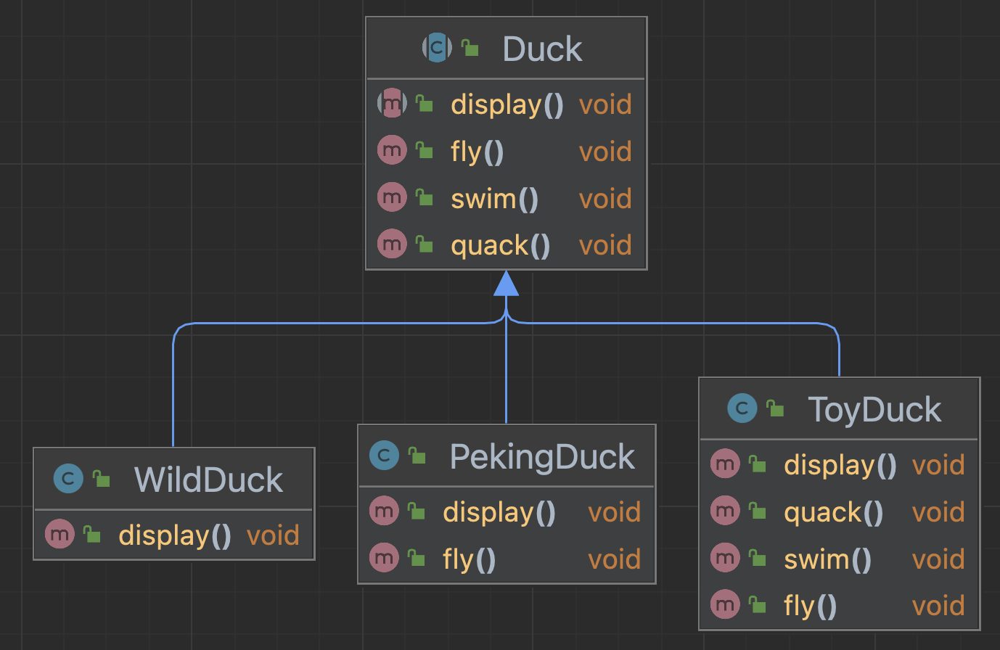
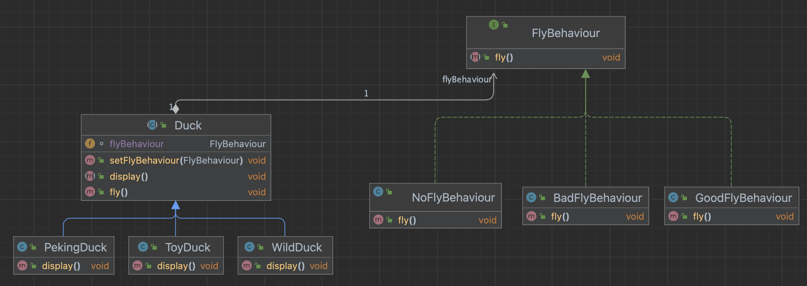

行为型模式: 类或对象如何交互, 如何划分职责, 从而更好地完成任务


# 1. :moon: 模版方法模式 (Template Method)
96-100

UniMelb week 10 https://refactoring.guru/design-patterns/template-method


# 2. 命令模式 (Command)
101-105


# 3. 访问者模式 (Visitor)
106-110

# 4. :moon: 迭代器模式 (Iterator)
111-116

# 5. :moon: 观察者模式 (Observer)
117-122

UniMelb week 10 https://refactoring.guru/design-patterns/observer


# 6. 中介者模式 (Mediator)
123-126 

# 7. 备忘录模式 (Memento)
127-130

# 8. 解释器模式 (Interpreter)
131-135

# 9. 状态模式 (State)
136-139

# 10. :moon: 策略模式 (Strategy)
140-144

UniMelb week10 https://refactoring.guru/design-patterns/strategy


:bangbang:  策略模式的思想是, 将主体类的多变的行为抽象为策略接口, 然后通过策略接口提供不同的策略实现, 并将策略接口聚合到主体类中来达到主体类的可变行为.  策略接口通常是functional interface, 所以常和lambda表达式连用


鸭子问题

编写鸭子项目，具体要求如下:

1) 有各种鸭子(比如 野鸭、北京鸭、水鸭等， 鸭子有各种行为，比如 叫、飞行等) 
2) 显示鸭子的信息


传统实现方式: 继承 + 重写方法




传统的方式实现的问题分析和解决方案

1) 其它鸭子，都继承了Duck类，所以fly让所有子类都会飞了，这是不正确的, 比如ToyDuck并不会飞
2) 上面说的1的问题，其实是继承带来的问题:对类的局部改动，尤其超类的局部改动，会影响其他部分。会有溢出效应

3) 为了改进1问题，我们可以通过覆盖fly方法来解决=>覆盖解决
4) 问题又来了，如果我们有一个玩具鸭子ToyDuck, 这样就需要ToyDuck去覆盖Duck的所有实现的方法 => 解决思路 策略模式 (strategy pattern)


## 基本介绍

+ 策略模式(Strategy Pattern)中，定义算法族，分别封装起来，让他们之间可以 互相替换，此模式让算法的变化独立于使用算法的客户

+ 这算法体现了几个设计原则，
  + 把变化的代码从不变的代码中分离出来; 
  + `面向接口编程`而不是面向具体类(定义了策略接口);
  + 多用组合/聚合， 少用继承(客户通过组合方式使用策略)。


说明:从上图可以看到，客户context 有成员变量strategy或者其他的策略接口 ,至于需要使用到哪个策略，我们可以在构造器中指定.


## 代码实现

142

思路分析(类图) 策略模式:分别封装行为接口，实现算法族，超类里放行为接口对象，在子类里具体设定行为对象. 原则就是:分离变化部分，封装接口，基于接口编程各种功能。此模式让行为的变化独立于算法的使用者. 

+ 下图中, 还可以添加关于鸭子叫的策略接口, 类似FlyBehaviour




策略接口及其实现类:

```java
public interface FlyBehaviour {
    void fly();
}

public class BadFlyBehaviour implements FlyBehaviour{

    @Override
    public void fly() {
        System.out.println("bad fly behaviour");
    }
}

public class GoodFlyBehaviour implements  FlyBehaviour{

    @Override
    public void fly() {
        System.out.println("good fly skills");
    }
}

public class NoFlyBehaviour implements FlyBehaviour{
    @Override
    public void fly() {
        System.out.println("cannot fly");
    }
}
```

执行策略的主体:

```java
public abstract class Duck {

    // 属性, 策略接口
    FlyBehaviour flyBehaviour;

    public void setFlyBehaviour(FlyBehaviour flyBehaviour) {
        this.flyBehaviour = flyBehaviour;
    }

    public Duck(){
    }

    public abstract void display();     // 显示鸭子信息
    public void fly(){
        if(flyBehaviour != null) {
            flyBehaviour.fly();
        }
    }
}

public class WildDuck extends Duck {
    public WildDuck() {
        this.flyBehaviour = new GoodFlyBehaviour();
    }
    @Override
    public void display() {
        System.out.println("this is wild duck");
    }
}

public class PekingDuck extends Duck {
    public PekingDuck() {
        flyBehaviour = new BadFlyBehaviour();
    }

    @Override
    public void display() {
        System.out.println("this is a peking duck");
    }
}

public class ToyDuck extends Duck {

    public ToyDuck() {
        flyBehaviour = new NoFlyBehaviour();
    }

    @Override
    public void display() {
        System.out.println("this is toy duck");
    }
}
```


## ArrayList 源码

JDK的Arrays的Comparator就使用了策略模式, 一般策略接口是functional interface

```java
public class Strategy {
    public static void main(String[] args) {
        Integer[] data = { 9,1,2,8,4,3 };

        // 实现升序排序，返回-1放左边，1放右边，0保持不变

        // 说明
        // + 实现了Comparator接口(策略接口), 匿名类的对象 new Comparator<Integer>(){} 是实现了策略接口的策略对象
        // + 对象new Comparator<Integer>(){..} 就是实现了策略接口的对象, 包含具体的策略
        //    + public int compare(Integer o1, Integer o2){...} 指定具体的处理方式
        Comparator<Integer> comparator = new Comparator<Integer>() {
            public int compare(Integer o1, Integer o2) {
                if(o1 > o2) {
                    return 1;
                }else{
                    return -1;
                }
            };
        };

        // 说明：
        /**
         * public static <T> void sort(T[] a, Comparator<? super T> c) {
         *         if (c == null) {
         *             sort(a);         // 默认策略
         *         } else {
         *             if (LegacyMergeSort.userRequested)
         *                 legacyMergeSort(a, c);       // 使用策略对象c
         *             else
         *                 TimSort.sort(a, 0, a.length, c, null, 0, 0);
         *         }
         *     }
         */

        // 方式1 提供具体的策略对象
        Arrays.sort(data, comparator);      // (操作对象, 操作策略)
        System.out.println(Arrays.toString(data)); //

        // 方式2 采用lambda表达式, 提供functional interface内唯一的方法的实现
        Integer[] data2 = {19,11,12,18,14,13};
        Arrays.sort(data2, (var1, var2) -> {
            if(var1.compareTo(var2) > 0){
                return 1;
            }else {
                return -1;
            }
        });
        System.out.println( "data2: " + Arrays.toString(data2));
    }
}
```


:question: 在`Comparator`内有不止一个方法, 为什么它是functional interface?

Since Java 8, interfaces can also be used as functional interfaces, which have exactly one abstract method (<u>excluding methods inherited from `Object`)</u>, allowing them to be used with lambda expressions and method references. ----> 所以Comparator是functional interface


# 11. :moon: 责任链模式 (Chain of Responsibility)
145-149


