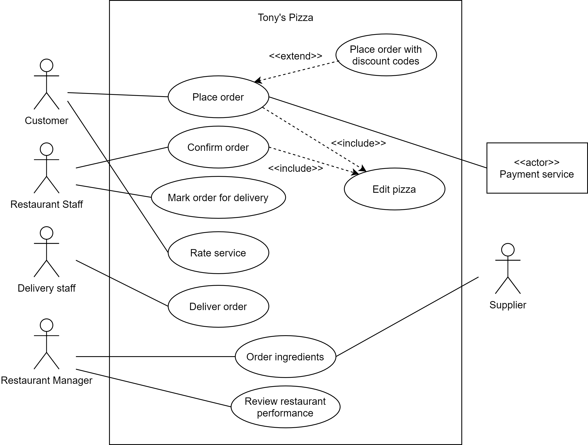

# 1. Intro

## Brief Background:

The software engineers have discussed with Tony about his pizza business and identified who will use the system and how they use. The details have been recorded in the text. Based on the provided details, the software engineers use a UML use case diagram to clearly visualise the relationships between use cases and the actors. In addition, they also create the use case text for each of the use cases to document the details of the business process of Tony's business.

## Content Structure:

In this week, we aim to provide a demonstration of how to create a UML use case diagram based on a particular scenario. We also jot down various examples of use case text in different styles.


# 2. :gem: Use Case Diagram

To gain a high-level overview of the use cases, the engineering team created the following use case diagram. As you can see, it does not include all the steps of each use case, because otherwise it will make the diagram very cluttered and unreadable. This page also provides [a tutorial video](https://canvas.lms.unimelb.edu.au/courses/153221/pages/case-study-1-dot-2-use-case-diagram-and-tutorial-video#tutorial_video) of how the use case diagram is created.


Use case text:

Tony has outlined the following as <u>critical use cases</u> (就相当于是app的需求) for the initial version of the system: 

- **Customers** can place orders for pizzas and drinks. They are able to customise the toppings on the pizza. Customers can choose to pay by either credit card online or with cash on pick up/delivery. 
  - In future, Tony would also like to support a discount system so that loyal customers can access deals when placing their orders. This is out of scope for the initial version. 
- **Restaurant staff** can confirm once the order has been placed. They may need to modify the order if they are out of stock of a pizza topping. 
- **Restaurant staff** can update the status of the order when it is ready for collection 
- Order deliveries will be assigned to **delivery staff** in an efficient order 
- **Delivery staff** can perform delivery jobs and mark them as completed 
- **Customers** can rate their experience of the order 
- **Restaurant Managers** can manage an inventory of ingredients and place orders directly from suppliers 
- **Restaurant Managers** can review the performance of all team members at their store 


Now transform the user case text to Use case diagram below following steps:

```java
1. identify actors. 
  1.1 primary actor and supoorting actors (person based or system based)
2. map each use case text into a use case bublle
	2.1 skipping over use cases for a future need
3. looking back at the diagram, extract the common points accross different uses cases as included use case to avoid repetation
4. add exetended use case
```




# 3. :gem: Textual Use Cases

The engineering team also created the following three textual use cases, in order to confirm the flow of system operations. These have been written in different styles below in order to illustrate the differing levels of detail and formality.


## **Use Case 1: Order ingredients (Brief style)**

just  a block of texts, no structure

> The restaurant manager logs into the system using their staff ID and password to view the stock of ingredients. The system presents the current stock levels of the pizza ingredients at their restaurant. The restaurant manager selects items that are at a low stock level and enters the desired amounts that they wish to order for each ingredient. The restaurant manager confirms their order. The system records the details of the order and sends a confirmation email to the restaurant manager. The system sends the order requests to the relevant suppliers.


## **Use Case 2: Deliver order (Casual style)**

a bit more structrual language with Main success scenario and alternate scenario decribing possible failure result to the main success scenario


> **Main success scenario:** A delivery staff receives a notification that a delivery order has been assigned to them. The delivery staff arrives at the restaurant to collect the order. The system presents the delivery staff with an itemised list of the ordered items. The delivery staff checks that the order number matches their assigned job and that all ordered items are present. The delivery staff marks the order as collected. The system will present the delivery staff with the delivery address and assist them in navigating there. The customer is notified that the order is being delivered. When the delivery staff completes the delivery, the delivery staff marks the order delivery as complete.
>
> **Alternate Scenarios:** If the order has missing items upon collection, the system informs the restaurant manager and waits until the collection can be marked as complete. If the customer is not at the delivery address to receive the order, the delivery staff marks the delivery as incomplete. The system will provide the contact details of the customer so that the delivery staff can coordinate handover of the order.


## **Use Case 3:** **Place order (Fully dressed style)**

what we are mainly after, with fully dressed structural language and step by step description

+ In alternate scenarios, there could be branch option for each step noted as e.g. 6a, 6b are the possible branch in step6


> **Use case name:** **Place order**
>
> **Scope:** Tony’s Pizza - Online Ordering System
>
> **Level:** User goal
>
> **Primary actor:** Customer
>
> **Preconditions:** The current time is within operating hours for the restaurants
>
> **Success Guarantee:** An order has been placed and is pending confirmation from the selected restaurant
>
> **Special Requirements:** Seamless user experience Optimisation for mobile devices Reliable communication with payment service
>
> **Main success scenario**:
>
> ​	1. Customer selects pizza style from menu
>
> ​	2. System informs the customer of toppings included in the selected style
>
> ​	3. Customer selects pizza size
>
> ​	4. Customer adds pizza to order
>
> Repeat steps 1-4 until done
>
> ​	5. Customer selects drink from menu
>
> ​	6. Customer selects bottle size
>
> ​	7. Customer adds drink to cart
>
> Repeat steps 5-7 until done
>
> ​	8. Customer selects a collection method
>
> ​	9. Customer selects the restaurant location
>
> ​	10. Customer confirms the total price of the order
>
> ​	11. Customer selects a payment method
>
> ​	12. Customer receives confirmation that their order has been placed
>
> ​	13. Staff at selected restaurant location are notified of incoming order
>
> **Alternate scenarios**:
>
> ​	2a. Customer edits pizza toppings: Include Edit Pizza.
>
> ​	4-7. Customer removes item from cart
>
> ​	8a. Pick up from store
>
> ​		1. Customer selects the restaurant location to pick up from
>
> ​		2. System gives customer pick up instructions
>
> ​	8b. Delivery
>
> ​		1. Customer adds their delivery address
>
> ​		2. System selects nearest restaurant location to fulfil the order
>
> ​		3. Delivery fee is added to their total price
>
> ​	9a. Delivery address is outside of the range for any restaurant locations
>
> ​		1. Customer is notified that their order cannot be placed
>
> ​		2. Order process is terminated
>
> ​	11a. Cash on pick up/delivery
>
> ​	11b. Pay by credit card online
>
> ​		1. Customer enters cardholder name, card number and expiry
>
> ​		2a. Pending charge is placed on Customer’s account
>
> ​		2b. Payment is declined / Customer directed back to step 11
>
> *a. At any time, customer terminates the order process


## **Use Case 4: Edit Pizza (Fully dressed style)**


> **Use case name:** **Edit Pizza**
>
> **Scope:** Tony’s Pizza - Online Ordering System
>
> **Level:** Subfunction
>
> **Primary actor:** Customer or Staff member
>
> **Preconditions:** A pizza from the menu has been selected
>
> **Success Guarantee:** The pizza’s toppings have been modified
>
> **Main success scenario**:
>
> ​		1. Review pizza toppings
>
> ​		2. Modify toppings
>
> Repeat step 2 until done
>
> ​		3. Confirm updated price of pizza
>
> **Alternate scenarios**:
>
> ​		2a. Add topping to pizza
>
> ​		2b. Remove topping from pizza