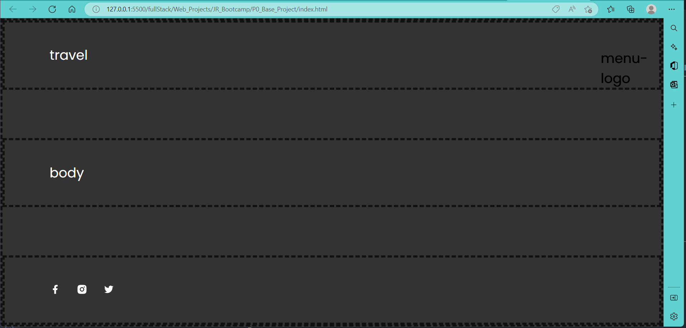
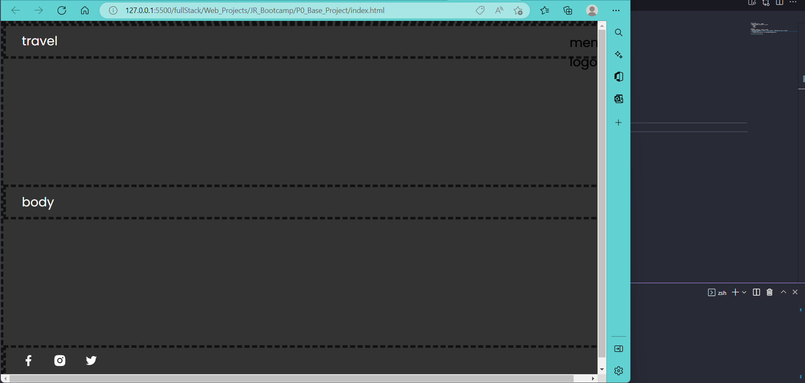

只是一个毛坯, 
+ 还没有用JS定义event和逻辑功能
+ 仅有main menu这一个section, 分为三部分:
    + header
    + body
    + footer

但feature:
+ flexblox, 允许block随着视口大小动态变化
+ CSS动态特效: 当视口大小小于某个值, 启用另一套style, 中间的transition time也作出了定义
+ import自定义字体
+ 使用变量来定义某个dimension, 以及定义变量之间的dependencies

以下对相同的屏幕区域截屏:
+ 当max-width大于1200px:

+ 当max-width小于1200px:
block大小, 内部字体大小都发生了变化
