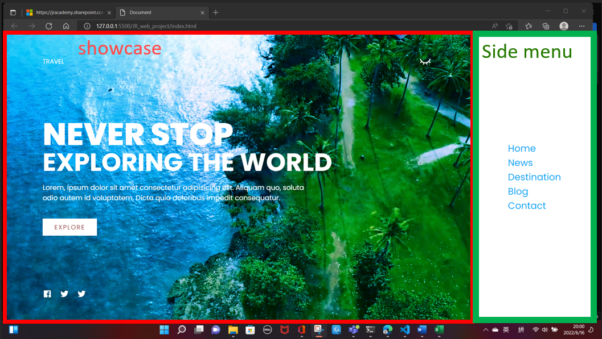
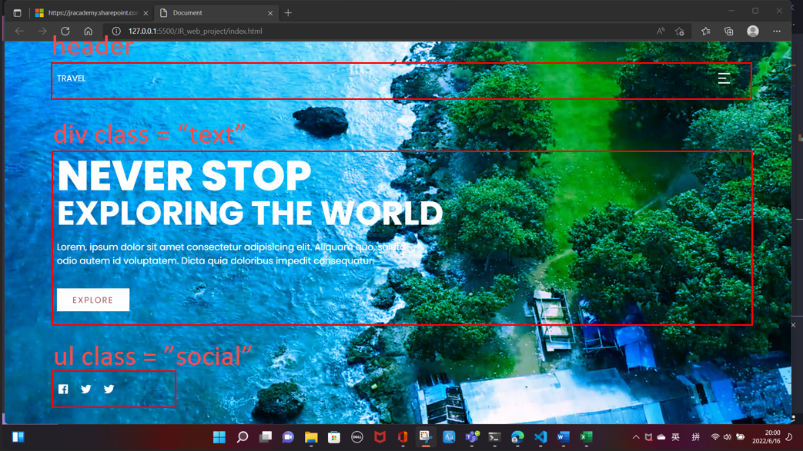
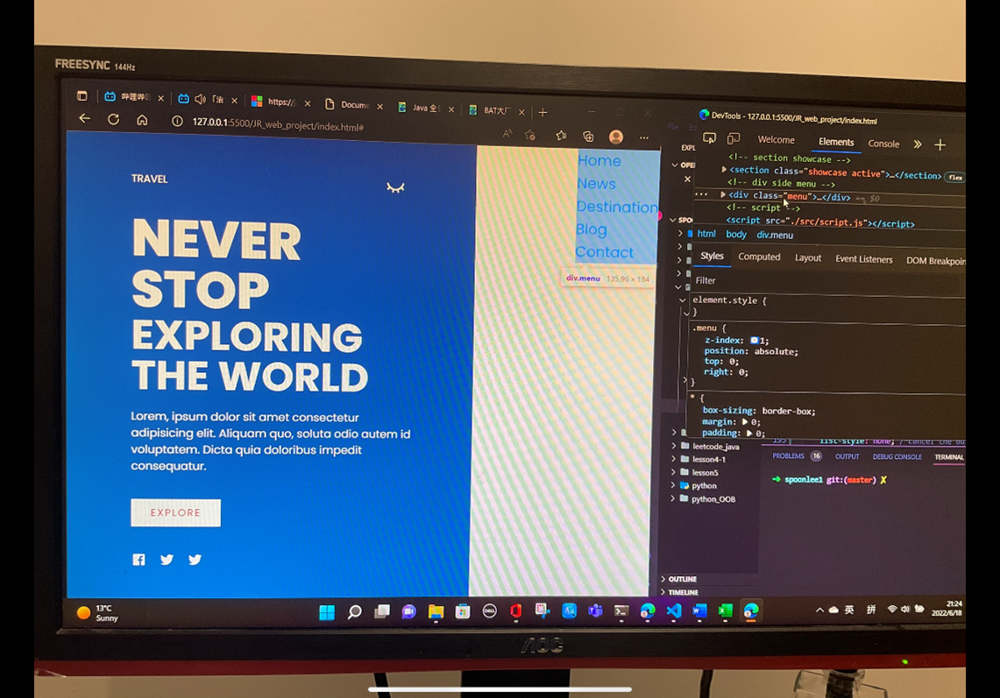

跳转 

[index.html](./index.html)

---
Contents

- [1. 并列属性](#1-并列属性)
  - [1.1 "showcase" 向左收缩, "menu"显现](#11-showcase-向左收缩-menu显现)
  - [1.2 menu icon 变化](#12-menu-icon-变化)
- [2. CSS中定义menu样式](#2-css中定义menu样式)
- [3. JS中定义Event](#3-js中定义event)


---
Features

一个较为完备的web project, 包含:
+ CSS动态特效
  + 点击menu, 侧边窗弹出(利用并列属性优先级高和JS event)
  + 鼠标移到图标上, 图标会发生对应变化
+ JS定义触发事件

对应匠人新手班tutorial3, JS lessons3

之后还有在此project基础上更为进阶的教程, 见 [Top-Coder b站](https://www.bilibili.com/video/BV1Gg411o7aE/?spm_id_from=333.999.0.0&vd_source=c6866d088ad067762877e4b6b23ab9df)

UI design分割:





---
# 1. 并列属性
当两个class 一起写(中间没有空格时),  如.showcase.active， 表示showcase 和 active是并列关系, 此时并列属性比任意一个拆开的属性的优先级都高. 我们经常利用并列属性和JS, 通过触发事件来修改某个网页模块的样式(如修改某个图标, 改变页面布局...). 

当点击menu的图标时('click' event), 会产生两个效果:
+ "showcase" 向左收缩, "menu"显现
+ menu icon变化

## 1.1 "showcase" 向左收缩, "menu"显现
如下, 我们希望当"showcase"通过JS事件触发变成"showcase active"之后, 将"showcase" block向左收缩一定距离, 从而使得z-index较低的"menu"显现出来(menu其实一直都存在, 只是z-index比较低被覆盖了) 

```css
.showcase.active {
  /*watch: no space; it means that only when showcase & active 
    show up in the same time in the class name, then employ below settings; we will use js to control how to add 
    active in html tag class name to activate below settings*/
  right: var(--menu-width); /**showcase至上一级position为absolute右边框的距离*/
  width: calc(100% - var(--menu-width)); /**即新的showcase的宽度*/
}
```

## 1.2 menu icon 变化

```css
.toggle.active{ /*when click menu, toggole to another state*/
    background-image: url('./image/close.svg');

}
```

# 2. CSS中定义menu样式

+ 记得在定义menu内部布局之前, 先定义width和height, 否则menu的width和height会按照包络里面文字的最小block来算(如下图)

  

+ 注意position与层级关系, 一些相对的属性比如top, right, width, height会和上一层元素的position有关

```html
<!-------------- side menu ------------------>
    <div class="menu">
      <!--this is for menu-->
      <ul>
        <li><a href="http://www.google.com">Home</a></li>
        <li><a href="#">News</a></li>
        <li><a href="#">Destination</a></li>
        <li><a href="#">Blog</a></li>
        <li><a href="#">Contact</a></li>
      </ul>
    </div>
```

```css
/*------------------menu-------------------*/
.menu {
  position: absolute; /*isolate .menu from the file flow so that we can place menu wherever we want*/
  top: 0;       /*回溯html上一层定位，直到那一层position:relative,选取该层作为参考系, position默认为static*/
  right: 0;     /*回溯html上一层定位, 直到...*/

  width: var(--menu-width);
  height: 100%; /*回溯html上一层定位, 直到...*/

  /*in order to make menu list in the middle, need to define width & height first*/
  display: flex;    /*effective for elements under .menu */
  justify-content: center;
  align-items: center;

  z-index: 1;   /*z-index: 1; make sure showcase can cover menu*/
}

.menu ul {
  position: relative;

  list-style: none; /*cancel the bullet points*/
}

.menu ul li a {
  text-decoration: none; /*hide the underlines*/
  font-size: 24px;
  color: var(--overlay-color); /*font color*/
}
```


# 3. JS中定义Event

先选node, 再用Node的内置方法

``` js
/**get the DOM node: toggle */
const menuToggle = document.querySelector('.toggle');

/**get the DOM node: showcase */
const showcase = document.querySelector('.showcase');

/**DOM2 function addEventListener: define event when click on toggle */
menuToggle.addEventListener('click', ()=>{

    // "menu" toggle 'active'-----------------------
    menuToggle.classList.toggle('active') /**toggle: switch,
     if having 'active' then remove it, if not having 'active' then add it in the class name*/
    // menuToggle.classList.add('active')
    // menuToggle.classList.remove('active')

    // "showcase" toggle 'active'------------------
    showcase.classList.toggle('active')
})
```