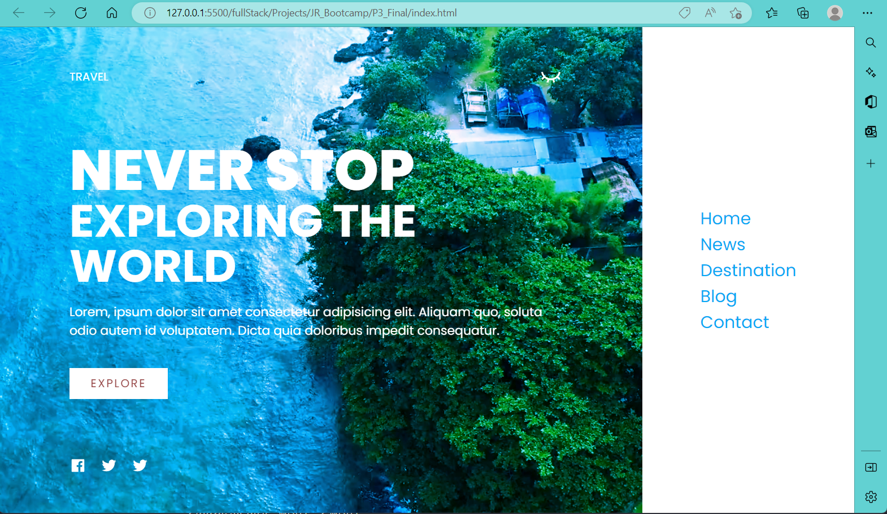

Contents

- [经验:](#经验)
  - [写web page步骤:](#写web-page步骤)
  - [对于style.css的模板](#对于stylecss的模板)
  - [对于一个CSS class的模板](#对于一个css-class的模板)
- [资源](#资源)


---

P3最终效果:
网页分为main-menu和side-menu两部分



重点关注P3,P4
[P3_Final_effect](./P3_Final/P3_Final.md)

[P4_MoreAdvanced](./P4_MoreAdvanced/P4_MoreAdvanced.md)

---

# 经验:

## 写web page步骤:
+ step1: 根据UI design, 分割网页模块, 结合`文档流`先写一个html的框架
+ step2: 去实现CSS和JS的细节 
    + CSS中也按照`文档流`的顺序来定义html中标签的渲染与布局属性, 从大到小, 从上到下

## 对于style.css的模板
```CSS
@import ... 

/*===================定义全局属性=======================*/
:root{
    /*定义各种变量*/
    --font-color: white;
}


html,body{
    width: 100vw;       /*100% viewport width*/
    height: 100vh;      /*100% viewport height*/
    ...
}

*{
    box-sizing: border-box; /*dimension defined include border, padding, content*/
    margin: 0;
    padding: 0;
    ...
} /*global settings, normaly we do this*/

/*===============自定义class属性=================*/
.class1{
    
}

.class1 Class1_subClass1{

}
...

.class2{

}

.class2 Class2_subClass2{

}

...
/*================另一套style方案===================*/
@media(max-width: 798px){       /*触发条件*/

 }

```


## 对于一个CSS class的模板
```css
.class1{
    /*------------------position property-----------------*/
    position: ;
    left: ;
    top: ;
    ...

    /*-----------------dimensional property-------------*/
    width: 100px;
    height: 100%;
    padding: ;
    ...

    /*-----------------layout property------------------*/
    display: flex/inline-block;
    align-content: ;
    justify-content: ;
    ...

    /*-------------------other property--------------*/
    /*text style*/
    font-size: ;
    font-weight: ;
    letter-spacing: ;
    text-decoration: ;
    text-transform: ; 
    list-style: ;

    /*depth, color*/
    z-index: ;
    color: ;
    background: ;
    filter: ;

    /*cursor, dynamic effect*/
    cursor: ;
    transition: ;

    ...
}

```

---
# 资源

在这里下载src的图片, 字体和视频资源
[Top-Coder docs](https://www.wolai.com/topcoderdoc/qxVBEVDrfSzif4djdw4hGm)