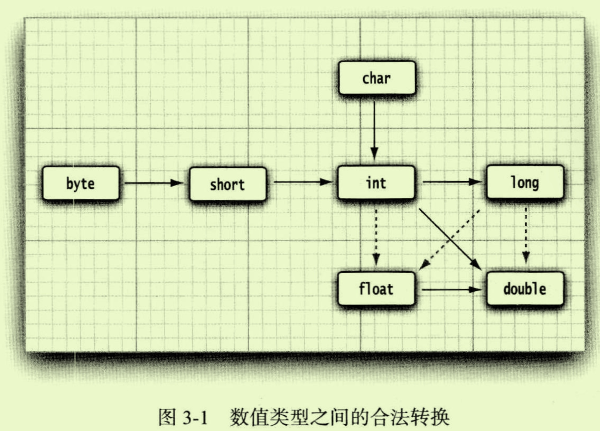
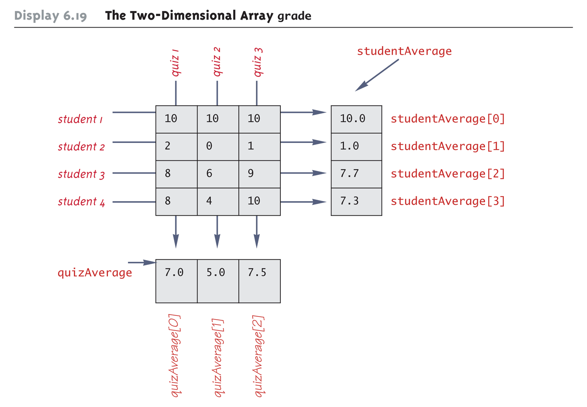
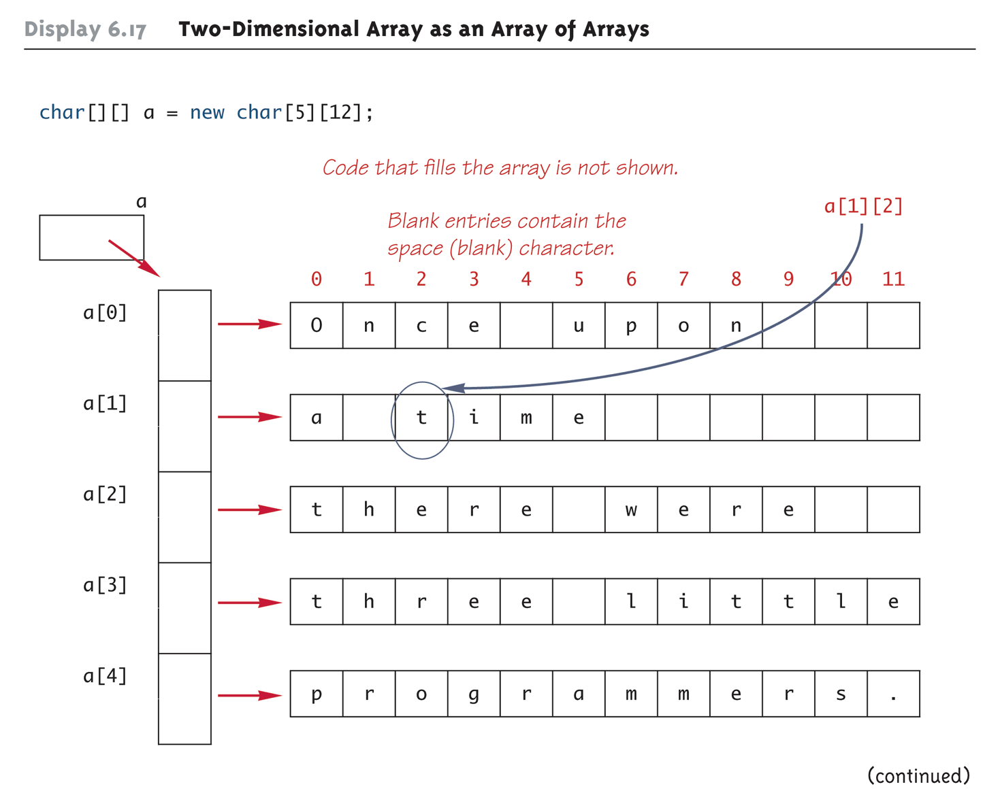

# Chapter 3 Java基本程序设计结构

## 3.3 数据类型

---
以下来自UniMelb: Java
[demo_overflow](overflow.java)

---

### 3.3.1 整型
|类型 |存储需求  | 取值范围|
--- | --- | ---|
|byte|1 Bytes|-128~127 |
|short|2 Bytes|-32768 ~ 32767 |
|int|4 Bytes|-2 147 483 648 ~ 2 147 483 647 (刚超过20亿) |
|long|8 Bytes|-9 223 372 036 854 775 808 ~ 9 223 372 036 854 775 807|

### 3.3.2 浮点类型
|类型 |存储需求  | 取值范围|
--- | --- | ---|
|float|4 Bytes|大约 $\pm$ 3.402 823 47E+38F (有效位为6~7位)|
|double (更常用)|8 Bytes|大约 $\pm$ 1.797 693 134 862 315 70E+308 (有效位为15位)|


### 3.3.3 Char类型

### 3.3.4 Unicode和Char类型


### 3.3.5 boolean类型


## 3.5 运算符
### 3.5.1 算术运算符
>+ 当参与/运算的两个操作数(operand)都是整数时, 表示整数除法; 否则表示浮点除法. 如 15/2=7, 15.0/2=7.5
>+ 整数被0除将会产生一个异常, 而浮点数被0除将会得到无穷大或NaN结果.


### 3.5.2 数学函数与常量

### 3.5.3 :moon:数值类型之间的转换
Java has different integer types (byte, short, int, long) and different "floating point" types (float, double). These take up increasing amounts of storage (1, 2, 4, 8 bytes for integers, 4, 8 bytes for floating point), but can store larger ranges of numbers.

> Widening conversion
> 在二元运算中, 当混用两种类型的数值时(如a+b, a是int, b是float), 先将两个操作数化为同一类型再做计算, 优先级是 double > float > long > int **(即有浮点就化浮点, 有精度高的结果就精度高)**, 如下:
>+ 如果两个操作数中有一个是double型, 另一个也化为double型
>+ 否则, 如果其中一个操作数是float型, 另一个操作数也化为float型
>+ 否则，如果其中一个操作数是long型, 另一个操作数也化为long型
>+ 否则, 两个操作数都将被转换为int型  



上图中有6个实线箭头, 表示无信息丢失的转换; 另有3个虚线箭头, 表示可能有精度损失的转换(由编码方式决定).

---

以下来自UniMelb: Java

The char type is a special case. While it technically is not an int it is an integral type, i.e., it is considered to be a whole number that can be converted to and from other integral types:
```java
public class Conversion {
    public static void main(String[] args) {
        char c = 'J';
        long y = 10;
        System.out.println(c+y); //84
        
    }
}
```
---

### 3.5.4 :moon:强制类型转换 (Typecasting)
narrowing conversion
强制类型转换: 在圆括号内给出想要转换的目标类型, 后面紧跟待转换的变量名.例如:
```java
double x = 9.997;
int nx = (int) x;
```
这样变量nx的值为9. 因为强制类型转换通过截断小数部分将浮点值转换为整型.

如果想对浮点数做舍入运算, 以便得到最接近的整数, 使用Math.round方法.

---

以下来自UniMelb: Java  
A char converted to an int represents the corresponding ASCII code (or Unicode code point) of the character. Typecasting can be used to convert an int to a char type:
```java
public class Conversion {
    public static void main(String[] args) {
        int j = 74;
        int a = 65;
        int v = 86;
        System.out.println((char)j + "" + (char)a + "" + (char)v + "" + (char)a); // "JAVA"
    }
}
```
A cast can also be used to explicitly ask for a widening conversion:
```java
public class Conversion {
    public static void main(String[] args) {
        //narrowing
        short x;
        int y = 50;
        x = (short) y;
        System.out.println(x); //50

        //narrowing
        int sum = 10;
        int count = 2;
        double average = (double)sum / count;
        System.out.println(average); //5.0
    }
}
```
---

### 3.5.5 结合赋值和运算符

### 3.5.6 自增与自减运算符
++x, --x 先加减后用
x++, x-- 先用后加减

### 3.5.7 关系与boolean运算符
> 关系运算符
> <, <=, >, >=
> !=, ==
> 返回true OR false
> ```java
> boolean result = (5!=4);// result = true
> ```

> boolean运算符
> &&(AND), ||(OR), !(NOT)
> 通过true, false的与或非关系返回true OR false
> 短路方式求值: 如果第一个操作数足以确定表达式的值, 第二个操作数就不必计算了

>三元运算符
> ?:
> 表达式: condition? expression1:expression2

### 3.5.8 位运算符

### 3.5.9 括号与运算符级别
见书P44 
优先级(Precedence)
结合性(Associativity)

## 3.6 :full_moon:字符串String
[JavaString](stringJava.java)

从概念上讲, Java字符串就是Unicode字符序列.Java没有内置的字符串类型, 而是在标准Java类库中提供了一个预定义类, 很自然地叫做String.**每个用双引号括起来的字符串都是String类的一个实例.**

---
以下来自UniMelb: Java

+ Using a backslash (\) allows you to include double-quotes and other special characters (including \ itself) in a string:
```java
System.out.println("He said a \"backslash (\\) is special!\""); //He said a "backslash (\) is special!"
System.out.println("Windows file names become C:\\users\\fred"); // Windows file names become C:\users\fred
```

+ Certain letters after a backslash are treated specially, for example, \n for a new line and \t for a tab character.

+ Two strings can be appended using +, an operation also called concatenation. If either operand is a string, the + operation will convert the other operand into a string:
    ```java
    // simple concatenation
    System.out.println("Hello " + "String!"); //Hello String!

    // conversion
    int x = 1;
    System.out.println("x = " + x); // x = 1

    // can you figure out (and fix) what happens here?
    System.out.println("x + x = " + x + x); // x + x = 11
    System.out.println( x + x + "= x + x  "); // 2 = x + x
    // Explain what happens here.
    String strJ = "J";
    char chrJ = 'J';
    System.out.println ("With a string we get " + (strJ + 1)); //With a string we get J1
    System.out.println ("With a char we get " + (chrJ + 1)); // With a char we get 75, as char is treated as int
    ```
+ [Java Doc for more String API](https://docs.oracle.com/javase/8/docs/api/java/lang/String.html)

---

### 3.6.1 子串
```Java
String greeting = "Hello";
String s = greeting.substring(0,3); // s = "Hel", 第二个参数是不想复制的第一个index, 这里是(0,3)就表示只截取index=0,1,2
```

### 3.6.2 拼接
+ 用+连接

  字符串 + 非字符串， 后者会被转换成字符串

### 3.6.3 不可变字符串
String类没有提供修改字符串中某个字符的方法, 所以Java文档中将*String类对象*称为是**不可变的(immutable)**. 但是, 可以修改字符串变量, 让它引用另外一个字符串.String类对象本身就像是一个完整的实体存在内存中不能修改, 但是却可以改变字符串变量让它引用String类对象的一部分或者引用别的String类对象, 如:
```java
greeting = greeting.substring(0,3)+"p!";
```
Java的不可变字符串特性使得修改字符串的效率没那么高, 但是编辑器可以让字符串共享. **其实大多数情况下我们更需要比较两个字符串，而非修改字符串.**

注意C++中字符串是可修改的, 可以修改字符串中的单个字符.

### 3.6.4 检测字符串是否相等
```Java
s.equals(t) // return true if s与t相等; 否则return false
```
这里s和t可以是字符串变量, 或者字符串字面量(就是"aaaa..."之类的)

```Java
"Hello".equalsIgnoreCase("hello") // 忽略大小写检查
```

**注意千万别使用==运算符检测两个字符串是否相等!** ==运算符只能确定两个字符串是否存放在同一个位置. 如果字符串放在同一个位置上, 它们必然相等, 但是完全有可能将内容相同的多个字符串副本放置在不同的位置上.

### 3.6.5 空串与Null串
  + 检测是否为空串
```Java
if (string.length()==0)
or
if(str.equals(""))
```
+ 检测是否为null
```Java
if(str == null)
```
+ 检测是否为null & 空串
注意必须先检查是否为null, 因为无法在null值上调用方法.
```Java
if(str!=null && str.length() != 0 )
```

### 3.6.6 码点与代码单元
略
记住不要使用char类型,太底层了.

### 3.6.7 String API

[Java Doc for more String API](https://docs.oracle.com/javase/8/docs/api/java/lang/String.html)
### 3.6.8 阅读联机API文档
+ [阅读Java联机API文档](https://docs.oracle.com/en/java/javase/18/)  
当使用的类不是定义在基本java.lang包中时， 一定要使用import指令导入相应的包. 例如读取System.in, 需要import java.util包, 来使用[Scanner类](https://docs.oracle.com/en/java/javase/18/docs/api/java.base/java/util/Scanner.html) , 你可以查看它的定义, method之类的说明

### 9. 构建字符串 
使用StringBuilder类
```java
//构建一个空的字符串构造器
StringBuilder builder = new StringBuilder();
// 添加内容
builder.append("who's ");
builder.append("your daddy");
// 字符串构建完成, 使用toString method将其转化成string
String completedString = builder.toString();

System.out.println(completedString);
```
## 3.7 :full_moon:输入输出
### 3.7.1 读取输入
[inputTest](inputOutput.java)

注意Scanner 类定义在java.util中. 当使用的类不是定义在基本java.lang包中时， 一定要使用import

> 常用Scanner api:
>+ keyboard.nextLine(): reads **the entire line**, including the newline character (\n换行符)
>+ keyboard.next(): reads in **one word** as a String
>+ keyboard.nextInt(): reads in a number and converts it to int
>+ keyboard.nextDouble(): reads in a number and converts it to double

记得用完后close Scanner

更多API见[Java Scanner API](https://docs.oracle.com/javase/8/docs/api/java/util/Scanner.html)

---
UniMelb Java e.g.:

Write a calculator that will read a line like

num1 + num2 or num1 * num2

and output the sum in the first case, or the product in the second case.

```java
public static void main (String[] args) {
    System.out.println ("Enter either  num1 + num2  or num1 * num2");
    
    Scanner keyBoard = new Scanner (System.in);

    int firstNum = keyBoard.nextInt();
    char operator = keyBoard.next().charAt(0); // get the first character of a String
    int secondNum = keyBoard.nextInt();

    int result = (operator=='+')?firstNum+secondNum:firstNum*secondNum;
    System.out.println(result);
}
```

**It is also worth mentioning the use of nextLine() and nextInt (watchful when mixed use them!)**, see below quiz question: What are the values of x, s, and y after running the program below with the following parameters:

```shell
java IOTest
8
Test
9
```

```java
import java.util.scanner;

class IOTest {
  public static void main (String[] args) {
    Scanner keyboard = new Scanner(System.in);
    int x = keyboard.nextInt();
    String s = keyboard.nextLine();
    int y = keyboard.nextInt();
  }
}
```

The answer is miraculously:

The following exception is thrown:
```shell
Exception in thread "main" java.util.InputMismatchException
```

In fact:

x = 8 (there is a hidden newline "\n" when the input is provided but only the number is read in.

s = "\n" (that hidden newline character makes it into the nextLine() method)

y = "Test"  >  The String cannot be converted to int.

>Tim, the lecturer answers:
>In order to send your input to the Scanner input, you will need to hit 'enter', which produces a newline on your console, so technically the above input looks like this:
>```shell
>8\n
>Test\n
>9\n
>```
>The method nextInt() only parses the next number while >nextLine() parses the entire line.


---

### 3.7.2 格式化输出(Formatted output)

---
MelbUni: Java

This so-called format-string is an ordinary string, but can contain format specifiers for each argument you pass in:
```java
double average = 5.0;
System.out.printf("Average: %5.2f", average);
```

**A format specifier** begins with % and may have a number specifying how to format the next value in the list of arguments.  It ends with a letter specifying the type of the value:
```java
String formatString = "%X.Y"; // Syntax: x.y; where x= padding (width) and y= decimal places.
```

> The X before the decimal point specifies the minimum number of characters to be printed.
>+ The full number will be printed, even if it takes more characters than specified by X 
>+ If X is omitted, the value will be printed in its minimum width 
>+ If X is negative, the value will be left-justified, otherwise right-justified
>+ If X starts with a zero, then the number will be padded with leading 0s (good if printing for a variable-width font, where the width of a space is different from the width of a digit); otherwise it will be padded with spaces

>The Y after the decimal point specifies the number of digits of the value that are printed after the decimal point. If Y is omitted, Java decides how to format it. 


---

|转换符 |类型  | 示例|转换符 |类型  | 示例|
--- | --- | ---| --- |---|---|
|d|十进制整数|159 | s| 字符串| Hello|
|x|十六进制整数|9f| c| 字符| H|
|o|八进制整数|237| b| 布尔| true|
|f|定点浮点数|15.9| h| 散列码| 42628b2|
|e|指数浮点数|1.59e+01| tx or Tx| 日期时间| 已过时, 应用java.time类|
|g|通用浮点数(e和f中较短的一个)|-| %| 百分号| %|
|a|十六进制浮点数|0x1.fccpd3| 0x1.fccpd3| 与平台有关的分隔符| -|
 

 [Demo: formatPlay](formatPlay.java)

Result

```shell
"string" has 6 characters 
pi to 4 places: 3.1416
Right>>   3.1416<<
Left>>3.1416   <<
$9.99
009.99
009.99
250000.00
2.50e+05
```
### 3.7.3 文件输入与输出
[Demo: Histogram of temperatures](UniMelb/Histogram_temp/histo_temp.java)

注意上述demo因为是通过command line来读取和写出的, 所以package目前还是读取base directory中的txt file, 不是读取package内部的txt file!

### 3.7.4 Command Line Input
_this session is from UniMelb Java_

```java
public static void main(String[] args) {}
```
The variable args holds the values that a user provides when the program is executed.  e.g. [commandLineInput](commandLineInput.java):

```java
public class commandLineInput {
    public static void main(String[] args) {
        System.out.println("Hello " + args[0] + "!");
    }
}
```
type in following at terminal:
```shell
javac commandLineInput.java
java commandLineInput abc
```
Results:
```shell
Hello abc!
```

You can add arguments to your program, which will be referred to by their index: args[0], args[1], ... **Each argument is treated as a string.** But you can convert the string input to int or a double, for example using:
```java
int argument = Integer.parseInt(args[0]);
double arg0 = Double.parseDouble(args[0]);
```

e.g.

```java
public class Sum {
    public static void main(String[] args) {

        int firstNum = Integer.parseInt(args[0]);
        int secondNum = Integer.parseInt(args[1]);
        System.out.println("The result is:"+ (firstNum + secondNum));
    }
}
```
```shell
java Sum 20 24
```
```shell
The result is: 44
```

> Note: Command line arguments are usually delimited (ie separated) by spaces. By putting double quotation marks around an argument, we indicate that the spaces are a part of the single argument.
> ``` shell
> $ java SimpleCalculator "meaning of life"
> 42
> ```

## 3.8 控制流程
### 3.8.1 块作用域

### 3.8.2 条件语句

---

> conditional operator

UniMelb:Java

可以使用conditional operator在函数的argument里, 而if else却不能做到.

```java
System.out.println(Math.sqrt(Math.sin(a > 0 ? a : -a)));
```

---

### 3.8.3 循环


### 3.8.4 确定循环

---

for loop

+ A for loop can contain multiple initialization actions separated by commas:
```java
for(int i=0, j=100; i<j; i++) {}
```

+ A for loop can contain multiple update actions, separated by commas:
```java
for(int i=0, j=100; i<j; i++, j--) {}
```

---


### 3.8.5 多重选择: switch语句

---

UniMelb Java

```java
switch (Controlling_Expression)
{
  case Case_Label_1:
           Statement_Sequence_1
           break;
  case Case_Label_2:
           Statement_Sequence_2
           break;
  case Case_Label_n:
           Statement_Sequence_n
           break;
  default:
}

```

> 注意!
+ Beware that the controlling expression must evaluate to a char, int, short, byte or String (or an enumerated type, which we will see later).  Note that it cannot be a long.
+ The optional default label is usually used last. If no case label matches, then the only statements executed are those following the default label (if there is one).
+ Each sequence of statements should be followed by a break statement, which tells the program execution to continue after the switch block. If you don't add a break statement, the next case label will be evaluated. 
  + Advanced:  The only time it is appropriate not to have a break statement is if there are multiple cases that should run the same code, as in the following example.  Note that the "fall-through" only applies when there is no code.  Whenever there is code, there is a break.

    ```java
    class Main {
        static public void main (String[] args) {
            int a = 1;
            switch (a) {
                case 1:
                case 3: 
                case 5:
                case 7:
                case 9:
                    System.out.println("odd, single digit");
                    break;
                default :
                    System.out.println("even or multi-digit");
                    break;
            }
        }
    }
    ```
---

### 3.8.6 中断控制流程的语句

---

UniMelb Java

When loop statements are nested, any **break** or **continue** statement **applies to the innermost, containing loop statement**.

**1. label break**
 
There is a type of break statement that, when used in nested loops, can end any containing loop, not just the innermost loop. To achieve this, we use a labeled break statement. If an enclosing loop statement is labelled with an Identifier, the following version of the break statement will exit the labelled loop, even if it is not the innermost enclosing loop: 
```java
break someIdentifier;
```

To label a loop, simply precede it with an Identifier and a colon: 
```java
someIdentifier:
```
[Demo: label break](labelBreak.java)

**2. The exit Statement**
 
A break statement will end a loop or switch statement, but will not end the program. The exit method will immediately end the program as soon as it is invoked: 

```java
System.exit(0);
```
The exit statement takes one integer argument . By tradition, a zero argument is used to indicate a normal ending of the program. However, the cleanest way to end a program is to always let it run to the end of its main function, except when you want to report that an error occurred.

---

## 3.10 数组Array
### 3.10.1 :full_moon:数组声明
[arrayAnnouncing](arrayJava.java)

1. 数组是用来存储**同一类型值**的集合. 
   + 数组长度不要求是常量, 但一旦数组长度指定便无法更改(使用arrayList动态扩容).  
   + Java中允许长度为0的数组(注意长度为0的数组不同于null数组)

2. 数组的声明方式:
   + 方式1: 
       ```java
       int[] arr = new int[100];//内存中开辟一个可以容纳100个int数值的空间存放数组arr
       ```
       默认初始化:
        + int型数组元素初始化为0
        + Boolean型数组元素初始化为false
        + String型数组元素初始化为null
   + 方式2: 在{}中枚举元素, 无需指定数组长度
       ```java
       int[] arr = {1,2,3,4,5,6}; // no need to new
       ```
   + 方式3: 用匿名数组快速初始化旧数组

---

UniMelb Java:

#### 1. Base types

**You can create an array of any type, including class types.**  However, all elements in the array must have the same type.  This type is called the **base type** of the array.

Advanced: If you want to have an array of different types of objects, you can use polymorphism, which will be covered much later in this course.

An array is declared and created in almost the same way that objects are declared and created:

```java
BaseType[] ArrayName = new BaseType[size];
```

The size may be given as an expression that evaluates to a nonnegative integer, for example, an int variable.

```java
char[] line = new char[80];
double[] reading = new double[count];
Person[] specimen = new Person[2 * line.length];
```

#### 2. access

The array itself (i.e., the entire collection of indexed variables) can be referred to using the array name without any square brackets. You would use this form if you wanted to pass the array as a parameter to a method, for example.

#### 3. Three ways square brackets are used with an array name

   + The most common way: Square brackets are used to name an element of an array:
  
        ```java
        max = score[0];
        ```


   + Square brackets can be used with an integer value to create a new array
        ```java
        score = new double [5];
        ```


   + Square brackets can be used to create a type name.  In this context, the brackets are only used to mean "this is an array", because brackets are associated with arrays due to the first two uses.

        ```java
        double [] score;
        ```
#### 4. An array is considered to be an object, not a class

+ Every array has exactly one instance variable named length. When an array is created, the instance variable length is automatically set equal to its size. The value of length cannot be changed (although a new array of a different size can be assigned to the same variable).

```java
double[] score = new double[5];      // score.length now has a value of 5
```

An out of bounds index will cause a program to terminate with a run-time error message.

> Advanced: Note that this is an instance variable, not a member method.  Some classes, such as String have a method named length() for a similar role, and others have a method named size().  You can remember that arrays are the odd one out (variable not method) because they aren't classes.

+ **An array variable holds a reference to where the actual array is stored in memory**. Note also that as a result of the assignment statement above, a contains a single value: a memory address or reference:

```java
double[] a = new double[10];
```

+ The assignment operator (=) only copies this memory address. It does not copy the values of each element.

+ For the same reason, the equality operator (==) only tests two arrays to see if they are stored in the same location in the computer's memory. It does not test two arrays to see if they contain the same values.
  ```java
  (a == b)
  ```
  In the same way that an equals method can be defined for a class, an equalsArray method can be defined for a type of array. This is how two arrays must be tested to see if they contain the same elements.


#### 5. Pitfall: An array of characters is not a String

An array of characters is conceptually a list of characters, and so is conceptually like a string. However, an array of characters is not an object of the class String.  (This may be a surprise to C programmers.)
```java
char[] a = {'A', 'B', 'C'};
String s = a; //Illegal!
```
An array of characters can be converted to an object of type String, however.

<br/>

The class String has a constructor that has a single parameter of type char[].
```java
String s = new String(a);
```
The object s will have the same sequence of characters as the entire array a ("ABC"), but is an independent copy.  
Another String constructor uses a subrange of a character array instead:
```java
String s2 = new String(a,0,2);
```
Given a as before, the new string object is "AB".

<br/>

An array of characters does have some things in common with String objects. For example, an array of characters can be output using println
```java
System.out.println(a);
```
Given a as before, this would produce the output
```shell
ABC
```

#### 6. Methods that return arrays

[Demo: 数组元素加1返回新数组](UniMelb/Array/arrayTest.class)

#### 7. 数组扩容

[Demo: 数组扩容](UniMelb/Array/partiallyFilledArray.java)


[Demo: 自定义动态数组](UniMelb/Array/varArrayMain.java)

#### 8. Methods with a variable number of parameters
[Demo: methods with a variable number parameters](UniMelb/Array/varArg_method.java)
  
Starting with Java 5.0, methods can be defined that take any number of arguments. **Essentially, it is implemented by taking in an array as argument, but the job of placing values in the array is done automatically.** The values for the array are given as arguments. Java automatically creates an array and places the arguments in the array. Note that arguments corresponding to regular parameters are handled in the usual way.

Such a method has as the last item on its parameter list a vararg specification of the form:
```java
Type... ArrayName
```
Note the three dots called an ellipsis that must be included as part of the vararg specification syntax.

Following the arguments for regular parameters are any number of arguments of the type given in the vararg specification. These arguments are automatically placed in an array. This array can be used in the method definition. Note that a vararg specification allows any number of arguments, including zero.

#### 9. :full_moon:Privacy leaks with array
see [javaCore chapter4 4.6](../chap4/README.md) for details of privacy leak and deep copy

Arrays are objects, like class objects.  Just as there were risks of privacy leaks with object member variables (static or instance variables), there are risks with array member variables.

If an accessor method does return the contents of an array, special care must be taken:
```java
public double[] getArray() {
return anArray;        //BAD!
}
```
The example above will result in a privacy leak.  It would simply return a reference to anArray.  The code  var.getArray()[0] = 1;  will write to anArray, which may have been private.

+ **Instead, an accessor method should usually return a reference to a deep copy of the private array object.**
```java
class Main {
    double[] anArray = {};

    public double [] getArray ()
    {   
        // create an copy of anArray, then return the copy instead of returning itself
        double [] tmp = new double [anArray.length];

        for (int i = 0; i < anArray.length; i++)
            tmp[i] = anArray[i];
            
        return tmp;
    }

    public static void main (String[] args) {
    // Write your own test here.
    }

}
```
+ **If a private instance variable is an array that has a class as its base type**, the ncopies must be made of each class object in the array when the array is copied:
```java
class Main {

    ClassType[] anArray = {}; // every element in an  array is of class type, so you need to create copy of every element, then return the copy instead of returning itself

    public ClassType [] getArray ()
    {
        ClassType [] tmp = new ClassType [anArray.length];
        for (int i = 0; i < anArray.length; i++)
            tmp[i] = new ClassType(anArray[i]); // since tmp[i] is of class type
        return tmp;
    }

    public static void main (String[] args) {
        // Write your own test here.
    }
}

class ClassType {
    // Copy constructor.
    // Add a member variable to ClassType, and update this copy constructor
    ClassType(ClassType c) {  
    }
}
```
      
#### 10. Array sorting

[Demo: selectionSort with java](UniMelb/Array/selectionSort.java)

[Demo: collection sort](UniMelb/Array/collectionSort.java)

---

### 3.10.2 访问数组元素
略

UniMelb Java:

The number in square brackets is called an index or subscript

In Java, indices must be numbered starting with 0.

Advanced:  This is because of how the array is laid out in memory.  A reference to the array refers to the first element in the array.  The ith element is stored at  <array reference> + i * (size of element).  The element stored at <array reference> is number i=0.

### 3.10.3 for each loop
```Java
for(int element:arr)
    System.out.println(element);
```
打印数组arr的每一个元素, 一个元素占一行. 读作"循环arr中的每一个元素"
+ 更简洁不宜错
+ 但不如for循环效率高, 不如for循环灵活(for each只能遍历每一个元素)

### 3.10.4 数组拷贝
[arrayCopy](arrayJava.java)
>+ 方式1: 拷贝数组变量  
>  新旧变量同时引用内存中的同一数组, 一变都变

>+ 方式2: Arrays.copyOf()
>  直接开辟新的内存来存储新的数组, 新旧数组各自独立

### 3.10.5 命令行参数
[arrayCommandLine](arrayCommandLine.java)
```java
public static void main(String[] args)
```
中的String[] args 其实是一个string array, 用来接收命令行的输入

### 3.10.6 数组排序
[arraySort](arraySorting.java)
Arrays.sort() 使用快速排序法(QuickSort)排序

### 3.10.7 多维数组
先跳过,
java实际上没有多维数组, 实际上只是"数组的数组"

---

UniMelb java:

> [Demo: GradeBook](UniMelb/Array/GradeBook.java)
> 


It is sometimes useful to have an array with more than one index. These "multidimensional" arrays are declared and created in basically the same way as one-dimensional arrays.  You simply use as many square brackets as there are indices. Each index must be enclosed in its own brackets.

```java
double[][] table = new double[100][10];
int[][][] figure = new int[10][20][30];
Person[][] = new Person[10][100];
```



```java
class Main {
    public static void main (String[] args) {
        char[][] a = new char[][] {
            {'O', 'n', 'c', 'e', ' ', 'u', 'p', 'o', 'n', ' ', ' ', ' '},
            {'a', ' ', 't', 'i', 'm', 'e', ' ', ' ', ' ', ' ', ' ', ' '},
            {'t', 'h', 'e', 'r', 'e', ' ', 'w', 'e', 'r', 'e', ' ', ' '},
            {'t', 'h', 'r', 'e', 'e', ' ', 'l', 'i', 't', 't', 'l', 'e'},
            {'p', 'r', 'o', 'g', 'r', 'a', 'm', 'm', 'e', 'r', 's', '.'}};

        for (int row = 0; row < 5; row++) {
            for (int column = 0; column < 12; column++)
                System.out.print(a[row][column]);
            System.out.println('|');
        }
    }
}
```

The fact that a two dimensional array is an array of arrays allows some flexibility.  The line
```java
double[][] = new double[3][5];
```
is equivalent to
```java
double[][] a = new double[3][];
a[0] = new double[5];
a[1] = new dobule[5];
a[2] = new double[5];
```
Note that the first line makes a the name of an array with room for 3 entries, each of which is an array of doubles that can be of any length.

The next three lines each create an array of doubles of size 5, but we can replace them with any sizes. We could write:
```java
double[][] a = new double[3][];
a[0] = new double[5];
a[1] = new dobule[10];
a[2] = new double[4];
```

Multidimensional array parameters and return values
```java
public void myMethod(int[][] a)
{ . . . }

public double[][] aMethod()
{ . . . }
```


---

### 3.10.8 不规则数组
紧跟多维数组, 先跳过

## 3.11 :full_moon:ArrayList
UniMelb Java

> ArrayList is a class in the standard Java libraries. Unlike arrays, which have a fixed length once they have been created, an ArrayList is an object that can grow and shrink while your program is running. In general, an ArrayList serves the same purpose as an array, except that an ArrayList can change length while the program is running.
> 
> The class ArrayList is implemented using an array as a private instance variable. When this hidden array is full, a new larger hidden array is created and the data is transferred to this new array, like in the class we wrote in the previous module.

Why not always use an ArrayList instead of an array?

  + An ArrayList is less efficient than an array

  + It does not have the convenient square bracket notation

  + The base type of an ArrayList must be a class type or interface type (or other reference type): it cannot be a primitive type. This last point is less of a problem now that Java provides automatic boxing and unboxing of primitives.

### 3.11.1 Using the ArrayList class

In order to make use of the ArrayList class, it must first be imported from the package java.util
```java
import java.util.ArrayList;
```

An ArrayList is created and named in the same way as object of any class, except that you specify the base type in angle brackets ("less than" and "greater than") as follows:
```java
ArrayList<Double> aList = new ArrayList<Double>();

double[] score = new double[5]; // compare with an array

// creates an ArrayList that stores objects of the base type String with an initial capacity of 20 items
ArrayList<String> list = new ArrayList<String>(20); // watch it: if you don't fill up the arraylist with any elements, its length is still 0 
```

### 3.11.2 常用API 
   
[Demo: API of ArrayList](UniMelb/Array/arrayListMethod.java)

+ **add(item)**: 
append item to the end of the list

+ **add(idx, item)**: 
insert item at location  idx,  and move up all elements after idx to the next higher position. 

+ **set(idx, item)**:
    overwrite(改写) the data at idx, which must already be present in the list.

+ **int size()**:
    return the number of elements in the list -- not the number pre-allocated in the constructor.

    > Java  uses three methods for reporting sizes of objects.
    > For arrays: member variable  int length
    > For strings: method  int length ()
    > For containers (e.g. ArrayList): method int size ()


### 3.11.3 More methods in the class ArrayList

    <br/>

#### 3.11.3.1 Constructors
```java 
public ArrayList<BaseType>(int initialCapacity)
public ArrayList<BaseType>()  
```
Creates an empty ArrayList with the specified BaseType.  If initialCapacity is omitted, 10 is used.

<br/>

#### 3.11.3.2 Array-like methods  
```java
public BaseType set (int index, BaseType newElement)
```
相当于CRUD中的U  
Sets the element at the specified index to newElement.  Returns the element previously at that position, but the method is often used as if it were a void method.  (In java, return values can be ignored.) 
If you draw an analogy between the ArrayList and an array a, this function is analogous to setting a[index] to the value newElement.  We need  0 <= index <= ArrayList.size().  Throws an IndexOutOfBoundsException if the index is not in this range.

```java
public BaseType get (int index)
```
相当于CRUD中的R
Returns the element at the specified index.  
This statement is analogous to returning a[index] for an array a.  We need  0 <= index < ArrayList.size().  (Note that the second is < not <=.)  Throws an IndexOutOfBoundsException if the index is not in this range.

<br/>

#### 3.11.3.3 Inserting elements  
```java
public void add (int index, BaseType newElement)
```
Inserts newElement as an element of the calling ArrayList at the specified index. **Each element in the ArrayList with an index greater than or equal to index is shifted upward to have an index that is one greater than the value it had previously.** 
The index must be a value greater than or equal to  and less than or equal to the current size of the ArrayList.  Throws IndexOutOfBoundsException if the index is not in this range.  Note that you can use this method to add an element after the last element.  The capacity of the ArrayList is increased if that is required.

```java
public boolean add(BaseType newElement)
```
Equivalent to   v.add(v.size(), newElement).

Adds newElement to the end of the calling ArrayList and increases the ArrayList's size by one.  The capacity of the ArrayList is increased if that is required.  Returns true if the add was successful.

<br/>

#### 3.11.3.4 Deleting elements
```java
public BaseType remove (int index)
```
相当于CRUD中的D, 根据index来删除元素    
Deletes and returns the element at the specified index.  **Each element of the ArrayList with an index greater than index is decreased to have an index that is one less than the value it had previously.** 
The index must be a value greater than or equal to 0, and less than the current size of the ArrayList.  Throws IndexOutOfBoundsException if the index is not in this range.  Often used as if it were a void method.

```java
protected void removeRange (int fromIndex, int toIndex)
```
Deletes all the elements with indices i such that fromIndex <= i < toIndex.  Elements with indices greater than or equal to toIndex are decreased appropriately.

```java
public boolean remove (Object theElement)
```
(Treat this as if Object were the base type of the ArrayList.  This will become clear next lecture.)

Removes the first occurrence of theElement from the calling ArrayList.  **If theElement is found in the ArrayList, then each element in the ArrayList with an index greater than the removed element's index is decreased to have an index that is one less than the value it had previously.** 
Returns true if theElement was found (and removed).  Returns false if theElement was not found in the calling ArrayList.

```java
public void clear ()
```
Removes all elements from the calling ArrayList and **sets the ArrayList's size to 0.**
This does not reduce the ArrayList's capacity (i.e., the amount of memory allocated to it).  See trimToSize() below for that.

<br/>

#### 3.11.3.5 Searching
```java
public boolean contains (Object target)
```
Returns true if the calling ArrayList contains target; otherwise, returns false.  
Uses the method  equals  of the object target to test for equality with any element in the calling ArrayList.

```java
public int indexOf (Object target)
```
Returns the index of the **first element** that is equal to target.    
Uses the method equals of the object target to test for equality.  Returns -1 if target is not found.

```java
public int lastIndexOf (Object target)
```
Returns the index of the **last element** that is equal to target.  
Uses the method equals of the object target to test for equality.  Returns -1 if target is not found.

<br/>

#### 3.11.3.6 Finding the how many elements there are
```java
public int size()
```
Returns the number of elements in the calling ArrayList.

```java
public boolean isEmpty()
```
Equivalent to  size() == 0.  Using isEmpty makes the intention clearer to the reader.  For some other container classes, it may also be faster, and so using it makes it easier to refactor code to use another container.

<br/>

#### 3.11.3.7 Resizing the underlying array
主动控制已有的ArrayList的大小， 拉长或截短
```java
public void ensureCapacity (int newCapacity)
```
Increases the capacity of the calling ArrayList, if necessary, in order to ensure that the ArrayList can hold at least newCapacity elements.  Using ensureCapacity can sometimes increase efficiency (as it can avoid increasing the capacity multiple times and elements are added sequentially), but it is not needed for any other reason.

```java
public void trimToSize()
```
An ArrayList automatically increases its capacity when needed. However, the capacity may increase beyond what a program requires. **In addition, although an ArrayList grows automatically when needed, it does not shrink automatically.**
If an ArrayList has a large amount of excess capacity, an invocation of the method trimToSize will shrink the capacity of the ArrayList down to the size needed.

<br/>

#### 3.11.3.8 Copies
   
```java
public Object[] toArray ()
```
Returns an array containing all the elements in the list.  Preserves the order of the elements.


```java
public Type[] toArray( Type[] a)
```
Returns an array containing all the elements in the list.  Preserves the order of the elements.  
Type can be any class type.  
+ If the list will fit in a, the elements are copied to a and a is returned.  Any elements of a not needed for list elements are set to null.  
+ If the list will not fit in a, a new array is created and returned.

(It is explained in Setion 14.2 of the text book that the correct Java syntax for this method heading is
```java
public <Type> Type[] toArray(Type[] a)
```
but you can treat it as if it is the simpler heading.)

<br/>

```java
public Object clone() // shallow copy,  could be dangerous 
```
Returns a shallow copy (not a deep copy) of the calling ArrayList.  Warning: The clone is not an independent copy.  Subsequnt changes to the clone may affect the calling object and vice versa.  (See Chapter 5 of the text book for a discussion of shallow copy.)


```java
public boolean equals (Object other)
```
If other is another ArrayList (of any base type), then equals returns true if and only if both ArrayLists are of the same size and contain the same list of elements in the same order.  (In fact, if other is any kind of list, then equals returns true if and only if both the ArrayList and other are of the same size and contain the same list of elements in the same order.  Lists are discussed in Chapter 16 of the text book.)  Does not require the capacities to be equal.

### 3.11.4 :star: Practice
   
[Demo: to-do-list](UniMelb/Array/arrayListPractice.java)

[Demo: scoreKeeper](UniMelb/Array/arrayList_scoreKeeper.java)

[Demo: hospitalWard](UniMelb/Array/arrayList_hospitalWard.java)


## 3.12 Enumerated types (枚举类型)

### 3.12.1 Basics of enumerated type
+ Define a enumerated type
   Starting with version 5.0, Java permits enumerated types. An enumerated type is a type in which all the values are given in a (typically short) list. The definition of an enumerated type is normally placed outside of all methods in the same place that named constants are defined:
   ```java
   enum TypeName {VALUE_1, VALUE_2, ..., VALUE_N};
   ```
   Note that a value of an enumerated type is a kind of named constant and so, by convention, is spelled with all UPPERCASE_LETTERS, with underlines between them.

   As with any other type, variables can be declared of an enumerated type.  Given the following definition
   ```java
   enum WorkDay {MONDAY, TUESDAY, WEDNESDAY, THURSDAY, FRIDAY};
   ```

+ Declare a variable as enumerated type
   variables can be declared as
   ```java
   WorkDay meetingDay, availableDay;
   ```
+ Set the value for a variable as enumerated type
   The value of a variable of this type can be set to one of the values listed in the definition of the type, or the special value  null:
   ```java
   meetingDay = WorkDay.THURSDAY;
   availableDay = null;
   ```

### 3.12.2 Enumerated type VS String
Although they may look like String values, values of an enumerated type are not String values

However, they can be used for tasks which could be done by String values and, in some cases, work better:

+ Using a String variable allows the possibility of setting the variable to a nonsense value. Using an enumerated type variable constrains the possible values for that variable. An error message will result if an attempt is made to give an enumerated type variable a value that is not defined for its type

+ Enumerated types are also more efficient.  An enumerated type is stored as an integer.  The computer can test if the enumerated type has a particular value in one "clock cycle", whereas testing if strings are equal takes many clock cycles; more for longer strings.

+ Two variables or constants of an enumerated type can be compared using the equals method or the == operator. However, the == operator has a nicer syntax:
    ```java
    if (meetingDay == availableDay)
    System.out.println("Meeting will be on schedule.");
    if (meetingDay == WorkDay.THURSDAY)
    System.out.println("Long weekend!);
    ```

### 3.12.3 Enumerated Types in switch
   
Enumerated types can be used to control a switch statement. The switch control expression uses a variable of an enumerated type. Case labels are the unqualified values of the same enumerated type (i.e., they don't mention the type name).

<br/>

[Demo: enumated type in switch](UniMelb/Array/enumeratedType.java)

:full_moon:**??没太懂这个???**

This example also uses three new features of enumerated types.

+ The static method _Flavour.values()_ returns an array of type Flavour containing each value of the enumeration.

+ Enumeration values convert to String in the way you would expect: the string value is a string containing the same name as is used in code.  For example toString(Flavour.CHOCOLATE) is "CHOCOLATE".  (Note that toString() is called implicitly when a value has to be converted to a String, such as when it is being added to a String.)
Z 
+ The reverse -- converting from a string to the enumeration value -- is done by _Flavour.valueOf()_.  The input is a string, which must be exactly the name of the enumeration value.  The case must match, and it must not have any spaces.
    ```shell
    Flavour.valueOf(toString(Flavour.CHOCOLATE)) == Flavour.CHOCOLATE
    ```

### 3.12.4 Enumeration methods
The following are some methods that every enumerated type has automatically.

+ protected Enum(String name, int ordinal)
This is the only constructor.  However enumerations are like primitive types, and can be just assigned from literals, like Flavour.VANILLA without needing a new and a constructor.
+ boolean equals(Object other)
Returns true if the specified object is equal to this enum constant.
+ String toString()
+ String name()
Returns the name of this enum constant, as contained in the declaration.  The difference between these two is that toString() can be overridden (a process which we will cover in a later lecture) but name cannot.
+ int ordinal()
Returns the ordinal of this enumeration constant (its position in its enum declaration, where the initial constant is assigned an ordinal of zero).
+ int compareTo(EnumeratedType o)
Compares this enum with the specified object.  Returns > 0 if this is later in the list than o, or < 0 if this is earlier or 0 if they are equal..
+ public EnumeratedType [] values ()
Returns an array whose elements are the values of the enumerated type in te order in which they are listed in the definition of the enumerated type.
+ static EnumeratedType valueOf(String name) 
Returns the enum constant of the specified enum type with the specified name.