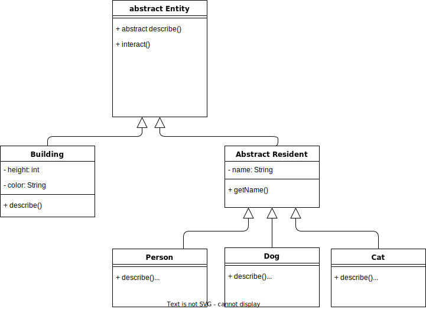

# Overview of class relationships

+ Town 
  Town "has" Entity

+ Entity




# Class Descriptions
## 1. Town class
Your Town class should manage a collection of entities and will provide some simple functionality for displaying information about the town, and for interacting with the entities inside the town.

Town

+ name - name of the town (string).
+ entities - the entities in the town (array or ArrayList).
+ add() - add an entity to the town.
+ displayDescription() - prints out the town name, the total number of entities in the town and a description of each of the entities.
  + "The town '[town name]' has [number of entities] entities in it."
  + For every entity, in the town, print: "It has... a [description of entity]"
+ displayInteraction() - prints out a description of the interaction with every entity in the down.
  + "You tried interacting with the [description of entity]... [description of interaction]"


## 2. Entity classes
Entities are the "things" inside a town. Entities have similarities, but also differences. Every entity should have functionality (ie methods) to allow the entity to describe itself, and to allow the entity to be interacted with. The behaviour of these methods are, however, different depending on the exact type of the entity, so it would make sense to implement the different entities using inheritance and then override some of the methods.

Entity (Note: This class has been implemented for you)

+ describe() - returns a string describing the entity.

+ interact() - returns a string describing the result of interacting with the entity. By default when you interact with an entity the string "(nothing happened)" should be returned.

### 2.1 Building (inherits from Entity)

+ color - the color of the building (string).
+ height - the number of floors on the building (int).
+ describe() - should return a string describing the building in the following form: "[color] building with [height] floor(s)"

### 2.2 Resident (inherits from Entity)

+ name - the name of the resident


#### 2.2.1 Cat (inherits from Resident)

+ describe() -  returns a string describing the cat: "cat named [name]".

+ interact() - returns the string "meowwww".

#### 2.2.2 Dog (inherits from Resident)

+ describe() -  returns a string describing the dog: "dog named [name]".

+ interact() - returns the string "woof woof".

#### 2.2.3 Person (inherits from Resident)

+ describe() -  returns a string describing the person: "person named [name]".

+ interact() - returns the string "Hi, my name is [name], it's nice to meet you!".

## Program Execution

An example run of the program below with a driver program that creates a town called "Forest", a person name "Penelope", a dog named "K.K.", a cat named "Rosie", a blue building with 2 floors, and a red building with one floor gives the following output:

```shell
The town 'Forest' has 5 entities in it.
It has... a person named Penelope
It has... a dog named K.K.
It has... a cat named Rosie
It has... a blue building with 2 floor(s)
It has... a red building with 1 floor(s)
You tried interacting with the person named Penelope... Hi, my name is Penelope, it's nice to meet you!
You tried interacting with the dog named K.K.... woof woof
You tried interacting with the cat named Rosie... meowwww
You tried interacting with the blue building with 2 floor(s)... (nothing happened)
You tried interacting with the red building with 1 floor(s)... (nothing happened)
```
