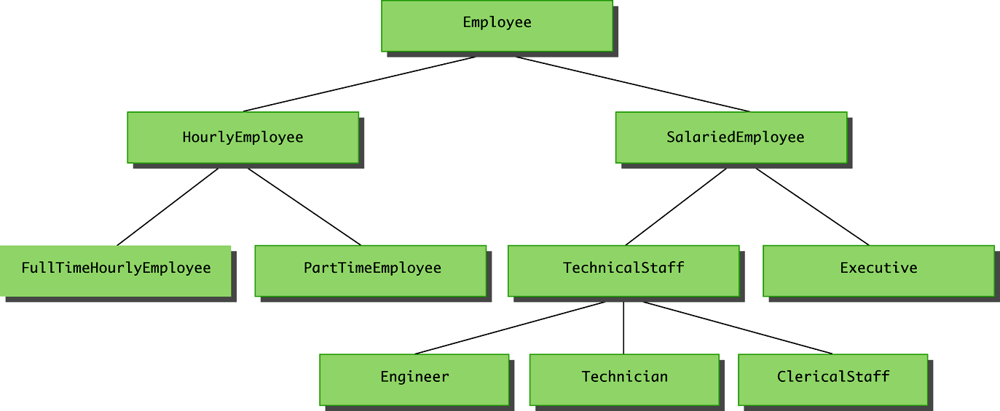

UniMelb Java

# 1. inheritance
Inheritance is the process by which a new class is created from another class.

+ The new class is called a derived/child/sub class
+ The original class is called the base/parent/super class

A derived class automatically has all the instance variables and methods that the base class has (except those with private or package scope), and it can have additional methods and/or instance variables as well.



```java
    class Employee { // base class
        int employeeNumber;
    }

    class HourlyEmmployee extends Employee { // derived class
        double hourlyRate;
    }
```

# 2. Overriding a method definition

Overriding a method is much more powerful than just defining a new method.  It can also change the behaviour of other methods that haven't been overridden.  This is called **polymorphism**, and will be discussed more later in this lesson.

```java
    class Main {
    void sayHello () {
        System.out.println("Hello, World!");
    }

    void sayHelloHello () {
        sayHello();
        sayHello();
        System.out.println();
    }

    static public void main (String[] args) {
        new Main   ().sayHelloHello();
        new Chinese().sayHelloHello(); 

        Main zh = new Chinese();
        zh.sayHelloHello(); 
    }
}

class Chinese extends Main {
    @Override
    void sayHello () {
        System.out.println("你好、世界!");
    }
}
```
Results
```shell
Hello, World!
Hello, World!

你好、世界!
你好、世界!

你好、世界!
你好、世界!
```

In the above example, the function sayHelloHello called the function sayHello.  When the derived class overrode sayHello, it changed the behaviour of sayHelloHello, because the overridden form was called instead.

**This allows the base class to describe a general procedure for doing things, and the derived classes to specify details that are different for different cases.**

## 2.1 Pitfall: Overriding vs Overloading

  + **Overridden**: the new method definition given in the derived class has the same "signature".  That is, the exact same number and types of parameters as in the base class.

  + **Overloading**: When a method in a derived class has a different signature from the method in the base class
    + Note that when the derived class overloads the original method, it still inherits the original method from the base class as well.
  
    ```java
        class Main {
            public static void main (String[] args) {
            }
        }

        class Child extends Main {
            public static void main (String[] args) {
                // This overrides the main class
            }

            public static void main (int i) {
                // This overloads main
            }
        }
    ```

## 2.2 Multiple types and permissions
  1. An object of a derived class has multiple types. It has the type of the derived class, but it also has the type of the base class -- and all ancestor classes.

      ```JAVA
      class Main {
          public static void main (String[] args) {
              Main var = new Child (); // In particular, it can be assigned to a variable of any of its ancestor classes.
          }
      }

      class Child extends Main {
      }
      ```
        
   1. That is the motivation for **covariant return types** introduced in Java 5.0.

   + If a method returns a primitive type (int, double, ...) or an array, then the overriding method must return the same type.

   + However, if the return type is a class type, then the returned type may be changed to that of any descendant class of the return type. (The reason for it to be a descendant is so that code written for the original function will still receive an object of a type it can handle.)
    
        ```JAVA
        // An example of covariant return types is:

        public class BaseClass {
            // method in base class
            public Employee getSomeone (int someKey) {

            }
        }

        class DerivedClass extends BaseClass {
            // overridden method
            public HourlyEmployee getSomeone(int SomeKey) {

            }
        }
        ```

  3. Changing the access Permission of an Overridden Method

      即如果ancestor class的一个方法是permissive的, 其子代class的对应overridden method也应该是permissive的

      + The access permission of an overridden method can be changed from, say, protected in the base class to public (or some other more permissive access) in the derived class.

      + However, the access permission of an overridden method must be at least as accessible as method in the base class.  Again, this is so that any code written for the base class can still be used with the derived class.

        Example:
        ```java
        // Given the following method header in a base case:
        protected void doSomething()

        // The following method header is valid in a derived class:
        public void doSomething()

        // However, the opposite is not valid------------------------------------
        // Given the following method header in a base case:
        public void doSomething()

        // The following method header is not valid in a derived class:
        private void doSomething()        // illegal

        ```     

## 2.3 Preventing overriding and inheritance
   
  + If the modifier **final** is placed before the definition of a **method**, then that method may not be redefined in a derived class.

  + If the modifier **final** is placed before the definition of a **class**, then that class may not be used as a base class to derive other classes.


    ```java
    class Main {
        final static public void main (String[] args) {
        }
    }

    final class Major extends Main {
        static public void main (String[] args) { // error: you cannot overridden a final method
        }
    }

    class Minor extends Major { // error: you cannot extend a fina class

    }
    ```

# 3. Constructors
## 3.1 The super constructor

**A derived class uses a constructor from the base class to initialize all the data inherited from the base class.** 因为a derived class的构造器不能访问base class的私有字段.

>Note: 
>+ A private instance variable in a base class is not accessible by name in the definition of a method in any other class, not even in a method definition of a derived class. Otherwise private variable in a base class is not safe.
>+ The private methods of the base class are like private variables in terms of not being directly available. This should not be a problem because private methods should just be used as helping methods.  If a method is not just a helping method, then it should be public (or package access), not private.

In order to invoke a constructor from the base class, it uses a special syntax.  **The parent's class (and in particular, the parent class's constructor) is called "super". You can regard 'super' as the name of parent class, as a constructor has the same name of its class**

```java
public derivedClass(int p1, int p2, double p3)
{
    super(p1, p2);        // call parent's constructor whose parameters is (int, int)
    instanceVariable = p3;
}
```

There are some rules that apply to the super constructor:
+ A call to the base class constructor can never use the name of the base class, but uses the keyword super instead

+ A call to super must always be the first action taken in a constructor definition

+ An instance variable cannot be used as an argument to super.

> Note: If a derived class constructor does not include an invocation of super, then the no-argument constructor of the base class will automatically be invoked.  This can result in an error if the base class has not defined a no-argument constructor. Since the inherited instance variables should be initialized, and the base class constructor is designed to do that, _then an explicit call to super should always be used_.


## 3.2 Using super to access an overridden method

Within the definition of a method of a derived class, the base class version of an overridden method of the base class can still be invoked.  Simply preface the method name with super and a dot
```java
public String toString()
{
    return (super.toString() + "$" + wageRate);
}
```

However, using an object of the derived class outside of its class definition, there is no way to invoke the base class version of an overridden method.

If you think of super as being the name of the parent class, then this syntax corresponds to the syntax for calling static methods.  Similarly, using super as a constructor corresponds to the fact that a constructor is normally called by the class name.

<br>

> Note: super这种用法只refer to 上一层parent!  
> It is only valid to use super to invoke a method from a direct parent.  Repeating super will not invoke a method from some other ancestor class. 
> For example, if the Employee class were derived from the class Person, and the HourlyEmployee class were derived form the class Employee, it would not be possible to invoke the toString method of the Person class within a method of the HourlyEmployee class
> ```java
> super.super.toString() // ILLEGAL!
> ```

As explained at [super](https://www.geeksforgeeks.org/accessing-grandparents-member-in-java-using-super/), using super within an overriding method effectively bypasses the behaviour of the class you are defining, which is up to you.  However, you shouldn't be allowed to bypass the behaviour of the class you are derived from.  For example, the implementer of that class should be able to derive it from a different base class.

:question:???what???

## 3.3 The this constructor

Within the definition of a constructor for a class, ==this== can be used as a name for invoking another constructor **in the same class**. The same restrictions on how to use a call to super apply to the this constructor. 在这里可以把this当作derived class name, 毕竟constructor和class同名.

<br>

If it is necessary to include a call to both super and this, the call using this must be made first, and then the constructor that is called must call super as its first action: 

```java
// base class =========================================
class Main { 
// field-----------------------------------
int value;

// constructor-----------------------------
Main () {
    
}

// methods---------------------------------
static public void main (String[] args) {
}
}

// derived class =======================================
class Child extends Main {
// fields-------------------------------
int another;

// Constructor--------------------------
// Explicit-value constructor---
Child (int i) {
    super(); // call Main()
    another = i;
}

// Non-argument constructor---
Child () {
    // the call using this must be made first
    this(1);  // call Child(int)
}
}
```

<br>

Often, a no-argument constructor uses this to invoke an explicit-value constructor.

```java
// No-argument constructor (invokes explicit-value constructor using this and default arguments):
public HourlyEmployee()
{
this("No name", new Date(), 0, 0); // calls below explicit-value constructor
}
// Explicit-value constructor (receives default values):
public HourlyEmployee(String theName, Date theDate, double theWageRate, double theHours){
...
}

```

# 4. Practice

[Demo: Enhanced String Tokenizer](UniMelb/EnhancedStringTokenizer.java)

# 5. Protected and Package access

## 5.1 Protected modifier 
If a method or instance variable is modified by **protected** (rather than public or private), then it can be accessed by name in the following conditions:
+ Inside its own class definition

+ Inside any class derived from it (even not in the same package)

+ In the definition of any class in the same package (even the class not being derived from it). This shows that protected access implies package access, but not vice versa.

The protected modifier provides very weak protection compared to the private modifier.  It allows direct access to any programmer who defines a suitable derived class. _Therefore, instance variables should normally not be marked protected_.

## 5.2 Package access
An instance variable or method definition that is not preceded with a modifier has **package access**. Package access is also known as **default or friendly access**.

Instance variables or methods having package access can be accessed by name inside the definition of any class in the same package.  However, neither can be accessed outside the package

Note that package access is more restricted than protected (Protected access implies Package access, but not vice versa). Package access gives more control to the programmer defining the classes. Whoever controls the package directory (or folder) controls the package access.

> Note:
> "Access" here means direct access, that is, access by name.


## 5.3 Pitfall and tips
### 5.3.1 Forgetting the default package
If a class in the current directory is not in any other package, then it is in the default package.  If an instance variable or method has package access, it can be accessed by name in the definition of any other class in the default package.

### 5.3.2 A restriction on protected access
Refer to the fig in 5.2, if a class D is derived from class A, and class A has a protected instance variable v2, but the classes A and D are in different packages, then the following is true:
+ A method in class D can access v2 by name (n is inherited from class A)
+ A method in class D can create a local object of itself, which can access v2 by name (again, n is inherited from class A)

However, if a method in class D creates an object of class A, it can not access v2 by name.  

  + This is because a class knows about its own inherited variables and methods. However, it cannot directly access any instance variable or method of an ancestor class unless they are public.  Therefore, D can access v2 whenever it is used as an instance variable of D, but D cannot access v2 when it is used as an instance variable of A.

This is true if A and D are not in the same package. If they were in the same package there would be no problem, because protected access implies package access

### 5.3.3 Tip: Static variables are inherited
**Static variables in a base class are inherited by any of its derived classes.**

The modifiers public, private, and protected, and package access have the same meaning for static variables as they do for instance variables

# 6. Relationship between two classes
There are many ways in which objects can be related.  Two of these are called the "is a" hierarchy and the "has a" hierarchy.
## 6.1 "is a"
A derived class demonstrates an "is a" relationship between it and its base class. Forming an "is a" relationship is one way to make a more complex class out of a simpler class.

For example, an HourlyEmployee "is an" Employee. HourlyEmployee is a more complex class compared to the more general Employee class

## 6.2 "has a"
Another way to make a more complex class out of a simpler class is through a "has a" relationship.

For example, the Employee class contains an instance variable, hireDate, of the class Date, so therefore, an Employee "has a" Date.

---

Both kinds of relationships are commonly used to create complex classes, often within the same class.  Since HourlyEmployee is a derived class of Employee, and contains an instance variable of class Date, then HourlyEmployee "is an" Employee and "has a" Date.

[Demo: "is a"&"has a"-practice](UniMelb/isaHasa_practice.java)

## 6.3. class Object
In Java, every class is a descendent of the class Object.

+ Every class has Object as its ancestor

+ Every object of every class is of type Object, as well as being of the type of its own class

If a class is defined that is not explicitly a derived class of another class, it is still automatically a derived class of the class Object. The class Object is in the package java.lang which is always imported automatically.

The class Object has some methods that every Java class inherits. For example, the equals and toString methods. Every object inherits these methods from some ancestor class: either the class Object itself, or a class that itself inherited these methods (ultimately) from the class Object.

However, these inherited methods should be overridden with definitions more appropriate to a given class. Some Java library classes assume that every class has its own version of such methods.

### 6.3.1 getClass() 
Every object inherits the same getClass() method from the Object class.  This method is marked final, so it cannot be overridden.

An invocation of getClass() on an object returns a representation only of the class that was used with new to create the object.  The results of any two such invocations can be compared with == or != to determine whether or not they represent the exact same class

```java
(object1.getClass() == object2.getClass())
```

### 6.3.2 instanceof

The instanceof operator checks if an object is of the type given as its second argument

```java
object instanceof ClassName // This will return true if object is of type ClassName, and otherwise return false.
```

Note that this means it will return true if object is the type of any descendent class of ClassName.

The most common use of instanceof is to find out whether a particular method can be used on an object.  That is because a method in a particular class will often take an argument that is a base class, and it doesn't know which descendant of that class the actual object is. 子类可以调用超类中的方法, 但这个方法需要直到是哪个子类来具体化该怎么操作.

[Demo: instanceof](UniMelb/instanceof_Demo.java)

:question: demo中的ExperiencedMusician的打印问题: if else  ,   if 

In contrast getClass() is used when you want to check the exact class of the object, not just that it is in a particular branch of the hierarchy.

### 6.3.3 equals()
In most cases, instanceof is a better choice than getClass(), but there is one big exception: testing for equality.

1. The overridden version of equals must meet the following conditions

   + The parameter otherObject of type Object must be type cast to the given class (e.g., Employee)

   The right way to define equals:
   ```java
   public boolean equals(Object otherObject)
   {
       if(otherObject == null)                           // NULL object
           return false;
       else if(getClass( ) != otherObject.getClass( ))   // not the same class, can't compare so return false
           return false;
       else {                                           // same class, but what about content?
           // the parameter otherObject of type Object must be type cast to the given class
           Employee otherEmployee = (Employee)otherObject;
           
           // compare each of the instance variables
           return (name.equals(otherEmployee.name) &&
               hireDate.equals(otherEmployee.hireDate));
       }
   }
   ```

   What would this look like using  instanceof?  For class Employee, we would have
   ```java
   . . . //excerpt from bad equals method
   else if(!(OtherObject instanceof Employee))
       return false; . . .
   ```

   and from class HourlyEmployee, we would have
   ```java
   . . . //excerpt from bad equals method
   else if(!(OtherObject instanceof HourlyEmployee))
   return false; . . .
   ```

   In order to use instanceof, you need to know the type of this object in the first place.

2. Now consider the following example :
    ```java
    Employee e = new Employee("Joe", new Date());
    HourlyEmployee h = new HourlyEmployee("Joe", new Date(),8.5, 40);
    boolean testH = e.equals(h);
    boolean testE = h.equals(e);
    ```
    Results:
    + testH will be true, because h is an Employee with the same name and hire date as e

    + testE will be false, because e is not an HourlyEmployee, and cannot be compared to h

    Note that this problem would not occur if the getClass() method were used instead, as in the previous equals method example :question: what does this mean?


# 7. Modularity

Some OOB philosophy:

Modularity is a way to manage complexity and improve quality.

A **module** is the basic unit of decomposition of our systems. It will often correspond to a Java class, a file containing multiple classes, or a "package", which is a set of Java classes that cooperate to achieve a task.

**Modular design and programming** is designing or constructing software based on modules.

Modules typically form a hierarchy: modules can consist of smaller modules.  For example, a java program may consist of multiple packages. A package consists of multiple classes.  Each class consists of multiple methods, or even of sub-classes.

## 7.2 Modular design criteria
There are five criteria that underlie modular design.

+ Decomposability.

+ Composability.

+ Understandability.

+ Continuity.

+ Protection.

References:

[1] Meyer, Bertrand. “Object-Oriented Software Construction, 2nd Edition.” (1997).

## 7.3 Modular design rules
The guiding principles that allow modular design to meet the above criteria are as follows.

+ Direct mapping

+ Few interfaces

+ Small interfaces

+ Explicit interfaces

+ Information hiding

## 7.4 Unified modelling language (UML)

The Unified modelling language (UML) is a graphical representation of modules and their interactions. UML is designed to reflect modularity, and the object-oriented programming philosophy.

### 7.4.1 UML diagrams


### 7.4.2 


# 8. Polymorphism

# 9. Abstract classes