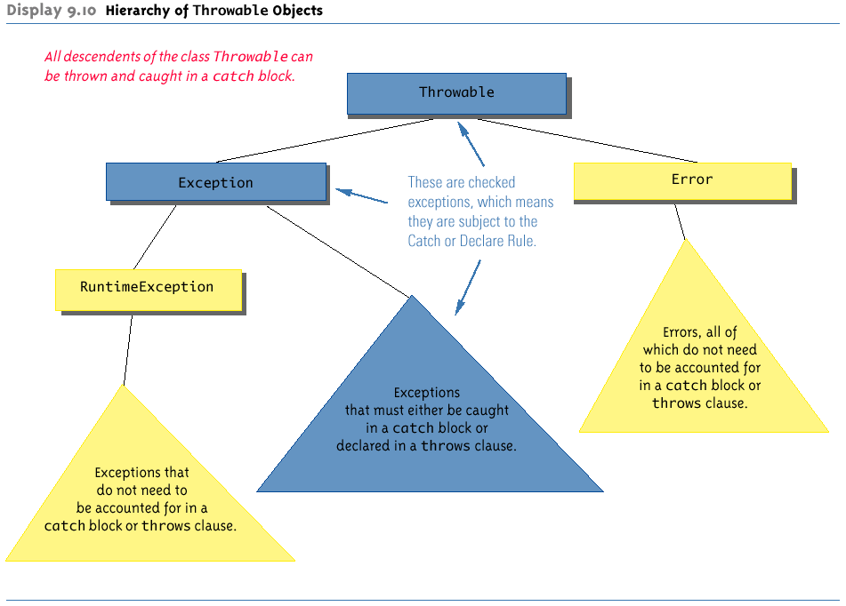

# 0. Overview
These are personal notes referring to UniMelb Java week 8 learning materials

# 1. Introduction to exception handling
 
Java exception handling facilities are used when the invocation of a method may cause something exceptional to occur.

**Throwing an exception:** Java library software (or programmer-defined code) provides a mechanism that signals when something unusual happens.  
**Handling the exception:** In another place in the program, the programmer must provide code that deals with the exceptional case.  

面对Exception有两方面可以做的:
+ 查阅Oracle Java docs, 看具体某个函数会throw怎样的Exception
+ 自定义Exception class


# 2. try-throw-catch
 The basic way of handling exceptions in Java consists of the try-catch mechanism. 
 

## 2.1 try

The try block contains the code for the basic algorithm.  It tells what to do when everything goes smoothly.  It can also contain code that throws an exception if something unusual happens, and is caught by the catch block.

### 2.1.1 :full_moon: try-throw-catch mechanism 
 
When a try block is executed, either one of below cases can happen:

1. No exception is thrown in the try block.
– The code in the try block is executed to the end of the block
– The catch block is skipped
– The execution continues with the code placed after the catch block

2. An exception is thrown in the try block and caught in the catch block
– The rest of the code in the try block is skipped
– Control is transferred to a following catch block (in simple cases)
– The thrown object is plugged in for the catch block parameter (see 2.3)
– The code in the catch block is executed
– The code that follows that catch block is executed (if any)


## 2.2 catch

The code inside the try block is executed as normal.  If something goes wrong in any of the standard library methods inside the block, an exception will be generated.  _When this happens, the execution of the try block stops, and the catch block is executed._  

The variable e contains information about the error that occurred. This e is called the **catch block parameter**.  It does two things: 
+ It specifies the type of thrown exception object that the catch block can catch (e.g., an Exception class object above).

+ It provides a name (for the thrown object that is caught) on which it can operate in the catch block. Note: The identifier e is often used by convention, but any non-keyword identifier can be used.

**The catch block has only one parameter.  A catch block looks like a method definition that has _a parameter of type Exception class_, but it is not really a method definition.**

In some cases, it is possible to recover from an exception.  For example, if it was caused by a bad choice by the user then it is possible to ask for another choice.

```java
// demo
class Main {
public static void main (String[] args) {
    // . . . 
    try
    {
        // Something that may fail
    }
    catch(Exception e)  // catch block is actually not a method
    {
        String message = e.getMessage();
        System.out.println("Exception: " + message);
        System.exit(1);
    }
    // ...
}
}
```


## 2.3 throw

Often, you will want to report a problem, even if none of the library routines throws an exception.   This is done by the throw command.

```java
class Main {
    public static void main (String[] args) {
        // . . . 
        try
        {
            //. . .
            throw new Exception("StringArgument"); // When the throw statement occurs, the try block stops.
            //. . .
        }
        catch(Exception e)
        {
            String message = e.getMessage();
            System.out.println(message);
            System.exit(1);
        }
        ///. . .
    }
}
```

:question: only allow 1 throw statement in try block?

**Instead of calling a method, a throw statement calls a catch block. Whenever an exception is thrown, it should ultimately be handled (or caught) by some catch block.**

Recall that the catch block only takes one parameter, typically an Exception. The above code only passes a string to the Exception constructor.  That is enough to print an error message and exit, but not enough to allow the code to try to recover.  Using polymorphism, you can create a class derived from Exception, to contain as much additional information as you like.


### 2.3.1 Using the getMessage Method

Every exception has a String instance variable that contains some message. This string typically identifies the reason for the exception.

In the previous example, "StringArgument" is an argument to the Exception constructor.

This is the string used for the value of the string instance variable of exception e.  Therefore, the method call e.getMessage() returns this string.


# 3. :full_moon:Exception classes

There are more exception classes than just the single class Exception.

+ There are more exception classes in the standard Java libraries

+ New exception classes can be defined like any other class

All predefined exception classes have the following properties:

+ There is a constructor that takes a single argument of type String.

+ The class has an accessor method getMessage that can recover the string given as an argument to the constructor when the exception object was created.

All programmer-defined exception classes must be derived from the class Exception its descendants.

## 3.1 Exception Classes from Standard Packages

### 3.1.1 base exception class
The predefined exception class Exception is the root class for all exceptions. Every exception class is a descendent class of the class Exception.


The class Exception is in the java.lang package, and so requires no import statement.

### 3.1.2 predefined derived exception classes
Numerous predefined exception classes are included in the standard packages that come with Java. For example:

+ IOException

+ NoSuchMethodException

+ FileNotFoundException

Many exception classes must be imported in order to use them.

```shell
import java.io.IOException;
```

## 3.2:full_moon:Defining Exception Classes

A throw statement can throw an exception object of any exception class.

Instead of using a predefined class, exception classes can be programmer-defined
+ These can be tailored to carry the precise kinds of  information needed in the catch block
+ A different type of exception can be defined to identify each different exceptional situation

Constructors are the most important members to define in an exception class
+ They must behave appropriately with respect to the variables and methods inherited from the base class
+ Often, there are no other members, except those inherited from the base class


The following exception class performs these basic tasks only:

```java
class Main {
    public static void main(String[] args) {
        try{
           double c = 9.0/0; 
           throw new DivisionByZeroException();  // non argument constructor
        }
        catch(DivisionByZeroException e){
            String message = e.getMessage();
            System.out.println(message);
            System.exit(1);
        }
    }
}

class DivisionByZeroException extends Exception {
    public DivisionByZeroException() {
        super("Error: divisor cannot be Zero");
    }

    public DivisionByZeroException(String message) {
        super(message);
    }
}
```

The two most important things about an exception object are 
+ Its type (i.e., exception class) and 
+ The message it carries.
  + The message is sent along with the exception object as an instance variable. Furthermore, this message can be recovered with the accessor method getMessage, so that the catch block can use the message.

### 3.2.1 Programmer-Defined Exception Class Guidelines

A programmer-defined exception class must be a derived class of an already existing exception class.

The exception class should allow for the fact that the method getMessage is inherited.   For all predefined exception classes, getMessage returns the string that is passed to its constructor as an argument, or it will return a default string if no argument is used with the constructor.

At least two constructors should be defined:

+ A constructor that takes a string argument and begins with a call to super, which takes the string argument.

+ A no-argument constructor that includes a call to super with a default string as the argument.

Often more constructors will be provided, to pass additional information. For instance, to take types other than String as the argument.


## 3.3 Other message types

An exception class constructor can be defined that takes an argument of any other type. 

It would store its value in an instance variable.  It would need to define accessor methods for this instance variable.

```java
class Main {
    public static void main(String[] args) {
        
    }
}

class BadNumberException extends Exception {
    private int badNumber;

    // Accessor
    public int getBadNumber () {
        return badNumber;
    }

    // new constructor taking integer ----------------
    public BadNumberException (int number) {
        super("Bad number");
        badNumber = number;   // take other type of argument as instance variable
    }

    // Standard constructors------------------------
    public BadNumberException () {
        super ("Bad number");
        badNumber = -1;
    }

    public BadNumberException (String message) {
        super(message);
        badNumber = -1;
    }

}
```

# 4. :full_moon:Multiple catch block

A try block can potentially throw any number of  exception values, and they can be of differing types.

In any one execution of a try block, at most one exception can be thrown (since a throw statement ends the execution of the try block).  However, different types of exception values can be thrown on different executions of the try block.

Different types of exceptions can be caught by placing more than one catch block after a try block.

Any number of catch blocks can be included, but they must be placed in the correct order. When an exception is thrown in a try block, the catch blocks are examined in order.  The first one that matches the type of the exception thrown is the one that is executed.

> tip: **Catch the more specific exception first** (i.e., catch a descendant class before an ancestor).

## e.g.

```java
// code with no issues
class Main {
    public static void main (String[] args) {
        try {
            double a = 1.0/0.0;
        }
        catch (ArithmeticException e) {
            System.out.println("Well done");
        }
        catch (Exception e) {
            System.out.println("Try again");
        }
    }
}
```

Because an ArithmeticException is a descendant of Exception, if you place catch (Exception e) before catch(ArithmeticException) in the code, all ArithmeticException will be caught by the first catch block before ever reaching the second block.  The catch block for ArithmeticException will never be used.  (Ed refuses even to compile this code.) **So catch the more specific exception first.**

# 5. :full_moon:Throwing exceptions from methods
The greatest value of exceptions is when we don't know enough of the context to be able to handle the situation.  For example, if we divide by 0, should we replace the answer by a very large number and continue, or should we tell the calling method to choose a different set of parameters and call again?

_Because of this, it is common to want to throw an exception in a method, but not catch it in the same method._

In such cases, the program using the method should enclose the method invocation in a try block, and catch the exception in a catch block that follows.  The method that throws the exception would not surround the throw by try and catch blocks.

## 5.1 Methods throws without catching

> **简言之, 如果一个method中throw了exception, 那么这个exception必须在后续的代码执行中被catch; 如果这个throw exception的method没有catch, 要在它的heading上加上throws ...**

However, the method that throws without catching has to include a throws clause in its header (不然编译时会报错), 这是在提示程序员后续代码必须有catch语句来接收被throw的Exception.

The reason is that, if a method can throw an exception but does not catch it, it must provide a warning to the callers.  The process of including an exception class in a throws clause is called **declaring the exception.** 

```java
class Main {
    // method throws but without catching --> heading: throw Exception
    // the code calling this method must handle Exception threw by this method using catching
    static private int dangerMethod () throws Exception {
        throw new Exception ("Error from dangerMethod");
    }

    // --------------------------------------
    static public void caller () {
        int a;
        try {
            a = dangerMethod ();
        } catch (Exception e) {         // handle Exception threw by dangerMethod with catching
            System.out.println(e.getMessage());
        }
    }

    // ----------------------------------------
    // method throws without catching --> heading: throw Exception
    static public void caller1 () throws Exception {
        int a = dangerMethod ();
    }

    // ==============================================
    static public void main (String[] args) {
        try {
            caller();
        } catch (Exception e) {
            System.out.println ("Main caught from caller");
        }

        try {
            caller1();
        } catch (Exception e) {     // handle Exception threw by caller1() with catching
            System.out.println ("Main caught from caller1");
        }
    }
}
```

In the above example, any method that calls dangerMethod (in this case caller and  caller1) must deal with the exception.  

caller()在自己的函数内部catch了Exception threw by dangerMethod(),
对于caller1()我们则是在主函数中另加了catch来handle Exception threw by dangerMethod(). 但不管怎样, 在代码中, 如果有throw, 就必须要有catch来接盘.

If a method throws an exception and does not catch it, then the method invocation ends immediately. (Well, Almost immediately; we'll meet the finally block in the next slide.)

If a method can throw more than one type of exception, then separate the exception types by commas:

```java
public void aMethod() throws AnException, AnotherException
```

# 6. Advanced topics
## 6.1 Hierarchy of throwable objects
he try/throw/catch framework can apply to objects other than exceptions.



Most importantly, not all exceptions are subject to the "catch or declare" rule(e.g. RuntimeException and its derived class). The compiler checks to see if they are accounted for with either a catch block or a throws clause.

+ Exception class
  + The classes Throwable, Exception, and all descendants of the  class Exception (other than RuntimeException and its descendants) are **checked exceptions**. _They must be either caught in a catch block or declared in a throws clause._
  + Descendants of RuntimeException are **unchecked exceptions**. _They do not need to be accounted for in a catch block or throw clause._

+ Error class
  + The class Error and all its descendant classes are called **error classes**.  They are not subject to the "catch or declare" rule.


> Note:
> When a method in a derived class is overridden, it should have the same exception classes listed in its throws clause that it had in the base class, or it should have a subset of them. This is because an object of a derived class must be able to be used any way its parent class can.

### 6.1.1 e.g.
+ When a program contains an assertion check, and the assertion check fails, an object of the class **AssertionError (unchecked)** is thrown.  This causes the program to end with an error message.

    The class AssertionError is derived from the class Error, and therefore is an unchecked Throwable.  In order to prevent the program from ending, it could be handled, but this is not required.


+ The Scanner class can throw the **InputMismatchException (unchecked exception)**. The nextInt method of the Scanner class can be used to read int values from the keyboard.

    However, if a user enters something other than a well-formed int value, an InputMismatchException will be thrown.  Unless this exception is caught, the program will end with an error message (见finally block 的例子). If the exception is caught, the catch block can give code for some alternative action, such as asking the user to reenter the input.

    + The InputMismatchException is in the standard Java package java.util
    A program that refers to it must use an import statement, such as the following:
        ```java
        import java.util.InputMismatchException;
        ```
    + It is a descendent class of RuntimeException.  Therefore, it is an unchecked exception and does not have to be caught in a catch block or declared in a throws clause.

+ An **ArrayIndexOutOfBoundsException (unchecked exception)** is thrown whenever a program attempts to use an array index that is out of bounds (below 0 or above the length minus 1).  This normally causes the program to end.
  
    + Like all other descendants of the class RuntimeException, it is an unchecked exception.  There is no requirement to handle it.

    + When this exception is thrown, it is nearly always an indication that the program contains an error.  Instead of attempting to handle the exception, the program should simply be fixed.  (A possible exception would be in a class like ArrayList in which it may signal that the underlying array needs to grow.  However, it is typically better to check for that explicitly.)


### 6.1.2 What happens if an exception is never caught?
If every method up to and including the main method simply includes a throws clause for an exception, that
exception may be thrown but never caught

+ In a GUI program (i.e., a program with a windowing interface), nothing happens - but the user may be left in an unexplained situation, and the program may be no longer be reliable.
+ In non-GUI programs, this causes the program to terminate with an **error message** giving the name of the exception class.

Every well-written program should eventually catch every exception by a catch block in some method.

### 6.1.3 When to use exceptions
There is overhead in using exceptions, even if the exception is not thrown.  The try itself slightly increases run time.

Exceptions should be reserved for situations where a method encounters an unusual or unexpected case that cannot be handled easily in some other way.  (In other languages such as Python, exceptions are used more freely.)

How exceptions are handled depends on how a method is called.

## 6.2 Event driven programming (作了解)

Exception handling is an example of a programming methodology known as **event-driven programming** (就像JS触发event来调用对应CSS代码一样).  When using event-driven programming, objects are defined so that they send events to other objects that handle the events.  An event is also an object. Sending an event is called firing an event.

In exception handling, the event objects are the exception objects.  They are fired (thrown) by an object when the object invokes a method that throws the exception.  An exception event is sent to a catch block, where it is handled.

Another important type of event driven programming is writing GUI applications.  There, events are typically triggered by a user action, such as a mouse movement, mouse click, or key press.  The handlers for these events can last a long time, such as recalculating a spreadsheet.

## 6.3 Nested try-catch blocks (作了解)

It is possible to place a try block and its following catch blocks inside a larger try block, or inside a larger catch block.

+ If a set of try-catch blocks are placed inside a larger catch block, different names must be used for the catch block parameters in the inner and outer blocks, just like any other set of nested blocks

+ If a set of try-catch blocks are placed inside a larger try block, and an exception is thrown in the inner try block that is not caught, then the exception is thrown to the outer try block for processing, and may be caught in one of its catch blocks

## 6.4 :moon:The finally block

[Resource: finally block tutorial 注意看其中的例子!](https://dotnettutorials.net/lesson/finally-block-in-java/#:~:text=Syntax%20to%20use%20Finally%20block,in%20Java%3A%201%20try%2Fcatch%2Ffinally%202%20try%2Ffinally)

其中这个例子Example: try/catch/finally with exception and catch block is not matched: 此时由于try block throw 的exception并没被catch block 捕捉, finally中的代码可被执行, 但在finally之后的代码不会被执行了


1. What is finally block in Java?

    Finally establishes a block that definitely executes statements placed in it. Statements that are placed in finally block are always executed irrespective of the way the control is coming out from the try block either by completing normally or throwing exceptions by catching or not catching.

2. Why we need finally block in real-time applications?

    As per the coding standard in the finally block we should write resource releasing logic or clean up code.

    Resource releasing logic means unreferenced objects that are created in the try block. For example, in real-time projects, we create JDBC objects in the try block and at the end of the try block, we must close these objects. Since the statements written in try and catch block are not guaranteed to be executed we must place them in the finally block.

Once again, if the try-catch-finally blocks are inside a method definition, there are three possibilities when the code is run:

+ Case1: The try block runs to the end, no exception is thrown, and the finally block is executed

+ Case2: An exception is thrown in the try block, caught in one of the catch blocks, and the finally block is executed

+ Case3: An exception is thrown in the try block, there is no matching catch block in the method, the finally block is executed, and then the method invocation ends and the exception object is thrown to the enclosing method

## 6.5 :star: Exception controlled loops
Sometimes it is better to simply loop through an action again when an exception is thrown, as follows:

```java
boolean done = false;
while (! done)
{
    try
    {
        // CodeThatMayThrowAnException
        done = true;
    }
    catch (SomeExceptionClass e)
    {
        // SomeMoreCode
    }
}
```

Exercise: Read and understand the following code.  Try it with inputs "forty", "=1", "10.5", "10,5", "10/5", "10".  Before you try each, guess whether or not nextInt() will succeed.

[Demo: InputMismatch_repopUntilMatching](UniMelb/InputMismatchRepop.java)

## 6.6 :star: Practice
This simple program has not handled any exceptions yet. Please identify all potential exceptions and use the "try...catch" statement to capture them. 

```java
import java.util.Scanner;

public class ExceptionDemo {

  public static void main(String[] args) {
    Scanner keyboard = new Scanner(System.in);

    int[] arr = {1, 2, 3, 4, 5, 6, 0};
    System.out.println("Array index: ");
    
    int index = keyboard.nextInt();

    int value = arr[index];
    System.out.printf("arr[%d] = %d\n", index, value);

    keyboard.close();
  }
}
```

[Demo: practice on customized Exception class](UniMelb/Practice_ExceptionDemo.java)

Extension: Define a new customized exception class and throw it instead of the predefined exception class when something wrong happens (e.g., the array index is out of bound).

Extension: Update the program to allow user to repeatedly provide a valid array index until they are successfully.


## 6.7 Program exit values
You will notice that System.exit() takes an argument.  This argument is passed to the operating system when the program finishes.  

If the program is being run from a script, the script will interpret an exit value of
+ 0 as "success", or true, 
+ a non-zero value as "failure" or false.  If the program exits because of an error, it should pass a non-zero argument to exit.  

