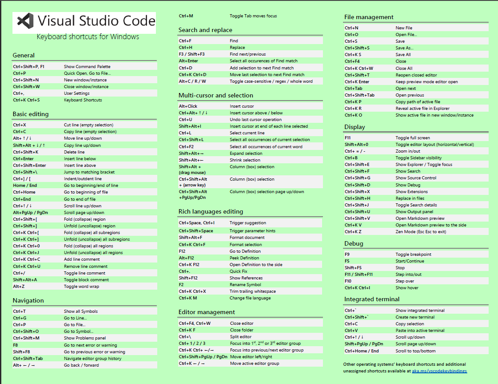
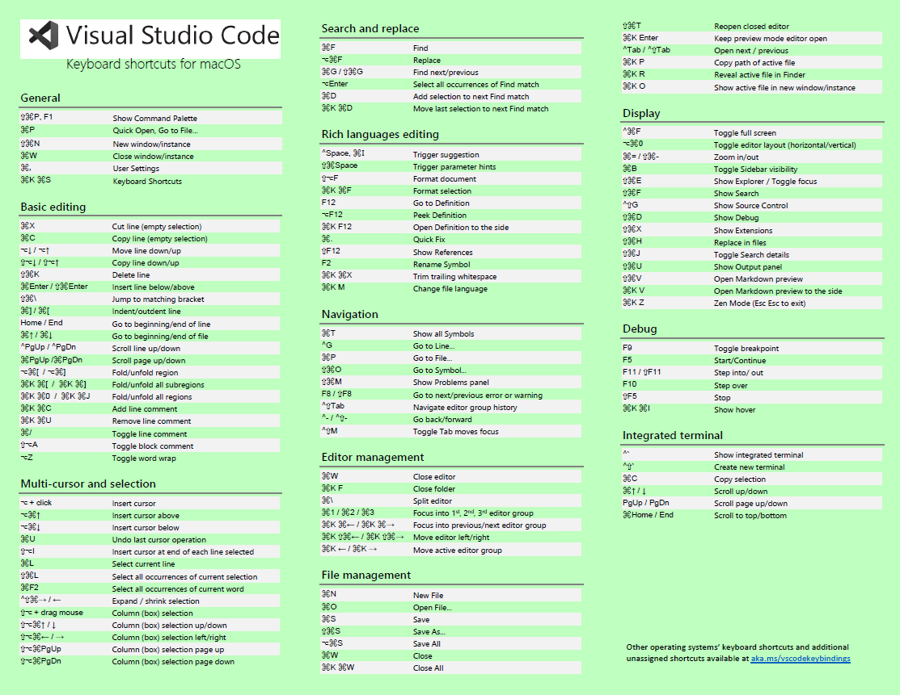

**学无止境, 你所学到的可能只是沧海之一粟, Java要学的东西有很多很多...stay hungry, stay foolish**


some blog channel for web development, you can find a lot tutorials there: 

https://blog.logrocket.com

https://johnstyle.medium.com/getting-started-with-nestjs-a-step-by-step-example-guide-3ff4b13def67


:link: [JR21 fullstack notes](https://github.com/australiaitgroup/FullStack-21-Note)

| Id                                    | Topic                  | Description                         |
| ------------------------------------- | ---------------------- | ----------------------------------- |
| [1](./FrontEnd/myFrontEndBasics.md)   | FrontEnd Basics        | HTML, CSS, JS, <br> TS, TailwindCSS |
| [2](./BackEnd/myBackEnd.md)           | BackEnd                | Java, NodeJS, Python <br> [另外, Spring的学习参考](https://www.pdai.tech/md/spring/spring.html) <br> |
| [3](./Database/myDatabase.md)         | Database               |                                     |
| [4](../Udemy/Git/Udemy_Git.md)                  | version control: git   |                                     |
| [5](./WebDevTheory/myWebDevTheory.md) | :bangbang: web development theory |                                     |
| [6](./CICD/myCICD.md) | CICD |                                     |


Software Engineering

| Id                                         | Topic                    | Description         |
| ------------------------------------------ | ------------------------ | ------------------- |
| [1](./CleanCode/clean_code.md)             | clean code               |                     |
| [2](./Software_Design/mySoftwareDesign.md) | software design          | OOP design patterns |
| [3](./myITCareer.md)                       | software engineer career |                     |


---

Table of Contents: 
- [Typora theme](#typora-theme)
- [Ubantu](#ubantu)
- [快捷键](#快捷键)
- [代码模板](#代码模板)
- [Extensions on VSCode](#extensions-on-vscode)
  - [Theme extensions:](#theme-extensions)
  - [Spelling checks extensions:](#spelling-checks-extensions)

---

其他学习资源:
+ [JR 笔记](https://github.com/australiaitgroup/full-stack-bootcamp-wiki)
+ [mozilla developer](https://developer.mozilla.org/en-US/docs/Web)
+ [b站李立超](https://space.bilibili.com/1500126264?spm_id_from=333.337.0.0)
+ [b站Raymond ==> project练习](https://space.bilibili.com/208444454?spm_id_from=333.337.0.0)
+ [fullstack roadmap](https://github.com/kamranahmedse/developer-roadmap)
+ [鱼皮roadmap](https://github.com/liyupi/code-roadmap)

学习以跟做project为核心, 遇到不懂得再查书做笔记: 
学习>做笔记>做项目>反思>循环

**学习Tips:** 

+ YouTube上web project, 自己写出一遍以后可以尝试改变代码微调出自己想要的款式，如果出现问题尝试思考为什么会出现再解决它。
+ YouTube直接搜html, css, js, 有很多项目
+ 全身心投入学习(学习>做笔记>做项目>反思>循环) ，最后才能找到还不错的工作 
+ 在github上建立自己的项目库，这样可以加在简历上让别人看到

---

# Typora theme

Settings > preference > appearance > get themes, 下载想要的theme的zip

接着解压zip, 然后将css 和folder复制粘贴到Settings > preference > appearance > open theme folder路径下, 重启typora即可


# Ubantu

+ sudo apt update

---

# 快捷键

Intellij

+ `alt` + `insert`: 生成constructor, getter, setter

---
VsCode

+ vscode的setting中搜索save,勾选保存时格式化，这样按Ctrl + S自动保存时会格式化代码比如换行
+ 使用 ctrl + / 可以注释
+ 使用ctrl + f 可以打开vscode的搜索bar
+ 按住ctrl + z可以返回指令原来的样子，按ctrl + shift + z再切换回去
+ `ctrl + shift + p`
+ `ctrl + p`, search file by name, 可以实现在文档间快速切换; 
  +  把readme.md改成myCamel.md的形式, 方便直接用`ctrl+p`来跳转md文档
+ `alt + shift + 鼠标左键点击两个地方`, 选中多行同时打字
+ 快速打字:
  + 输入!按tap, 出现一个html模板
  + 快速写: 键入“section.main-structure” + tap:
    ```html
    <section class="main-strucuture"></section>  
    ```
  + 快速写:键入”a>div.logo” + tap:
    ```html
    <a href="">
        <div class="logo"></div>
    </a>
    ```
+ Shift+点击收缩代码可以逐层收缩; 
  + ctrl+k ctrl+0 折叠所有代码; 
  + ctrl+k ctrl+j 展开所有代码;
+ Ctrl + f 检索代码，还可以据此replace 代码中的关键词
  + Aa: 搜索结果是否对大小写敏感
  + ab:搜索结果是否必须严格是粘连在一起的
  + GitHub上使用类似的检索功能(也是ctrl + f启动快捷寻找, 甚至word里也是ctrl + f)
+ 加标签：选中HELLO WROLD, ctrl + p打开搜索框，输入>wrap回车，再输入想wrap的标签 (来自js lesson1 3h44min)
+ HTML快速创建多重标签:
  ```html
  div.block1*7, then hit tap
  ```






# 代码模板

[vscode java template](./myJavaVscodeTemplate.json)

vscode: File ---> preferences ---> configure user snippets ---> define a JSON file

[vscode snippets](https://code.visualstudio.com/docs/editor/userdefinedsnippets)

+ Tabstops:
With tabstops, you can make the editor cursor move inside a snippet. Use $1, $2 to specify cursor locations. The number is the order in which tabstops will be visited, whereas $0 denotes the final cursor position.


+ Placeholder:
With tabstops, you can make the editor cursor move inside a snippet. Use $1, $2 to specify cursor locations. The number is the order in which tabstops will be visited, whereas $0 denotes the final cursor position.


# Extensions on VSCode

打开vscode json setting: 左下角的小齿轮图标 -->settings --> 右上角的open settings(json), 可以configure设置

## Theme extensions:
+ Dracula official (老师用的这个)
+ Atom one dark theme
+ Ayu 
+ Noctis(for python)
+ Material theme (also have icons)

## Spelling checks extensions:
+ Code spell checker 
+ Icon extensions:
+ Fluent icons
+ Icons


