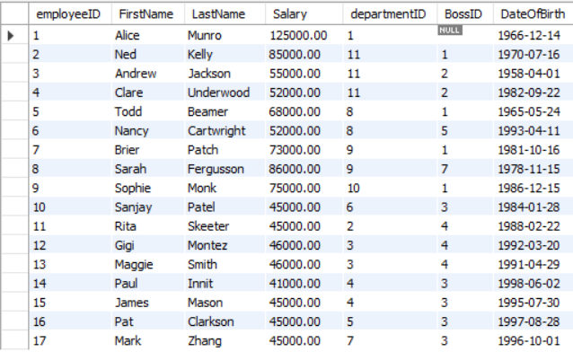

UniMelb DB practice on mySQL

---
## department-employee

department

employee

---
## supplier-delivery

supplier

delivery

deliveryitem

---
## item-sale 

Sale

saleitem

item

[Week 5 tut: basic SQL](WK5/readme.md)

[Week 6 tut: JOINS, HAVING, sub-query](WK6/readme.md)

[Week 7 tut: more practice, IN, date](WK7/readme.md)

[Week 8 tut: OUTER JOIN, UNARY JOIN, VIEW, relational divide](WK8/readme.md)

[Week 9 tut: SQL DDL, DML, referential integrity](WK9/readme.md)

[Week 11 tut: NoSQL & JSON](WK11/readme.md)
