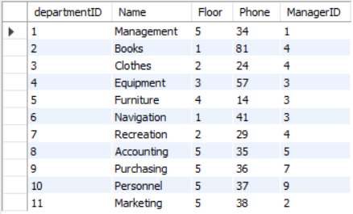

UniMelb DB practice on mySQL

---
## department-employee

---
## supplier-delivery

supplier

delivery

deliveryitem

---
## item-sale 

Sale

saleitem

item

[Week 5 tut: basic SQL](WK5/readme.md)

[Week 6 tut](WK6/readme.md)

[Week 7 tut](WK7/readme.md)

[Week 8 tut](WK8/readme.md)

