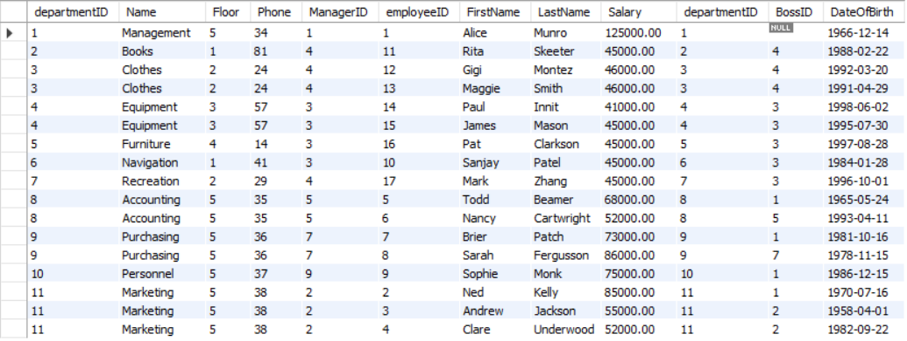

# 1. Formatting & Rounding

```sql
Select AVG(salary) AS Avg_Salary
From Employee;
```
```shell
60529.411765
```

format(X,D)
```sql
Select format(AVG(Salary),2) AS Avg_Salary
From Employee;
```
```shell
60,529.41   // a String
```


round(X,D)
```sql
Select round(AVG(Salary),2) AS Avg_Salary
From Employee;
```

```shell
60529.41    // a number
```


# 2. Joins
只能join直接相连的relation (table)


## 2.1 Natural Join
不推荐使用, 比inner join慢, 没有inner join严格


## 2.2 :full_moon:Inner Join

```sql
Select *
From department Inner Join employee
On department.departmentid = employee.departmentid;
```

Results:
左边是department table, 右边是对应的employee table



```sql
Select *
From employee Inner Join department
On employee.departmentid = department.departmentid;
```

Results:
左边是employee table, 右边是对应的department table


```sql
Select name, firstname, lastname
From department Inner Join employee
On department.departmentid = employee.departmentid;
```

Results:


# 3. Sub Queries 


# 4. Multiple table joins

# 5. Having clause

# 6. Union