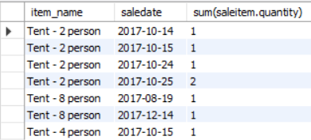

# 1. Formatting & Rounding

```sql
Select AVG(salary) AS Avg_Salary
From Employee;
```
```shell
60529.411765
```

format(X,D)
```sql
Select format(AVG(Salary),2) AS Avg_Salary
From Employee;
```
```shell
60,529.41   // a String
```


round(X,D)
```sql
Select round(AVG(Salary),2) AS Avg_Salary
From Employee;
```

```shell
60529.41    // a number
```


# 2. Joins

**只能join直接相连的relation (table)**


## 2.1 Natural Join
不推荐使用, 比inner join慢, 没有inner join严格


## 2.2 :full_moon:Inner Join

```sql
Select *
From department Inner Join employee
On department.departmentid = employee.departmentid;
```

Results:
左边是department table, 右边是对应的employee table


```sql
Select *
From employee Inner Join department
On employee.departmentid = department.departmentid;
```

Results:
左边是employee table, 右边是对应的department table


```sql
Select name, firstname, lastname
From department Inner Join employee
On department.departmentid = employee.departmentid;
```

Results:


```sql
# show each Employee full name and the department name they are working in
Select name AS Department_name, concat(firstname, ' ', lastname) AS Employee_name
From department Inner Join employee
On department.departmentid = employee.departmentid
Order by name;
```

Results:


### 2.2.1 Practice

```sql
# list the firstname and last name of all the employees in the Management department
Select firstname, lastname
From department Inner Join employee
On department.departmentid = employee.departmentid
Where name = 'Management';
```


```sql
# list the supplier name and the number of deliveries made to the department store
Select supplier.name AS supplier_name, count(deliveryid)
From supplier inner join delivery
On delivery.SupplierID  = supplier.SupplierID
Group by supplier_name
Order by supplier_name;
```

# 3. Sub Queries 

1.
```sql
# find the department that gives lowest salary
# first find out the lowest salary (sub-query)
# then find the department row that matches the lowest salary (outer query)
Select departmentid 
From employee
where salary = 
    (select min(salary)
    From employee);
```

```sql
# alternative to find the department that gives lowest salary
select departmentid, salary 
from employee
order by salary
limit 1;
```

```sql
# this is not right to find out the department giving lowest salary!
select min(salary), departmentid
from employee;
```


2.

if the sub-query returns more than 1 result, "=" will not work you have to use "IN" instead.

```sql
# how many employees work in departments located on the fifth 
floor
# firstly to know which departments on the fifth floor (sub-query)
# then find matching rows in employee (outer-query)
Select count(employeeid)
From employee
where departmentID In 
    (select departmentid
    From department
    where floor = 5
    );
```

```sql
# alternative way: use inner join
Select count(employeeid)
From employee inner join department
on employee.departmentid = department.departmentid
where department.floor = 5;
```

# 4. Multiple table joins

When we join more than 2 tables, the same principle apply, there must be a common column between the two entities functioning as a primary key/ foreign key referential integrity


1. Query: find the sale dates of all types of tents

We want to join item, saleitem, sale these three tables(they are directly connected):

```sql
# find the sale dates of all types of tents
Select *
From item inner join saleitem
on item.itemid = saleitem.itemid inner join sale
on saleitem.saleid = sale.saleid
where item.name LIKE "tent%";
```
Results:


```sql
# find the sale dates of all types of tents
Select item.name as item_name, saledate, sum(saleitem.quantity)
From item inner join saleitem
on item.itemid = saleitem.itemid inner join sale
on saleitem.saleid = sale.saleid
where item.name LIKE "tent%"
Group by item_name;
```

Results:


```sql
# find the sale dates of all types of tents
Select item.name as item_name, saledate, sum(saleitem.quantity)
From item inner join saleitem
on item.itemid = saleitem.itemid inner join sale
on saleitem.saleid = sale.saleid
where item.name LIKE "tent%"
Group by item_name, saledate;       # group by two columns
```

Results:



# 5. Having clause

The HAVING clause acts like a WHERE  clause but it identifies groups meeting a criteria, rather than rows. 

**A HAVING clause usually follows a GROUP BY clause, acting as a filter**
**A GROUP BY clause specifies how to use an aggregate function**

## e.g.1

```sql
# list department names with more than 2 employees
Select department.name, count(employee.employeeid)
From department inner join employee
on department.departmentid = employee.departmentid
group by department.name
Having count(employee.employeeid) > 2;
```
Results:


This is based on group by results, if only have:

```sql
Select department.name, count(employee.employeeid)
From department inner join employee
on department.departmentid = employee.departmentid
group by department.name;
```
Results:


## 5.1 Practice

### :star: :question: e.g.1

find the item id's sold by at least two departments on the second floor

:question: why join item, deliveryitem and department doesn't work??

```sql
select *
from item inner join deliveryitem inner join department
on item.itemid = deliveryitem.itemId 
AND deliveryitem.departmentid = department.departmentid
Where floor = 2
Order by item.itemid;
```
Results:


### :star:e.g.1 

find the item id's sold by at least two departments on the second floor

#### join table

```sql
select *
from sale inner join saleitem inner join department
on sale.saleid = saleitem.saleid AND sale.departmentid = department.departmentid
where department.floor =2;
```
Results:

37 records in total

从左至右为: sale - saleitem - department table,
是按照SQL里from 的顺序join table的


#### see difference with group by:

count()里面只要不写distinct, 写什么都无所谓, 都代表count row number; 关键在于你是group by哪个column, 这里就像hashmap一样, group by是指定用哪个column来作为横坐标来画histogram统计频率

以下: 
+ group by itemid: 是统计每个itemid的记录对应表里有几行;
+ group by department.departmentid: 是统计每个departmentid的记录对应表里有几行.

```sql
# group by itemid
select itemId,  count(department.departmentid)
from sale inner join saleitem inner join department
on sale.saleid = saleitem.saleid AND sale.departmentid = department.departmentid
where department.floor =2
Group by itemid;
```

Results:


```sql
# group by departmentid
select department.departmentid,  count(department.departmentid)
from sale inner join saleitem inner join department
on sale.saleid = saleitem.saleid AND sale.departmentid = department.departmentid
where department.floor =2
Group by department.departmentid;
```

Results:


#### count(distinct(...))
进一步地, 我们把上面group by itemid中count()内的内容改成distinct(department.departmentid)再来看下效果

```sql
select itemid, count(distinct(department.departmentid))
from sale inner join saleitem inner join department
on sale.saleid = saleitem.saleid AND sale.departmentid = department.departmentid
where department.floor =2
Group by itemid;
```
Results:


The SELECT DISTINCT statement is used to return only distinct (different) values.

相应地, 使用count(distinct(department.departmentid)), 相同的deparmentid记录只算作1行. 比如itemid = 14, 对应有8条记录(如下), 但这8条记录中对应departmentid = 3的有5条, count(distinct(...))只把这5条算作1条; 对应deparmentid = 7的有3条, count(distinct(...))只把这3条算作1条. 故最后itemid=14对应count(distinct(...))为2.

```sql
select itemid, department.departmentid
from sale inner join saleitem inner join department
on sale.saleid = saleitem.saleid AND sale.departmentid = department.departmentid
where department.floor =2 AND itemid = 14 AND (department.departmentid = 3 OR department.departmentID=7);
```
Results:


#### solution
最后, 在上一步中进行一个having的过滤即得到最终结果
```sql
select distinct itemid
from sale inner join saleitem inner join department
on sale.saleid = saleitem.saleid AND sale.departmentid = department.departmentid
where department.floor =2
Group by itemid
Having count(distinct(department.departmentid))>1;
```


#### :star:Summary
对于复杂问题:
+ 确保先看明白了physical model
+ 看physical model, 确定要join哪些table
+ 再确定有哪些filter条件要使用, 思考是否需要aggregate function


### e.g.2 

```sql
select department.departmentid, avg(salary)
from department inner join employee 
on department.departmentid = employee.departmentid
Group by department.departmentid
Having avg(salary) > 55000;
```

remember having is the way to use a condition for any column that has an aggregate function used on it (e.g. AVG, MAX, SUM, COUNT etc)

#### Format()

Format(,2) 可限定格式为显示2位小数点
```sql
select department.departmentid, Format(avg(employee.salary),2) AS averageSalary
from department inner join employee 
on department.departmentid = employee.departmentid
Group by department.departmentid
Having avg(salary) > 55000;
```

### e.g.3

Type the name of items which have only been delivered by exactly one supplier

类似e.g.1:

```sql
select item.itemid, item.name, count(distinct(delivery.supplierid))
From item inner join deliveryitem inner join delivery
On item.itemid = deliveryitem.itemid AND deliveryitem.deliveryid = delivery.deliveryid
Group by item.name
Having count(distinct(delivery.supplierid)) = 1;
```

### e.g.4

list the suppliers that have delivered at least 10 distinct items. List the supplier name and id.

类似e.g.1

```sql
select supplier.supplierid, supplier.name, count(distinct(item.itemid))
From item inner join deliveryitem inner join delivery inner join supplier
On item.itemid = deliveryitem.itemid AND deliveryitem.deliveryid = delivery.deliveryid AND delivery.supplierid = supplier.supplierid
Group by supplier.supplierid
Having count(distinct(item.itemid)) >= 10;
```

### e.g.5

Type the SQL that for each item, gives its type, the departments that sell the item, and the floor location of these three departments.

just note "for each item", so we need distinct

```sql
select distinct item.name,  item.type, department.departmentID, department.floor
From item inner join saleitem inner join sale inner join department
On item.itemid = saleitem.itemId AND saleitem.saleid = sale.saleid AND sale.departmentID = department.departmentid
Order by  item.name;
```


### :star:e.g.6

Name the items that are delivered by Nepalese Corp OR sold in the Navigation department

```sql
select distinct item.name
From item
Where itemid In 
        (select itemID 
        from deliveryitem inner join delivery inner join supplier
        On deliveryitem.deliveryid = delivery.deliveryid AND supplier.supplierid = delivery.supplierid
        where supplier.name = 'Nepalese Corp.')
OR itemid In 
        (select itemid
        From saleitem inner join sale inner join department 
        On saleitem.saleid = sale.saleid AND sale.departmentid = department.departmentid
        Where department.name = 'Navigation'
        );
```

# 6. Union